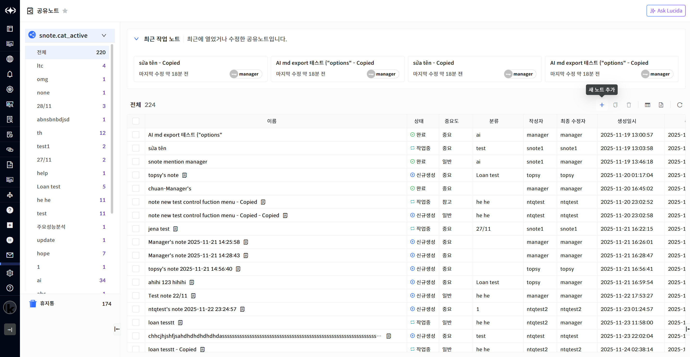
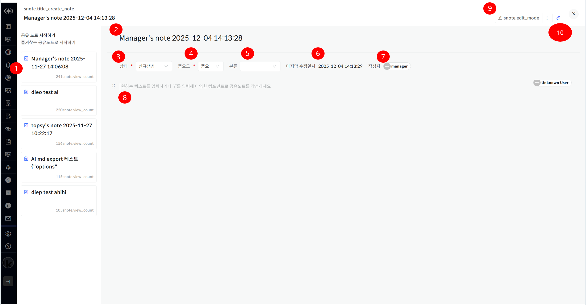
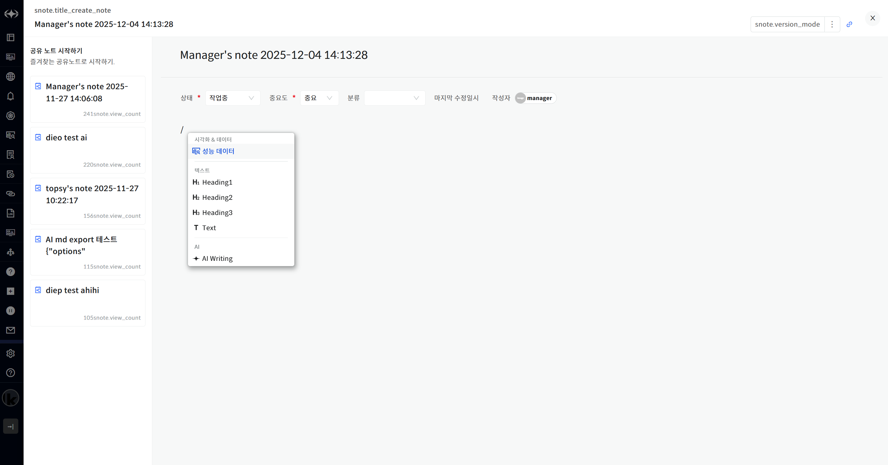
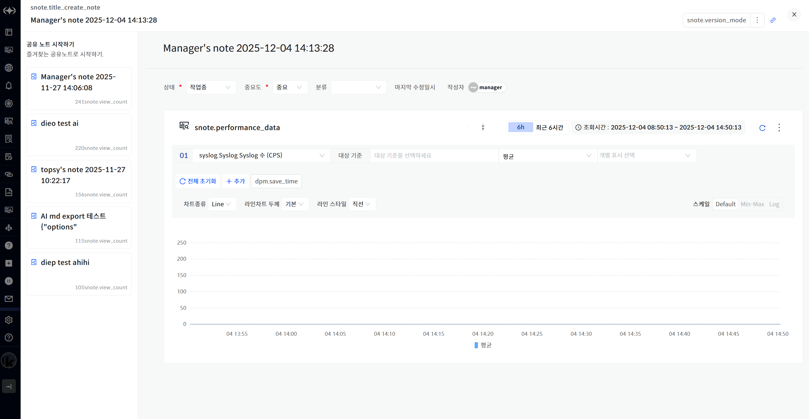
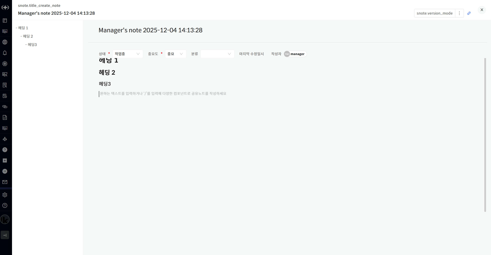
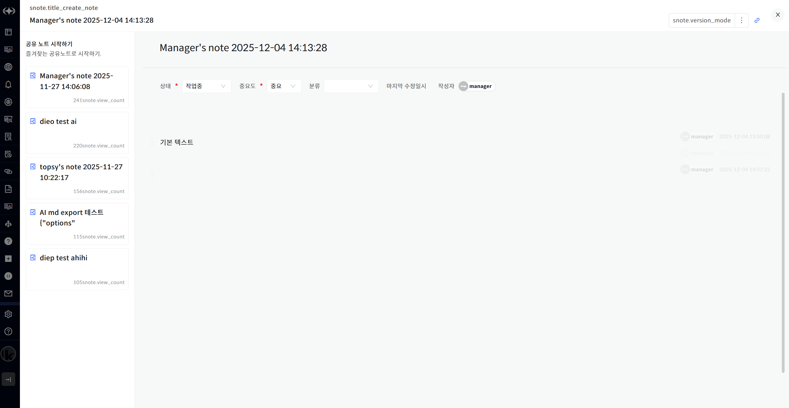
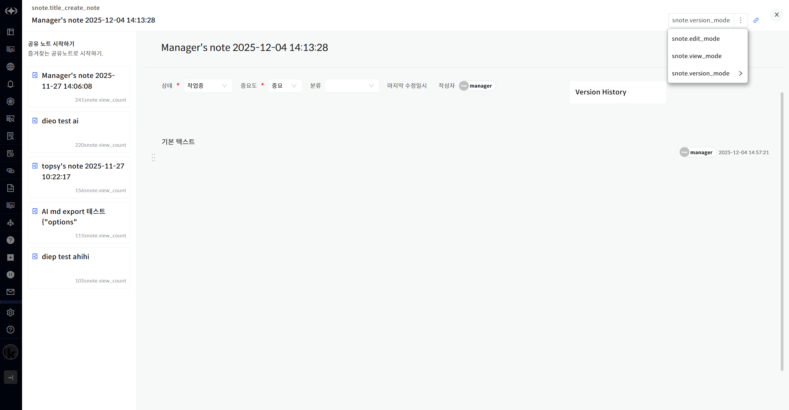
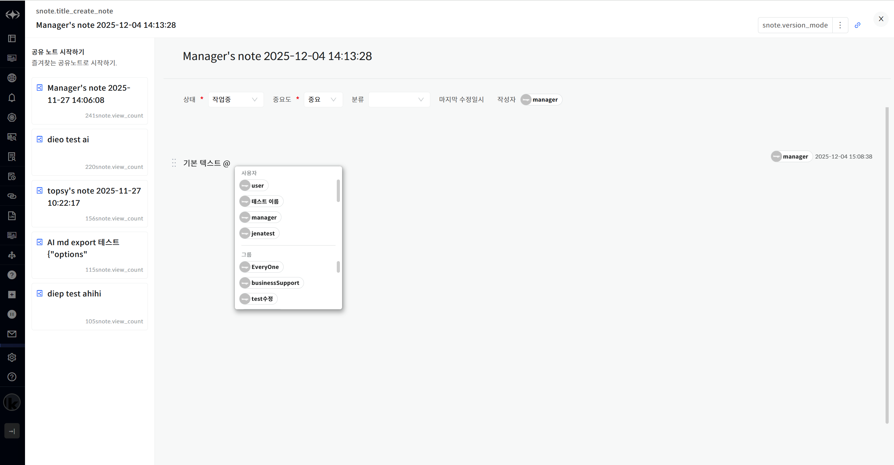

공유 노트 추가

공유 노트 목록에서 \[새 노트 추가\] 버튼을 클릭하면 새로운 공유 노트를 추가할 수 있습니다.

> ▶ \[그림1\] 새 노트 추가

> ▶ \[그림2\] 공유 노트 편집

상세 정보

| 1\. 공유 노트 목록 | 조회 수가 높은 공유 노트 목록을 표시합니다.                                                 |
| ------------ | ------------------------------------------------------------------------- |
| 2\. 공유 노트 이름 | 공유 노트 이름을 표시합니다. 더블 클릭 시 이름을 변경할 수 있습니다.                                  |
| 3\. 상태       | 공유 노트의 상태를 변경합니다.                                                         |
| 4\. 중요도      | 공유 노트의 중요도를 변경합니다.                                                        |
| 5\. 분류       | 공유 노트의 분류를 선택합니다. 분류를 선택하면 선택된 분류로 하위 그룹으로 표시됩니다. 선택하지 않으면 미분류로 자동 분류됩니다. |
| 6\. 마지막 수정일시 | 공유 노트의 마지막 수정일시를 표시합니다.                                                   |
| 7\. 작성자      | 공유 노트의 작성자를 표시합니다.                                                        |
| 8\. 컨텐츠 입력   | 텍스트를 입력하거나 /를 입력하여 컨텍스트 메뉴를 호출합니다.                                        |
| 9\. 상태 변경    | 공유 노트의 상태를 변경할 수 있습니다.                                                    |

컨텍스트 메뉴

텍스트 입력창에 /를 입력하면 컨텍스트 메뉴를 표시할 수 있습니다.

▶ \[그림3\] 컨텍스트 메뉴

컨텍스트 메뉴

| 성능 데이터     | 성능 데이터를 추가할 수 있는 블록을 생성합니다.                  |
| ---------- | -------------------------------------------- |
| Heading1   | Heading1 텍스트를 입력할 수 있는 블록을 생성합니다.            |
| Heading2   | Heading2 텍스트를 입력할 수 있는 블록을 생성합니다.            |
| Heading3   | Heading3 텍스트를 입력할 수 있는 블록을 생성합니다.            |
| Text       | 기본 텍스트를 입력할 수 있는 블록을 생성합니다.                  |
| AI Writing | 공유 노트에 대한 AI Writing 기능을 이용할 수 있는 블록을 생성합니다. |

성능 데이터

성능 통계와 같이 원하는 성능 데이터를 추가할 수 있습니다. 설정은 성능 통계와 동일합니다.

<table>
<tbody>
<tr class="odd">
<td>
노트

성능 데이터의 저장은 [시간 저장] 버튼을 클릭해야 저장됩니다.
</td>
</tr>
</tbody>
</table>

► \[그림4\] 성능 데이터

Heading

Heading 텍스트는 텍스트를 입력할 수 있는 기능을 제공합니다. 텍스트 입력 시 왼쪽에 자동으로 인덱싱이 되며 텍스트 클릭 시 해당 위치로 이동합니다.

► \[그림5\] Heading

Text

기본 텍스트를 입력할 수 있는 기능을 제공합니다. 기본 텍스트는 자동 인덱싱이 되지 않습니다.

► \[그림6\] Text

상태 변경

\[Editor 모드\]에서 10분간 수정이 없을 경우 자동으로 \[Viewer 모드\] 로 변경됩니다. 또한 오른쪽 상단의 상태 변경을 이용하여 공유 노트의 상태를 변경할 수 있습니다. 버전 이력을 이용하여 해당 버전으로 변경할 수 있습니다.

► \[그림7\] 상태 변경

멘션 호출

텍스트 입력에 @를 입력하면 모든 사용자와 사용자 그룹 정보가 표시되며 선택하면 멘션등록이 됩니다. 멘션등록이 되면 해당 공유 노트를 같이 수정할 수 있습니다.

► \[그림8\] 멘션 호출

