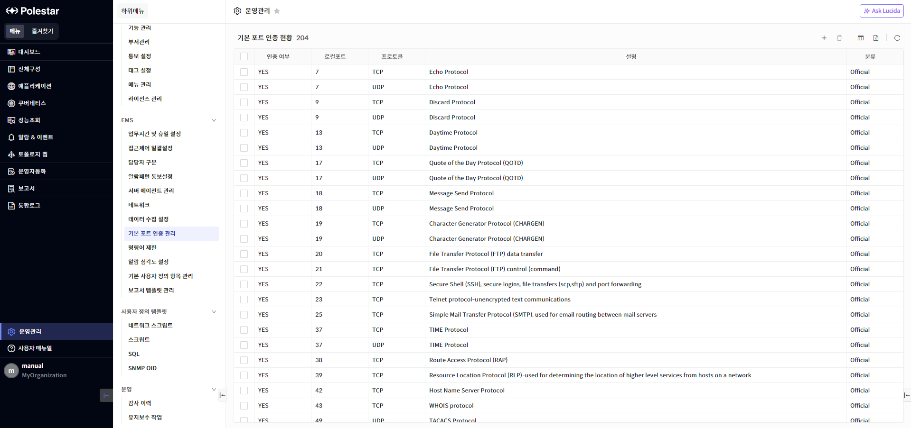
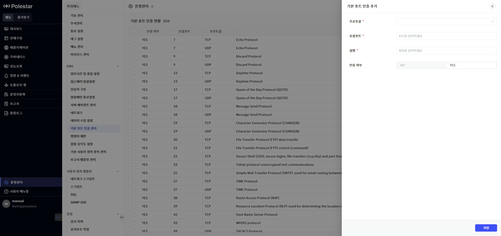
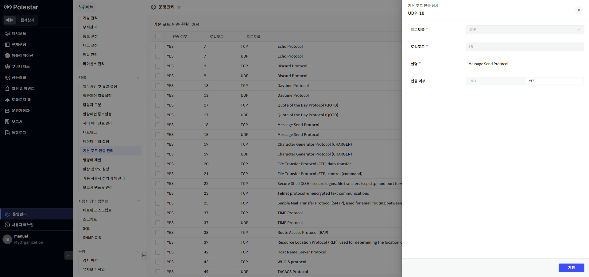
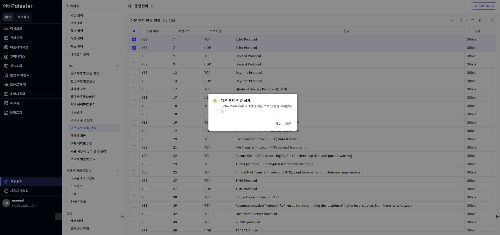

기본 포트 인증 관리

기본 포트 인증 관리 기능을 사용하여 서버 장비의 네트워크 세션(TCP / UDP) 로컬포트의 기본 인증 정보를 관리할 수 있습니다.

운영관리에서 \[기본 포트 인증 관리\]를 선택하여 로컬포트 별로 인증여부를 추가/수정/삭제합니다. 기본 포트 인증 현황 목록에서 로컬포트를 클릭하면 등록된 포트 인증 정보를 수정할 수 있는 드로어가 나타납니다.

기본 포트 인증 관리 메뉴 외에 등록된 서버에서도 개별적으로 포트 인증 정보를 추가하거나 삭제할 수 있습니다.

<table>
<tbody>
<tr class="odd">
<td>
노트

개별 서버의 [성능] 메뉴 중 [네트워크]의 [인증 현황]에서 포트 인증 정보를 추가/수정/삭제할 수 있습니다.
</td>
</tr>
</tbody>
</table>

▶ \[그림1\] 기본 포트 인증 현황 목록

> 화면 지표

<table>
<thead>
<tr class="header">
<th>인증 여부</th>
<th>포트 인증 여부를 표시합니다.</th>
</tr>
</thead>
<tbody>
<tr class="odd">
<td>로컬포트</td>
<td>로컬포트 번호를 표시합니다.</td>
</tr>
<tr class="even">
<td>프로토콜</td>
<td>
프로토콜 정보를 표시합니다.

(지원 프로토콜: TCP, TCP4, TCP6, UDP, UDP4, UDP6)
</td>
</tr>
<tr class="odd">
<td>설명</td>
<td>포트에 대한 설명을 표시합니다.</td>
</tr>
<tr class="even">
<td>분류</td>
<td>
포트 인증 현황 분류를 표시합니다.

Official : POLESTAR에 정의되어 있는 포트 정보

Unofficial : 사용자가 등록한 포트 정보
</td>
</tr>
</tbody>
</table>

기본 포트 인증 추가

POLESTAR에서 제공하는 포트 인증 정보 외에도 사용자가 포트 인증 정보를 추가할 수 있습니다. 이미 등록되어 있는 프로토콜과 로컬포트 조합으로는 포트 인증 정보를 추가할 수 없으며, 사용자가 추가한 포트 인증 정보는 ‘분류’가 ‘Unofficial’로 표시됩니다.

▶ \[그림2\] 기본 포트 인증 추가

> 기본 포트 인증 추가 절차

1.  기본 포트 인증 현황 목록 우측 상단의 \[추가\] 버튼 클릭

2.  추가할 포트 인증 정보를 입력하고 \[저장\] 버튼 클릭

기본 포트 인증 수정

기본 포트 인증 현황 목록에서 ‘로컬포트’ 필드를 클릭하여 등록된 포트 인증 정보를 수정할 수 있습니다. ‘프로토콜’ 및 ‘로컬포트’ 필드는 변경할 수 없는 항목입니다. 포트 인증 정보를 수정하더라도 POLESTAR에서 관리 중인 서버의 포트 인증 정보에는 영향을 미치지 않습니다.

▶ \[그림3\] 기본 포트 인증 수정

> 기본 포트 인증 수정 절차

1.  기본 포트 인증 현황 목록에서 수정할 포트 정보의 ‘로컬포트’ 필드 클릭

2.  ‘설명’ 및 ‘인증여부’ 정보를 수정하고 \[저장\] 버튼 클릭

기본 포트 인증 삭제

기본 포트 인증 현황 목록에서 삭제할 포트 인증 정보를 삭제할 수 있습니다.

기본 포트 인증 현황 목록에서 삭제하더라도 POLESTAR에서 관리 중인 서버의 포트 인증 정보에는 영향을 미치지 않습니다.

▶ \[그림4\] 기본 포트 인증 삭제

> 기본 포트 인증 삭제 절차

1.  기본 포트 인증 현황 목록에서 삭제할 포트 정보 선택 (다수 선택 가능)

2.  기본 포트 인증 현황 목록 우측 상단의 \[삭제\] 버튼 클릭

