대시보드 생성 및 편집

대시보드 생성 및 편집을 위해 “대시보드 빌더”에 최초 접속 시 기본적인 대시보드 생성 방법을 튜토리얼(따라하기)로 제공됩니다.

<table>
<tbody>
<tr class="odd">
<td>
노트

튜토리얼을 통해 대시보드 빌더의 간단한 사용법을 제공합니다. 튜토리얼은 최초 접속 시에만 활성화되며 최초 실행 이후에는 활성화되지 않습니다.
</td>
</tr>
</tbody>
</table>

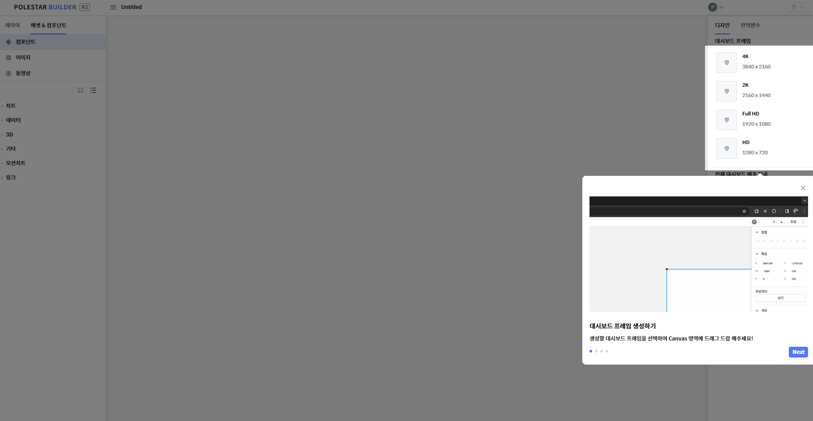

▶ \[그림1\] 튜토리얼

주요 화면 구성

대시보드 생성 및 편집을 위한 대시보드 빌더의 화면 레이아웃은 다음과 같습니다.

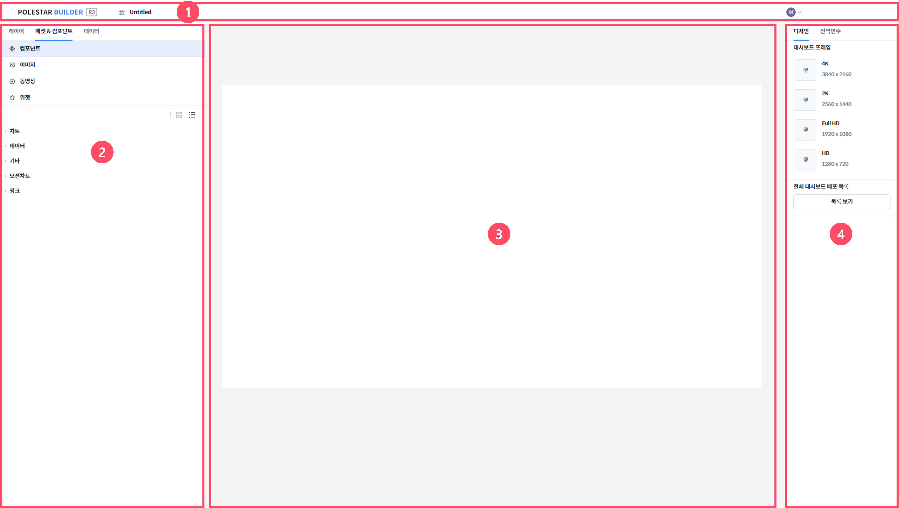

▶ \[그림2\] 대시보드 화면 레이아웃

> 레이아웃 설명

| 1\. 상단 부(헤더) | 파인더 버튼, 프로필이 배치되어 있습니다.                                               |
| ------------ | --------------------------------------------------------------------- |
| 2\. 좌측 메뉴    | 레이어 트리와 에셋&컴포넌트를 전환하여 사용할 수 있도록 구성되어 있습니다.                            |
| 3\. 메인 캔버스   | 대시보드를 생성 및 편집할 수 있는 영역이며 스크롤 줌/아웃. 드래그를 통해 자유롭게 대시보드를 제작할 수 있는 영역입니다. |
| 4\. 우측 메뉴    | 디자인 설정과 전역변수 설정을 탭 전환으로 사용할 수 있도록 구성되어 있습니다.                          |

상단 부 (헤더)

상단부에서는 파인더 버튼, 프로필(현재 접속 계정정보)이 배치되어 있습니다.

▶ \[그림3\] 상단 부 (헤더)

> 상단 부 설명

| 1\. 제품명      | 현재 대시보드 빌더 솔루션명을 제공합니다.                 |
| ------------ | --------------------------------------- |
| 2\. 파인더 불러오기 | 새 프로젝트를 생성하거나 파인더를 불러올 수 있습니다.          |
| 3\. 프로필      | 현재 대시보드 빌더에 접속해 있는 사용자의 프로필(계정)을 제공합니다. |

좌측 메뉴

좌측메뉴는 레이어 트리와 에셋&컴포넌트를 전환하여 사용할 수 있도록 탭 버튼 형식으로 구성되어 있습니다.

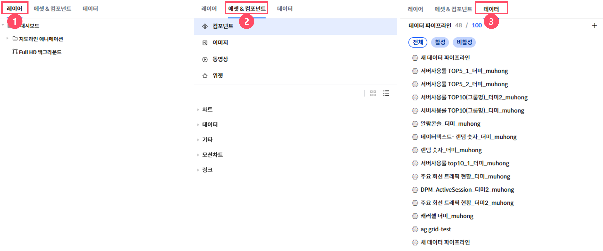

▶ \[그림4\] 좌측 메뉴

> 좌측 메뉴 설명

| 1\. 레이어       | 대시보드의 제작에 필요한 에셋&컴포넌트를 선택하면 하나의 레이어가 생성되며 레이어를 통해 대시보드를 쉽게 제작할 수 있습니다. |
| ------------- | ---------------------------------------------------------------------- |
| 2\. 에셋 & 컴포넌트 | 대시보드에 필요한 컴포넌트(차트 등), 이미지, 동영상에 대한 목록을 제공합니다.                          |
| 3\. 데이터       | 컴포넌트에 데이터를 설정하여 데이터 소스를 생성할 수 있습니다.                                    |

메인 캔버스

메인 캔버스 영역은 대시보드를 생성하여 제작할 수 있는 영역이며 캔버스 영역안에서 자유롭게 대시보드를 제작할 수 있습니다.

<table>
<tbody>
<tr class="odd">
<td>
노트

우측메뉴 디자인 프레임을 제작하고자 하는 대시보드의 해상도에 맞게 선택하여 시작할 수 있습니다.
</td>
</tr>
</tbody>
</table>

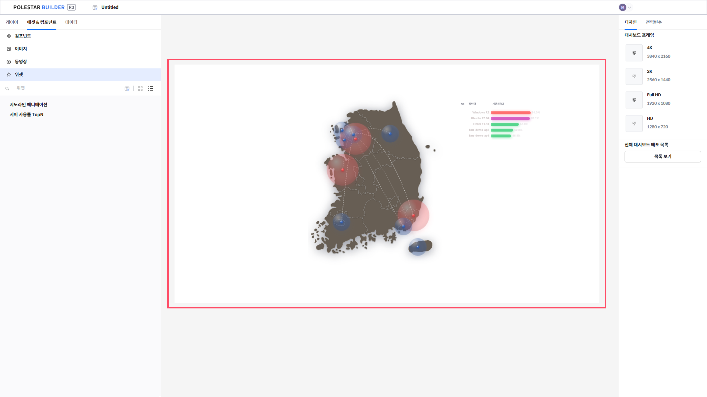

▶ \[그림5\] 메인 캔버스

우측 메뉴

좌측메뉴는 레이어 트리와 에셋&컴포넌트를 전환하여 사용할 수 있도록 탭 버튼 형식으로 구성되어 있습니다.

<table>
<tbody>
<tr class="odd">
<td>
노트

기본적으로 제공되는 4가지 해상도를 선택하여 제작할 수 있지만 해상도 선택 후 해당 해상도의 width, height 값을 직접 수정하여 변경할 수 있습니다.
</td>
</tr>
</tbody>
</table>

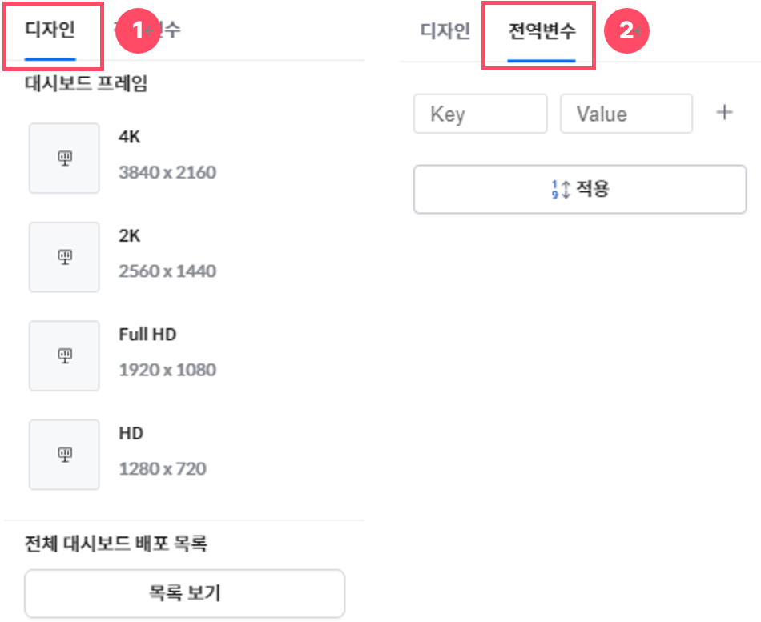

▶ \[그림6\] 우측 메뉴

> 우측 메뉴 설명

<table>
<thead>
<tr class="header">
<th>1. 디자인</th>
<th>
대시보드 해상도에 맞는 대시보드 프레임을 선택하여 제작할 수 있습니다. 기본적으로 제공되는 해상도는 아래와 같습니다.

4K : 3840 x 2160

2K : 2560 x 1440

Full HD : 1920 x 1080

HD : 1280 x 720
</th>
</tr>
</thead>
<tbody>
<tr class="odd">
<td>2. 전역변수</td>
<td>프로젝트 1개당 여러 개의 전역 변수를 가질 수 있으며, ‘헤더‘와 ‘파라미터’에서 {{전역변수이름}}을 통해 전역 변수에 들어있는 값들을 사용할 수 있습니다.</td>
</tr>
</tbody>
</table>

파인더(탐색기)

대시보드 빌더에서는 파인더(탐색기) 기능을 제공하고 있습니다.

파인더를 통해 다른 프로젝트로 이동하거나 새프로젝트를 생성할 수 있으며 프로젝트 목록, 에셋(이미지, 동영상, 폰트) 목록을 관리할 수 있습니다.

<table>
<tbody>
<tr class="odd">
<td>
노트

프로젝트 다운로드 및 업로드 기능을 통해 외부에서 제작한 대시보드를 쉽게 불러오거나 내보낼 수 있습니다. 
대시보드 전체파일이 아닌 Json 파일형태의 파일 하나로 제공하기 때문에 대시보드 유지보수 시 또는 대시보드 공동작업 시 효율적으로 공유하고 활용할 수 있다.
</td>
</tr>
</tbody>
</table>

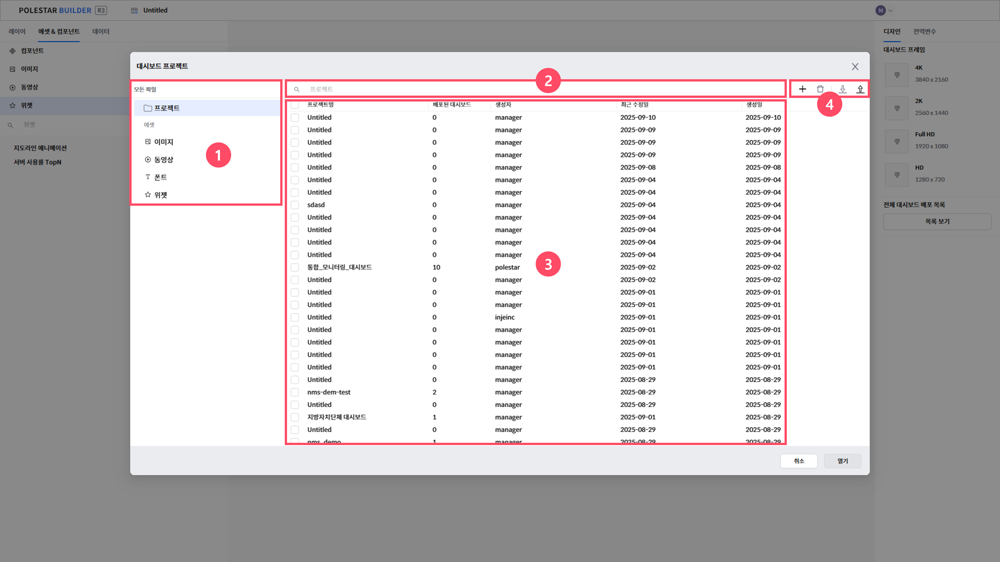

▶ \[그림7\] 파인더(탐색기)

> 파인더 설명

<table>
<thead>
<tr class="header">
<th>1. 파인더 메뉴</th>
<th>프로젝트, 에셋(이미지, 동영상, 폰트)을 선택할 수 있습니다.</th>
</tr>
</thead>
<tbody>
<tr class="odd">
<td>2. 검색</td>
<td>검색을 통해 찾고자 하는 프로젝트, 에셋을 빠르게 검색할 수 있습니다.</td>
</tr>
<tr class="even">
<td>3. 목록</td>
<td>프로젝트, 에셋 목록을 제공합니다.</td>
</tr>
<tr class="odd">
<td>4. 파일관리</td>
<td>
관리대상의 파일을 추가하거나 삭제할 수 있습니다.

<table>
<thead>
<tr class="header">
<th>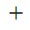: 프로젝트 및 에셋 추가</th>
</tr>
</thead>
<tbody>
<tr class="odd">
<td>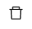: 프로젝트 및 에셋 삭제</td>
</tr>
<tr class="even">
<td>: 프로젝트 다운로드 (프로젝트 메뉴만 해당)</td>
</tr>
<tr class="odd">
<td>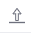: 프로젝트 업로드 (프로젝트 메뉴만 해당)</td>
</tr>
</tbody>
</table></td>
</tr>
</tbody>
</table>

파인더 열기

파인더는 메인 캔버스 영역 상단 아이콘 선택 후 “전체 프로젝트 목록 열기” 또는 “이미지/에셋 관리하기”를 선택하면 파인더 창이 생성됩니다.

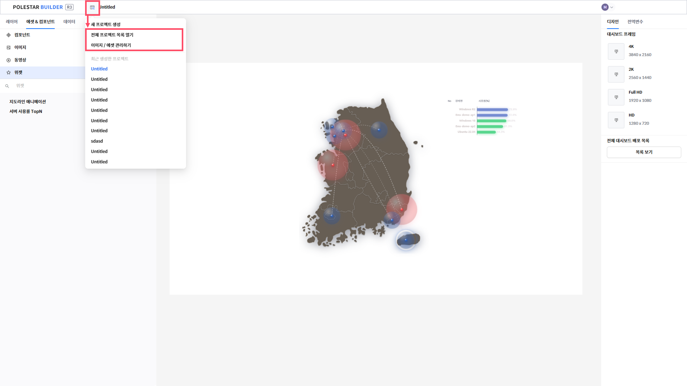

▶ \[그림8\] 파인더(탐색기) 열기

파인더 프로젝트

전체 프로젝트 목록 열기를 통해 대시보드 프로젝트 목록을 관리할 수 있습니다.

프로젝트 목록에서는 프로젝트별 프로젝트명, 생성자, 최근 수정일, 생성일 정보를 제공하며 체크박스를 통해 프로젝트를 선택할 수 있고 선택된 파일을 일괄삭제, 다운로드 할 수 있습니다.

<table>
<tbody>
<tr class="odd">
<td>
노트

프로젝트는 ‘Json’파일 형태로 다운로드 하거나 업로드할 수 있습니다.
</td>
</tr>
</tbody>
</table>

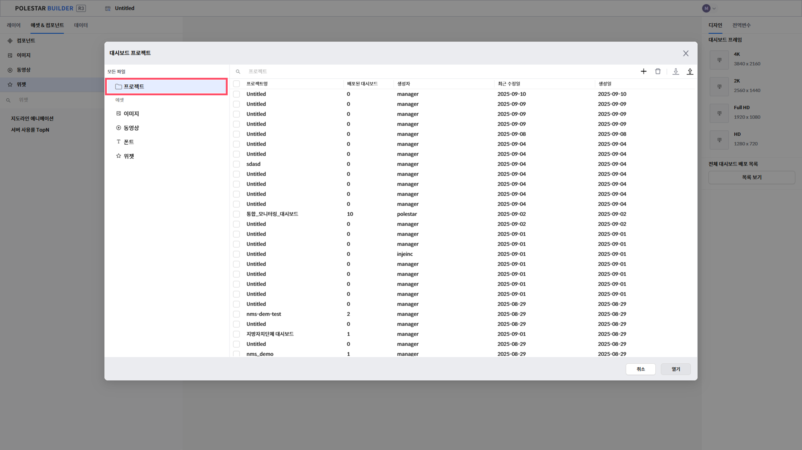

▶ \[그림9\] 파인더 프로젝트

파인더 이미지

이미지/에셋 관리하기를 통해 대시보드 이미지 목록을 관리할 수 있습니다.

이미지 파일은 외부에서 자유롭게 드래그 하여 파인더(탐색기)로 추가할 수 있습니다.

<table>
<tbody>
<tr class="odd">
<td>
노트

이미지 업로드는 다음 형식의 파일만 업로드 가능합니다. (png, jpg, gif, svg)
</td>
</tr>
</tbody>
</table>

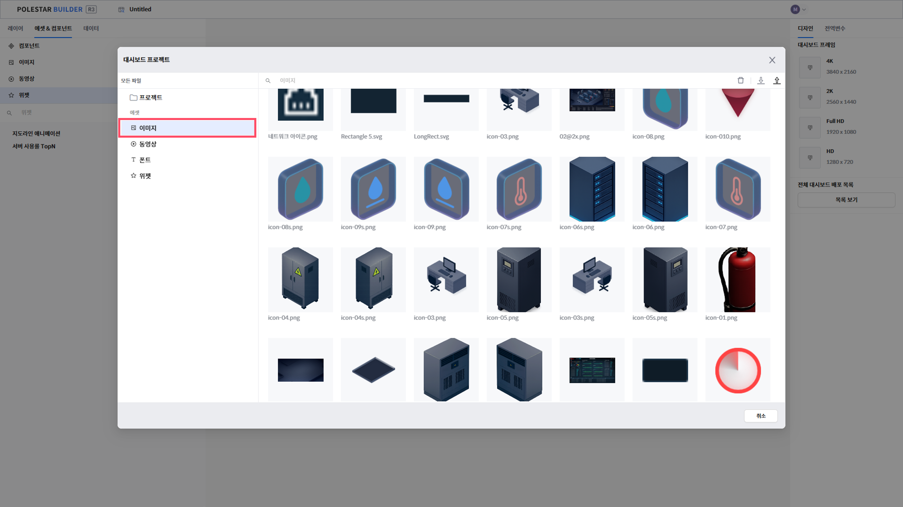

▶ \[그림10\] 파인더 이미지

파인더 동영상

이미지/에셋 관리하기를 통해 대시보드 동영상 목록을 관리할 수 있습니다.

동영상 파일은 외부에서 자유롭게 드래그 하여 파인더(탐색기)로 추가할 수 있습니다.

<table>
<tbody>
<tr class="odd">
<td>
노트

동영상 업로드는 다음 형식의 파일만 업로드 가능합니다. (mp4)
</td>
</tr>
</tbody>
</table>

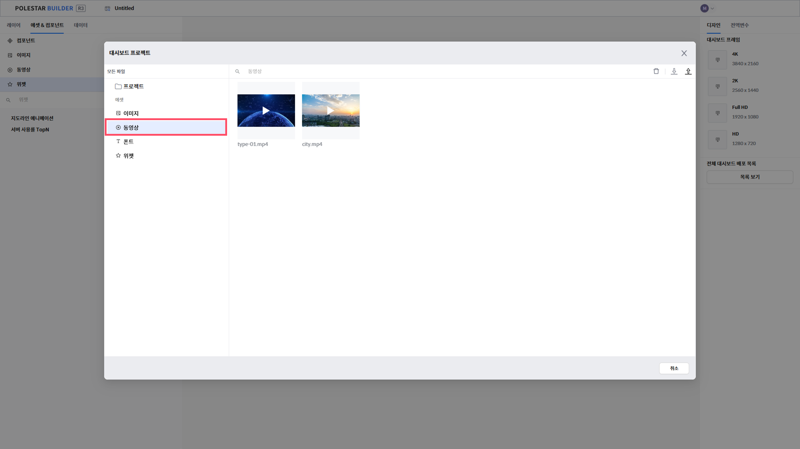

▶ \[그림11\] 파인더 동영상

파인더 폰트

이미지/에셋 관리하기를 통해 대시보드 폰트 목록을 관리할 수 있습니다.

폰트 파일은 외부에서 자유롭게 드래그 하여 파인더(탐색기)로 추가할 수 있습니다.

<table>
<tbody>
<tr class="odd">
<td>
노트

폰트 업로드는 다음 형식의 파일만 업로드 가능합니다. (ttf. otf)
</td>
</tr>
</tbody>
</table>

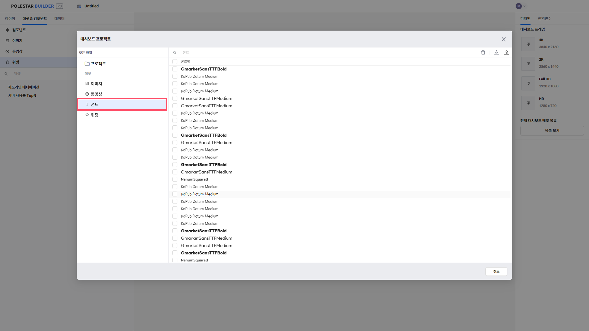

▶ \[그림12\] 파인더 폰트

파인더 위젯

이미지/에셋 관리하기를 통해 대시보드 위젯 목록을 관리할 수 있습니다.

자주 사용하는 컨텐츠, 차트 등을 위젯으로 등록하여 재사용이 가능합니다.

<table>
<tbody>
<tr class="odd">
<td>
노트

위젯 생성시 2개 이상의 레이어를 생성 후 그룹핑한 다음 위젯으로 등록할 수 있습니다.
</td>
</tr>
</tbody>
</table>

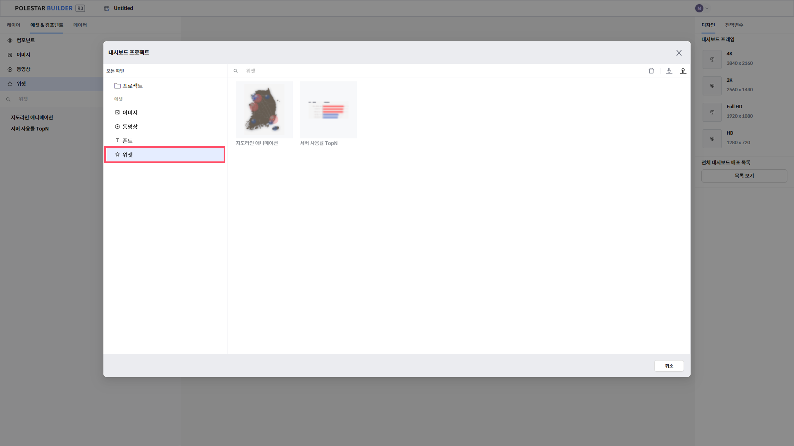

▶ \[그림13\] 파인더 폰트

대시보드 만들기

프로젝트

프로젝트 생성 및 삭제

대시보드를 제작하기 위해서는 가장 먼저 프로젝트를 생성해야 합니다. 프로젝트는 대시보드를 구성하는 모든 파일이 저장되는 가장 상위의 단위입니다.

<table>
<tbody>
<tr class="odd">
<td>
노트

프로젝트는 메인 화면 상단에서 ‘새 프로젝트 생성’ 버튼을 눌러 생성할 수도 있고, 파인더(탐색기)의 프로젝트 메뉴에서 ‘+’ 버튼을 눌러 생성할 수도 있습니다.
</td>
</tr>
</tbody>
</table>

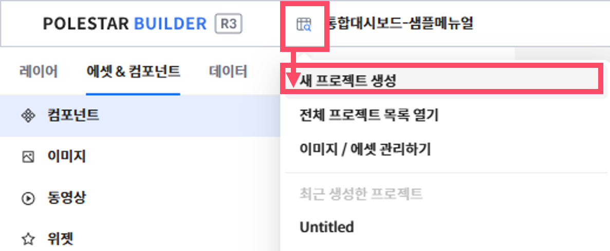

▶ \[그림14\] 메인 화면 상단에서 프로젝트 생성

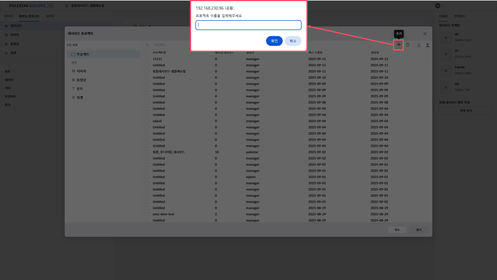

▶ \[그림15\] 파인더(탐색기) 프로젝트 메뉴에서 프로젝트 생성

프로젝트 다운로드 및 업로드

대시보드 프로젝트는 Json 파일 형태로 다운로드 및 업로드 할 수 있습니다.

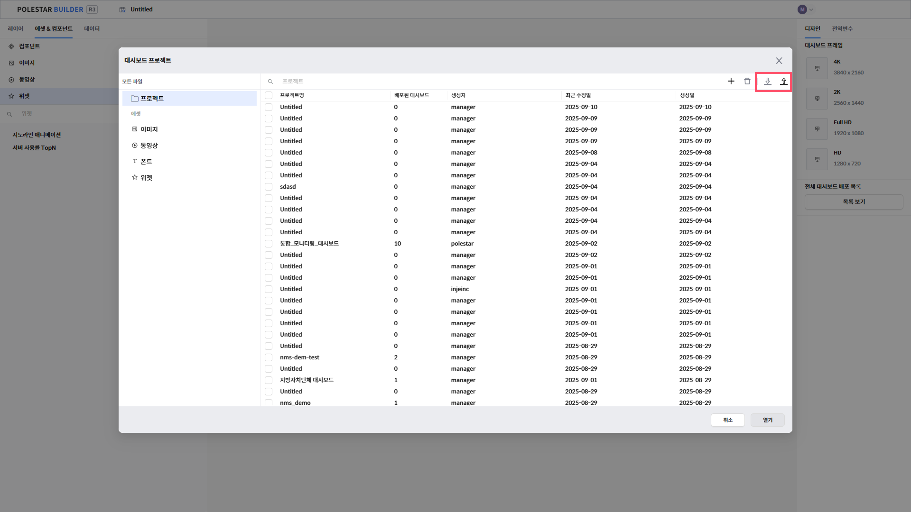

▶ \[그림16\] 대시보드 프로젝트 다운로드/업로드

프레임

프로젝트가 생성되었으면 이제 대시보드를 만들 수 있습니다. 가장 먼저 밑바탕의 역할을 하는 프레임을 생성해야 합니다. 프레임은 우측 사이드 바에서 디자인 탭의 ‘대시보드 프레임’에서 원하는 해상도를 선택하여 캔버스 영역으로 드래그 하거나, 캔버스에서 마우스 우 클릭하여 ‘대시보드 프레임 생성하기’ 메뉴를 통해 선택한 해상도로 프레임을 생성할 수 있습니다.

<table>
<tbody>
<tr class="odd">
<td>
노트

현재 지원가능한 해상도는 4K(3840X2160), 2K(2560X1440), Full HD(1920X1080), HD(1280X720)입니다.
</td>
</tr>
</tbody>
</table>

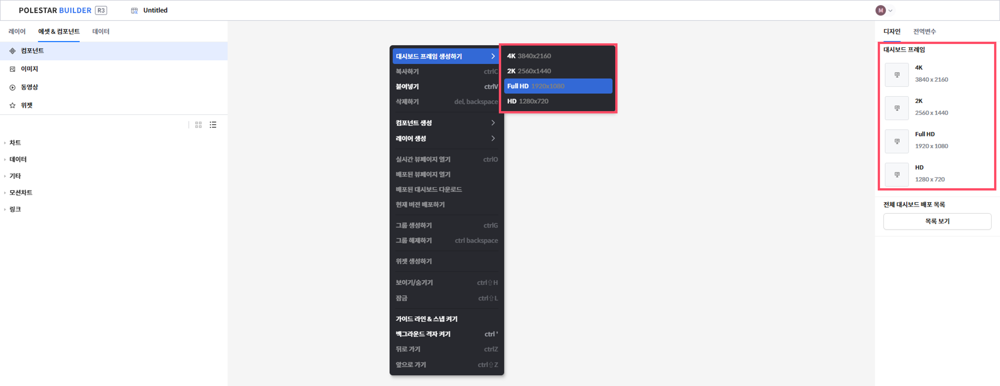

▶ \[그림17\] 해상도별 대시보드 프레임 종류, 캔버스 영역 마우스 우 클릭 프레임 생성

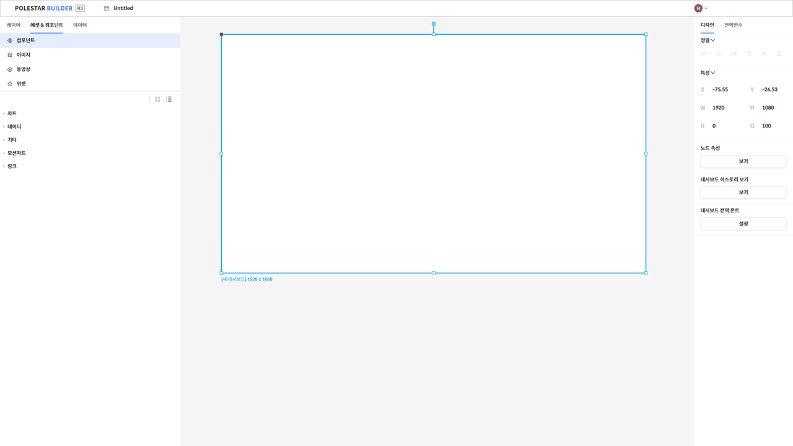

▶ \[그림18\] Full HD 프레임을 선택했을 때 화면

레이어

프레임을 생성하였으면 이제 레이어를 만들어 대시보드 화면을 구성합니다. 생성할 수 있는 레이어의 종류는 텍스트와 도형 레이어가 있고, 캔버스 영역에서 마우스 우 클릭을 하여 레이어를 생성할 수 있습니다.

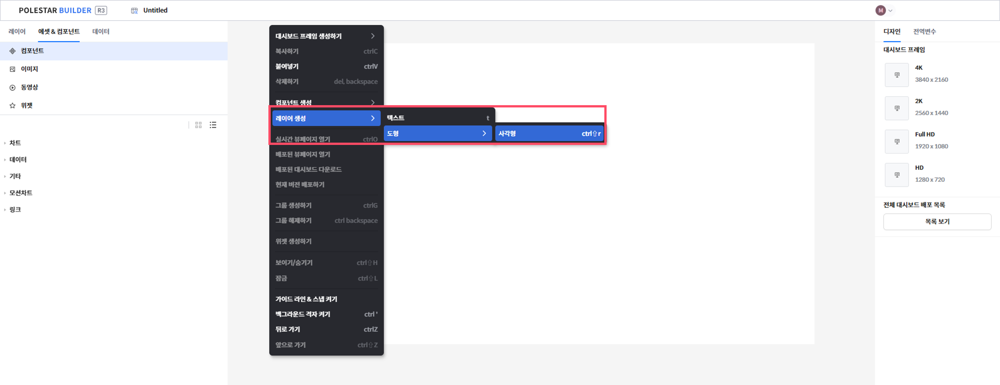

▶ \[그림19\] 레이어 생성

텍스트

텍스트 레이어는 대시보드에서 주로 각 지표의 타이틀을 구성하는데 쓰이며, 폰트, 크기, 정렬 등 여러 가지 속성을 통해 원하는 스타일로 작성할 수 있습니다.

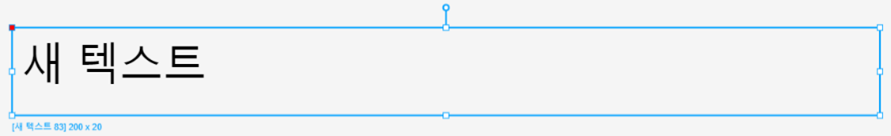

▶ \[그림20\] 텍스트 레이어

도형

도형 레이어는 대시보드에서 다양한 용도로 쓰일 수 있으며, 사각형, 원, 세모 중에서 선택할 수 있습니다. (현재는 사각형 레이어만 지원) 단위입니다.

<table>
<tbody>
<tr class="odd">
<td>
노트

사각형 레이어는 최초 100X100 사이즈로 생성되며, 내부는 랜덤 색상으로 채워집니다.
</td>
</tr>
</tbody>
</table>

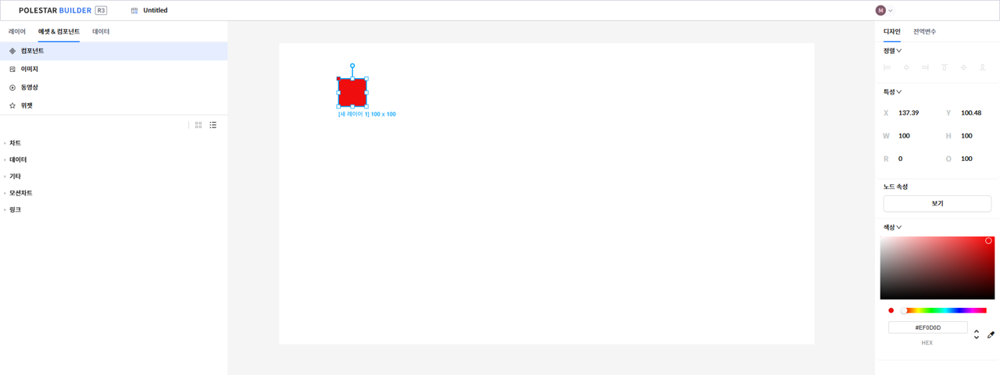

▶ \[그림21\] 사각형 레이어

에셋&컴포넌트

텍스트와 도형을 제외한 나머지는 ‘에셋&컴포넌트’에서 찾을 수 있습니다. ‘컴포넌트’에서는 데이터소스가 맵핑 된 종류별 차트를 만들 수 있고, ‘이미지’, ‘동영상’을 통해 외부에서 이미지 파일 및 동영상도 삽입할 수 있습니다.

<table>
<tbody>
<tr class="odd">
<td>
노트

생성할 수 있는 컴포넌트의 종류로는 차트, 데이터, 3D, 기타, 모션차트, 링크 가 있으며, 각각 여러 형태를 지원합니다. 좌측 메뉴에서 드래그 또는 마우스 우 클릭으로 컴포넌트를 생성합니다.
</td>
</tr>
</tbody>
</table>

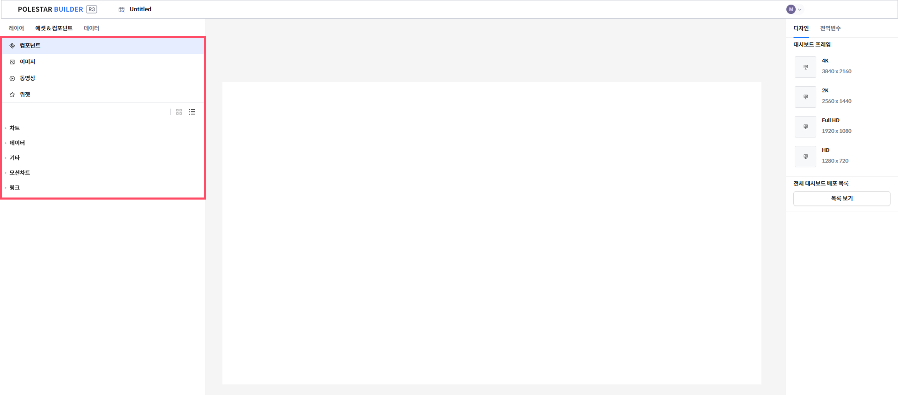

▶ \[그림22\] 컴포넌트 생성

차트

바, 라인, 영역, 스케터, 파이, 헥사곤, 스택, 게이지 등 다양한 차트를 제공합니다.

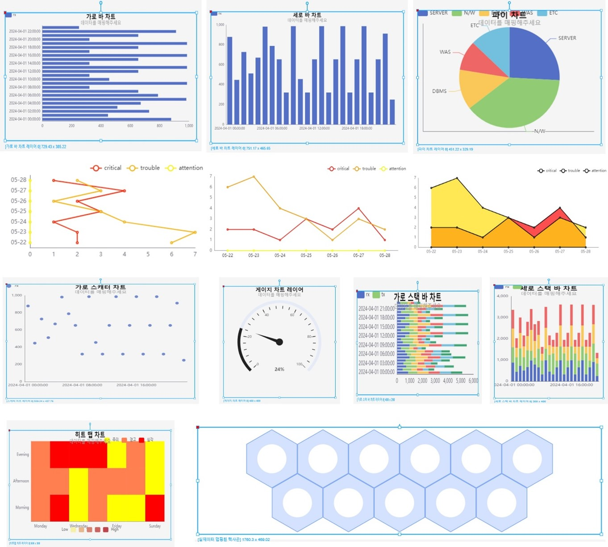

▶ \[그림23\] 지원하는 차트 목록

데이터

그리드, 데이터 텍스트, 데이터 이미지, 범례, 타임라인, 타임 등 데이터 관련 컴포넌트를 제공합니다.

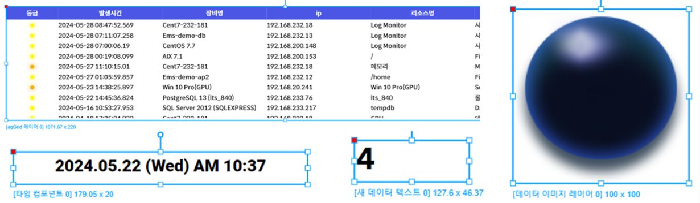

▶ \[그림24\] 데이터 그리드 컴포넌트 목록

기타

그 코딩을 통해 커스텀 하기 쉽도록 리액트 노드 컴포넌트를 제공합니다.

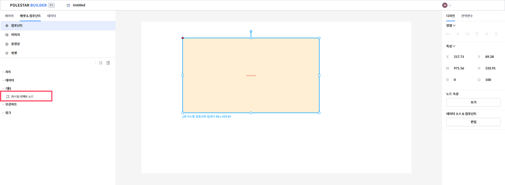

▶ \[그림25\] 커스텀 리액트 노드 컴포넌트

모션차트

대시보드에서 주요 서비스 그룹의 상태를 애니메이션 효과를 주어 표현하기 위해 많이 사용하는 컴포넌트입니다. 아래와 같이 서클 모양을 이루며 특정 방향과 주기를 가지고 회전하는 효과를 줍니다.

<table>
<tbody>
<tr class="odd">
<td>
노트

배경 이미지, 캐러셀 요소 이미지, 캐러셀 요소 임계치 이미지를 통해 표현할 수 있습니다.
</td>
</tr>
</tbody>
</table>

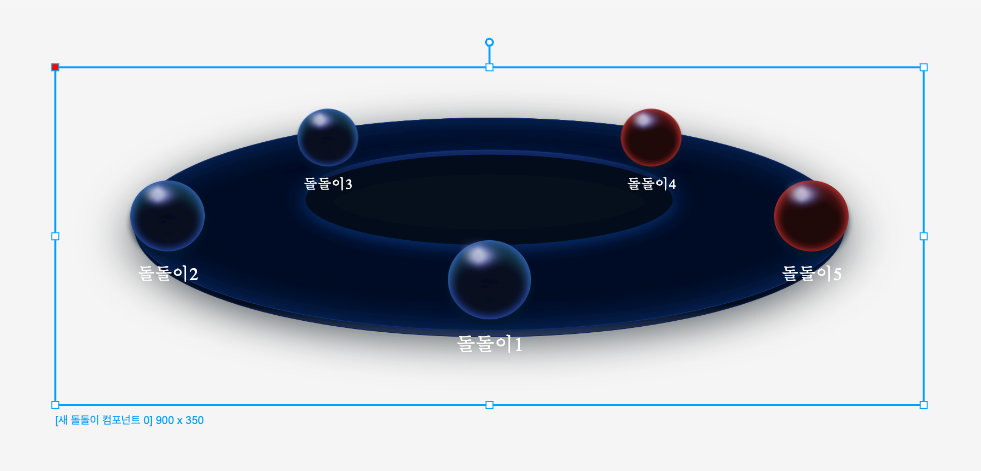

▶ \[그림26\] 원형 캐러셀(돌돌이) 컴포넌트

링크

전환할 대상의 설정 값(노드 아이디)을 통해 화면전환을 제공합니다.

<table>
<tbody>
<tr class="odd">
<td>
노트

링크 컴포넌트는 링크 탭, 링크 탭 토글 스위치, 다국어 링크 탭 3개의 컴포넌트를 제공하며 대시보드 성격에 맞게 선택하시면 됩니다.
</td>
</tr>
</tbody>
</table>

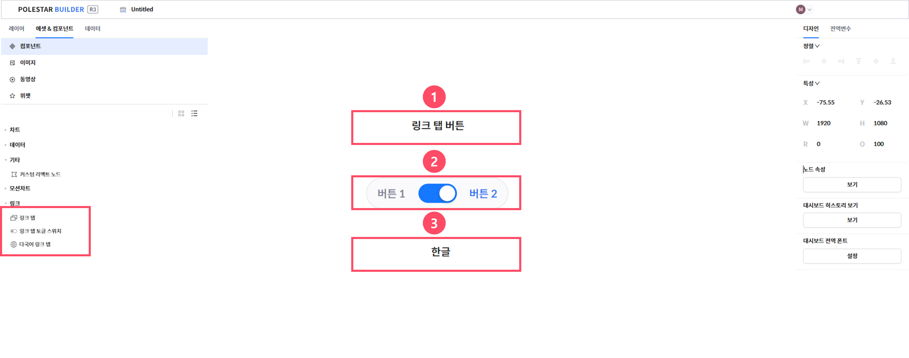

▶ \[그림27\] 링크 컴포넌트

> 링크 컴포넌트 설명

| 1\. 링크 탭        | 2개 이상의 메뉴를 통해 링크 버튼을 만들 때 주로 사용합니다. |
| --------------- | ----------------------------------- |
| 2\. 링크 탭 토글 스위치 | 토글 스위치 형식의 탭 전환이 필요할 때 주로 사용합니다.    |
| 3\. 다국어 링크 탭    | 언어 전환이 필요한 다국어 링크 버튼을 만들 때 사용합니다.   |

이미지

좌측 메뉴의 이미지 모음에서 사용할 이미지를 캔버스로 드래그 하여 사용합니다.

<table>
<tbody>
<tr class="odd">
<td>
노트

이미지 목록은 목록형, 썸네일 형 두가지를 선택하여 사용할 수 있으며 이미지를 검색할 수 있습니다.
</td>
</tr>
</tbody>
</table>

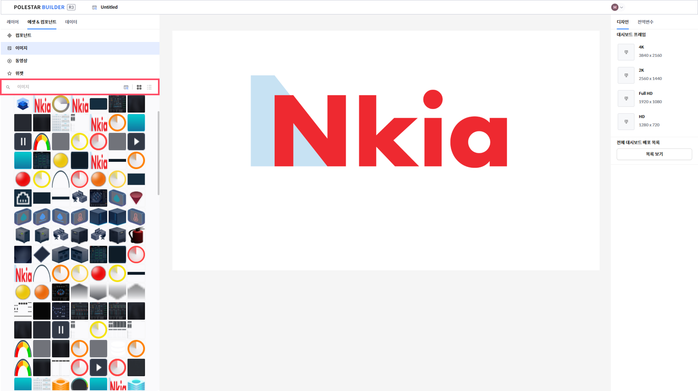

▶ \[그림28\] 이미지

동영상

좌측 메뉴의 동영상 모음에서 사용할 동영상을 캔버스로 드래그 하여 사용합니다.

<table>
<tbody>
<tr class="odd">
<td>
노트

동영상 목록은 목록형, 썸네일 형 두가지를 선택하여 사용할 수 있으며 동영상을 검색할 수 있습니다.
</td>
</tr>
</tbody>
</table>

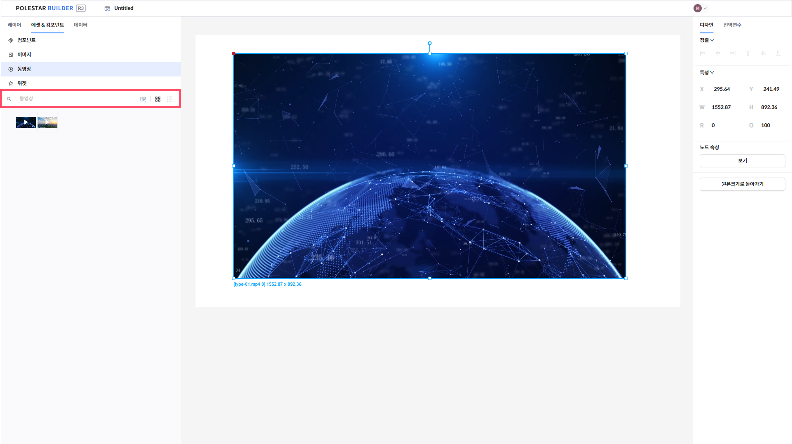

▶ \[그림29\] 동영상

데이터

컴포넌트에 데이터를 설정하여 보여주기 위해 필요한 가공데이터가 필요합니다. 이를 위해 데이터 파이프라인을 생성합니다. 데이터 파이프라인에는 원천 데이터(DB)가 필요할 수 있는데 이 경우 데이터 소스를 생성합니다.

<table>
<tbody>
<tr class="odd">
<td>
노트

생성한 데이터 파이프라인으로 컴포넌트에 데이터를 설정하여 데이터를 표시할 수 있습니다.

매뉴얼 “대시보드생성 및 편집” 파일내 데이터소스&amp;컴포넌트 설정을 참고하시기 바랍니다.
</td>
</tr>
</tbody>
</table>

설정 절차 01

좌측 사이드바에서 데이터 탭을 클릭하면 데이터 파이프라인, 데이터 소스 목록을 확인할 수 있습니다.

“데이터 소스 연결” 우측에 “+” 버튼을 클릭하면 데이터 소스 설정창이 나옵니다.

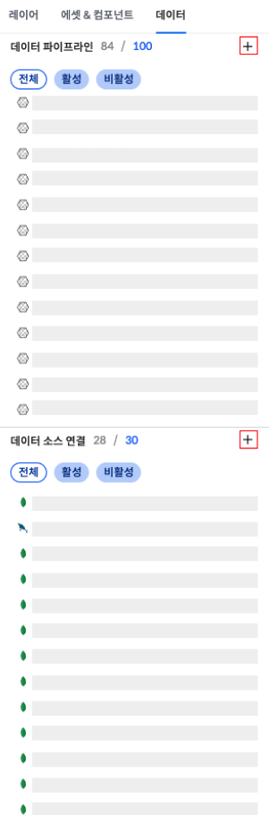

▶ \[그림30\] 데이터 탭 내 데이터 소스 생성 버튼

설정 절차 02

제목, 설명은 임의로 작성하여 데이터 소스를 설정할 수 있습니다.

데이터 소스 활성화를 ON으로 설정해야 데이터 파이프라인에서 사용할 수 있습니다.

연결 가능한 데이터 소스 목록에서 한 항목을 선택하면 연결정의가 나옵니다. 연결 정의를 입력하여 원천 데이터(DB)를 연결하는 데이터 소스를 설정합니다.

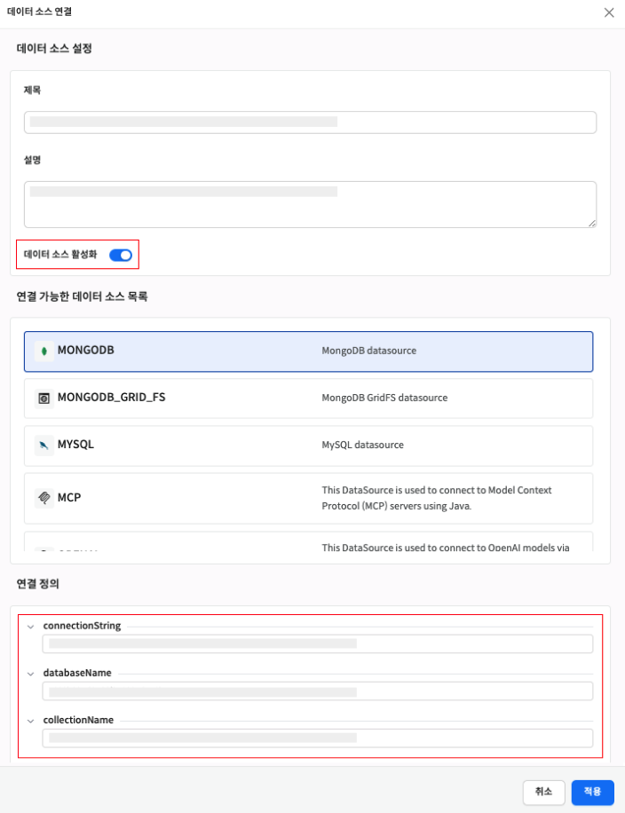

▶ \[그림31\] 데이터 소스 연결 설정 창

설정 절차 03

좌측 사이드바에서 데이터 탭을 클릭하면 데이터 파이프라인, 데이터 소스 목록을 확인할 수 있습니다.

“데이터 파이프라인” 우측에 “+” 버튼을 클릭하면 데이터 파이프라인 설정창이 나옵니다.

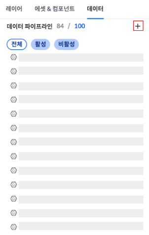

▶ \[그림32\] 데이터 탭 내 데이터 파이프라인 생성 버튼

설정 절차 04

제목은 임의로 작성하여 데이터 파이프라인을 설정할 수 있습니다.

데이터 파이프라인 활성화를 ON으로 설정해야 생성한 데이터 파이프라인을 컴포넌트에 설정할 수 있습니다.

(매뉴얼 “대시보드생성 및 편집” 파일내 데이터소스&컴포넌트 설정을 참고)

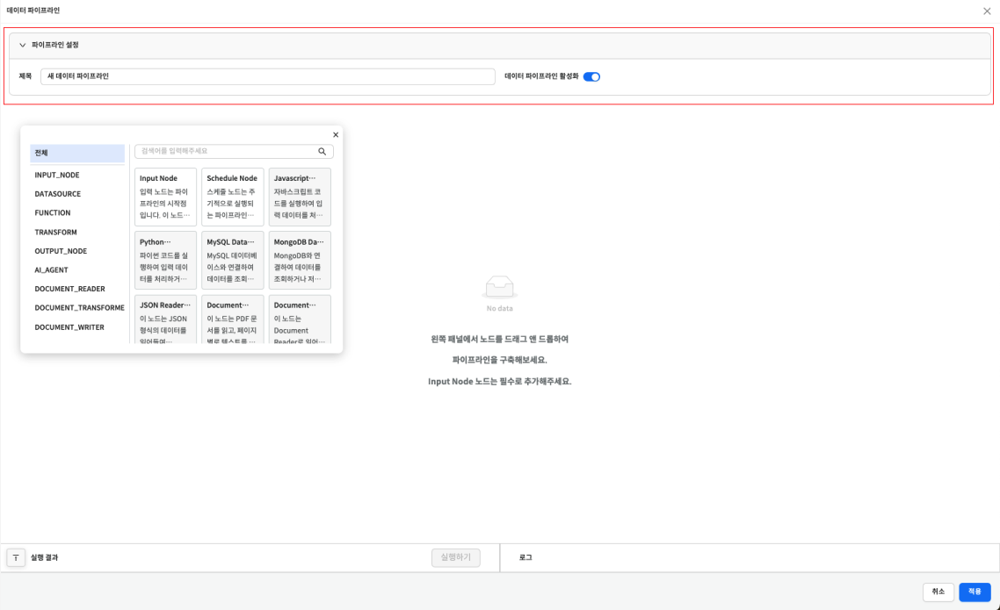

▶ \[그림33\] 파이프라인 설정

설정 절차 05

노드 목록에서 선택하여 드래그&드롭 영역에 드롭 하여 노드를 사용합니다.

최초에 Input Node를 추가해야 다른 노드를 드래그&드롭 할 수 있습니다.

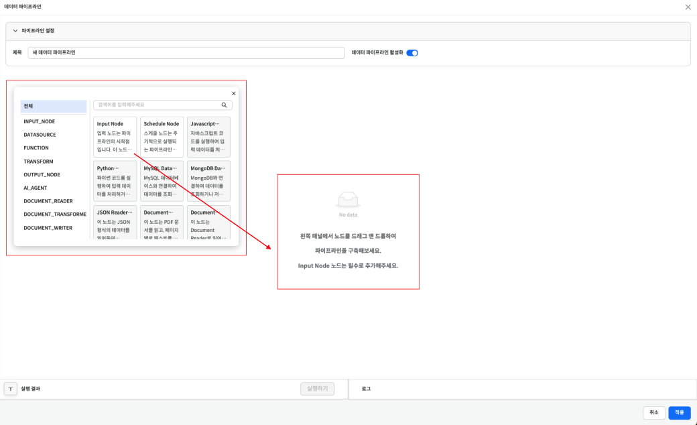▶ \[그림34\] 파이프라인 흐름 설정 – 최초 노드 드롭

설정 절차 06

설정 절차 02에서 설정한 데이터 소스를 사용할 수 있습니다.

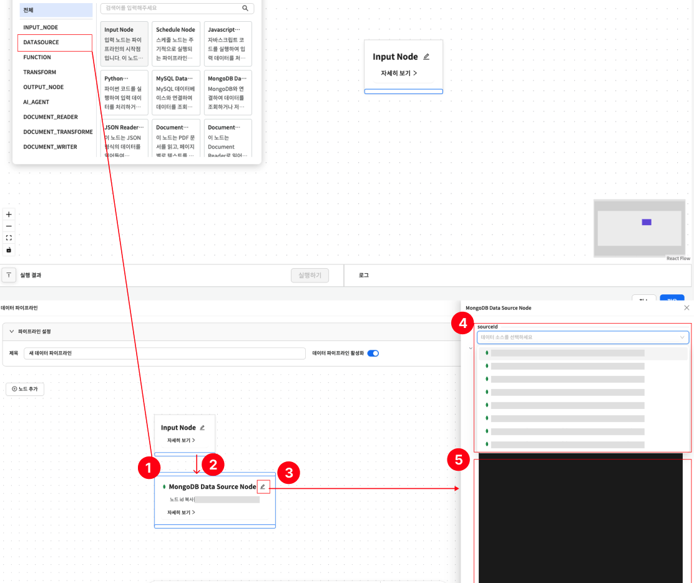▶ \[그림35\] 데이터 소스 노드 설정

> 상세 정보

<table>
<thead>
<tr class="header">
<th>1. 데이터 소스 노드 생성</th>
<th>
DATASOURCE 탭을 클릭하여 우측에서 데이터 소스 종류별 노드를 확인합니다.

그 중 MongoDB 노드를 드래그&amp;드롭 합니다
</th>
</tr>
</thead>
<tbody>
<tr class="odd">
<td>2. 노드 연결</td>
<td>
노드 사이를 간선으로 연결합니다.

두 노드의 상/하단의 영역을 서로 이어서 연결할 수 있습니다.
</td>
</tr>
<tr class="even">
<td>3. 노드 편집</td>
<td>편집 아이콘을 클릭하여 나온 설정창에서 편집합니다.</td>
</tr>
<tr class="odd">
<td>4. 데이터 소스 선택</td>
<td>
설정창에서 데이터 소스 항목을 확인합니다.

데이터 소스를 클릭하여 나온 드롭 다운에서 데이터 소스를 선택합니다.
</td>
</tr>
<tr class="even">
<td>5. 쿼리 작성</td>
<td>데이터 소스 선택 드로워 하단에 위치한 코드 에디터에서 쿼리를 작성합니다.</td>
</tr>
</tbody>
</table>

설정 절차 07

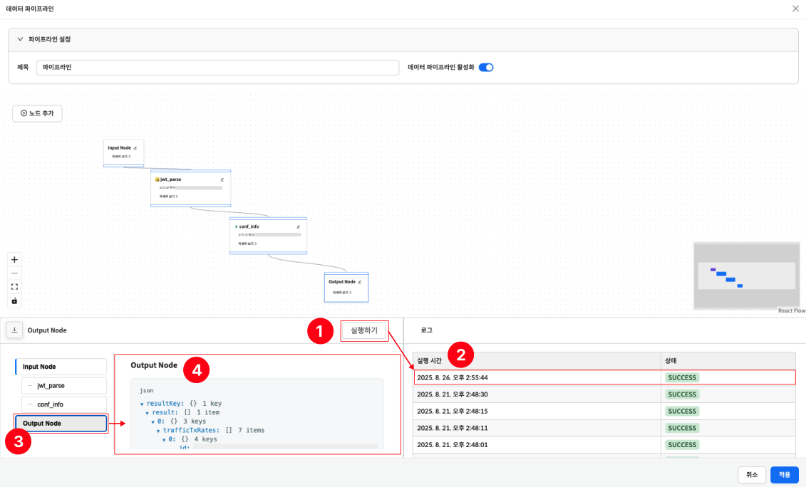추가적으로 기타 노드를 생성 및 연결하여 설정합니다. 원하는 파이프라인 흐름을 완성한 이후, Input Node를 선택한 채로 실행하기 버튼을 클릭하여 결과를 확인합니다.

▶ \[그림36\] 데이터 파이프라인 실행

> 상세 정보

| 1\. 노드 실행 | Input Node를 선택한 채로 하단 패널에서 실행하기 버튼을 클릭하여 전체 노드를 실행할 수 있습니다. |
| --------- | ----------------------------------------------------------- |
| 2\. 로그 확인 | 우측 로그 패널에서 실행한 로그들을 확인할 수 있습니다.                             |
| 3\. 실행 노드 | 로그를 클릭하면 좌측 패널에서 실행한 노드를 확인할 수 있습니다.                        |
| 4\. 결과 확인 | 실행한 노드를 클릭하면 JSON 결과화면을 확인할 수 있습니다.                         |

데이터소스&컴포넌트 설정

컴포넌트 중 데이터소스를 매핑하여 표시해 야하는 경우 ‘데이터소스 & 컴포넌트 - 편집’ 버튼을 눌러 관련 설정을 해야 합니다.

<table>
<tbody>
<tr class="odd">
<td>
노트

컴포넌트 종류가 다르더라도 기본적으로 데이터소스를 매핑하는 개념은 동일하므로 아래 공통 설명을 참고하시기 바랍니다.
</td>
</tr>
</tbody>
</table>

설정 절차 01

먼저 데이터소스를 매핑할 레이어를 클릭하면 우측 메뉴에서 ‘데이터소스 & 컴포넌트 - 편집’ 버튼이 나타나게 되고 이를 클릭하면 해당 설정창이 우측에서 좌측으로 드로우 됩니다.

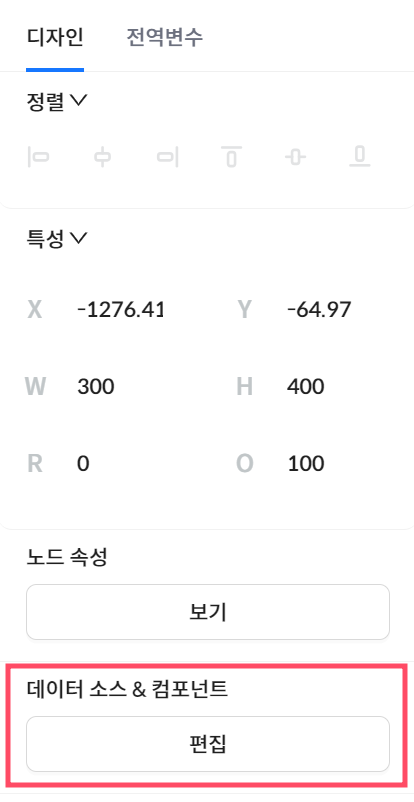

▶ \[그림37\] 데이터소스&컴포넌트 편집 버튼

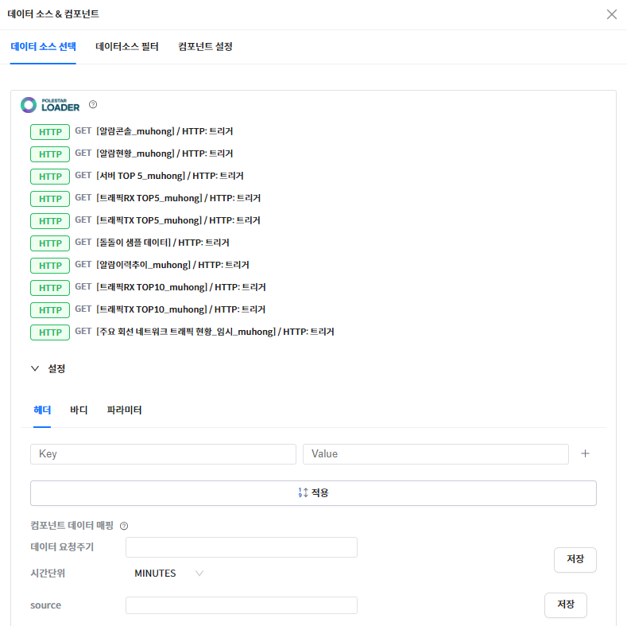

▶ \[그림38\] 데이터소스 & 컴포넌트 드로우 창

설정 절차02

데이터 파이프라인에 등록된 목록 중 사용할 소스를 선택합니다.

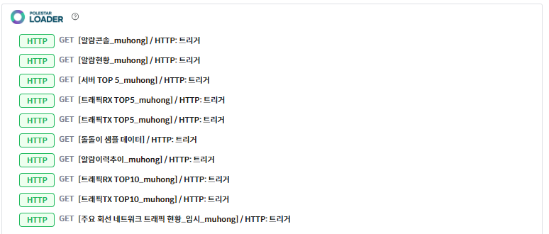

▶ \[그림39\] 데이터소스 선택 예시 화면

설정 절차03

‘헤더’ 탭에서 전역변수, 데이터 요청주기를 설정하고, 데이터 맵핑 작업을 합니다. 데이터 맵핑은, ‘응답 미리보기’에서 선택한 데이터 소스의 구조를 먼저 파악한 후, 사용할 데이터가 어떤 path에 들어가 있는지를 찾아야만 할 수 있습니다. 예를 들어 아래 그림에서는, ‘alarmCount1’이라는 path안에 사용하고자 하는 데이터 값 (total, attention, trouble, critical, 최고등급)이 들어있는 걸 확인할 수 있습니다. 그럼 ‘threshold’ 란에 사용할 데이터의 최종 경로를 기입합니다. ‘critical’이라는 컬럼의 값을 사용하고 싶다면 ‘\["alarmCount1","0","critical"\]’ 이라고 입력하면 됩니다. 그리고 ‘저장’ 버튼 또는 엔터를 치면 데이터 맵핑이 완료됩니다.

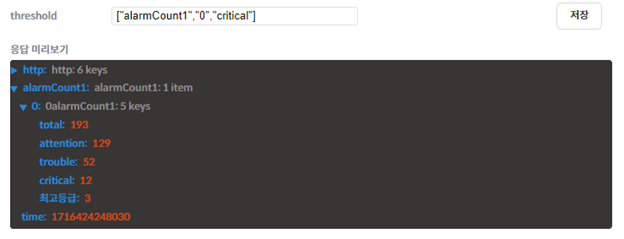

▶ \[그림40\] 데이터소스 맵핑 예시 화면

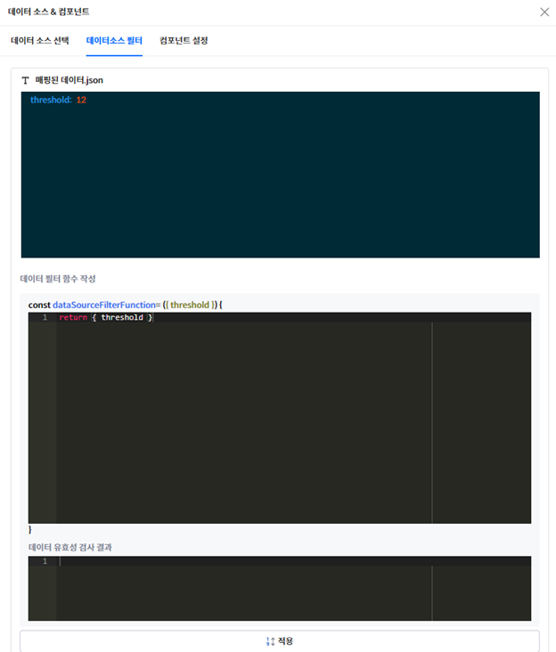

▶ \[그림41\] 데이터소스 필터

동시 편집 (프로필)

복수의 사용자가 동시에 접속하여 동시 편집이 가능합니다.

우측 상단 프로필 메뉴에서 현재 접속중인 사용자 정보를 확인할 수 있습니다. 각 사용자의 작업 내용을 실시간으로 확인할 수 있습니다.

<table>
<tbody>
<tr class="odd">
<td>
노트

이전 작업 (Ctrl+Z) 시에는 각 사용자의 작업 내용에 따라 진행됩니다.
</td>
</tr>
</tbody>
</table>

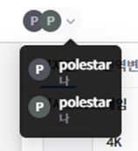

▶ \[그림42\] 동시편집자 프로필 표시

대시보드 보기

좌측 메뉴 레이어 트리에서, 대시보드 레이어 우 클릭하여’ 배포된 뷰 페이지 열기’ 또는 ‘실시간 뷰 페이지 열기’를 통해 작업한 대시보드 페이지를 확인할 수 있습니다. 배포된 경우 POLESTAR 페이지 대시보드 메뉴에서 ‘빌더 대시보드 목록’을 클릭하여 페이지를 볼 수도 있습니다.

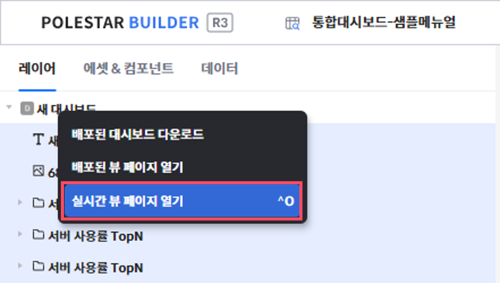

▶ \[그림43\] 실시간 뷰 페이지 열기

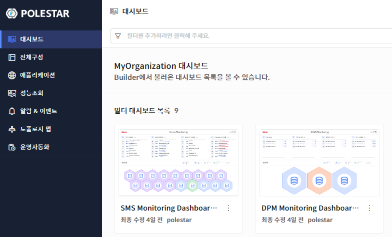

▶ \[그림44\] 배포된 대시보드 뷰 페이지 열기

기타기능

대시보드 배포

배포를 통해 특정 시점의 대시보드를 저장해놓을 수 있습니다. 배포 후 대시보드를 수정하더라도 재배포하지 않으면 배포된 뷰에서는 해당 수정내용이 반영되지 않습니다. 좌측 메뉴 레이어 트리에서 대시보드 레이어에 마우스 오버하면, 망치 모양의 버튼을 눌러 현재 버전의 대시보드를 배포할 수 있습니다.

<table>
<tbody>
<tr class="odd">
<td>
노트

화면 우측 메뉴의 ‘대시보드 히스토리 보기’에서는 배포된 이력(히스토리)을 확인할 수 있습니다.
</td>
</tr>
</tbody>
</table>

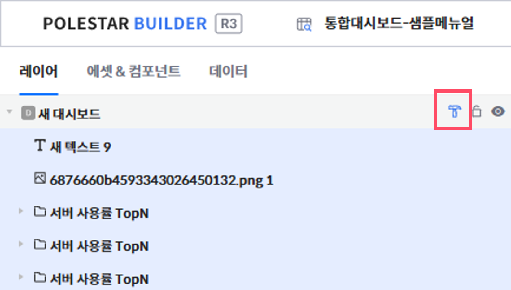

▶ \[그림45\] 대시보드 배포

전체 대시보드 배포 목록

전체 대시보드 배포 목록을 제공합니다. 이를 통해 최종 배포한 사용자의 이력을 관리할 수 있습니다.

<table>
<tbody>
<tr class="odd">
<td>
노트

화면 우측 메뉴의 하단에 전체 대시보드 배포목록 “목록보기” 버튼 선택 시 드로어로 생성됩니다.
</td>
</tr>
</tbody>
</table>

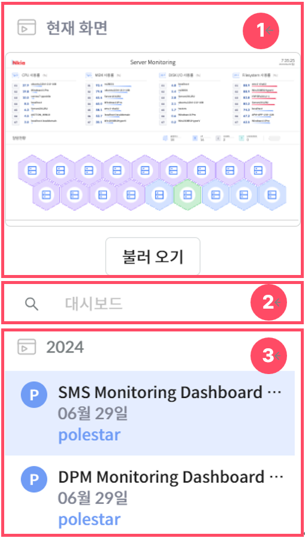

▶ \[그림46\] 전체 대시보드 배포 목록

> 전체 대시보드 배포 목록

| 1\. 화면 미리보기 및 불러오기 | 배포목록 선택 시 화면을 미리보기 할 수 있으며 불러오기 기능을 제공합니다.             |
| ------------------ | ------------------------------------------------------ |
| 2\. 검색             | 검색을 통해 찾고자 하는 배포목록을 빠르게 검색할 수 있습니다.                    |
| 3\. 목록             | 대시보드명, 배포일, 배포자 정보를 포함한 현재까지 배포된 대시보드 목록을 최신순으로 제공합니다. |

단축키

대시보드 제작에 필요한 단축키를 제공합니다.

> 단축키 목록

| w                 | 캔버스 위로 이동          |
| ----------------- | ------------------ |
| s                 | 캔버스 아래로 이동         |
| a                 | 캔버스 왼쪽으로 이동        |
| d                 | 캔버스 오른쪽으로 이동       |
| shift+w           | 캔버스 위로 10px 이동     |
| shift+s           | 캔버스 아래로 10px 이동    |
| shift+a           | 캔버스 왼쪽으로 10px 이동   |
| shift+d           | 캔버스 오른쪽으로 10px 이동  |
| esc               | 모든 노드 선택 해제        |
| ctrl+c            | 선택된 노드 복사          |
| delete, backspace | 선택된 노드 삭제          |
| ctrl+v            | 복사된 노드 붙여넣기        |
| alt+o             | 전체 노드 열기(닫기)       |
| ctrl+z            | 뒤로 가기              |
| ctrl+shift+z      | 앞으로 가기             |
| ctrl+shift+h      | 선택된 노드 숨기기(보이기)    |
| ctrl+'            | 격자 보이기(숨기기)        |
| ctrl+g            | 선택된 노드 그룹 맺기       |
| ctrl+backspace    | 선택된 노드 그룹 해제       |
| up (방향키)          | 노드 위로 1px 이동       |
| down (방향키)        | 노드 아래로 1px 이동      |
| left (방향키)        | 노드 왼쪽으로 1px 이동     |
| right (방향키)       | 노드 오른쪽으로 1px 이동    |
| shift+up          | 노드 위로 10px 이동      |
| shift+down        | 노드 아래로 10px 이동     |
| shift+left        | 노드 왼쪽으로 10px 이동    |
| shift+right       | 노드 오른쪽으로 10px 이동   |
| ctrl+shift+l      | 선택된 노드 잠금(해제)      |
| ctrl+a            | 모든 노드 선택           |
| ctrl+shift+r      | 사각형 레이어 생성         |
| t                 | 텍스트 레이어 생성         |
| ctrl+shift+1      | 가로 바 차트 생성         |
| ctrl+shift+9      | 세로 바 차트 생성         |
| ctrl+shift+o      | 가로 라인 차트 생성        |
| ctrl+shift+p      | 세로 라인 차트 생성        |
| ctrl+shift+e      | 가로 스택 에어리어 차트 생성   |
| ctrl+shift+s      | 가로 스캐터 차트 생성       |
| ctrl+shift+8      | 파이 차트 생성           |
| ctrl+shift+u      | 히트 맵 차트 생성         |
| ctrl+4            | AG그리드 생성           |
| ctrl+/            | 리액트 커스텀 노드 생성      |
| ctrl+o            | 실시간 대시보드 뷰 페이지 열기  |
| ctrl+shift+7      | 상면 차트 생성           |
| ctrl+shift+f      | 선택된 노드로 캔버스 포지션 이동 |

