로그 이상감지 현황 

로그 이상감지 현황 화면은 로그 데이터에서 이상을 탐지하고, 그 결과를 다양한 방식으로 시각화·분석할 수 있는 기능을 제공합니다.

사용자는 특정 시간대나 조건을 선택하여 필터링, 차트, 상세 메시지, 연계 정보를 확인할 수 있습니다.

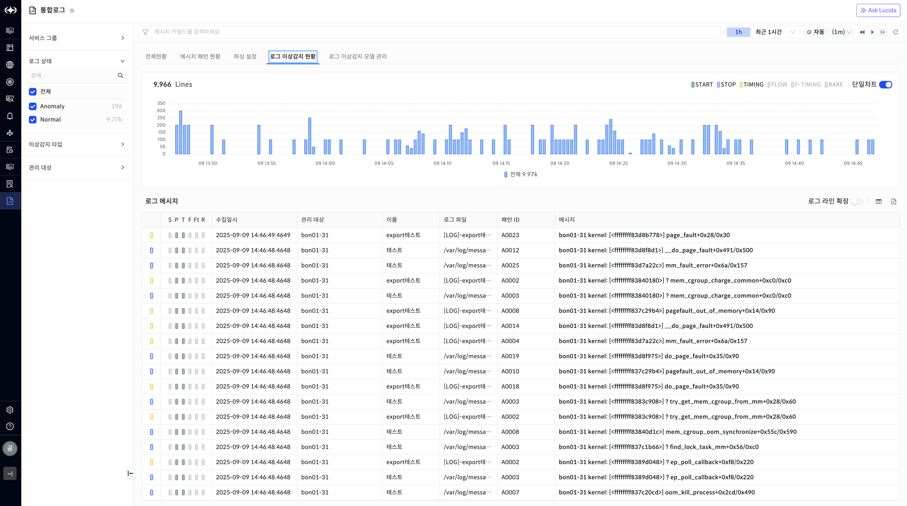

▶ \[그림1\] 로그 이상감지 현황

필터 조회

로그 이상감지 현황 화면의 좌측 패널에서는 조회 조건을 설정하여 원하는 로그 범위만 선별할 수 있습니다.  
사용자는 서비스 그룹, 로그 상태, 이상감지 타입, 관리 대상 필터를 조합하여 조회 대상을 한정할 수 있으며, 검색창을 통해 키워드 기반 빠른 필터링도 가능합니다.

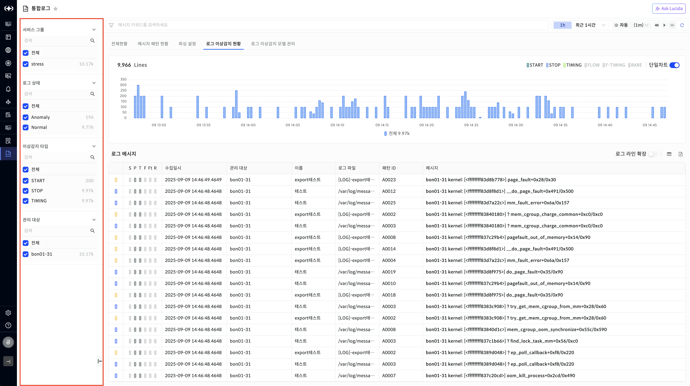

▶ \[그림2\] 로그 이상감지 현황 \> 필터 조회

| 서비스 그룹  | 수집된 로그가 속한 서비스 그룹 단위로 선택할 수 있습니다. 여러 그룹을 동시에 선택 가능하며, 전체 선택도 지원합니다. |
| ------- | ------------------------------------------------------------------- |
| 로그 상태   | Anomaly(이상 로그)와 Normal(정상 로그)로 구분하여 조회할 수 있습니다.                     |
| 이상감지 타입 | 탐지된 로그 이상 유형별 조회가 가능합니다. 예) START, STOP, TIMING, FLOW, RARE.        |
| 관리 대상   | 로그가 발생한 관리 대상(호스트/인스턴스 단위)을 지정할 수 있습니다.                             |

기능 특징

다중 선택: 각 필터에서 여러 값을 동시에 선택 가능

차트 조회

로그 이상감지 현황 화면의 상단에는 선택한 조건에 따른 로그 발생 분포가 시계열 차트로 제공됩니다.

막대그래프(Bar)와 꺾은선(Line) 차트를 조합하여 시간대별 로그 건수 및 이상 발생 여부를 직관적으로 확인할 수 있습니다.

차트에 집계되는 수치는 필터창의 이상감지 타입 및 로그 상태를 기준으로 집계된다.

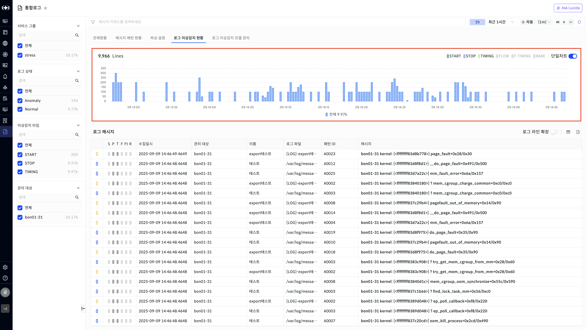

\[그림3\] 로그 이상감지 현황 \> 차트 조회

<table>
<thead>
<tr class="header">
<th>순위</th>
<th>자동(Auto) 또는 사용자가 지정한 간격(예: 1분, 5분, 1시간)에 따라 로그 발생 건수를 집계</th>
</tr>
</thead>
<tbody>
<tr class="odd">
<td>지표</td>
<td>전체 로그 건수, 이상 로그 건수, 알람 건수</td>
</tr>
<tr class="even">
<td>색상 구분</td>
<td>Normal(파란색), Anomaly(빨간색), 이상감지 타입(START, STOP, TIMING 등)별 색상</td>
</tr>
<tr class="odd">
<td>차트 모드</td>
<td>
단일 차트 모드: 전체 로그 건수와 이상 감지 타입을 하나의 차트에 통합 표시

분리 차트 모드: 전체 로그 건수와 이상감지 타입을 분리된 차트로 표시
</td>
</tr>
<tr class="even">
<td>이상탐지 정보</td>
<td>이상 타입 정보(Start, Stop, Timing, Flow, F-Timing, Rare) 
- 각 타입의 레이블 클릭을 타입별로 라인차트를 조회할 수 있다.</td>
</tr>
<tr class="odd">
<td>이상 스코어 합계</td>
<td>이상 스코어의 합계</td>
</tr>
</tbody>
</table>

메시지 조회

로그 이상감지 현황 화면의 하단에서는 선택된 조건에 해당하는 로그 메시지를 테이블로 제공합니다.

테이블은 각 로그 이벤트의 이상 유형, 수집 일시, 관리 대상, 이름, 로그 파일, 패턴 ID, 메시지 본문 등을 포함합니다.

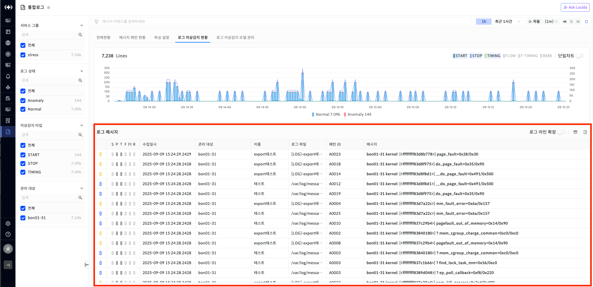

▶ \[그림4\] 로그 이상감지 현황 \> 메시지 조회

<table>
<thead>
<tr class="header">
<th>이상감지 타입</th>
<th>
로그 이상 유형을 아이콘으로 표시 (Start/Stop/Timing 등)

밝은 회색 : 로그 메시지만 조회될 뿐, 해당 패턴이 미발생

짙은 회색 : 로그 메시지에 특정 이상감지 타입 ‘패턴' 발생

붉은색 : 특정 이상감지 ‘타입 패턴 발생 및 이상감지 발생’
</th>
</tr>
</thead>
<tbody>
<tr class="odd">
<td>관리 대상</td>
<td>로그가 발생한 호스트·인스턴스</td>
</tr>
<tr class="even">
<td>이름</td>
<td>로그 소스 이름 (예: export테스트)</td>
</tr>
<tr class="odd">
<td>로그 파일</td>
<td>로그가 수집된 파일 경로</td>
</tr>
<tr class="even">
<td>패턴 ID</td>
<td>감지된 패턴의 고유 ID</td>
</tr>
<tr class="odd">
<td>메시지</td>
<td>로그 메시지 본문</td>
</tr>
</tbody>
</table>

부가 기능

로그 라인 확장: 긴 메시지 전체를 펼쳐서 확인 가능

엑셀 다운로드: 조회된 로그 메시지를 파일로 저장 가능

컬럼 보이기/숨기기: 사용자가 필요한 항목만 표시

<table>
<tbody>
<tr class="odd">
<td>
노트

좌측 필터와 상단 차트는 연동되어, 조건을 변경하면 메시지 리스트도 실시간으로 갱신됩니다.
</td>
</tr>
</tbody>
</table>

로그 메시지 상세 조회

로그 메시지 상세 조회 화면에서는 특정 로그를 클릭했을 때의 **상세 정보**를 제공합니다.  
이 화면은 우측 패널에 표시되며, 이벤트의 기본 속성과 함께 메시지 패턴, 속성, 성능 지표, 성능 이상감지 정보를 탭 형태로 확인할 수 있습니다.

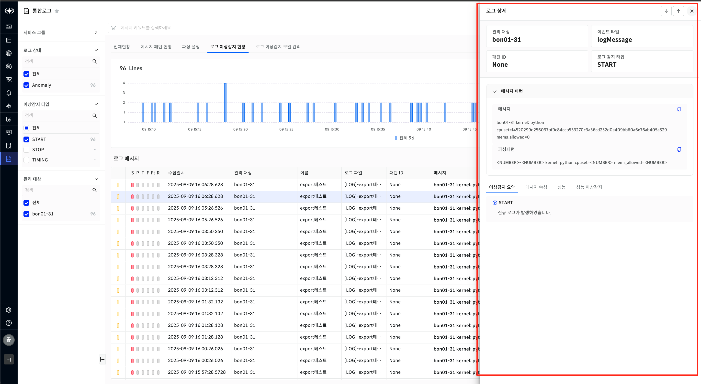

▶ \[그림5\] 로그 이상감지 현황 \> 로그 메시지 상세 조회

로그 메시지 상세 조회 \> 기본 정보 영역

**관리 대상**: 로그가 발생한 호스트/인스턴스 (예: bon01-31)

**이벤트 타입(EventType)**: 로그 이벤트 유형 (예: logMessage)

**패턴 ID**: 해당 로그가 매칭된 패턴 ID (없을 경우 None)

**로그 감지 타입**: 이상감지 분류 (START, STOP, TIMING 등)

로그 메시지 상세 조회 \> 메시지 패턴 탭

메시지 원문: 실제 수집된 로그 메시지를 그대로 보여줌

파싱 패턴: 해당 로그 메시지가 일치한 패턴 표현식을 확인 가능  
예) \<NUMBER\>-\<NUMBER\> kernel: python cpuset=\<NUMBER\> mems\_allowed=\<NUMBER\>

로그 메시지 상세 조회 \> 메시지 속성탭

로그에서 추출된 속성 값들을 구조화하여 제공합니다.

**LogLevel**: 로그 레벨 (예: WARN, ERROR)

**HostStatus**: 해당 시점의 호스트 상태 (예: Running)

**Timestamp**: 로그 발생 시각

**Tags / Parsed 영역**: 로그에서 추출된 Key-Value 속성 (예: process, mems\_allowed, cpuset 등)

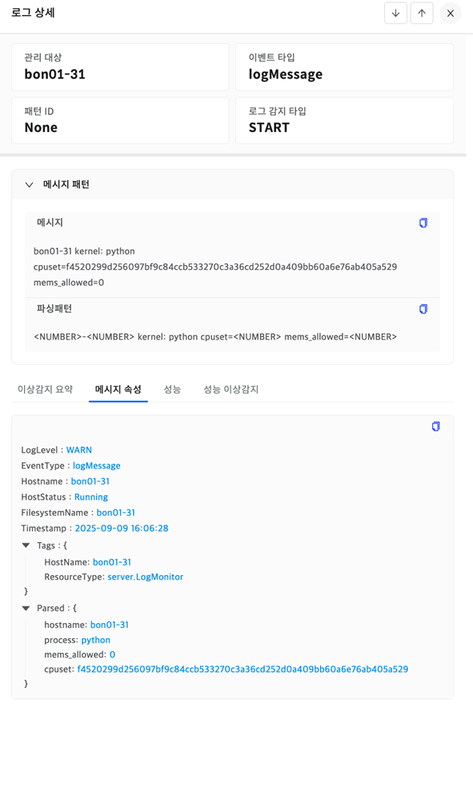▶ \[그림6\] 로그 이상감지 현황 \> 로그 메시지 상세 조회 \> 메시지 속성

로그 메시지 상세 조회 \> 성능 탭

로그 발생 시점의 주요 성능 지표를 시계열 차트로 제공합니다.

**CPU Run Queue / CPU 사용률**

**Disk 평균 I/O 처리율**

**Memory 사용률**

**네트워크 인터페이스 트래픽**

각 차트에는 로그 발생 시점을 Log 라인으로 표시하여, 로그와 성능 이벤트의 상관성을 분석할 수 있습니다.

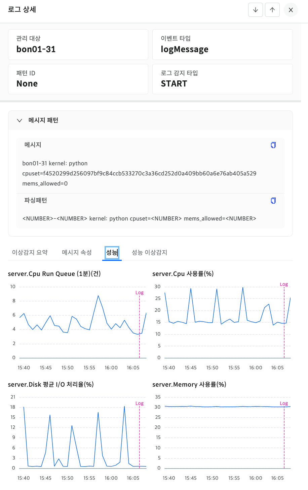

▶ \[그림7\] 로그 이상감지 현황 \> 로그 메시지 상세 조회 \> 성능

로그 메시지 상세 조회 \> 성능 이상감지 탭

로그 발생 시점에 연계된 **성능 이상감지 지표**를 표시합니다.

**정상 지표 포함 여부**: 토글로 이상 지표 외에도 정상 지표 차트를 함께 확인 가능

**정렬 기능**: 이상 발생 순, 스코어 순 등으로 지표를 정렬 가능

**지표별 상세 차트**: CPU, Memory, Process 등 성능 지표별로 스코어 평균/합계와 함께 차트 제공 ( 관리대상 타입에 따라 상이)

**확대 보기 기능**: 특정 지표를 즐겨찾기 하거나 확대하여 집중 분석 가능

**상세 정보는 이상감지 문서 참조**

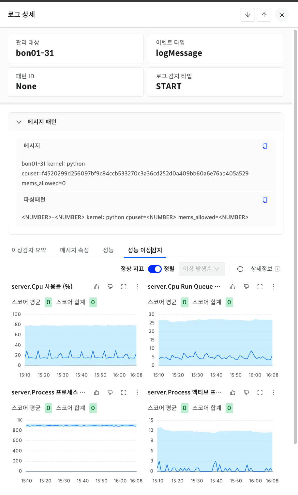

▶ \[그림8\] 로그 이상감지 현황 \> 로그 메시지 상세 조회 \> 성능 이상감지

로그 이상감지 모델 관리

로그 이상감지 모델 관리 화면은 생성된 로그 이상감지 모델을 조회, 등록, 설정 변경, 재학습할 수 있는 기능을 제공합니다.  
사용자는 등록된 모델의 상태를 확인하고, 필요 시 모델을 재학습하거나 비활성화할 수 있습니다.

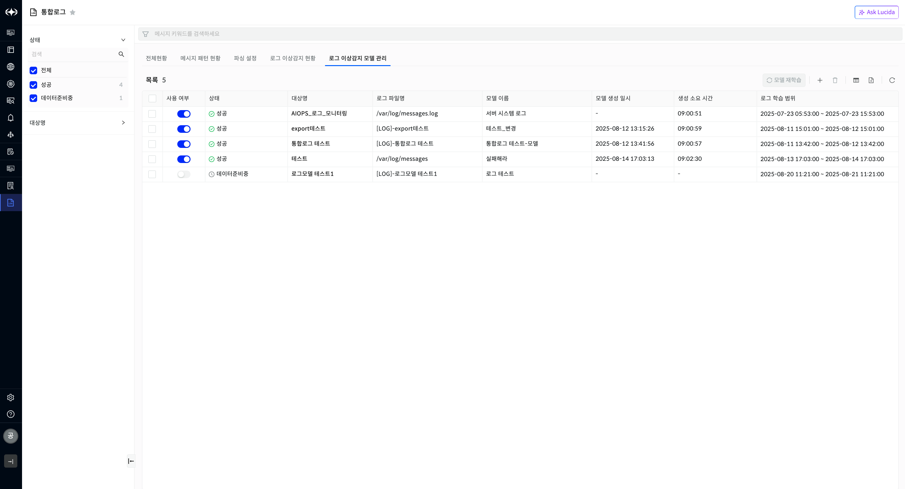

▶ \[그림9\] 로그 이상감지 모델 관리

모델 목록 조회

| 사용 여부    | 모델이 활성화/비활성화 상태인지 표시 (토글 버튼으로 변경 가능) |
| -------- | ------------------------------------ |
| 상태       | 모델 학습 및 사용 상태 (성공, 실패, 데이터준비중 등)     |
| 대상명      | 모델이 적용되는 대상 리소스 (예: 서비스명, 호스트명)      |
| 로그 파일명   | 모델 학습에 사용된 로그 파일 경로                  |
| 모델 이름    | 사용자가 정의한 모델 이름                       |
| 모델 생성일시  | 모델이 생성된 시각                           |
| 생성 소요 시간 | 모델 학습에 소요된 시간                        |
| 로그 학습 범위 | 모델 학습 시 사용된 로그의 기간 범위                |

주요 기능

**모델 재학습**: 선택된 모델에 대해 새로운 데이터 기반으로 재학습 수행

**모델 등록**: 새로운 로그 모델을 등록 가능 (+ 버튼)

**모델 설정 변경**: 사용 여부, 기본 정보 수정 가능

**상태 모니터링**: 모델이 정상적으로 동작하는지 확인 가능

모델 등록

새로운 로그 이상감지 모델을 등록하는 화면입니다.  
사용자는 모델의 기본 정보와 학습 대상을 지정하여 모델을 생성할 수 있습니다.

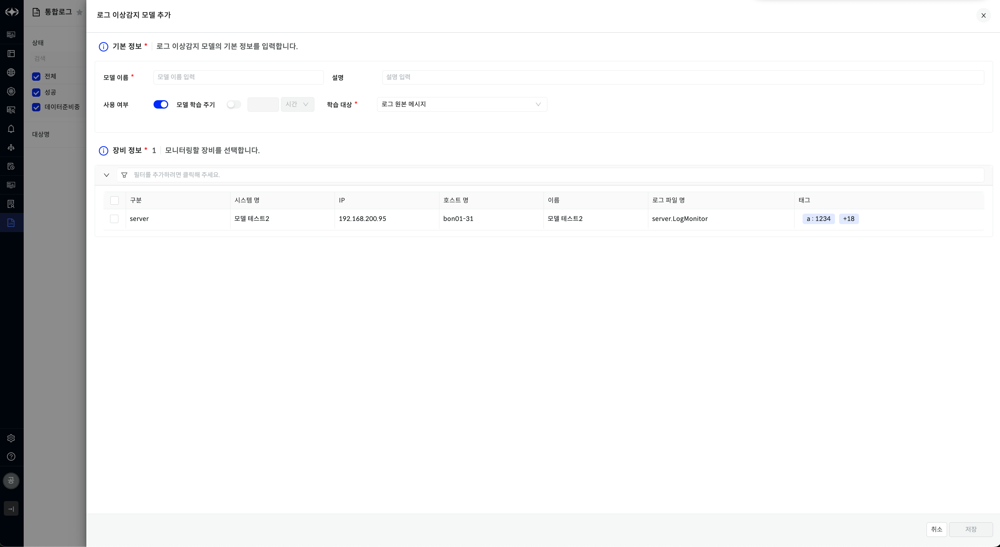▶ \[그림11\] 로그 이상감지 모델 관리 \> 등록

1.기본 정보 입력

**모델 이름**: 생성할 모델의 이름을 입력합니다.

**설명**: 모델에 대한 간단한 설명을 입력합니다.

**사용 여부**: 토글 버튼으로 해당 모델의 활성화 여부를 지정합니다.

**모델 학습 주기**: 모델을 일정 주기로 자동 학습할 수 있도록 설정합니다. (시간 단위 선택 가능)

**학습 대상**: 로그 원본 메시지, 패턴 등 학습에 사용할 데이터를 선택합니다.

2\. 장비 정보 선택

모니터링할 장비(호스트)를 선택합니다.  
표에는 아래와 같은 정보가 표시됩니다:

| 순위     | 프로세스 스코어 합계 순위 |
| ------ | -------------- |
| 시스템명   | 장비 시스템이름       |
| IP     | 대상 장비의 IP주소    |
| 호스트명   | 로그 수집 대상 호스트명  |
| 이름     | 장비 식별 이름       |
| 로그 파일명 | 학습에 사용할 로그 파일명 |
| 태그     | 장비에 부여된 태그 정보  |

<table>
<tbody>
<tr class="odd">
<td>
노트

좌측 필터와 상단 차트는 연동되어, 조건을 변경하면 메시지 리스트도 실시간으로 갱신됩니다.
</td>
</tr>
</tbody>
</table>

모델 관리 \> 모델 상세

모델 상세 화면 상단에서는 선택한 로그 이상감지 모델의 기본 정보를 확인하고 수정할 수 있습니다.

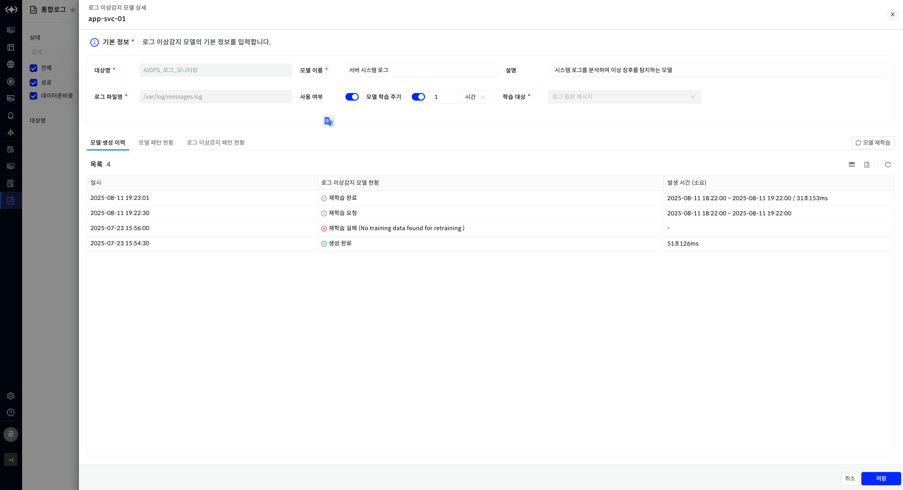▶ \[그림11\] 로그 이상감지 모델 관리 \> 조회 및 수정

| 대상명      | 모델이 적용되는 대상 리소스의 이름              |
| -------- | -------------------------------- |
| 모델 이름    | 모델의 이름                           |
| 설명       | 모델에 대한 설명                        |
| 로그 파일명   | 학습에 사용되는 로그 파일 경로                |
| 사용 여부    | 모델 활성화 여부 설정                     |
| 모델 학습 주기 | 일정 주기마다 자동으로 모델 재학습을 수행하도록 설정 가능 |
| 학습 대상    | 학습에 사용할 로그 데이터의 범주               |

모델 관리 \> 모델 상세 \> 모델 이력

모델 이력 탭에서는 해당 모델의 생성 및 재학습 내역을 시간 순으로 제공합니다.

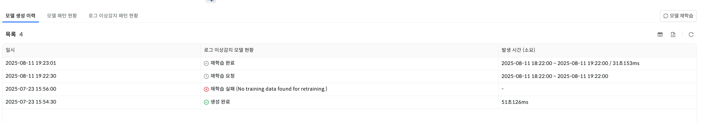▶ \[그림12\] 로그 이상감지 모델 이력 화면

| 일시            | 모델 생성 / 재학습 요청이 실행된 시각                   |
| ------------- | ---------------------------------------- |
| 로그 이상감지 모델 현황 | 각 실행의 상태 (생성 완료, 재학습 요청, 재학습 완료, 재학습 실패) |
| 발생 시간(소요)     | 모델 학습에 사용된 로그 데이터 기간과 학습에 걸린 시간          |

주요 상태

생성 완료: 모델이 정상적으로 생성됨

재학습 요청: 사용자가 재학습을 요청한 상태

재학습 완료: 재학습이 정상적으로 완료됨

재학습 실패: 학습 데이터 부족 등으로 재학습이 실패한 경우

모델 관리 \> 모델 상세 \> 모델 패턴 현황

모델 패턴 현황 화면은 해당 로그 이상감지 모델에서 탐지된 패턴들을 조회할 수 있는 기능을 제공합니다.

각 로그 패턴은 고유한 패턴 ID와 모델 패턴 식별자를 가지며, 모델이 학습하거나 탐지 과정에서 생성된 패턴의 상세 내용을 확인할 수 있습니다.

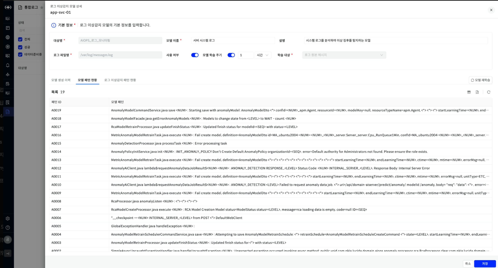▶ \[그림13\] 로그 이상감지 모델 패턴 현황 화면

모델 관리 \> 모델 상세 \> 로그 이상감지 패턴 현황

로그 이상감지 패턴 현황 화면은 모델이 학습한 로그 이상 패턴과 그 발생 내용을 유형별로 제공합니다.  
이를 통해 어떤 패턴에서 이상이 감지되었는지, 해당 패턴의 기준 값과 발생 값을 확인할 수 있습니다.

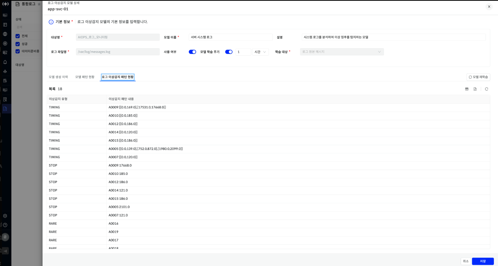▶ \[그림14\] 로그 이상감지 패턴 현황 화면

