서버목록

전체구성의 관리 대상에서 \[서버\]를 선택하거나, 전체구성 화면에서 서버목록의 개수 또는 \[더보기\>\]를 선택하면 전체 서버목록을 확인할 수 있습니다.

<table>
<tbody>
<tr class="odd">
<td>
노트

전체구성에서 관리되는 서버는 [전체구성] 메뉴의 [관리 대상 추가]에서 서버 [관리 대상 등록]을 통해 등록되어야 합니다.
</td>
</tr>
</tbody>
</table>

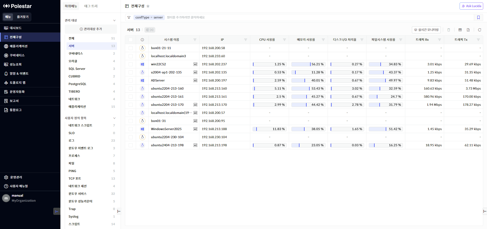

**▶ \[그림1\] 서버 목록**

화면 지표

<table>
<thead>
<tr class="header">
<th>가용성 및 관리상태</th>
<th>
서버의 가용성 및 관리상태를 서버 운영체제 아이콘을 활용하여 표시합니다.

<table>
<thead>
<tr class="header">
<th></th>
<th>: 서버가 정상적인 상태 표시 (서버 가용성: UP)</th>
</tr>
</thead>
<tbody>
<tr class="odd">
<td></td>
<td>: 서버가 다운된 상태 표시 (서버 가용성: DOWN)</td>
</tr>
<tr class="even">
<td></td>
<td>: 서버 상태정보를 알 수 없는 경우 (서버 가용성: UNKNOWN)</td>
</tr>
<tr class="odd">
<td></td>
<td>: 서버 유지보수 상태 표시</td>
</tr>
<tr class="even">
<td></td>
<td>: POLESTAR에서 관리하지 않는 서버 (성능 및 구성 데이터를 수집하지 않음)</td>
</tr>
</tbody>
</table></th>
</tr>
</thead>
<tbody>
<tr class="odd">
<td>시스템 이름</td>
<td>
서버의 호스트 이름을 보여주며 사용자가 설정할 수 있습니다.

설정 위치: 서버상세 &gt; 구성 &gt; 설정 정보 &gt; 시스템 이름
</td>
</tr>
<tr class="even">
<td>IP</td>
<td>
서버의 IP를 표시합니다.

IP는 에이전트에서 AP서버로 연결된 후 그 연결세션의 서버 IP정보입니다.
</td>
</tr>
<tr class="odd">
<td>CPU 사용률</td>
<td>
서버의 CPU 평균 사용률을 표시합니다.(최대값 : 100%)

계산 방식 : User 사용률 + Kernel 사용률

단위 : %
</td>
</tr>
<tr class="even">
<td>메모리 사용률</td>
<td>
서버의 물리적 메모리 사용률을 표시합니다.

계산 방식 :( 사용량 / 전체용량 ) * 100

단위 : %
</td>
</tr>
<tr class="odd">
<td>디스크 I/O 처리율</td>
<td>
전체 디스크들의 평균 I/O 처리율(디스크가 활성화 상태에 있는 시간의 백분율)을 표시합니다.

단위 : %
</td>
</tr>
<tr class="even">
<td>파일시스템 사용률</td>
<td>
전체 파일시스템의 총용량 대비 사용량을 사용률로 표시합니다.

단위 : %
</td>
</tr>
<tr class="odd">
<td>트래픽 Rx</td>
<td>
서버의 포트로 유입된 트래픽의 평균값을 표시합니다.

단위 : bps
</td>
</tr>
<tr class="even">
<td>트래픽 Tx</td>
<td>
서버의 포트에서 나간 트래픽의 평균값을 표시합니다.

단위 : bps
</td>
</tr>
</tbody>
</table>

서버 삭제

삭제할 서버를 선택하고 \[삭제\] 버튼을 선택하여 서버를 삭제할 수 있습니다. 서버를 삭제하더라도 수집한 성능 데이터는 삭제되지 않습니다. 삭제한 서버는 \[전체구성 \> 관리 대상 추가\] 메뉴에 등록 대기 장비로 자동 추가 되어 필요시 재등록할 수 있습니다.

POLESTAR에서 더이상 관리하지 않는 서버는 설치되어 있는 에이전트를 중지 또는 삭제해야 합니다. 에이전트 삭제 방법은 아래 노트를 참고하시기 바랍니다.

<table>
<tbody>
<tr class="odd">
<td>
노트

[서버 재등록]

삭제한 서버를 재등록하면 삭제하기 전에 수집했던 데이터와 재등록한 후 수집한 데이터를 동일한 서버의 데이터로 간주합니다. 재등록한 서버의 수집 데이터를 기존 데이터와 분리해야 하는 경우, Agent ID를 변경해야 합니다.

[에이전트 삭제]

에이전트가 설치된 서버에 접속하고 아래 명령어를 사용하여 에이전트를 삭제할 수 있습니다.

./AgentInstall.sh –uninstall

서버 에이전트와 관련된 자세한 안내는 관리자 매뉴얼의 ‘SMS Agent 설치 가이드’ 항목을 참고해주시기 바랍니다.
</td>
</tr>
</tbody>
</table>

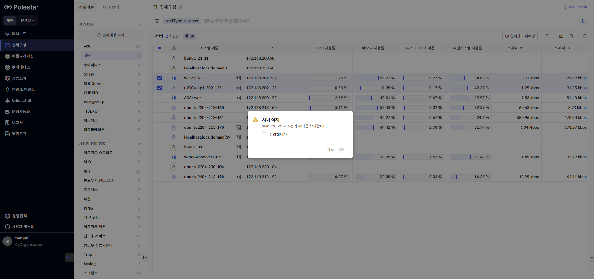

**▶ \[그림2\] 서버 삭제**

서버 삭제 절차

1.  삭제하고자 하는 서버 선택 (다중 선택 가능)

2.  서버 목록 우측 상단의 \[삭제\] 버튼 클릭

3.  삭제 안내 팝업창 내용 확인 후 \[확인\] 버튼 클릭

일괄 오퍼레이션

여러 서버에서 일괄적으로 오퍼레이션을 실행할 수 있습니다.

오퍼레이션을 실행할 서버를 선택하고 오퍼레이션 아이콘을 클릭하여 동일한 오퍼레이션을 다수의 서버에서 동시에 실행할 수 있습니다.

실행한 결과는 TXT 또는 엑셀 파일로 다운로드 받을 수 있습니다.

<table>
<tbody>
<tr class="odd">
<td>
노트

각 오퍼레이션 기능은 ‘서버 상세’ 매뉴얼을 참고하시기 바랍니다.
</td>
</tr>
</tbody>
</table>

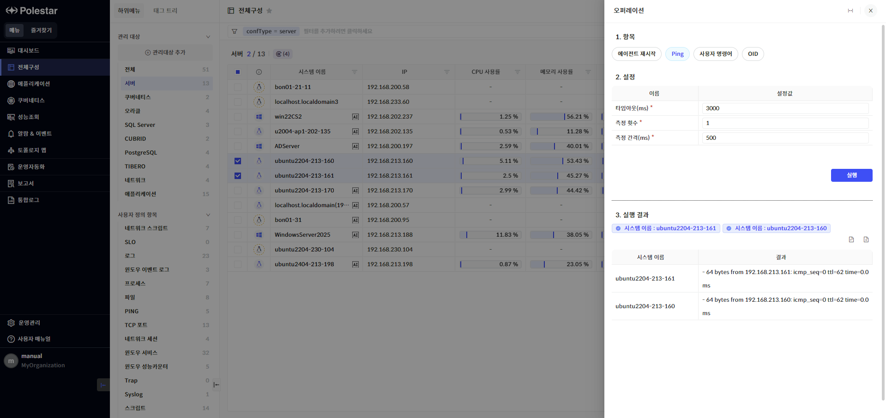

**▶ \[그림3\] 일괄 오퍼레이션**

오퍼레이션 종류

<table>
<thead>
<tr class="header">
<th>에이전트 재시작</th>
<th>선택한 서버의 에이전트를 모두 재시작합니다.</th>
</tr>
</thead>
<tbody>
<tr class="odd">
<td>Ping</td>
<td>
선택한 서버로 ICMP ping을 보내고 그 결과를 제공합니다.

타임아웃(기본 3000ms)과 측정횟수(기본 1회), 측정 간격(기본 500ms)을 설정할 수 있습니다.
</td>
</tr>
<tr class="even">
<td>사용자 명령어</td>
<td>선택한 서버에서 사용자가 입력한 명령어를 실행합니다.</td>
</tr>
<tr class="odd">
<td>OID</td>
<td>성능/구성 지표마다 설정된 OID를 사용하여 선택한 서버의 에이전트가 수집한 데이터를 확인합니다.</td>
</tr>
</tbody>
</table>

<table>
<tbody>
<tr class="odd">
<td>
주의

대량의 서버를 선택하여 오퍼레이션을 일괄적으로 실행할 경우, 실행 시간이 오래 걸릴 수 있습니다.
</td>
</tr>
</tbody>
</table>

실시간 모니터링

실시간 모니터링에서 서버의 실시간 성능 차트를 한 화면에서 조회할 수 있습니다.

서버 목록 우측 상단의 ‘실시간 모니터링’ 버튼을 클릭하면 브라우저 설정에 따라 새 창 또는 새 탭에서 서버 실시간 모니터링 화면이 표시됩니다.

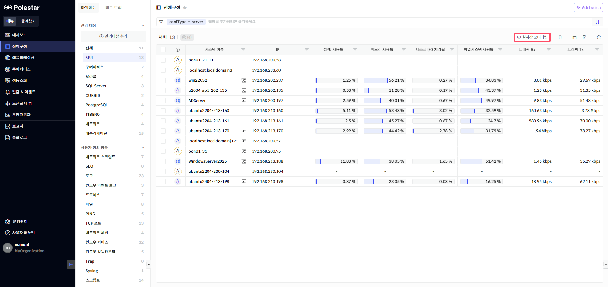

**▶ \[그림4\] 실시간 모니터링**

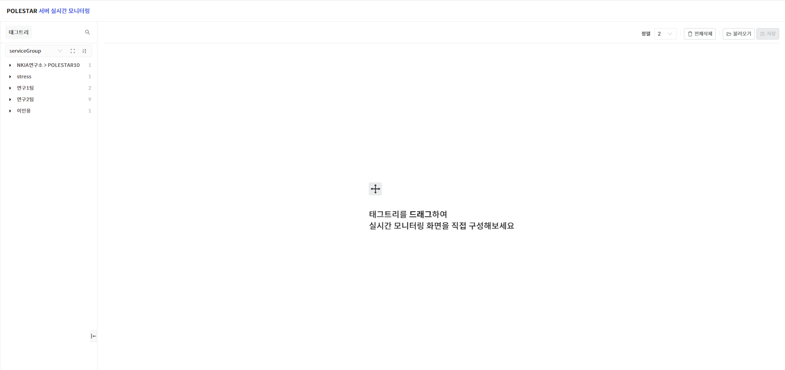

**▶ \[그림5\] 실시간 모니터링 초기 화면**

실시간 모니터링 차트 조회

태그트리에서 태그 Key 또는 각 태그 Key에 속해 있는 항목을 드래그 앤 드롭하여 선택한 태그에 해당하는 서버의 실시간 모니터링 차트를 추가할 수 있습니다. 2개 차트가 한 줄로 표시되도록 기본 설정이 되어 있고, 정렬 옵션을 변경하여 한 줄에 표시되는 차트 개수를 변경할 수 있습니다. 화면을 초기화하고 싶은 경우, \[전체삭제\] 버튼을 사용하면 조회 중인 차트를 일괄 삭제할 수 있습니다.

실시간 모니터링 차트에서는 서버의 CPU 사용률과 메모리 사용률이 표시됩니다. 차트에 표시되는 장비 이름을 클릭하면 해당 서버 장비의 상세 드로어가 나타납니다. 차트의 ‘확대 보기’ 버튼을 사용하여 특정 차트를 자세하게 확인할 수 있습니다.

<table>
<tbody>
<tr class="odd">
<td>
노트

실시간 모니터링 차트 데이터는 서버 장비의 CPU, 메모리 데이터 수집 주기에 따라 데이터가 갱신됩니다.

데이터 수집 주기는 [서버 상세 드로어 &gt; 구성 &gt; 설정 정보 &gt; 수집 정책 &gt; 정책 설정]에서 확인하실 수 있습니다.
</td>
</tr>
</tbody>
</table>

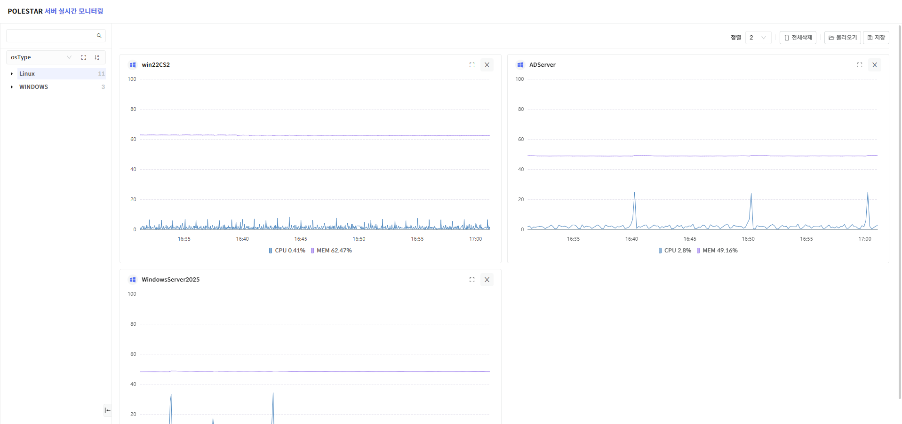

**▶ \[그림6\] 실시간 모니터링 차트**

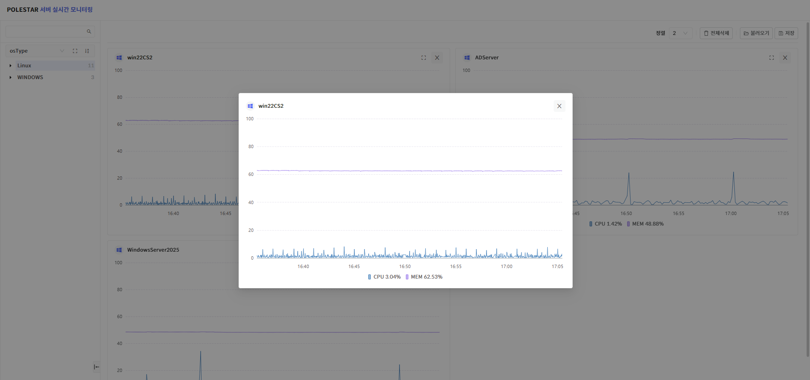

**▶ \[그림7\] 실시간 모니터링 차트 – 확대 보기**

실시간 모니터링 저장

사용자는 실시간 모니터링 차트를 조회하고 있는 서버 정보를 저장할 수 있습니다. 조회 중인 차트가 있는 경우, 화면 우측 상단의 \[저장\] 버튼이 활성화되고 조회 중인 서버 목록과 정렬 옵션을 저장할 수 있습니다.

<table>
<tbody>
<tr class="odd">
<td>
노트

실시간 모니터링 관리는 주로 조회하는 서버와 정렬 옵션을 저장하여 다음 조회 시 간편하게 적용할 수 있도록 지원하는 기능입니다. 차트의 성능 데이터를 저장하는 스냅샷 기능이 아닙니다.

실시간 모니터링 관리 기능(저장, 수정, 삭제)은 서버 조회 역할이 있는 계정에서 사용할 수 있습니다.
</td>
</tr>
</tbody>
</table>

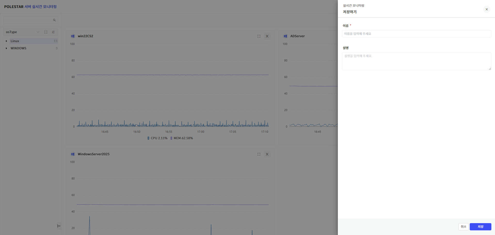

**▶ \[그림8\] 실시간 모니터링 저장**

실시간 모니터링 저장 절차

1.  태그트리에서 실시간 모니터링 차트로 조회할 태그 드래그 앤 드롭

2.  화면 우측 상단의 \[저장\] 버튼 클릭

3.  이름 및 설명 필드 입력하고 \[저장\] 버튼 클릭

실시간 모니터링 불러오기

\[불러오기\] 버튼을 클릭하면 저장한 실시간 모니터링 항목을 확인할 수 있습니다. 사용자가 등록한 실시간 모니터링 항목만 조회가 가능합니다.

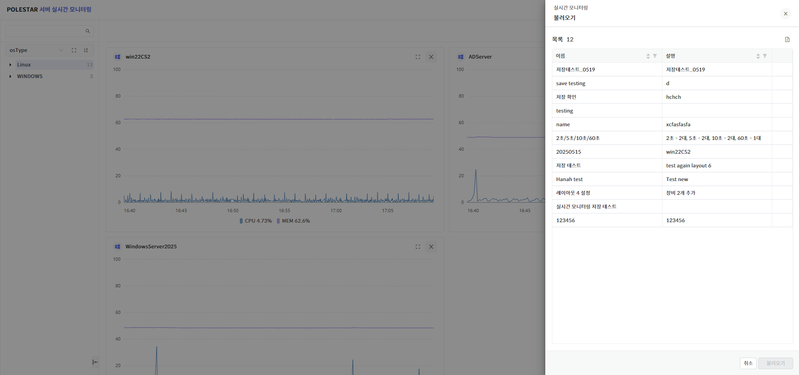

**▶ \[그림9\] 실시간 모니터링 불러오기**

실시간 모니터링 불러오기 절차

1.  화면 우측 상단의 \[불러오기\] 버튼 클릭

2.  불러올 실시간 모니터링 항목 클릭

3.  \[불러오기\] 버튼 클릭

실시간 모니터링 수정

\[불러오기\]를 통해 특정 실시간 모니터링 항목을 사용하고 있는 경우, 차트를 추가 또는 삭제하거나 정렬 옵션을 변경할 수 있습니다.

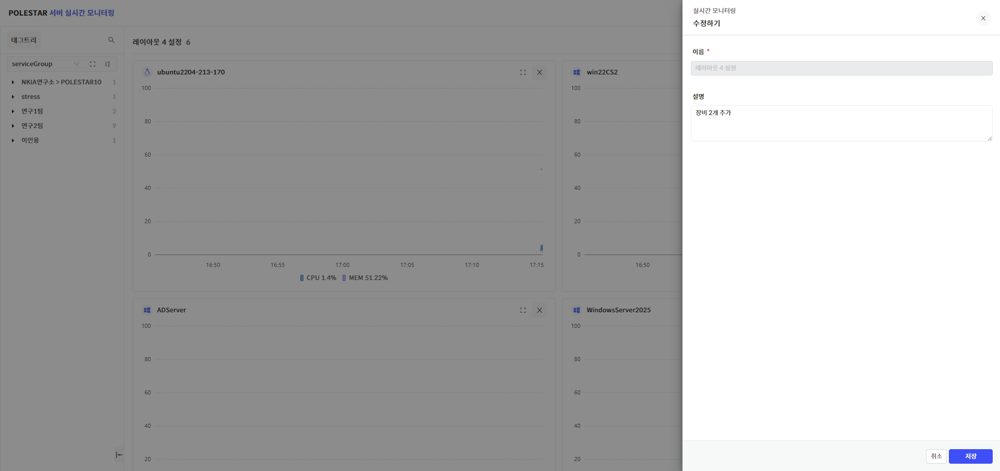

**▶ \[그림10\] 실시간 모니터링 수정**

실시간 모니터링 수정 절차

1.  화면 우측 상단의 \[불러오기\] 버튼 클릭

2.  불러올 실시간 모니터링 항목 클릭

3.  \[불러오기\] 버튼 클릭

4.  화면 우측 상단의 \[저장\] 버튼 클릭

5.  ‘수정하기’ 드로어에서 \[저장\] 버튼 클릭

실시간 모니터링 삭제

\[불러오기\] 목록에서 특정 실시간 모니터링 항목을 선택하여 삭제할 수 있습니다.

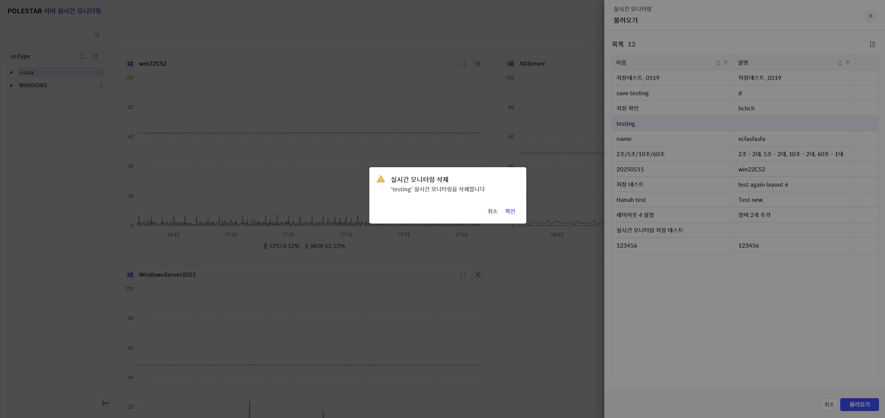

**▶ \[그림11\] 실시간 모니터링 삭제**

실시간 모니터링 삭제 절차

1.  화면 우측 상단의 \[불러오기\] 버튼 클릭

2.  특정 항목에 마우스 hover시 나타나는 \[삭제\] 버튼 클릭

3.  삭제 안내 팝업창에서 \[확인\] 버튼 클릭

