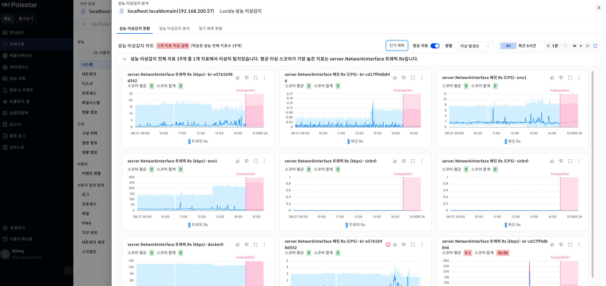
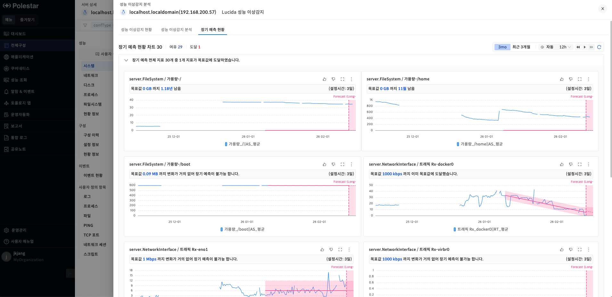

성능 예측

AI를 통해 미래의 성능 데이터를 예측하는 기능입니다. 종류로는 단기, 장기 예측 두가지가 있습니다.

단기 예측

단기 예측은 최소 1주의 성능 데이터를 학습하여 6시간의 성능 데이터를 예측합니다.

▶ \[그림1\] 단기 예측 차트

단기 예측 차트 확인 절차

1.  \[전체 구성\] 화면에서 임의의 관리 대상을 클릭합니다.

2.  왼쪽 상단에서 AI 버튼을 클릭합니다.

3.  \[성능 이상감지 현황\]에서 \[단기 예측\] 버튼을 클릭합니다.

<table>
<tbody>
<tr class="odd">
<td>
노트

AI버튼은 Aiops 라이선스가 있고 해당 관리 대상이 이상감지 관제를 수행하고 있는 경우 활성화됩니다. 이상감지 관제 관련된 부분은 성능 이상감지 정책 매뉴얼을 확인해주세요.
</td>
</tr>
</tbody>
</table>

장기 예측

장기 예측은 5분 단위 최소 1개월의 성능 데이터를 학습하여 최소 3일치의 성능 데이터를 예측합니다. 또한 장기 예측 정책에서 설정한 목표값에 도달하기 까지 얼마나 남았는지에 대한 정보와 목표값에 도달했을 때 알람을 발생시킬 수 있는 기능을 제공합니다.

<table>
<tbody>
<tr class="odd">
<td>
노트

장기 예측에 대한 설정은 장기 예측 정책 매뉴얼을 참고해주세요.
</td>
</tr>
</tbody>
</table>

▶ \[그림2\] 장기 예측 현황

장기 예측 차트 확인 절차

1.  \[전체 구성\] 화면에서 임의의 관리 대상을 클릭합니다.

2.  왼쪽 상단에서 AI 버튼을 클릭합니다.

3.  \[장기 예측 현황\] 탭을 클릭합니다.

