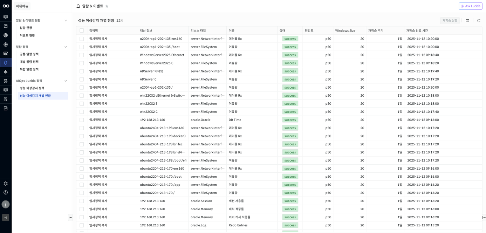

성능 이상감지 개별 현황

성능 이상감지 개별 현황은 성능 이상감지 정책을 통해 생성된 성능 이상감지 모델 목록을 보여주는 화면입니다.

▶ \[그림7\] 성능 이상감지 개별 현황 목록

성능 이상감지 개별 현황 목록 컬럼

| 정책명         | 성능 이상감지 정책 이름                                   |
| ----------- | ----------------------------------------------- |
| 대상 정보       | 리소스 이름                                          |
| 리소스 타입      | 성능 이상감지 모델의 리소스 타입                              |
| 이름          | 지표 이름                                           |
| 상태          | 성능 이상감지 모델의 상태(init/wait/running/success/error) |
| 민감도         | 성능 이상감지 정책에서 설정한 민감도                            |
| Window Size | 성능 이상감지 정책에서 설정한 Window Size                    |
| 재학습 주기      | 해당 모델의 재학습 주기                                   |
| 재학습 완료 시간   | 성능 이상감지 모델 재학습 완료 시간                            |

성능 이상감지 모델 재학습

특정 이상감지 모델 체크 후 화면 오른쪽 상단의 \[재학습 실행\] 버튼 클릭시 이상감지 모델 재학습이 수행됩니다. 재학습이 성공하면 이상감지 모델이 업데이트되고 실패하면 기존 이상감지 모델을 사용합니다.

