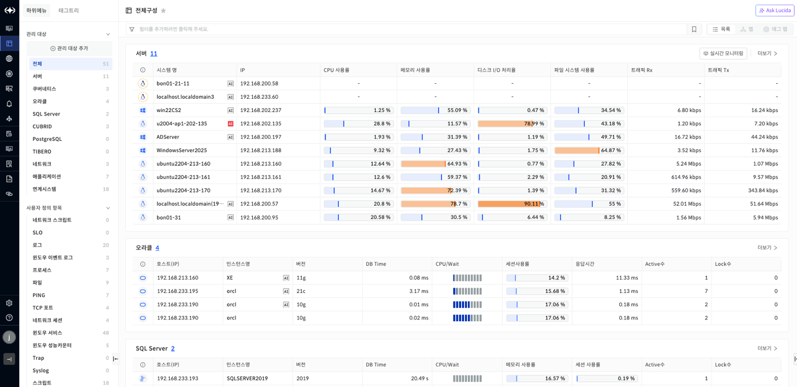
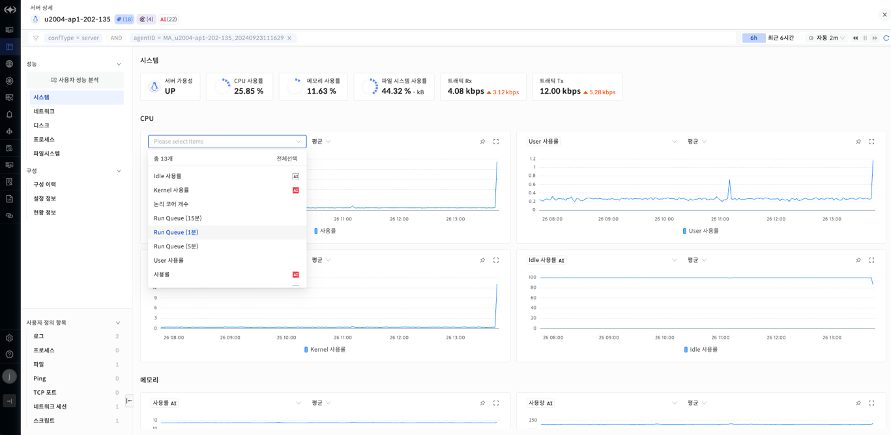
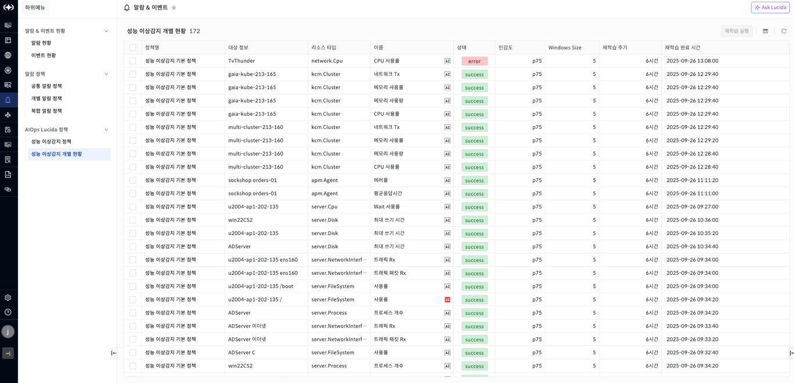

이상감지 시각화

통합 신제품 화면내에서 특정 관리 대상이나 지표가 이상감지 모니터링을 수행하고 있는지 판단할 수 있는 아이콘을 제공합니다. 이상감지 모니터링을 수행할 경우 검정색 AI 아이콘을 표시를 하고 이상감지가 발생할 경우 빨간색 AI 아이콘을 표시합니다.

전체구성 이상감지 시각화

전체 구성 화면에서 등록된 관리 대상 중 이상감지 모니터링을 수행중이면 검정색 AI 아이콘을 표시합니다. 이 중 이상감지가 발생하면 빨간색 AI 아이콘을 표시합니다. 해당 화면에서는 1분마다 이상감지 모니터링 여부를 판단합니다.

▶ \[그림1\] 전체 구성

관리 대상 상세 이상감지 시각화

이상감지 모니터링을 수행하고 있는 임의의 관리 대상 상세 화면의 왼쪽 상단에는 AI 아이콘이 표시되고 있고 해당 관리대상에서 생성한 이상감지 모델 개수를 표시합니다. 이상감지가 발생한 모델이 존재할 경우 빨간색으로 AI 아이콘이 표시됩니다. 성능 차트 지표의 경우에도 이상감지 모니터링을 수행하고 있으면 AI 아이콘이 표시되고 이상감지가 발생할 경우 빨간색 AI 아이콘이 표시됩니다. 이상감지 발생 유무 확인은 오른쪽 상단 타임 셀렉트 기간내로 조회합니다.

▶ \[그림2\] 관리 대상 상세

성능 이상감지 개별 현황 이상감지 시각화

성능 이상감지 개별 현황에서는 이상감지가 발생한 경우에만 이름 옆에 빨간색 AI를 표시합니다.

이상감지 유무 확인은 1분단위로 수행합니다.

▶ \[그림3\] 성능 이상감지 개별 현황

