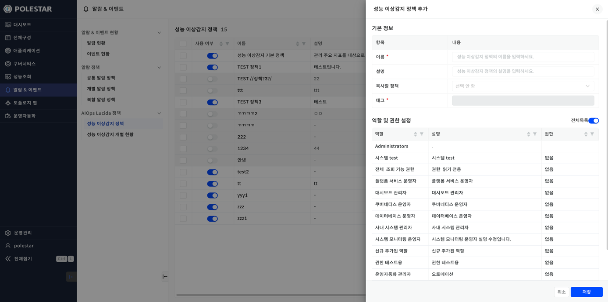
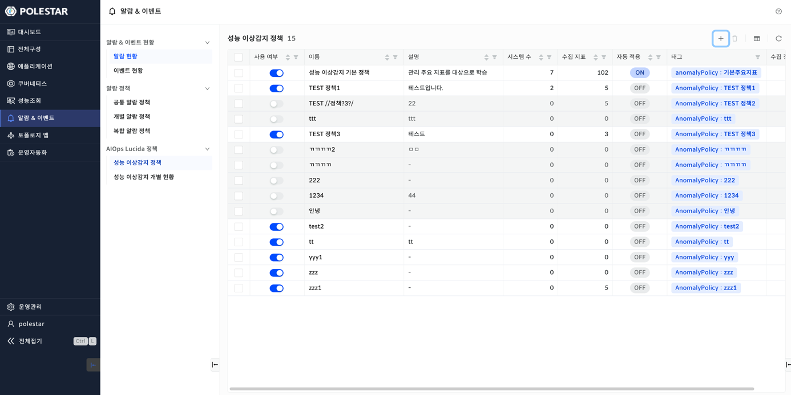
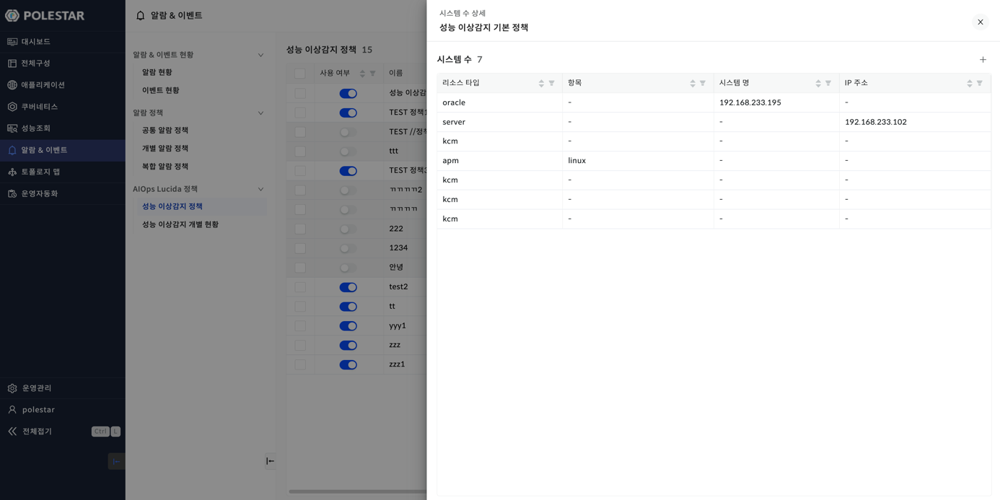
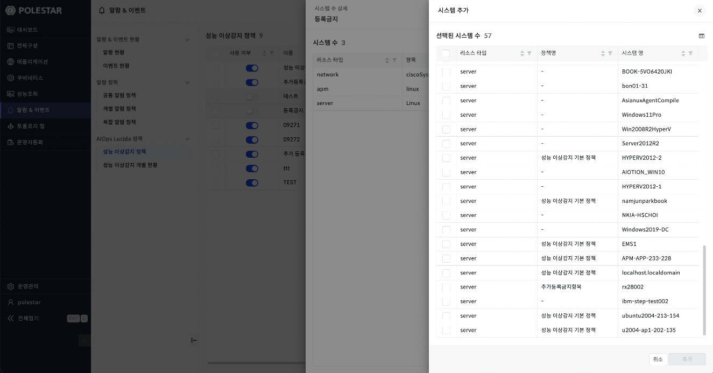
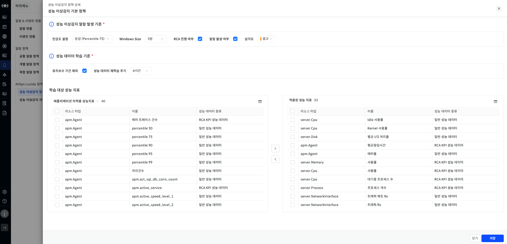
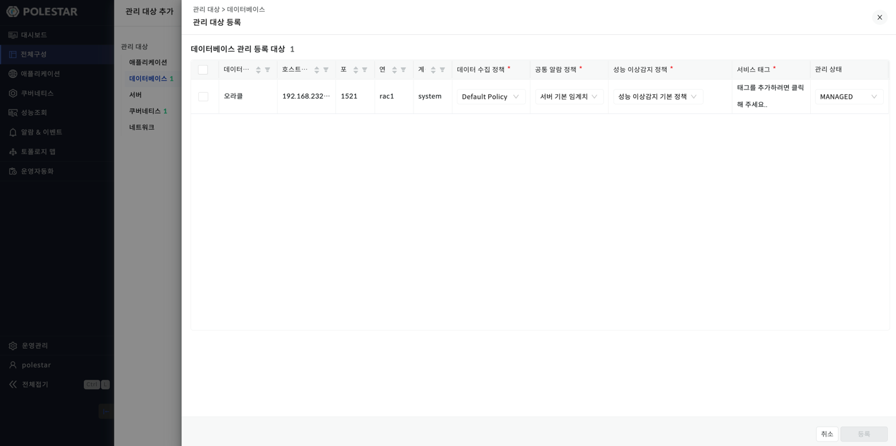

성능 이상감지 정책

성능 이상감지 정책은 관리대상들에 이상감지 기능을 적용하기 위한 용도로 사용합니다. 성능 이상감지 정책이 적용된 리소스는 정책 옵션에 맞게 이상감지 모니터링을 수행합니다.

<table>
<tbody>
<tr class="odd">
<td>
노트

현재 성능 이상감지 정책 대상이 되는 리소스는 [전체구성] 화면에서 [관리 대상 추가]로 등록할 수 있는 리소스입니다.
</td>
</tr>
</tbody>
</table>

▶ \[그림1\] 성능 이상감지 정책 추가

성능 이상감지 정책 추가 절차

1.  \[알람 & 이벤트\] \> \[성능 이상감지 정책\] 화면에서 오른쪽 상단의 \[+\]버튼을 클릭한다.

2.  기본 정보 입력, 역할 및 권한을 설정한다.

3.  \[저장\] 버튼을 클릭한다.

<table>
<tbody>
<tr class="odd">
<td>
노트

이미 등록된 성능 이상감지 정책 이름은 사용할 수 없습니다.
</td>
</tr>
</tbody>
</table>

성능 이상감지 정책 추가 항목

| 이름         | 성능 이상감지 정책 이름입니다.                   |
| ---------- | ----------------------------------- |
| 설명         | 성능 이상감지 정책 설명입니다.                   |
| 복사할 정책     | 복사할 정책입니다. 복사되는 요소는 수집정책과 수집 지표입니다. |
| 태그         | 성능 이상감지 정책 태그입니다.                   |
| 역할 및 권한 설정 | 성능 이상감지 정책의 역할 및 권한입니다.             |

성능 이상감지 정책 삭제 절차

1.  성능 이상감지 정책 목록에서 삭제하고자 하는 성능 이상감지 정책을 체크한다.

2.  오른쪽 상단 \[휴지통\] 버튼을 클릭한다.

3.  알림이 나오면 \[확인\] 버튼을 클릭한다.

성능 이상감지 정책 목록

성능 이상감지 정책 목록을 확인하는 항목입니다. \[알람 & 이벤트\] \> \[성능 이상감지 정책\]을 클릭시 해당 화면을 확인할 수 있습니다. 각 컬럼별로 필터를 적용할 수 있습니다.

▶ \[그림2\] 성능 이상감지 정책 목록

성능 이상감지 정책 목록 항목

| 사용 여부 | 성능 이상감지 정책 사용여부를 설정할 수 있습니다. 사용여부 off시 해당 이상감지 정책이 비활성화됩니다. |
| ----- | ----------------------------------------------------------- |
| 이름    | 성능 이상감지 정책 이름입니다.                                           |
| 설명    | 성능 이상감지 정책 설명입니다.                                           |
| 시스템 수 | 성능 이상감지 정책을 적용한 리소스의 개수입니다. 시스템 수를 클릭시 시스템 목록을 확인할 수 있습니다.  |
| 수집 지표 | 성능 이상감지 정책에서 설정한 학습 대상 성능 지표 수 입니다.                         |
| 자동 적용 | 관리 대상 추가시 자동으로 적용되는 성능 이상감지 정책 설정값입니다.                      |
| 태그    | 성능 이상감지 정책 태그입니다.                                           |
| 수집 정책 | 성능 이상감지 정책의 수집 정책을 확인할 수 있는 항목입니다. 클릭시 수집 정책을 확인할 수 있습니다.   |

시스템 수 상세

성능 이상감지 정책에 적용된 시스템들의 정보를 확인할 수 있습니다. 각 컬럼별로 필터 및 정렬 기능을 제공합니다. 해당 화면에서 시스템을 추가할 수 있습니다. 이미 이상감지 정책이 적용된 시스템을 추가하면 기존 이상감지 정책에 의해 생성됐던 이상감지 모델은 모두 삭제됩니다. 추가 버튼을 통해 이상감지 정책을 변경할 수 있습니다.

▶ \[그림3\] 시스템 수 상세

시스템 수 항목

| 리소스 타입 | 시스템의 리소스 타입입니다.        |
| ------ | ---------------------- |
| 항목     | 각 시스템의 타입을 나타내는 항목입니다. |
| 시스템 명  | 시스템의 이름입니다.            |
| IP 주소  | 시스템의 IP주소입니다.          |

시스템 추가 절차

1.  성능 이상감지 정책 목록에서 임의의 성능 이상감지 정책의 시스템 수를 클릭한다.

2.  시스템 수 상세 드로우 화면 오른쪽 상단 \[+\] 버튼을 클릭한다.

3.  추가하고자 하는 시스템을 체크 후 오른쪽 하단 \[추가\] 버튼을 클릭한다.

4.  성능 이상감지 정책에 시스템이 추가된다.

▶ \[그림4\] 시스템 추가

수집 정책

성능 이상감지 정책의 상세한 정보를 확인할 수 있다. 성능 이상감지 정책 목록에서 임의의 성능 이상감지 정책의 수집 정책 버튼을 클릭시 확인이 가능하다.

▶ \[그림5\] 성능 이상감지 정책 상세

수집 정책 항목

| 민감도 설정        | 성능 이상감지 알람 발생 판단을 위한 설정입니다. 설정값이P50인 경우, 하나의 시스템의 이상감지 학습 대상 지표들 중 하나 이상의 이상감지 스코어가 50이상일 때 알람이 발생한다는 것을 나타냅니다. |
| ------------- | --------------------------------------------------------------------------------------------------------------- |
| Window Size   | 성능 이상감지 알람을 판단 범위를 말합니다. 20분으로 설정시 20분동안의 이상감지여부를 판단하여 이상감지 알람 발생여부를 판단합니다.                                     |
| RCA 진행 여부     | RCA 발생 여부입니다.                                                                                                   |
| 알람 발생 여부      | 성능 이상감지 알람 발생 여부입니다.                                                                                            |
| 심각도           | 성능 이상감지 알람 발생시 나타낼 심각도입니다.                                                                                      |
| 유지보수 기간 제외    | 유지보수 기간 제외 여부를 나타냅니다.                                                                                           |
| 성능 데이터 재학습 주기 | 시스템의 이상감지 학습 대상 지표들의 재학습 주기를 뜻합니다.                                                                              |
| 학습 대상 성능 지표   | 성능 이상감지 정책에 적용된 학습 대상 성능 지표입니다.                                                                                 |

<table>
<tbody>
<tr class="odd">
<td>
노트

성능 이상감지 정책 추가시 적용되는 기본 수집 정책은 다음과 같다.

민감도: 기본(p50)

windowSize: 20분

알람 발생 여부: true

심각도: 경고

유지보수 기간 제외: true

성능 데이터 재학습 주기: 1일
</td>
</tr>
</tbody>
</table>

수집 정책 수정 절차

1.  \[알람 & 이벤트\] \> \[성능 이상감지 정책\] 목록에서 임의의 정책의 수집정책 버튼을 클릭한다.

2.  \[성능 이상감지 알람 발생 기준\], \[성능 데이터 학습 기준\]을 설정한다.

3.  \[학습 대상 성능 지표\] \> \[미적용된 성능 지표\]에서 추가할 성능 지표를 체크하고 \[\>\] 버튼을 클릭한다.

4.  \[학습 대상 성능 지표\] \> \[적용된 성능 지표\]에서 삭제할 지표를 체크하고 \[\<\] 버튼을 클릭한다.

5.  \[저장\] 버튼을 클릭한다.

성능 이상감지 정책 적용

관리대상 추가시 성능 이상감지 정책을 적용할 수 있다. 디폴트로는 \[선택 안함\]이 적용된다. \[성능 이상감지 정책\] 메뉴를 클릭하여 다른 성능 이상감지 정책으로 변경할 수 있다.

▶ \[그림6\] 성능 이상감지 정책 적용 예

성능 이상감지 정책 적용 절차

1.  \[전체구성\] 에서 \[관리 대상 추가\] 버튼을 클릭한다.

2.  추가하고자 하는 관리 대상을 체크 후 \[관리 대상 등록\] 버튼을 클릭한다.

3.  \[성능 이상감지 정책\] 컬럼에서 적용할 성능 이상감지 정책을 선택한다.

4.  체크 후 \[등록\] 버튼을 클릭한다.

5.  등록한 관리 대상을 선택한 성능 이상감지 정책에 맞게 이상감지 모니터링을 수행한다.

