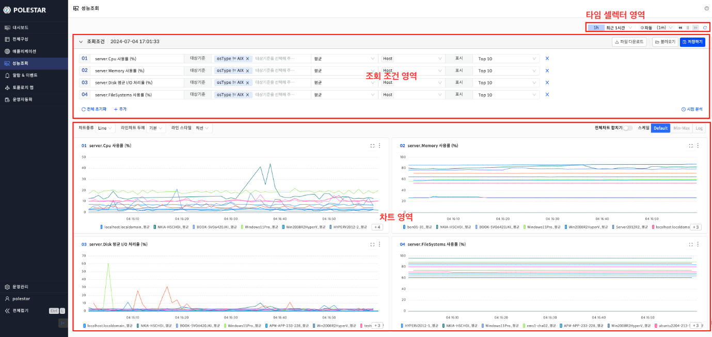
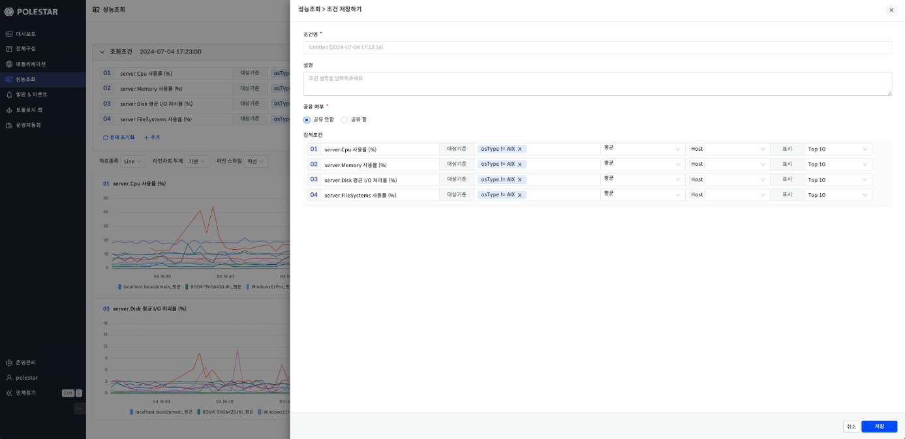
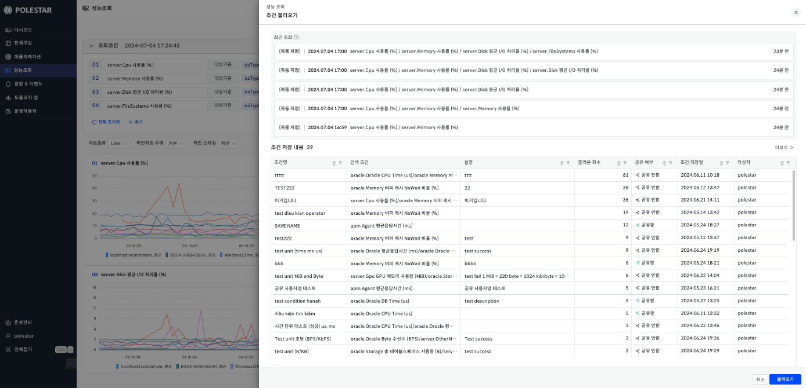
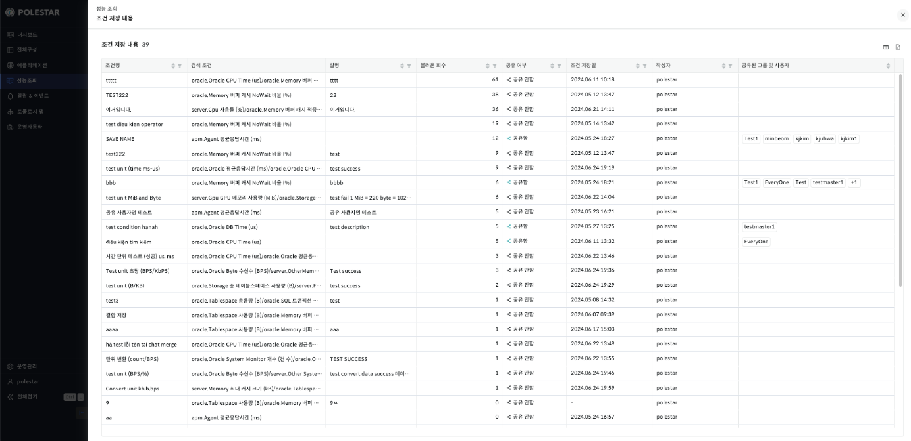
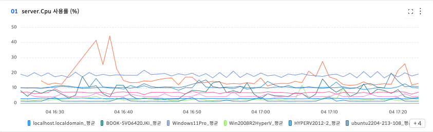
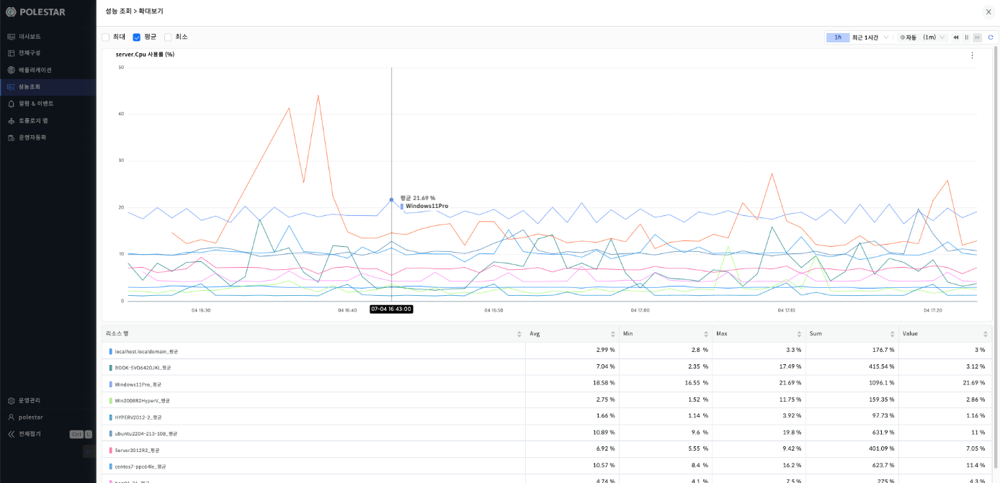
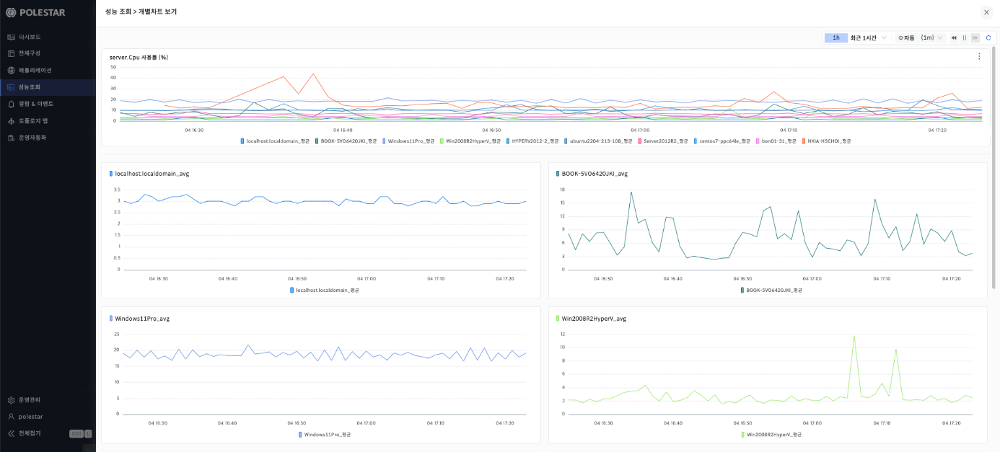

성능 조회

여러 리소스에 대한 성능을 종합적으로 분석할 수 있는 기능을 제공합니다. 조회조건에서 성능 지표 및 기타 옵션을 선택하면 지표에 대한 성능 차트가 나옵니다. 기본적인 성능 조회 기간과 시간 단위는 오른쪽 상단의 타임 셀렉터를 따라가며 조회 기간과 시간 단위는 설정할 수 있습니다.

<table>
<tbody>
<tr class="odd">
<td>
노트

성능 조회를 하기 위해서는 [전체구성]에서 성능 수집을 하는 관리 대상이 추가되어야 합니다.
</td>
</tr>
</tbody>
</table>

▶ \[그림1\] 성능 조회

<table>
<tbody>
<tr class="odd">
<td>
노트

타임 셀렉터의 모든 조회 기간에는 디폴트로 [자동] 시간 단위를 제공합니다.

사용자 정의 시간 범위 설정시 조회 기간에 맞춰 자동으로 시간 단위를 제공합니다

또한 조회 기간별로 제공되는 시간 단위가 다릅니다.

<ul>
<li>
최근 30분 : 1분/5분
</li>
<li>
최근 1시간 : 1분/5분/1시간
</li>
<li>
최근 3시간 : 1분/5분/1시간
</li>
<li>
최근 6시간 : 1분/5분/1시간
</li>
<li>
최근 1일 : 1분/5분/1시간/1일
</li>
<li>
최근 3일 : 5분/1시간/1일
</li>
<li>
최근 1주일 : 5분/1시간/1일
</li>
<li>
최근 1개월 : 1시간/1일
</li>
<li>
최근 3개월 : 1일
</li>
<li>
최근 6개월 : 1일
</li>
<li>
최근 1년 : 1일
</li>
</ul></td>
</tr>
</tbody>
</table>

조회조건

조회조건은 성능 조회시 필수적으로 선택해야 하는 정보로 사용자가 보길 원하는 성능 데이터를 조회조건을 통해 차트로 확인할 수 있다. 조회조건은 \[+ 추가\] 버튼을 클릭하여 복수개의 조회조건을 추가할 수 있고 조회조건 오른쪽 \[x\]버튼을 클릭하여 삭제할 수 있습니다.

조회조건 선택 항목

<table>
<thead>
<tr class="header">
<th>지표</th>
<th>
성능 조회하고자 하는 리소스의 지표를 선택합니다.

메뉴 상단에 최근 검색 목록이 나옵니다.
</th>
</tr>
</thead>
<tbody>
<tr class="odd">
<td>대상 기준</td>
<td>
리소스 태그를 선택합니다.

메뉴 상단에 최근 검색 목록이 나옵니다
</td>
</tr>
<tr class="even">
<td>통계 기준</td>
<td>평균/최대/최소를 선택할 수 있다. 성능 차트를 어떻게 통계할지에 대한 기준이 됩니다.</td>
</tr>
<tr class="odd">
<td>개별 표시 선택</td>
<td>성능 차트를 Host/Name 으로 그룹핑여부를 선택할 수 있습니다.</td>
</tr>
<tr class="even">
<td>범례 개수</td>
<td>ALL/Top10/Top20/Top30/Bottom10/Bottom20/Bottom30</td>
</tr>
</tbody>
</table>

조회조건 추가 절차

1.  조회조건 영역에서 왼쪽 하단의 \[+ 추가\] 버튼을 클릭한다.

2.  조회조건 항목을 선택한다.

3.  조건에 맞는 차트가 차트영역에 자동 조회된다.

조회조건 삭제 절차

1.  조회조건 영역에서 임의의 조건 오른쪽 \[X\] 버튼을 클릭한다.

2.  조회조건이 삭제되고 해당 조건에 대한 차트가 차트 영역에서 삭제된다.

저장하기

성능조회를 위한 검색 조건을 저장하는 기능입니다. 자주 사용하는 조회조건을 저장하여 불러오기를 통해 조회조건 선택 없이 빠르게 성능조회를 할 수 있습니다. 또한 저장한 조회조건을 다른 사용자나 그룹에 공유할 수 있습니다. 조회조건 영역 오른쪽 \[저장하기\] 버튼을 통해 조회조건을 저장할 수 있습니다.

▶ \[그림2\] 조회 조건 저장하기

저장하기 항목

| 조건명   | 조회조건 이름                                          |
| ----- | ------------------------------------------------ |
| 설명    | 조건 설명                                            |
| 공유 여부 | 평균/최대/최소를 선택할 수 있다. 성능 차트를 어떻게 통계할지에 대한 기준이 됩니다. |
| 검색조건  | 다른 사용자나 그룹에 해당 조건을 공유할지에 대한 옵션                   |
| 범례 개수 | 저장할 검색조건을 읽기 모드로 보여준다.                           |

불러오기

저장한 조회조건 혹은 최근에 조회한 조건을 불러오는데 사용됩니다. 불러오기 화면에서 조회조건 영역 오른쪽 \[불러오기\] 버튼을 통해 조회조건을 불러올 수 있습니다.

▶ \[그림3\] 조회 조건 불러오기

불러오기 항목

| 최근 조회  | 최근에 조회한 조건 목록                  |
| ------ | ------------------------------ |
| 조건명    | 조회 조건 이름                       |
| 검색조건   | 조회 조건                          |
| 설명     | 조회 조건 설명                       |
| 불러온 횟수 | 해당 조건을 불러온 횟수                  |
| 공유 여부  | 사용자 혹은 그룹에 해당 조건을 공유했는지에 대한 여부 |

불러오기 절차

1.  성능조회 화면의 \[불러오기\] 버튼 클릭

2.  \[조건 불러오기\] 화면에서 조건 클릭

3.  오른쪽 하단 \[불러오기\] 버튼 클릭

조건 내용 저장

조건 저장 내용을 상세하게 보기 위한 화면입니다. \[불러오기\] 화면에서 \[조건 저장 내용\] 오른쪽의 \[더보기\] 버튼을 클릭하면 해당 화면으로 이동됩니다.

▶ \[그림4\] 조건 저장 내용 화면

조건 저장 내용 항목

| 조건명          | 조회 조건 이름                       |
| ------------ | ------------------------------ |
| 검색조건         | 조회 조건                          |
| 설명           | 조회 조건 설명                       |
| 불러온 횟수       | 해당 조건을 불러온 횟수                  |
| 공유 여부        | 사용자 혹은 그룹에 해당 조건을 공유했는지에 대한 여부 |
| 조건 저장일       | 조회 조건을 저장한 날짜                  |
| 작성자          | 조회 조건을 저장한 사용자                 |
| 공유된 그룹 및 사용자 | 공유된 그룹 및 사용자 목록                |

<table>
<tbody>
<tr class="odd">
<td>
노트

조건 저장 내용 화면 오른쪽 상단의 [엑셀 저장] 버튼을 통해 조건 저장 내용을 엑셀 파일로 다운로드 받을 수 있습니다.
</td>
</tr>
</tbody>
</table>

조회조건 결과

각 조회조건에서 선택한 결과를 차트로 보여줍니다. 차트에 범례가 많을시 \[+N\] 아이콘으로 표시되고 \[+N\] 아이콘 클릭시 나머지 범례를 보여줍니다. 특정 범례를 클릭시 해당 범례에 대한 차트만 차트에 표시됩니다. \[전체차트 합치기\]를 통해 복수개의 조회조건을 하나의 차트로 볼 수 있습니다.

▶ \[그림5\] 성능 조회 차트

<table>
<tbody>
<tr class="odd">
<td>
노트

차트종류: Line/Stacked Bar/Stacked Area 형태로 차트를 보여줍니다.

라인차트 두께: 기본/볼드 형태를 선택 가능합니다.

라인 스타일: 직선/곡선으로 선택 가능합니다.
</td>
</tr>
</tbody>
</table>

<table>
<tbody>
<tr class="odd">
<td>
노트

차트 스케일은 기본 Default이고 차트 종류가 Line일 경우 Min-Max, Log 형태의 스케일을 선택할 수 있습니다..
</td>
</tr>
</tbody>
</table>

확대보기

확대보기는 조회조건 결과로 나온 차트를 확대해서 자세히 보기 위한 기능입니다. 오른쪽 상단 확장 버튼을 클릭시 확대보기 화면이 드로어로 나옵니다. 차트 조회 기간과 시간 단위는 오른쪽 상단의 타임 셀렉터를 따라가며 조회 기간과 시간 단위는 설정할 수 있습니다. 초기화 버튼 클릭시 조회 기간과 시간 단위가 초기화됩니다. 확대보기 화면은 크게 차트와 테이블로 나뉘어져 있고 기본적으로 평균 데이터를 제공하고 있습니다. 평균 이외에 최대/최소 성능 데이터도 추가로 제공하고 있고 화면 오른쪽 상단의 최대/평균/최소 체크박스 체크여부를 통해 화면에 보여지는 데이터를 선택할 수 있습니다. 차트를 마우스로 드래그시 드래그한 기간에 대한 데이터가 조회됩니다.

> ▶ \[그림6\] 확대보기

<table>
<tbody>
<tr class="odd">
<td>
노트

테이블에서는 리소스별로 Avg, Min, Max, Sum, Value 값을 제공하고 있고 Value의 경우 차트에서 마우스 오버시 해당 시점의 값을 반영합니다.
</td>
</tr>
</tbody>
</table>

개별차트 보기

하나의 조회조건 결과, 범례가 복수개일 경우 개별차트 보기를 통해 범례당 하나의 차트를 볼 수있습니다. 차트 조회 기간과 시간 단위는 오른쪽 상단의 타임 셀렉터를 따라가며 조회 기간과 시간 단위는 설정할 수 있습니다. 초기화 버튼 클릭시 조회 기간과 시간 단위가 초기화됩니다.

▶ \[그림7\] 개별차트 보기

개별차트 보기 절차

1.  조회조건 검색

2.  조회조건 결과로 나온 차트의 오른쪽 상단 메뉴 버튼 클릭

3.  개별차트 보기 클릭

