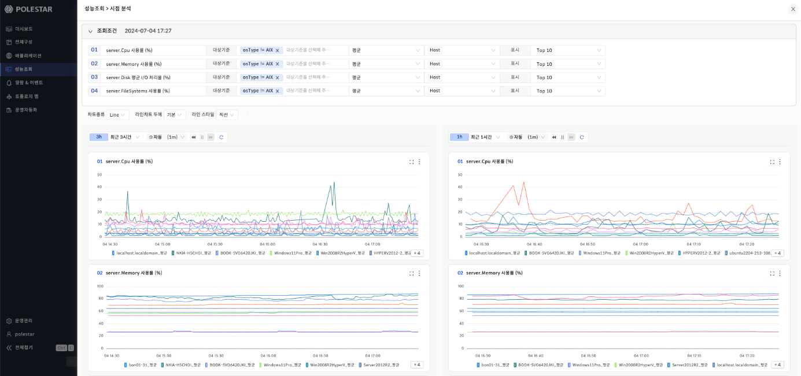

시점 분석

동일한 성능 차트를 다른 시간대에 비교할 수 있는 기능입니다. 성능 조회 결과 화면에서 조회 조건의 오른쪽 하단에 있는 \[시점 분석\]을 통해 해당 기능을 이용할 수 있습니다. 시점 분석 화면에서는 조회 조건을 변경할 수 있으며, 차트 조회 기간 및 시간 단위는 성능 조회 화면의 시간을 따릅니다. 또한, 시점 분석 화면에서 비교 대상이 되는 차트의 조회 기간은 더 긴 기간으로 조회됩니다. 예를 들어 최근 30분 기준으로 시점 분석시 비교대상의 조회 기간은 최근 1시간으로 조회됩니다.

▶ \[그림1\] 시점 분석

<table>
<tbody>
<tr class="odd">
<td>
노트

조회조건은 조회조건 챕터, 확대보기는 확대기보 챕터를 참고해주세요.
</td>
</tr>
</tbody>
</table>

<table>
<tbody>
<tr class="odd">
<td>
노트

차트종류: Line/Stacked Bar/Stacked Area 형태로 차트를 보여줍니다.

라인차트 두께: 기본/볼드 형태를 선택 가능합니다.

라인 스타일: 직선/곡선으로 선택 가능합니다.
</td>
</tr>
</tbody>
</table>

<table>
<tbody>
<tr class="odd">
<td>
노트

차트 오른쪽 상단 메뉴의 [excel 파일 저장] 버튼을 통해 차트 정보를 엑셀 파일로 다운로드 받을 수 있습니다.
</td>
</tr>
</tbody>
</table>

