애플리케이션 상세

WPM 서비스 타입의 애플리케이션 상세를 확인하고자 한다면 아래의 링크를 클릭합니다.

[► WPM 서비스의 애플리케이션 상세]()

애플리케이션 상세 화면에서는 서비스에서 수행된 애플리케이션의 성능을 조회하고 서비스맵을 통해 에이전트간의 트레이스 처리 현황을 시각적으로 조회할 수 있습니다. 과거에 수행된 애플리케이션을 조회하고자 한다면 \[트레이스조회\]를 선택하고 조회 기간을 지정해 조회할 수 있어 과거에 수행된 응답시간이 느린 트레이스의 실행내역을 상세하게 확인하여 애플리케이션의 문제점을 추적할 수 있습니다. 또한 \[분석\]기능을 통해 애플리케이션의 엔트리포인트, 데이터베이스(쿼리), 예외/에러를 통해 트레이스의 종합적인 성능 상태를 확인 할 수 있어 애플리케이션에서 발생한 성능 문제를 빠르게 조치할 수 있는 분석 데이터를 제공합니다.

<table>
<tbody>
<tr class="odd">
<td>
노트

애플리케이션 서비스 상세 화면에서는 조회하고자 하는 에이전트 목록을 설정할 수 있습니다. 화면 상단에 에이전트 목록이 표시되고 타임피커가 “LIVE”인 경우 조회하고자 하는 에이전트를 선택하여 선택 상태로 전환하면 됩니다.

[LIVE]가 아닌 경우 에이전트 목록에서 에이전트를 선택하거나 선택 해제한 후 조회 버튼을 클릭하여 선택한 에이전트들의 성능이 조회될 수 있도록 합니다.
</td>
</tr>
</tbody>
</table>

성능 \> 서비스 요약

성능의 서비스 요약화면에서는 애플리케이션의 수행 상태를 확인하기 위해 기본적으로 조회하는 주요 지표인 처리건수, 평균응답시간, 에러율, 응답시간에 대한 백분위수에 대한 정보를 제공합니다. 애플리케이션에서 수행 중인 트레이스들의 응답시간과 상태를 시각적으로 빠르게 확인할 수 있도록 응답분포도와 응답시간 히스토그램을 제공합니다.

> 조회 대상 에이전트 변경

1.  > LIVE 모드인 경우 조회 대상에서 선택 또는 제외하고자 하는 에이전트를 클릭.

> LIVE 모드가 아닌 경우 조회 대상에서 선택 또는 제외하고자 하는 에이전트를 클릭하고 조회 버튼 클릭

2.  > 에이전트 전체를 선택하거나 해제할 경우 전체 버튼 클릭

3.  > 에이전트 목록이 한 줄에 표현하지 못할 경우 에이전트 목록의 오른쪽 조회 버튼 앞의 ▼를 클릭하여 전체 에이전트 목록 표시

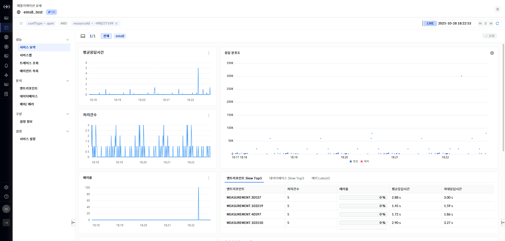

> ▶ \[그림1\] 서비스 요약
> 
> 서비스 요약

<table>
<thead>
<tr class="header">
<th>평균응답시간</th>
<th><table>
<tbody>
<tr class="odd">
<td>
서비스에서 수행된 트레이스의 응답시간을 단위시간(차트 간격)기준으로 평균 계산하여 표시합니다.

단위 : miliseconds
</td>
</tr>
</tbody>
</table></th>
</tr>
</thead>
<tbody>
<tr class="odd">
<td>처리건수</td>
<td>서비스에서 수행된 트레이스의 처리건수를 단위시간(차트 간격)기준으로 합산하여 표시합니다.</td>
</tr>
<tr class="even">
<td>에러율</td>
<td>
단위시간(차트 간격)기준으로 트레이스의 전체 처리건수 대비 에러건수를 비율로 표시합니다.(최대값 : 100%)

계산 방식 : 단위시간내 에러건수 / 단위시간내 전체처리건수 * 100
</td>
</tr>
<tr class="odd">
<td>응답시간 백분위수</td>
<td>
단위시간(차트 간격)기준으로 트레이스의 응답시간을 백분위수(p99,p95,p90,p75,p50)으로 표시합니다.

단위 : microseconds
</td>
</tr>
<tr class="even">
<td>엔트리포인트 Slow Top5</td>
<td>서비스에서 수행된 애플리케이션 중 응답시간이 느린 Top5를 엔트리포인트 기준으로 최대응답시간, 평균응답시간, 에러율과 함께 표시합니다.</td>
</tr>
<tr class="odd">
<td>데이터베이스 Slow Top5</td>
<td>서비스에서 수행된 데이테베이스 쿼리 중 응답시간이 느린 Top5를 엔트리포인트 기준으로 최대응답시간, 평균응답시간, 에러율과 함께 표시합니다.</td>
</tr>
<tr class="even">
<td>에러 Latest5</td>
<td>조회시간을 기준으로 최근에 발생한 에러를 표시합니다.</td>
</tr>
<tr class="odd">
<td>응답시간 히스토그램</td>
<td>조회시간내 실행된 트레이스들의 응답시간을 1초간격의 구간으로 합산하여 히스토그램으로 표시합니다. 히스토그램을 통해 기간 내 수행한 트레이스들의 응답시간 분포를 파악할 수 있습니다.</td>
</tr>
<tr class="even">
<td>연관 리소스</td>
<td>서비스 내 에이전트가 실행되고 있는 호스트 및 데이터베이스 정보, 에이전트 명, 에이전트 별 평균응답시간, 처리건수, 에러율의 성능을 표시합니다.</td>
</tr>
</tbody>
</table>

상세보기

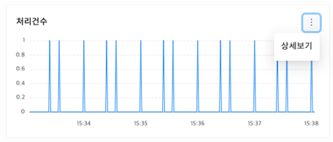

> ▶ \[그림2\] 상세보기

서비스 요약화면의 평균응답시간, 처리건수, 에러율 지표의 경우 \[상세보기\]를 선택하면 에이전트별 처리현황을 상세하게 확인할 수 있습니다. 지표 상세보기 현황화면에서는 아래의 그림에서 처럼 두 개의 차트가 표시됩니다. 위 차트의 경우 서비스내의 모든 에이전트의 성능을 종합하여 보여주는 차트이며 아래 차트는 개별 에이전트별 성능을 개별 라인으로 보여주는 차트입니다. 첫 번째 차트의 경우 오른쪽 상단의 에이전트 성능을 종합할 때 사용하는 함수를 AVG, SUM, MAX로 변경하여 성능을 확인할 수 있습니다. 개별 에이전트 차트의 경우 현재 시점을 기준으로 Top 5, Top 10, Top 20으로 에이전트별 지표 성능을 확인 할 수 있습니다. 차트 아래의 범례를 선택하여 특정 에이전트를 제외하거나 선택하여 확인할 수 있는 기능도 제공합니다.

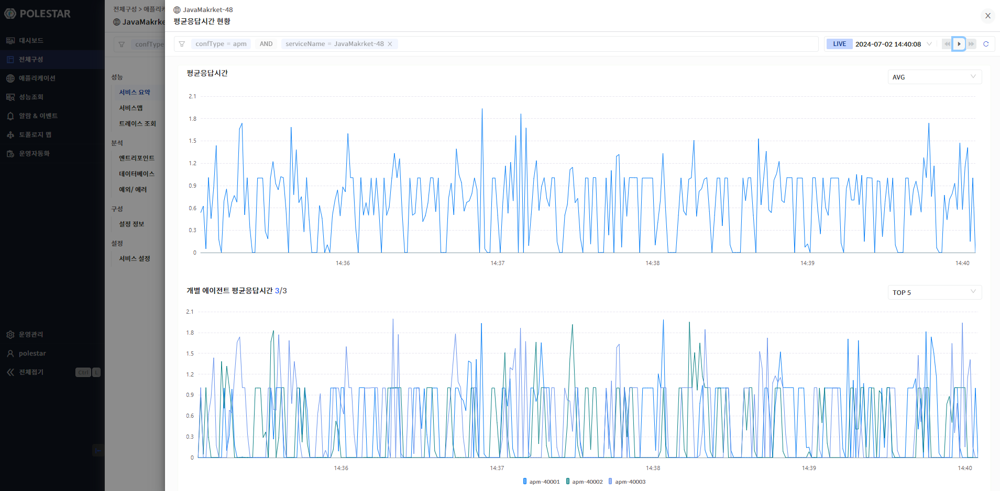

> ▶ \[그림3\] 상세 보기

응답시간 분포도

애플리케이션 서비스내에서 수행한 트레이스를 응답시간 분포도를 통해 조회할 수 있습니다. 응답시간 분포도는 스캐터 차트를 사용하여 X축은 시간, Y축은 응답시간을 표시합니다. 응답분포도내의 포인트로 표시되는 데이터는 하나의 트레이스를 나타내며 이때 좌표의 X축값은 해당 트레이스의 종료시간을 의미합니다. 응답시간 분포도의 경우 많은 데이터를 표현하기 때문에 조회시간을 변경하여 조회 시 라이브 이외의 조회구간에서는 응답분포도 설정 기능에 따라 최근 5분, 10분 구간만 표시합니다. 5분에서 10분 이상의 데이터를 조회하고자 할 경우에는 서비스 성능\>트레이스조회 기능을 사용하도록 합니다.

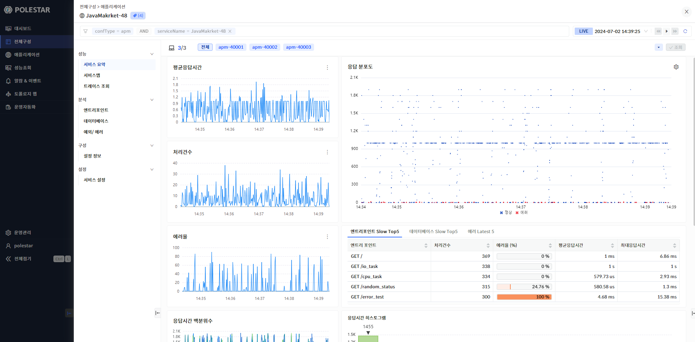

> ▶ \[그림4\] 응답분포도

응답분포도를 이용하여 트레이스의 상세 실행내역을 조회하고자 한다면 응답분포도에서 조회 하고자 하는 영역의 포인트를 포함하도록 하여 드래그를 합니다. 드래그한 영역을 포함한 트레이스 현황 화면이 표시됩니다. 응답분포도 내의 노란색 박스가 사용자가 드래그한 영역이며 트레이스 목록에 해당 영역의 트레이스가 표시됩니다. 다른 영역을 조회하고자 한다면 응답분포도의 영역을 드래그 하면 트레이스가 재조회되어 화면에 표시됩니다

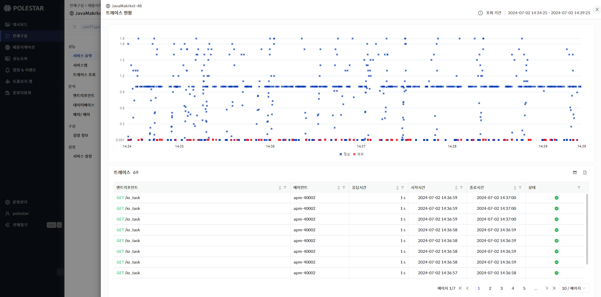

> ▶ \[그림5\] 트레이스 현황

<table>
<tbody>
<tr class="odd">
<td>
노트

트레이스 목록이 표시되는 화면에서 응답분포도와 엑셀다운로드 및 트레이스 목록 건수에 미세한 차이가 발생할 수 있습니다. 특히 엑셀다운의 경우 누르는 시점에 수집서버로 부터 조회되기 때문에 목록 그리드가 조회한 시작시간과 끝시간 사이에 추가로 종료된 트레이스가 존재할 수 있습니다. 특히나 많은 요청이 수행되는 애플리케이션이라면 빈번하게 발생할 수 있습니다.
</td>
</tr>
</tbody>
</table>

> 트레이스

<table>
<thead>
<tr class="header">
<th>엔트리포인트</th>
<th>실행한 트레이스의 엔트리포인트(URI, 메소드, 오퍼레이션)</th>
</tr>
</thead>
<tbody>
<tr class="odd">
<td>에이전트</td>
<td>트레이스가 실행된 에이전트. 여러 애플리케이션을 통해 수행해는 글로벌 트레이스의 경우 엔트리포인트가 실행된 에이전트를 의미</td>
</tr>
<tr class="even">
<td>응답시간</td>
<td>
트레이스가 수행되는 데 걸린 시간

계산 방식 : 트레이스의 종료시간 – 트레이스 시작 시간
</td>
</tr>
<tr class="odd">
<td>시작시간</td>
<td>트레이스의 시작시간</td>
</tr>
<tr class="even">
<td>종료시간</td>
<td>트레이스의 종료시간</td>
</tr>
<tr class="odd">
<td>상태</td>
<td>
트레이스의 상태를 표시한다. 상세 실행내역 중 에러 구간이 존재할 경우 에러 상태로 표시한다.

<table>
<thead>
<tr class="header">
<th>: 트레이스 정상 종료</th>
</tr>
</thead>
<tbody>
<tr class="odd">
<td>: 트레이스 에러 발생</td>
</tr>
</tbody>
</table></td>
</tr>
</tbody>
</table>

<table>
<tbody>
<tr class="odd">
<td>
노트

엔트리포인트는 시스템에 대한 외부 접근 지점을 의미하며, 요청이 처음으로 들어오는 지점입니다. 이는 프로그램 실행이 시작되는 지점이나, API 호출을 통해 시스템에 진입하는 지점을 포함합니다. 반면에 트레이스는 요청이 시스템 내부에서 처리되는 전체 경로와 과정을 추적하고 기록합니다. 엔트리포인트는 요청의 시작 지점, 트레이스는 요청의 전체 흐름을 이해하는 데 사용됩니다.
</td>
</tr>
</tbody>
</table>

트레이스 실행 내역을 확인하고자 한다면 트레이스 목록에서 하나의 트레이스를 선택합니다. 엔트리포인트 이름을 선택하면 목록 아래쪽에 해당 트레이스의 실행 내역이 표시됩니다. 실행내역은 타임라인 및 서비스맵을 통해 트레이스를 수행하기 위해 연동된 에이전트와 에이전트들 간의 연동 성능을 확인할 수 있습니다.

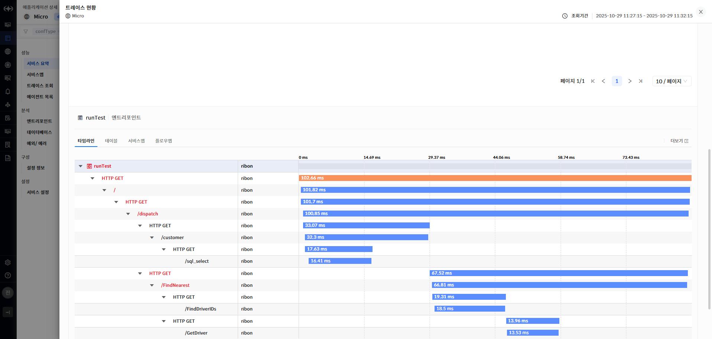

> ▶ \[그림6\] 응답분포도 - 트레이스 현황 - 타임라인

타임라인으로 보여지는 상세실행내역을 큰 화면에서 확인하고 싶다면 더보기를 클릭하여 전체화면으로 전환하여 확인할 수 있습니다. 타임라인으로 표시된 상세 실행 내역을 통해 분석할 경우 위 그림에서 확인할 수 있듯이 타임라인에 색상으로 표현된 바(Bar)를 이용하여 응답시간이 느린 구간을 찾아낼 수 있습니다.

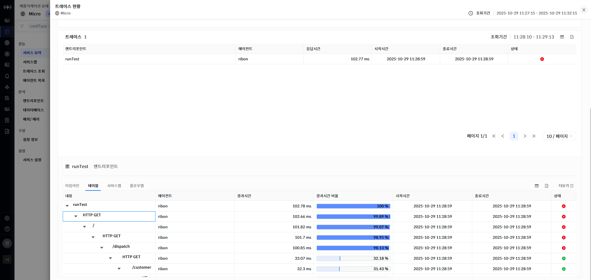

> ▶ \[그림7\] 응답분포도 – 트레이스 현황 – 테이블
> 
> 트레이스 - 테이블

<table>
<thead>
<tr class="header">
<th>내용</th>
<th>
트레이스 상세 실행내역의 구간. 스팬(Span)으로 부르기도 함

URI, 함수, 쿼리 등 실행내역 구간을 표시하는 정보.
</th>
</tr>
</thead>
<tbody>
<tr class="odd">
<td>에이전트</td>
<td>해당 실행내역 구간이 실행된 에이전트.</td>
</tr>
<tr class="even">
<td>경과시간</td>
<td>해당 구간을 실행하기 위해 소요된 시간</td>
</tr>
<tr class="odd">
<td>경과시간 비율</td>
<td>
트레이스 응답시간 중 해당 구간이 소요된 시간의 비율

계산방식 : 해당구간의 응답시간/트레이스의 응답시간 * 100
</td>
</tr>
<tr class="even">
<td>시작시간</td>
<td>스팬의 시작시간</td>
</tr>
<tr class="odd">
<td>종료시간</td>
<td>스팬의 종료시간</td>
</tr>
<tr class="even">
<td>상태</td>
<td>
스팬의 상태를 표시한다.

<table>
<thead>
<tr class="header">
<th>: 스팬 정상 종료</th>
</tr>
</thead>
<tbody>
<tr class="odd">
<td>: 스팬 에러 발생</td>
</tr>
</tbody>
</table></td>
</tr>
</tbody>
</table>

서비스 맵은 트레이스가 수행되는 애플리케이션간의 관계를 시각적으로 파악할 수 있도록 합니다. 에이전트가 설치된 애플리케이션을 둥근 노드로 표현하고 에이전트 간의 호출관계를 선으로 표시합니다. 또한 APM 에이전트가 설치되지 않는 대상 (예:데이터베이스)의 경우 노드 내에 아이콘으로 노드의 타입을 표시합니다. 아래 그림의 서비스맵에서는 에이전트가 설치된 애플리케이션과 통신하고 있는 데이터베이스의 경우 노드 안쪽에 데이터베이스 아이콘이 표시됩니다. 노드선 끝의 화살표는 호출 관계를 표시합니다. 화살표가 없는 노드가 호출하는 쪽, 화살표가 있는 쪽이 호출 대상이 됩니다. 서비스맵 내부를 클릭하고 애플리케이션 사이의 선 위에 마우스를 올리면 아래의 그림처럼 두 노드 사이의 처리건수, 평균응답시간, 에러율과 같은 성능 정보가 표시됩니다.

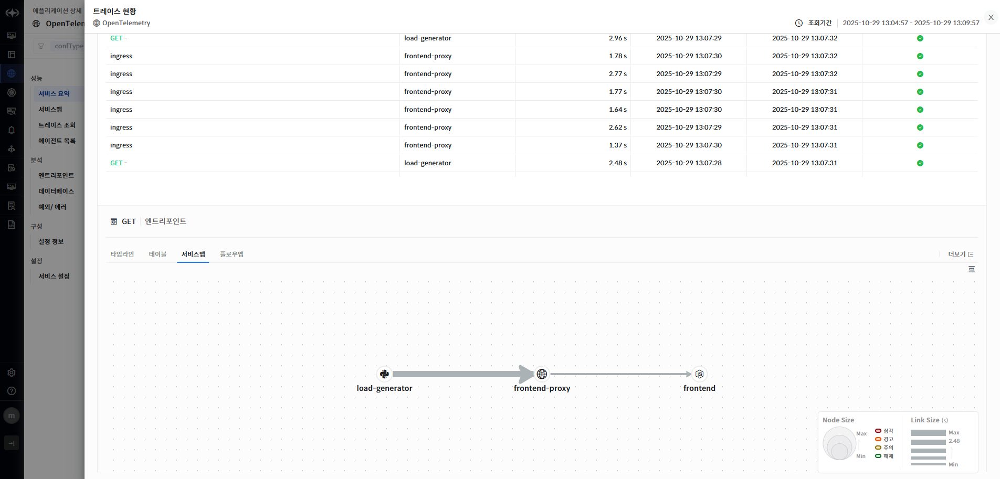

> ▶ \[그림8\] 응답분포도 – 트레이스 현황 – 서비스맵

플로우맵은 트레이스 수행한 스팬들 중 Http 호출과 데이터베이스 호출을 흐름대로 시각화하여 표현합니다. 서비스맵의 경우 노드 간 합산되어 표시되어 각 호출에 대한 응답시간을 인지할 수 없지만 플로우맵의 경우 각 호출에 대한 성능 값을 엔트리포인트와 함께 표현하여 어떤 호출이 응답에 영향을 주었는 지 빠르게 인지할 수 있습니다.

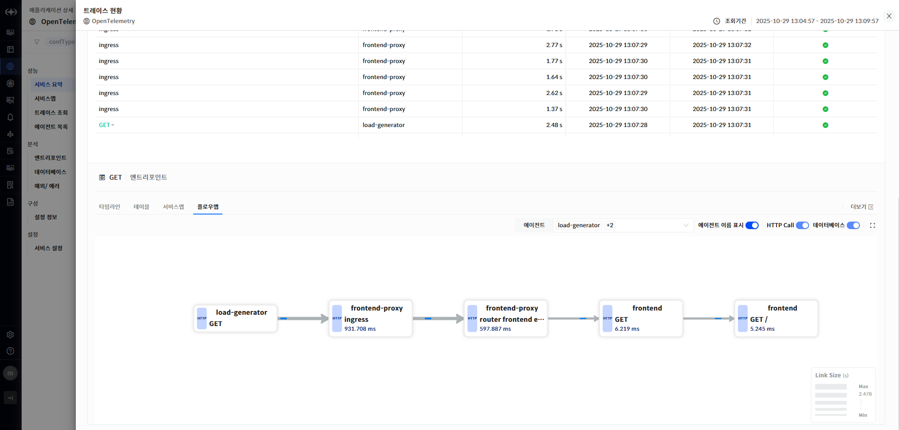

> ▶ \[그림9\] 응답분포도 – 트레이스 현황 – 플로우맵

응답시간 분포도 설정

응답분포도를 편리하게 사용하기 위해 설정 기능을 제공합니다. 응답분포도 오른쪽 상단의 \[설정\]아이콘을 선택하면 설정 기능을 사용할 수 있습니다. 설정 기능은 아래의 표를 참고하여 사용합니다.

> 응답분포도 설정 기능

<table>
<thead>
<tr class="header">
<th>응답분포도 표시 기간</th>
<th>
응답분포도의 X좌표인 표시기간을 설정

5분 또는 10분으로 설정
</th>
</tr>
</thead>
<tbody>
<tr class="odd">
<td>
엔트리포인트

(URI, 메소드, 오퍼레이션 명)
</td>
<td>특정 문자열을 포함한 엔트리포인트 명을 가진 트레이스를 조회하고자 할 경우 해당 문자열을 입력</td>
</tr>
<tr class="even">
<td>Y축 최대값</td>
<td>
응답분포도에 표시하고자 하는 Y축 최대값

기본 단위는 microseconds(us)이나 설정 편의를 위해 miliseconds(ms), seconds(s)로 선택하여 설정 가능
</td>
</tr>
<tr class="odd">
<td>Y축 최소값</td>
<td>
응답분포도에 표시하고자 하는 Y축 최소값

기본 단위는 microseconds(us)이나 설정 편의를 위해 miliseconds(ms), seconds(s)로 선택하여 설정 가능
</td>
</tr>
<tr class="even">
<td>Y축 간격</td>
<td>
응답분포도의 Y축에 안내선 간격

기본 단위는 microseconds(us)이나 설정 편의를 위해 miliseconds(ms), seconds(s)로 선택하여 설정 가능

Y축 간격을 너무 작은 단위의 작은 값으로 설정할 경우 응답분포도에 정상적으로 표시되지 않을 수 있으니 현재 최대값을 확인 후 적정값으로 설정 필요
</td>
</tr>
<tr class="odd">
<td>웹 요청 Root Span만 표시</td>
<td>Http 웹 요청 Root Span만 표시</td>
</tr>
<tr class="even">
<td>최대값 초과 트레이스 표시</td>
<td>응답분포도의 Y축 최대값을 설정한 경우 그 설정값 이상의 응답시간을 가진 트레이스가 있을 때 응답분포도 Y축 최상위에 표현</td>
</tr>
<tr class="odd">
<td>에러가 포함된 트레이스만 표시</td>
<td>트레이스 중 에러가 발생한 트레이스만 표시</td>
</tr>
<tr class="even">
<td>트레이스 전체 건수 표시</td>
<td>트레이스 전체 건수 표시</td>
</tr>
<tr class="odd">
<td>툴팁표시</td>
<td>응답분포도의 데이터(포인트)를 mouse over 시 해당 트레이스에 대한 툴팁 표시 여부</td>
</tr>
</tbody>
</table>

응답분포도에서 특정 영역의 응답시간의 트레이스을 보고자 할 경우 위 표에서 설명한 Y축 최대값과 Y축 최소값을 설정하여 확인할 수 있습니다. 아래 그림은 Y축 최대값과 Y축 최소값을 설정 한 후의 응답분포도를 보여줍니다.

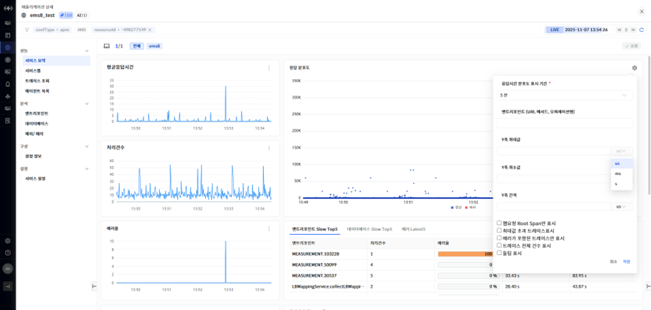

▶ \[그림 10\] 응답분포도 – 응답분포도 설정

Y축 최대값을 설정 후 최대값을 초과한 트레이스를 응답분포도내에 표시하고자 한다면 최대값 초과 트레이스 표시 항목을 체크합니다. 최대값 초과 트레이스 표시 후 응답분포도는 아래의 그림과 같이 응답분포도 최상단에 초과한 트레이스들이 겹쳐져 표시됩니다.

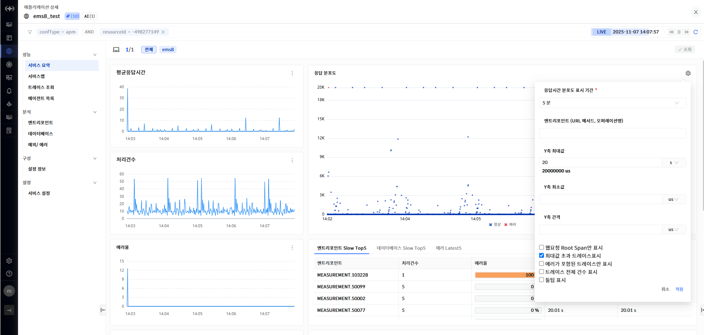

▶ \[그림 11\] 응답분포도 – 최대값 초과 트레이스 표시

엔트리포인트 Slow Top 5

애플리케이션 서비스 내에서 수행한 트레이스들 중 엔트리포인트(URI, 메소드명)를 수행한 트레이스들을 평균 응답시간을 기준으로 느린 엔트리 포인트 Top5를 조회하여 엔트리포인트 명, 처리건수, 에러율, 평균 응답시간, 최대응답시간 정보를 표시합니다. 엔트리포인트 Slow 5 테이블에 표시된 엔트리 명을 선택하면 해당 엔트리포인트에 대한 통계 정보와 동일 엔트리 명을 수행한 트레이스 목록과 처리현황이 표시되어 느린 엔트리포인트의 문제점을 빠르게 파악할 수 있습니다.

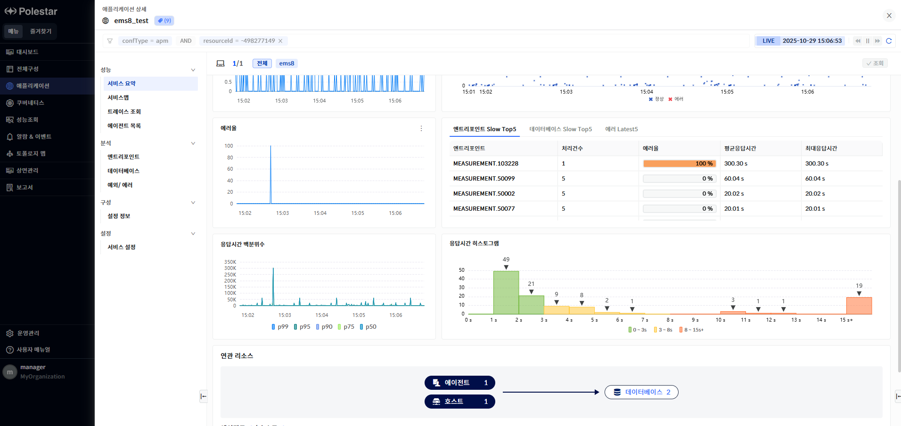

▶ \[그림 12\] 엔트리포인트 Slow Top5

엔트리포인트 Slow Top5 목록에서 엔트리포인트명을 클릭하면 조회기간 내 실행된 동일명을 가진 엔트리포인트의 목록이 표시된다.

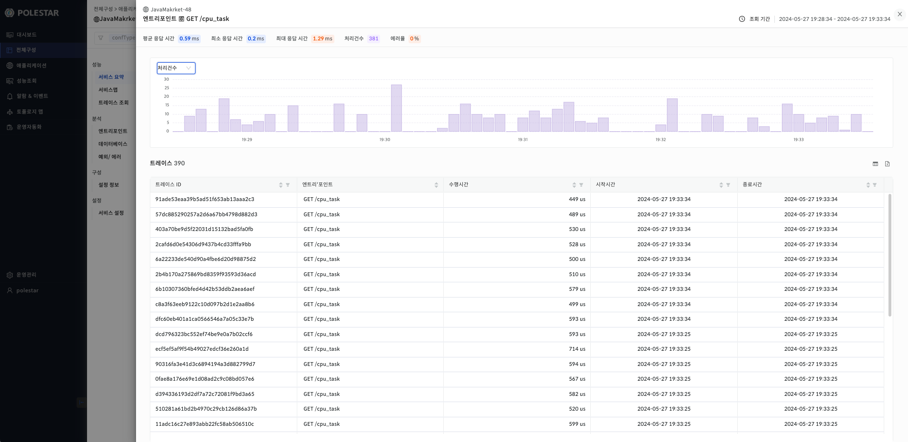

▶ \[그림 13\] 엔트리포인트 Slow Top5 상세

<table>
<tbody>
<tr class="odd">
<td>
노트

꼭 기억하세요. 엔트리포인트(URI, 메소드명)를 수행한 트레이스들을 평균 응답시간을 기준으로 느린 엔트리 포인트 Top5를 조회합니다.
</td>
</tr>
</tbody>
</table>

> 엔트리포인트

| 엔트리포인트 | 엔트리포인트명을 표시합니다.                                     |
| ------ | --------------------------------------------------- |
| 처리건수   | 동일한 엔트리포인트명을 가진 트레이스들의 조회기간내 최소응답시간을 표시합니다.         |
| 에러율    | 동일한 엔트리포인트명을 가진 트레이스들의 조회기간내 에러율을 표시합니다.            |
| 평균응답시간 | 동일한 엔트리포인트명을 가진 트레이스들의 조회기간내 응답시간을 평균으로 계산하여 표시합니다. |
| 최대응답시간 | 동일한 엔트리포인트명을 가진 트레이스들의 조회기간내 최소응답시간을 표시합니다.         |

처리건수 차트는 응답분포도로 변경하여 조회할 수 있으며 조회된 엔트리포인트의 트레이스 목록 중 하나를 선택하면 해당 트레이스의 상세 실행내역을 조회할 수 있습니다.

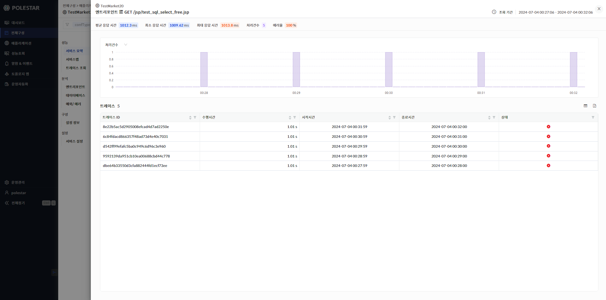

▶ \[그림 14\] 엔트리포인트 트레이스 목록

엔트리포인트 트레이스

> 트레이스

<table>
<thead>
<tr class="header">
<th>트레이스 ID</th>
<th>트레이스의 ID</th>
</tr>
</thead>
<tbody>
<tr class="odd">
<td>수행시간</td>
<td>
트레이스가 수행되는데 걸린 시간

트레이스의 종료시간에서 시작시간을 빼서 계산한다.
</td>
</tr>
<tr class="even">
<td>시작시간</td>
<td>트레이스의 시작시간</td>
</tr>
<tr class="odd">
<td>종료시간</td>
<td>트레이스의 종료시간</td>
</tr>
<tr class="even">
<td>상태</td>
<td>
트레이스의 상태를 표시한다. 상세 실행내역 중 에러 구간이 존재할 경우 에러 상태로 표시한다.

<table>
<thead>
<tr class="header">
<th>: 트레이스 정상 종료</th>
</tr>
</thead>
<tbody>
<tr class="odd">
<td>: 트레이스 에러 발생</td>
</tr>
</tbody>
</table></td>
</tr>
</tbody>
</table>

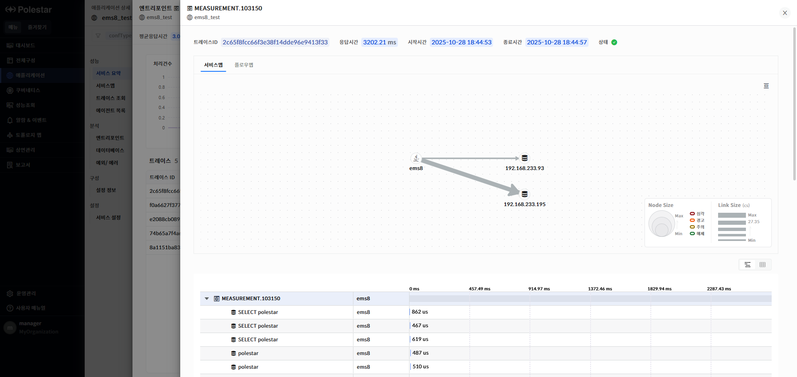

▶ \[그림 15\] 트레이스 상세실행내역

트레이스 상세 실행 내역 화면은 네 가지의 형태로 표시됩니다. 최상위에는 해당 트레이스의 실행 정보가 표시됩니다. 서비스 맵 구간은 트레이스가 여러 애플리케이션을 거쳐 수행되는 트레이스일 경우 트레이스가 수행되는 애플리케이션간의 관계를 시각적으로 파악할 수 있도록 합니다. 에이전트가 설치된 애플리케이션을 둥근 노드로 표현하고 애플리케이션 간의 호출관계를 선으로 표시합니다. 선 끝의 화살표는 호출 관계를 표시합니다. 화살표가 없는 노드가 호출하는 쪽, 화살표가 있는 쪽이 호출 대상이 됩니다. 서비스맵 내부를 클릭하고 애플리케이션 사이의 선 위에 마우스를 올리면 아래의 그림처럼 두 노드 사이의 처리건수, 평균응답시간, 에러율의 성능 정보를 제공합니다. 

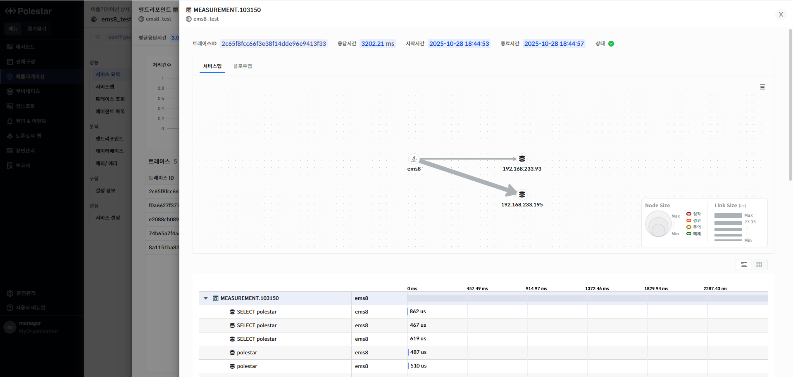

▶ \[그림 16\] 트레이스 상세실행내역의 서비스 맵

플로우맵은 트레이스 수행한 스팬들 중 Http 호출과 데이터베이스 호출을 흐름대로 시각화하여 표현합니다. 서비스맵의 경우 노드 간 합산되어 표시되어 각 호출에 대한 응답시간을 인지할 수 없지만 플로우맵의 경우 각 호출에 대한 성능 값을 엔트리포인트와 함께 표현하여 어떤 호출이 응답에 영향을 주었는 지 빠르게 인지할 수 있습니다.

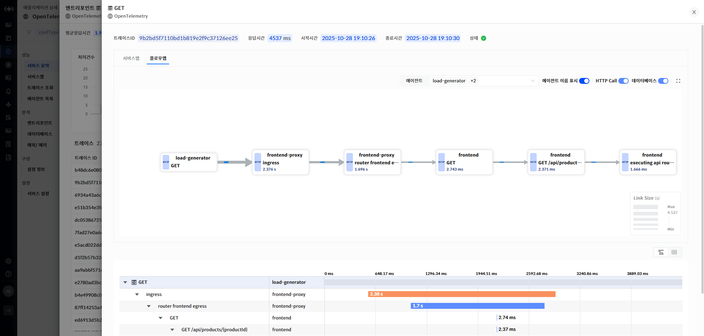

▶ \[그림 17\] 트레이스 상세실행내역의 플로우맵

타임라인과 테이블의 전환은 상세실행내역 오른쪽 상단의 타임라인 아이콘과 테이블아이콘을 선택하여 전환할 수 있습니다. 타임라인으로 표시된 상세 실행 내역을 통해 응답시간을 분석할 경우 아래 그림에서 처럼 타임라인에 넓게 색상으로 표현된 바(Bar)를 통해 분석할 수 있습니다.

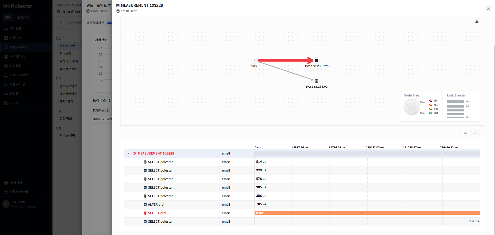

▶ \[그림 18\] 트레이스 상세 실행내역 – 타임라인

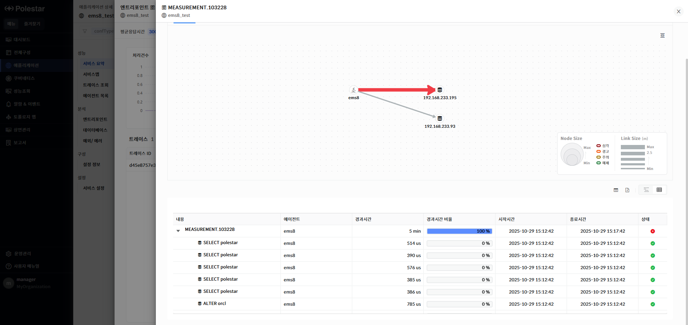

▶ \[그림 19\] 트레이스 상세 실행내역 – 테이블

> 트레이스

<table>
<thead>
<tr class="header">
<th>내용</th>
<th>
트레이스 상세 실행내역의 구간. 스팬(Span)으로 불리기도 함.

URI, 함수, 쿼리 등 실행내역 구간을 표시하는 정보.
</th>
</tr>
</thead>
<tbody>
<tr class="odd">
<td>에이전트</td>
<td>해당 실행내역 구간이 실행된 에이전트.</td>
</tr>
<tr class="even">
<td>경과시간</td>
<td>해당 스팬 구간을 실행하기 위해 소요된 시간</td>
</tr>
<tr class="odd">
<td>경과시간 비율</td>
<td>
트레이스 응답시간 중 해당 스팬 구간이 소요된 시간의 비율

계산방식 : 해당 스팬 구간의 응답시간/트레이스의 응답시간 * 100
</td>
</tr>
<tr class="even">
<td>시작시간</td>
<td>스팬의 시작시간</td>
</tr>
<tr class="odd">
<td>종료시간</td>
<td>스팬의 종료시간</td>
</tr>
<tr class="even">
<td>상태</td>
<td>
스팬의 상태를 표시한다.

<table>
<thead>
<tr class="header">
<th>: 스팬 정상 종료</th>
</tr>
</thead>
<tbody>
<tr class="odd">
<td>: 스팬 에러 발생</td>
</tr>
</tbody>
</table></td>
</tr>
</tbody>
</table>

트레이스 구간 상세 정보

트레이스의 상세 실행 구간에 대한 상세 정보를 조회할 수 있습니다. 트레이스 상세 실행 구간을 본 문서에는 “스팬”이라고 명칭합니다. 타임라인 또는 테이블화면에서 스팬 구간을 선택하면 상세정보가 표시됩니다. 스팬 구간의 타입에 따라 다른 상세정보가 표시됩니다. 스팬 구간 타입은 “HTTP” 스팬, “DB” 스팬, “기타” 스팬으로 세 가지가 있습니다.

HTTP 스팬의 경우 \[요청\]탭, \[응답\]탭, \[인-아웃 플로우\]탭, \[정보\]탭이 표시됩니다. \[요청\]탭은 웹요청과 관련된 헤더 정보들이 표시됩니다. 에러가 발생한 경우 \[예외/에러\] 탭도 표시됩니다.

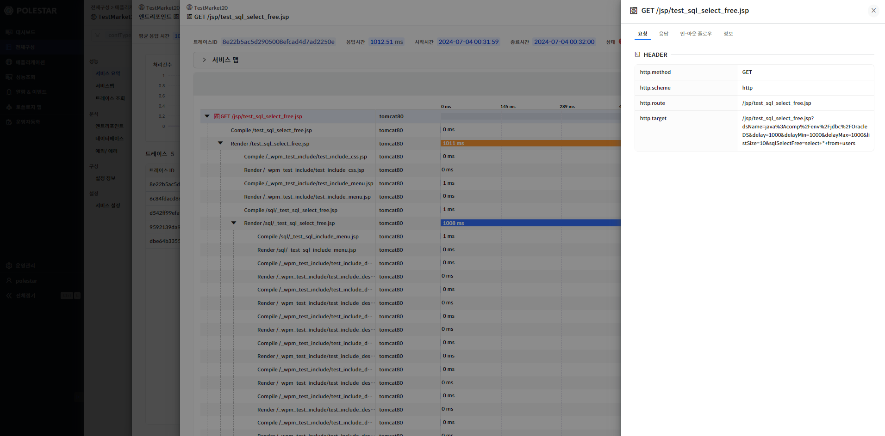

▶ \[그림 20\] HTTP 스팬 상세 정보 : 요청

\[응답\]탭은 웹응답과 관련된 헤더 정보들이 표시됩니다.

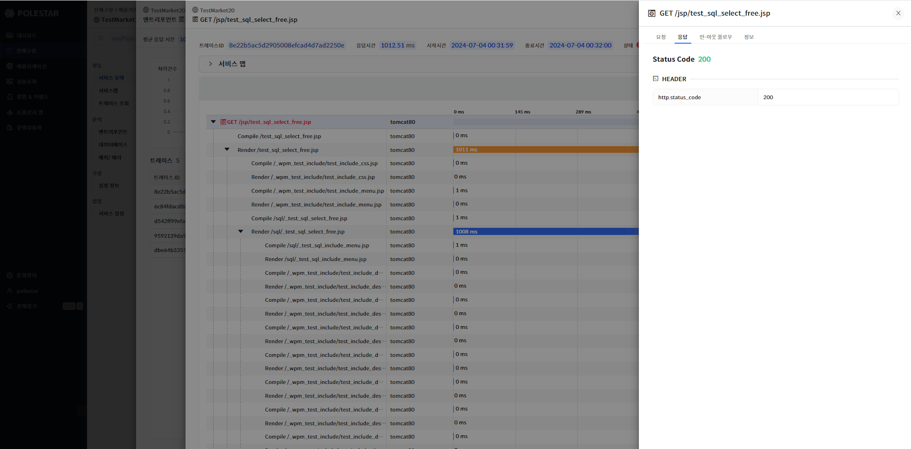

▶ \[그림 21\] HTTP 스팬 상세 정보 : 응답

\[인-아웃 플로우\]탭은 선택한 스팬의 웹요청에 대한 인-아웃 정보를 표시합니다. 호출한 에이전트 혹은 클라이언트의 정보가 맵 형태로 표시됩니다.

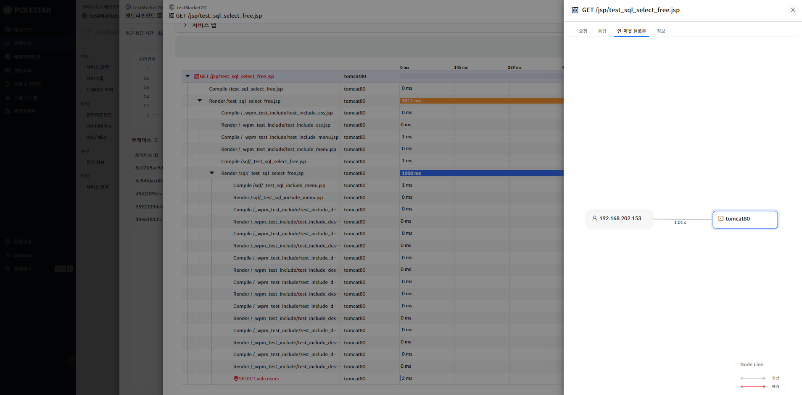

▶ \[그림 22\] HTTP 스팬 상세 정보 : 인-아웃 플로우

\[정보\] 탭은 웹요청 ,응답 이외에 수집된 태그 정보를 보여줍니다. 해당 스팬이 실행된 서비스, 에이전트 정보, 프로세스, 네트워크 정보를 표시합니다.

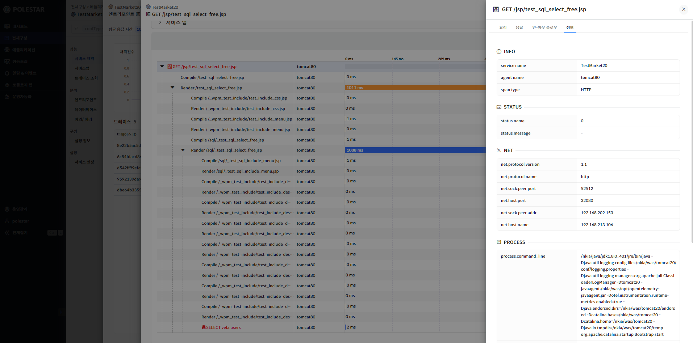

▶ \[그림 23\] HTTP 스팬 상세 정보 : 정보

DB 스팬의 경우 \[요청\]탭, \[인-아웃 플로우\]탭, \[정보\]탭이 표시되며 에러가 발생할 경우 \[예외/에러\]탭이 표시됩니다.

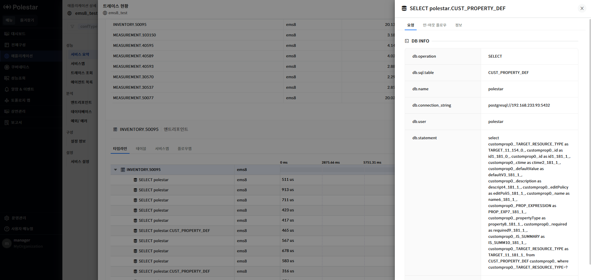

▶ \[그림 24\] DB 스팬 상세 정보 : 요청

인-아웃 플로우 탭의 경우 DB 스팬의 경우 DB테이블과의 수행 성능 정보를 맵으로 표시해줍니다. 접속한 DB명과 테이블 정보를 플로우 맵으로 표시해주며 구간 내 성능 정보를 라인에 표시합니다.

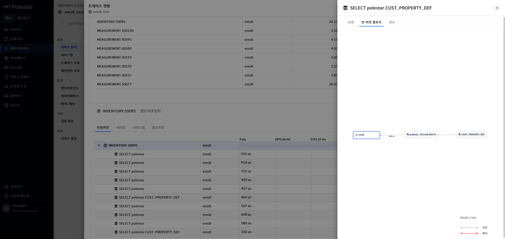

▶ \[그림 25\] DB 스팬 상세 정보 : 인-아웃 플로우

\[정보\]탭은 DB 요청관련 태그 이외의 태그 정보를 보여줍니다. 해당 스팬이 실행된 서비스, 에이전트 정보, 스팬 상태정보, DB 정보, 네트워크 정보, 프로세스, 쓰레드정보를 표시합니다.

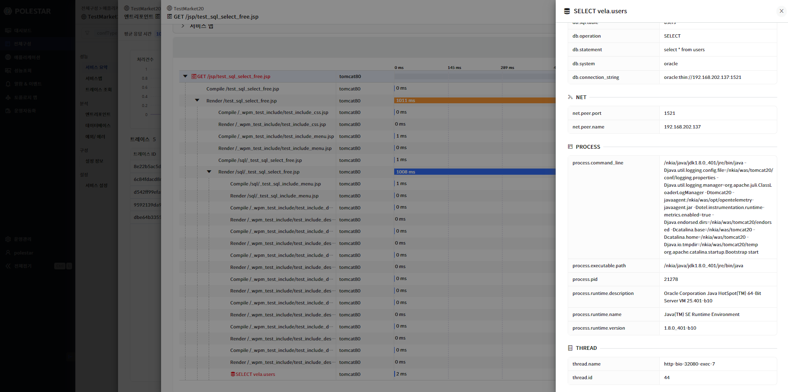

▶ \[그림 26\] DB 스팬 상세 정보 : 정보

DB 스팬 수행 중 에러가 발생했다면 \[예외/에러\]탭이 추가되어 나타납니다. \[예외/에러\]탭에는 에이전트 수집한 에러 관련 태그 정보인 name, time, exeception.type, exception.message를 표시하며 예외/에러가 발생한 상세 정보를 확인할 수 있는 스택트레이스(Stacktrace)도 제공합니다. 전체 스택트레이스를 확인하기 위해서는 스택트레이스의 \[상세보기\]를 선택합니다.

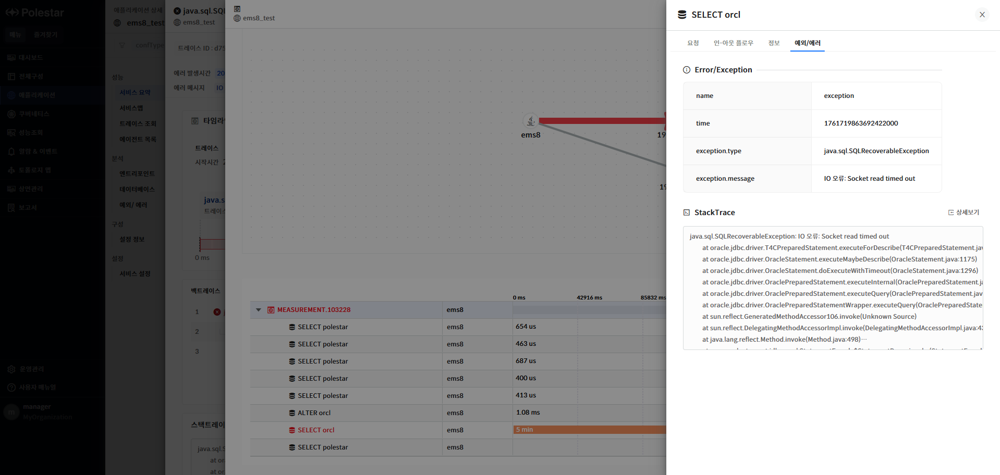

▶ \[그림 27\] DB 스팬 상세 정보 : 예외/에러

웹과 DB가 아닌 기타 스팬의 경우 \[정보\]탭만 표시됩니다. 정보탭의 경우 에이전트가 수집한 태그 정보를 카테고리별로 표시하면 각 카테고리별로 태그키-값 형태의 테이블로 표시됩니다. 아래의 그림을 예를 들어 설명하자면 프로세스에 대한 태그 정보를 확인하고 싶다면 PROCESS 카테고리의 테이블을 통해 프로세스 커맨드라인(process.command\_line)등을 확인할 수 있습니다. 태그의 종류는 에이전트 버전에 따라 달라질 수 있습니다.

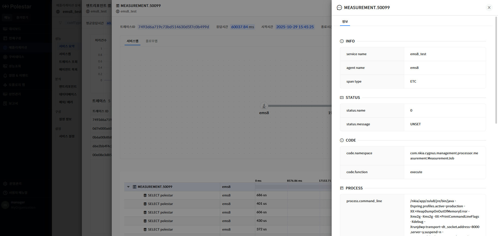

▶ \[그림 28\] 기타 스팬 상세 정보 : 정보

데이터베이스 Slow Top 5

애플리케이션 서비스 내에서 수행된 데이터베이스 쿼리 중 평균 응답시간을 기준으로 느린 데이터이베이스 쿼리 Top5를 조회하여 데이터베이스 쿼리, 처리건수, 에러율, 평균 응답시간, 최대응답시간 정보를 표시합니다. 데이터베이스 Slow Top 5 테이블에 표시된 데이터베이스 쿼리를 선택하면 해당 데이터베이스쿼리와 대한 통계 정보와 동일 데이터베이스 쿼리를 수행한 트레이스 목록과 처리현황이 표시되어 느린 데이터베이스 쿼리의 문제점을 빠르게 파악할 수 있습니다.

Top 엔트리 포인트 목록 데이터베이스 쿼리를 수행한 엔트리 포인트 중 쿼리 수행 비율이 높은 순으로 내림차순으로 표시합니다. Top 엔트리 포인트에 표시된 엔트리포인트 목록에 대해서 도넛차트를 통해 실행 비율을 시각적으로 빠르게 파악할 수 있습니다.

처리건수 차트는 선택된 데이터베이스 쿼리의 처리건수를 시간별로 표시합니다. 처리건수 차트는 응답분포도로 변경하여 조회할 수 있습니다. 아래에 표시되는 트레이스 목록은 선택된 데이터베이스 쿼리를 수행한 트레이스 목록을 표시합니다.

<table>
<tbody>
<tr class="odd">
<td>
노트

데이터베이스 쿼리 중 평균 응답시간을 기준으로 느린 데이터이베이스 쿼리 Top5를 조회합니다.
</td>
</tr>
</tbody>
</table>

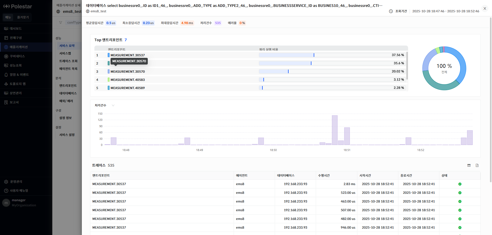

▶ \[그림 29\] 데이터베이스 상세 정보

트레이스 목록에서 하나의 트레이스를 선택하면 트레이스 내에서 수행된 데이터베이스 쿼리에 정보를 확인할 수 있습니다.

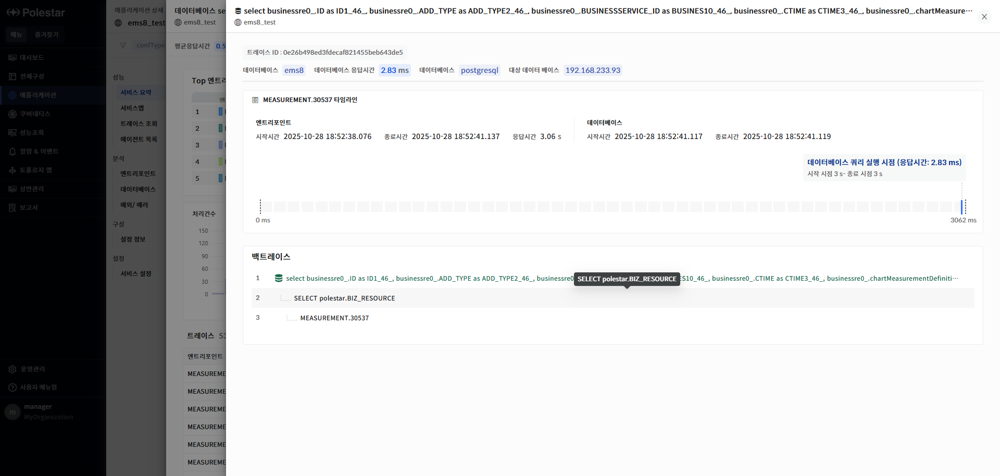

▶ \[그림 30\] 데이터베이스 수행 상세 정보

데이터베이스에 대한 상세 실행정보로 다음의 정보를 표시합니다.

> 데이터베이스

| 트레이스 ID     | 데이터베이스 상세 페이지의 트레이스 목록에서 선택한 트레이스의 트레이스 ID |
| ----------- | ------------------------------------------ |
| 에이전트        | 데이터베이스 쿼리를 수행한 에이전트                        |
| 데이터베이스 응답시간 | 데이터베이스의 해당 쿼리에 대한 응답시간                     |
| 데이터베이스      | Oracle, MariaDB등의 데이터베이스 종류                |
| 대상 데이터베이스   | 쿼리가 수행된 데이터베이스 서버의 IP 주소 또는 호스트명           |

화면 상단에 표시되어 있는 트레이스 ID를 클릭하면 트레이스 전체의 상세 실행 정보가 표시됩니다.

트레이스 상세 실행내역 기능에 대한 상세 설명은 성능\>서비스 요약\>엔트리포인트 Slow Top 5\> 상세 실행 정보를 참고하세요.

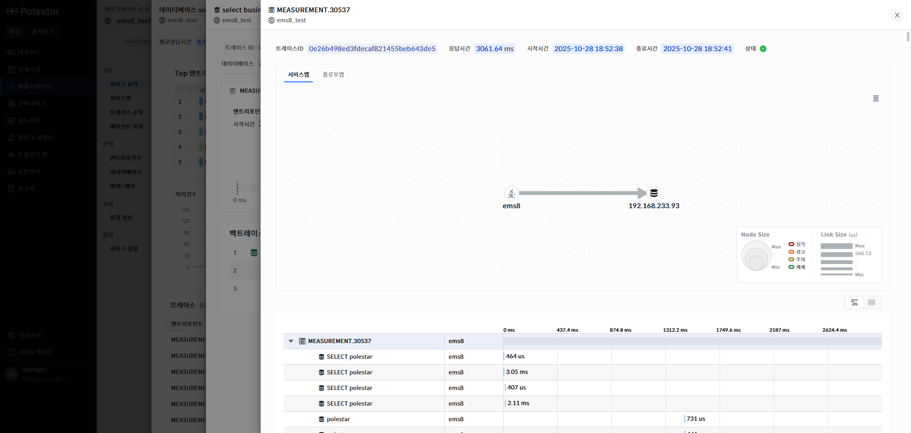

▶ \[그림 31\] 데이터베이스를 수행한 트레이스의 상세 실행 내역

타임라인 정보에서는 해당 쿼리가 수행된 타임 정보를 트레이스의 수행시간 타임라인을 기준으로 표시합니다.

> 데이터베이스 수행 트레이스 타임라인 정보

| 엔트리포인트 응답시간  | 데이터베이스 쿼리를 수행한 엔트리포인트의 응답시간  |
| ------------ | ---------------------------- |
| 엔트리포인트 시작 시간 | 데이터베이스 쿼리를 수행한 엔트리포인트의 시작시간  |
| 엔트리포인트 응답시간  | 데이터베이스 쿼리를 수행한 엔트리포인트의 응답시간  |
| 엔트리포인트 종료 시간 | 데이터베이스 쿼리를 수행한 엔트리포인트의 종료 시간 |
| 데이터베이스 시작시간  | 테이터베이스 쿼리 수행 시작 시간           |
| 데이터베이스 종료시간  | 테이터베이스 쿼리 수행 종료 시간           |

백트레이스는 데이터베이스 쿼리를 기점으로 하여 어떤 경로를 통해서 수행되었는지 역으로 추적할 수 있는 기능입니다. 트레이스 상세 실행내역의 타임라인을 통해 데이터베이스 수행 경로를 추적할 경우 데이터베이스 쿼리를 수행한 메소드 또는 구간을 찾기 위해 많은 내용을 살펴봐야하지만 백트레이스를 통해 데이터베이스 실행 까지의 구간을 역추적할 수 있어 느린 쿼리를 수정하기 위한 애플리케이션 코드를 검색하는 시간을 절약할 수 있습니다.

에러 Latest 5

엔트리포인트, 데이터베이스 Slow Top5와 달리 에러 Latest 5는 최근 발생한 에러를 발생시간을 기준으로 내림차순으로 표시합니다.

에러 Latest 5에서 에러명을 선택하면 에러 상세 정보가 표시됩니다.

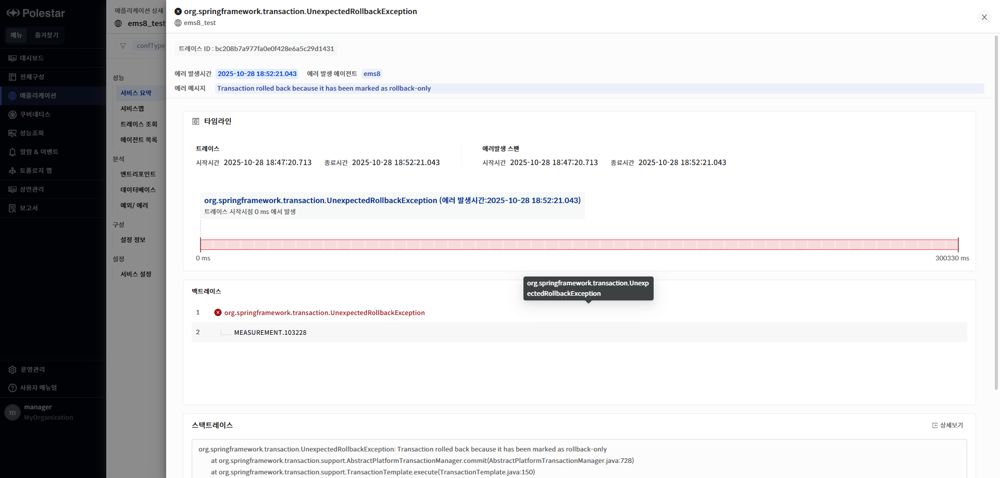

▶ \[그림 32\] 에러 상세 화면

> 에러 정보

| 트레이스 ID    | 에러 Latest 5 목록에서 선택한 에러가 발생한 트레이스의 ID |
| ---------- | ------------------------------------- |
| 에러 발생 시간   | 에러가 발생한 시간                            |
| 에러 발생 에이전트 | 에러가 발생한 에이전트                          |
| 에러 메시지     | 발생한 에러에 대한 에러 메시지                     |

타임라인 정보에서는 해당 에러가 발생한 시점을 트레이스의 수행시간 타임라인을 기준으로 표시합니다.

> 에러 타임라인 정보

| 트레이스 시작시간    | 에러가 발생한 트레이스의 시작시간 |
| ------------ | ------------------ |
| 트레이스 종료시간    | 에러가 발생한 트레이스의 종료시간 |
| 에러발생 스팬 시작시간 | 에러가 발생한 스팬의 시작시간   |
| 에러발생 스팬 종료시간 | 에러가 발생한 스팬의 종료시간   |

에러 백트레이스는 에러 발생 시간을 기점으로 하여 어떤 경로를 통해서 에러 발생 지점까지 수행되었는지 역으로 추적할 수 있는 기능입니다. 트레이스 상세 실행내역의 타임라인을 통해 에러가 발생한 스팬까지의 수행 경로를 추적할 경우 많은 스팬 내역을 살펴봐야하지만 백트레이스를 통해 에러가 발생한 시점까지의 구간을 역추적할 수 있어 에러 발생 원인을 분석하기위해 애플리케이션 코드를 검색하는 시간을 절약할 수 있습니다.

에러 백트레이스 외에 개발자에게 익숙한 에러 스택트레이스도 제공합니다. 에러스택트레이스를 전체화면으로 확인하기 위해서는 에러스택트레이스 \[상세보기\]를 선택합니다.

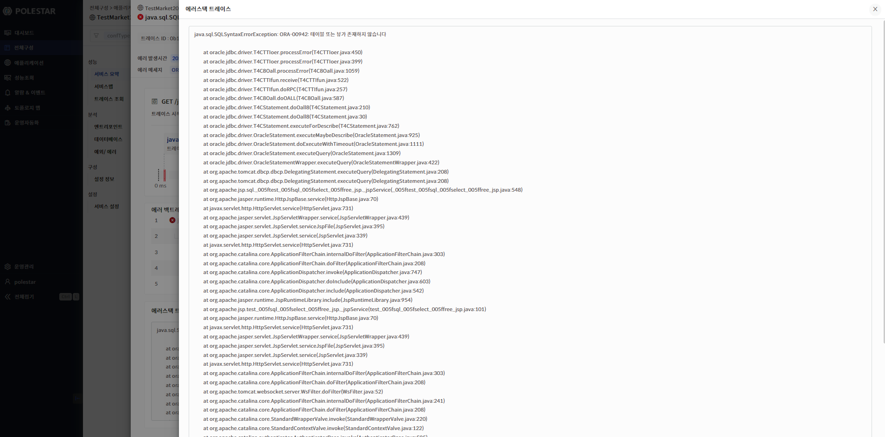

▶ \[그림 33\] 에러 스택트레이스 상세보기

응답시간 히스토그램

조회시간내 실행된 트레이스들의 응답시간을 1초간격의 구간으로 합산하여 히스토그램으로 표시합니다. 히스토그램을 통해 기간 내 수행한 트레이스들의 응답시간 분포를 파악할 수 있습니다. 응답시간 히스토그램은 1초 간격으로 총 16개 구간으로 나누어집니다. 각 구간은 하한값을 포함하며 상한값은 포함하지 않습니다. 즉 0\~1초 구간은 0초(0초포함)이상 1초 “미만”의 값을 표시합니다. 막대의 색상은 \~3초 구간까지는 비교적 안정적인 초록색으로 표시되며 3초이상 8초 미만 구간은 경고의 오렌지 색, 8초 이상은 빨강색으로 표시하여 느린 애플리케이션 수행될 경우 빠르게 파악이 가능합니다.

응답시간 히스토그램 차트 영역을 클릭하거나 드래그하면 해당 구간의 트레이스를 조회하는 트레이스 현황이 표시됩니다.

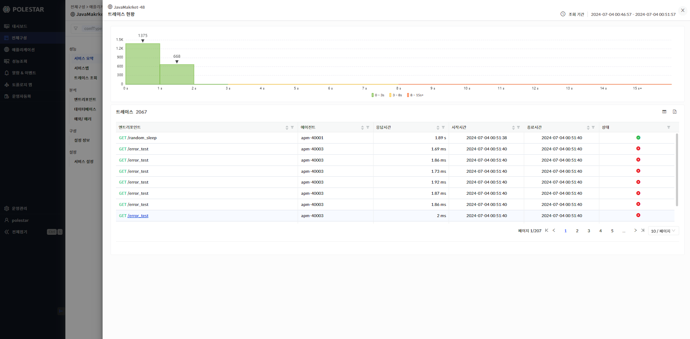

▶ \[그림 34\] 응답시간 히스토그램 트레이스 현황

조회한 트레이스 목록에서 확인하고자 하는 트레이스의 엔트리포인트 이름을 클릭하면 트레이스 상세 내용이 목록 아래쪽에 표시됩니다.

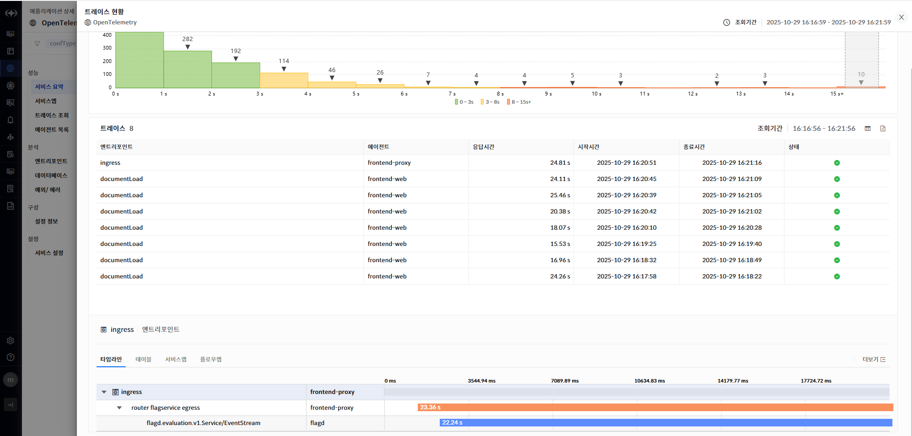

▶ \[그림 35\] 응답시간 히스토그램 트레이스 현황 – 트레이스 타임라인

응답시간 히스토그램 트레이스 현황에서 트레이스 상세 정보는 \[타임라인\]탭, \[테이블\]탭, \[서비스맵\] 탭으로 표시되며 각 탭에 대한 기능은 본 문서의 “엔트리포인트 Slow Top 5”의 트레이스 실행 내역 기능과 동일합니다.

연관리소스

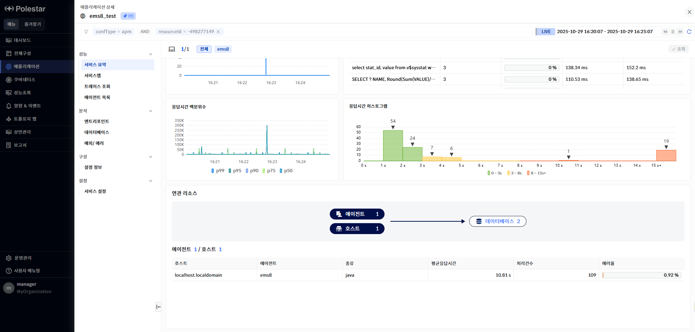

▶ \[그림 36\] 연관리소스 – 에이전트/호스트

해당 서비스의 애플리케이션이 수행되고 있는 에이전트와 호스트, 데이터베이스 정보가 표시됩니다. 연관리소스 에이전트, 호스트, 데이터베이스 아이콘 옆에 표시되어 있는 숫자는 조회기간 내 서비스에 등록된 에이전트 중 처리된 트레이스가 있는 에이전트와 호스트, 데이터베이스 갯수를 표시합니다. 각 아이콘을 클릭하면 해당 정보가 아이콘 아래 테이블 형태로 표시됩니다.

> 에이전트/호스트 정보

<table>
<thead>
<tr class="header">
<th>호스트</th>
<th>서비스내 트레이스를 수행하고 있는 에이전트가 설치된 서버의 호스트명 또는 IP</th>
</tr>
</thead>
<tbody>
<tr class="odd">
<td>에이전트</td>
<td>트레이스가 수행된 에이전트명</td>
</tr>
<tr class="even">
<td>종류</td>
<td>에이전트가 모니터링하고 있는 대상 언어</td>
</tr>
<tr class="odd">
<td>평균응답시간</td>
<td>해당 에이전트에서 조회시간 내 수행한 트레이스의 평균응답시간</td>
</tr>
<tr class="even">
<td>처리건수</td>
<td>해당 에이전트에서 조회시간 내 수행한 트레이스의 처리건수</td>
</tr>
<tr class="odd">
<td>에러율</td>
<td>
해당 에이전트에서 조회시간 내 수행한 트레이스의 에러율

아래 계산식에서는 조회시간 내 트레이스만 포함

계산 방식: 에러발생트레이스 수/ 전체트레이스 수 * 100
</td>
</tr>
</tbody>
</table>

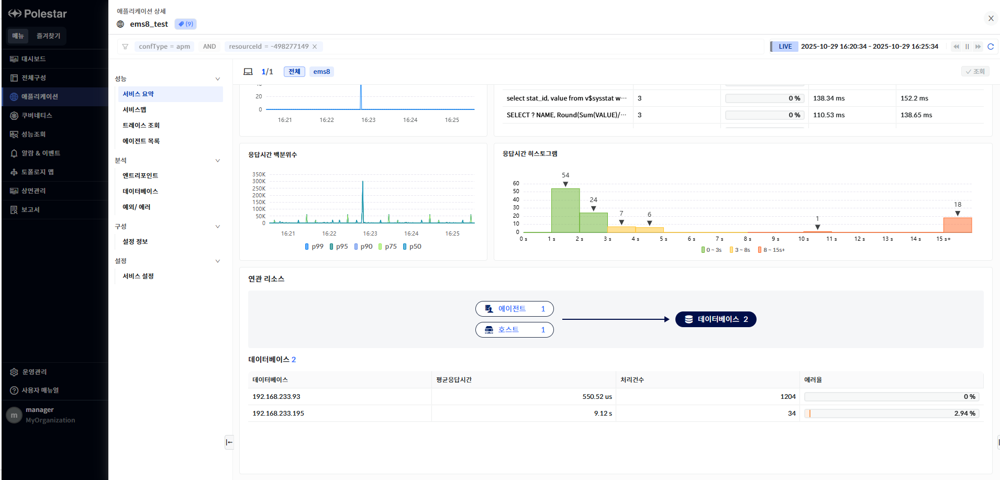

▶ \[그림 37\] 연관리소스 – 데이터베이스

> 데이터베이스

<table>
<thead>
<tr class="header">
<th>데이터베이스</th>
<th>서비스내 데이터베이스 쿼리를 수행한 데이터베이스</th>
</tr>
</thead>
<tbody>
<tr class="odd">
<td>평균응답시간</td>
<td>해당 데이터베이스에서 조회시간 내 수행한 데이터베이스의 평균응답시간</td>
</tr>
<tr class="even">
<td>처리건수</td>
<td>해당 데이터베이스에 처리된 조회시간 데이터베이스 쿼리수</td>
</tr>
<tr class="odd">
<td>에러율</td>
<td>
해당 에이전트에서 조회시간 내 수행한 데이터베이스쿼리의 에러율

아래 계산식에서는 조회시간 내 데이터베이스쿼리만 포함

계산 방식: 에러 발생 데이터베이스 쿼리 수/ 전체 데이터베이스쿼리 수 * 100
</td>
</tr>
</tbody>
</table>

연관리소스의 호스트/에이전트 목록에서 에이전트의 종류가 “java”로 표시된 경우 해당 에이전트의 JVM 성능 차트를 확인할 수 있습니다. JVM 성능 차트를 확인하고자 한다면 종류인 “java”를 선택하면 아래의 그림처럼 JVM 멀티 에이전트 성능 현황 드로어가 표시됩니다. 선택한 에이전트에 대한 성능 현황창이 화면에 표시되기 때문에 서비스에 속한 전체 에이전트 성능을 확인하고 싶다면 에이전트 목록 부분의 \[전체\]를 선택하거나 조회를 원하는 에이전트를 선택(On)한 후 조회 버튼을 클릭하여 전체 서비스 성능 또한 조회할 수 있습니다.

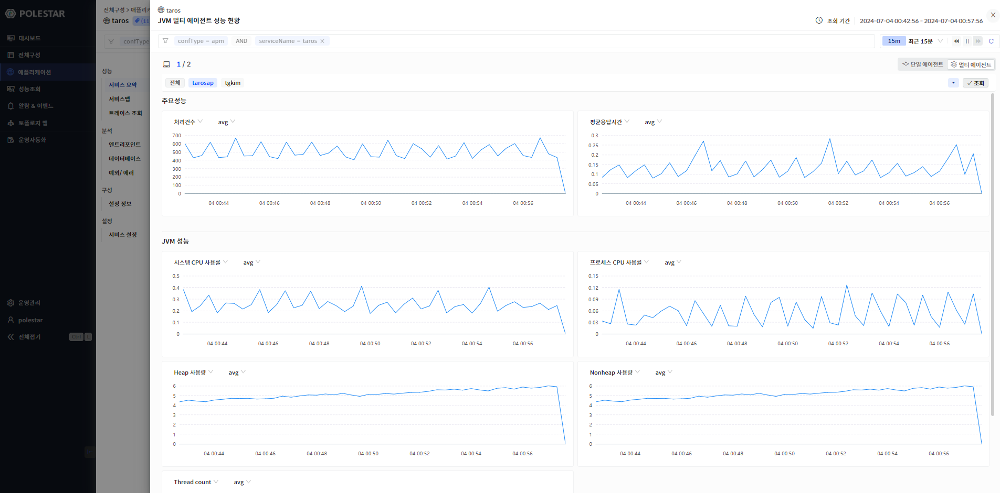

▶ \[그림 38\] 연관리소스 – JVM 멀티 에이전트 성능 현황

<table>
<tbody>
<tr class="odd">
<td>
노트

JVM 멀티 에이전트 성능 현황의 지표는 Java Agent에 따라 수집 정보를 제공하지 않는 경우가 있습니다.
</td>
</tr>
</tbody>
</table>

JVM 멀티 에이전트 성능 현황 오른쪽 상단의 \[단일 에이전트\]를 선택하면 해당 java agent의 상세한 지표를 확인할 수 있습니다. 단일 에이전트 성능 현황 화면의 경우 JDK(JRE)버전, OS, 에이전트 버전에 따라 표시되는 차트의 종류 또는 갯수가 다를 수 있습니다. 표시되는 성능의 경우 주요성능(처리건수, 평균응답시간, 에러율)지표, cpu, memory, thread 네 개의 카테고리로 표시됩니다. 각 성능 이름의 경우 opentelemetry에서 제공하는 성능 키를 그대로 표시하고 있습니다. 예를 들어 system.cpu.usage의 경우 해당 에이전트가 설치된 시스템의 CPU 사용률을 의미합니다.

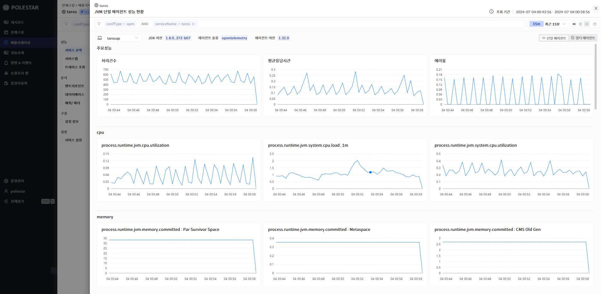

▶ \[그림 39\] 연관리소스 – JVM 단일 에이전트 성능 현황

단일 에이전트 성능 현황 화면에서 다른 java 에이전트의 성능 현황을 확인하고자 한다면 상단의 에이전트 목록에서 JVM 성능을 확인하고자 하는 에이전트를 선택합니다.

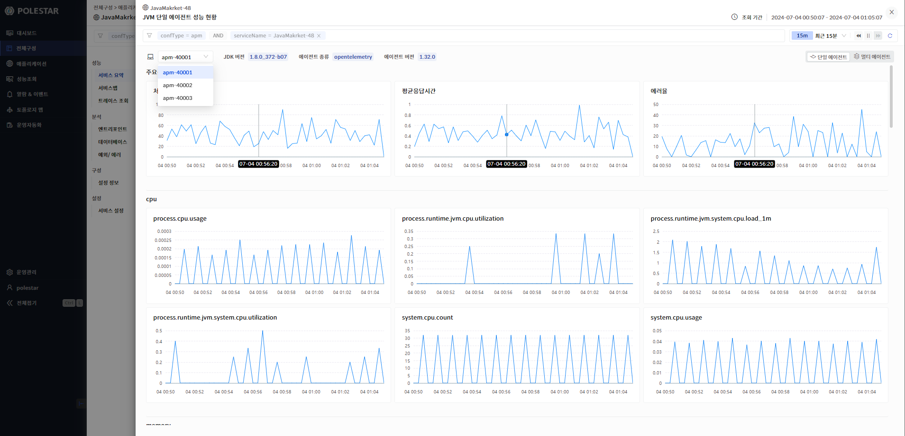

▶ \[그림 40\] 연관리소스 – JVM 단일 에이전트 성능 현황 – 에이전트 선택

성능 \> 서비스맵

서비스맵은 서비스내의 애플리케이션 간의 성능 현황을 시각화하여 표현한 맵입니다. 서비스맵을 통해 애플리케이션 간의 트레이스 처리 현황, 평균응답시간, 에러율을 확인할 수 있으며 알람을 발생했을 경우 발생한 알람을 빠르게 확인할 수 있습니다. 서비스맵의 상단에는 서비스 맵에 다양한 정보를 표현할 수 있는 기능아이콘이 표시됩니다. 서비스맵에서 에이전트는 둥근 노드로 표현되며 외부 리소스의 경우 노드 내 해당 리소스의 아이콘(예:데이테베이스)로 표현됩니다. 본 문서의 서비스맵에서는 에어전트 혹은 외부 리소스 모두 “노드”라는 용어로 통일하여 사용하겠습니다. 외부 리소스는 apm 에이전트가 설치되지 않는 애플리케이션 또는 에이전트가 설치된 애플리케이션과 통신하고 있는 데이터베이스 등을 의미합니다. 노드 간의 선은 두 노드 간의 호출 상태를 알려줍니다. 선의 끝이 둥근 부분이 호출하는 노드, 선의 끝이 화살표인 노드는 호출 대상 노드를 표시합니다.

▶ \[그림 41\] 서비스맵

서비스맵 알람표시

서비스맵의 기능 아이콘 중 알람 표시 아이콘을 선택하여 알람 표시 상태를 On/Off 할 수 있습니다. 알람 레벨에 대해서는 오른쪽 하단의 범례를 참고합니다. 아래 이미지에서는 모든 노드에 알람이 발생하지 않은 해제 상태입니다. 또한 알람 발생 표시가 되어 있을 경우 원 바깥쪽에 발생 알람 수가 표시됩니다.

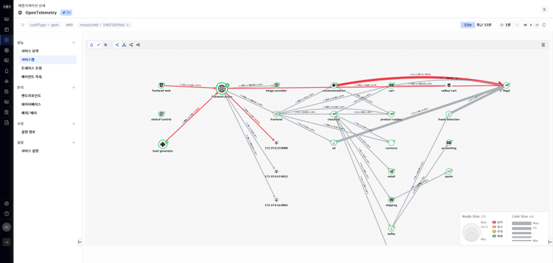

▶ \[그림 42\] 서비스맵 알람 표시 기능

서비스 맵에서 알람 표시 후 해당 서비스의 알람 목록을 확인하고자 한다면 오른쪽 하단의 알람 표시 창 열기 아이콘을 클릭하면 알람 표시 영역이 표시되며 현재 알람 현황을 확인할 수 있습니다.

서비스맵 성능 표시

서비스 맵의 성능 표시 기능을 사용하면 노드 간 성능이 표시됩니다. 표시되는 성능은 처리건수, 평균응답시간, 에러율 순으로 표시되며 에러율이 0%보다 높을 경우 라인이 붉은 색으로 표시됩니다.

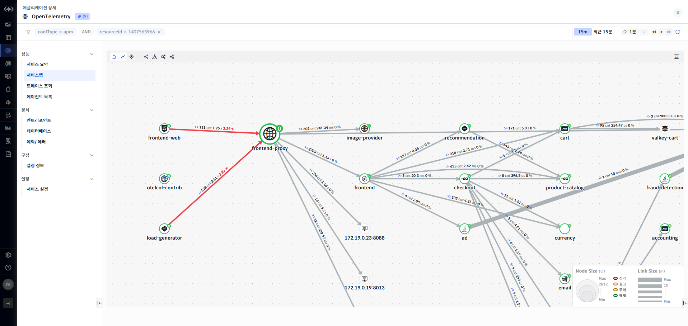

▶ \[그림 43\] 서비스 맵 노드 간 성능 표시

서비스맵의 노드 크기 설정 기능을 사용하면 노드의 성능에 따라 크기가 변경됩니다. 노드와 링크 사이즈는 자동으로 생성되며 서비스맵의 오른쪽 아래 범례를 참고하세요

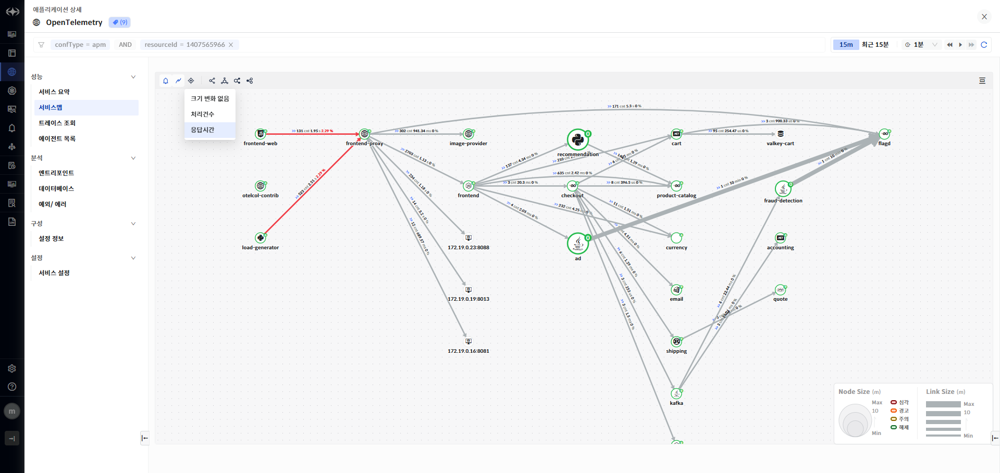

▶ \[그림 44\] 서비스 맵 노드 크기 설정

서비스맵 정렬 및 리소스 하이라이트

서비스맵은 매트릭스 또는 방사형 형태로 확인 할 수 있습니다. 또한 외부 노드와 내부 리소스를 구분하여 표시할 수 있습니다. 아래 그림에 표시된 서비스 맵 정렬 및 표시 아이콘은 매트릭스 정렬, 방사형 정렬, 내부리소스 하이라이트, 외부 리소스 하이라이트 순입니다. 서비스 맵의 기본 표시 방법은 매트릭스 방식이며 방사형으로 선택할 경우 아래의 그림과 같이 방사형으로 표시됩니다. 매트릭스 정렬 아이콘을 클릭하여 다시 매트릭스형으로 전환할 수 있습니다.

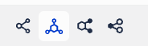

▶ \[그림 45\] 서비스 맵 정렬 및 표시 아이콘

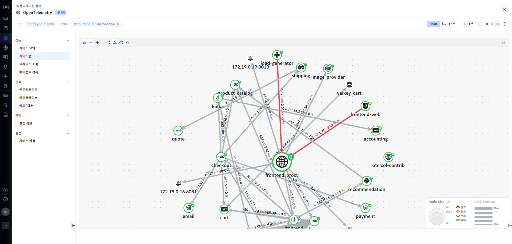

▶ \[그림 46\] 서비스 맵 – 방사형

\[내부리소스 하이라이트\]를 선택하며 내부리소스는 외부 리소스에 비해 밝게 표시되며 외부 리소스는 흐리게 표시합니다.

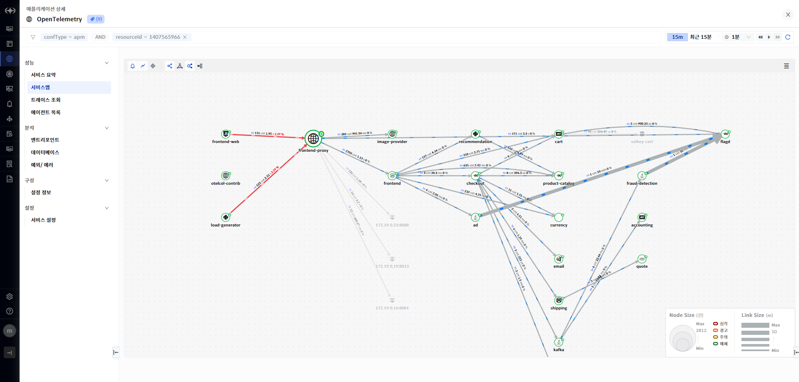

▶ \[그림 47\] 서비스 맵 – 내부 리소스 하이라이트

\[외부 리소스 하이라이트\]를 선택하면 외부리소스는 내부 리소스에 비해 밝게 표시되며 내부 리소스는 흐리게 표시합니다. 서비스에 등록된 에이전트가 많은 경우 내,외부 리소스를 구분할 수 있어 유용하게 사용할 수 있습니다.

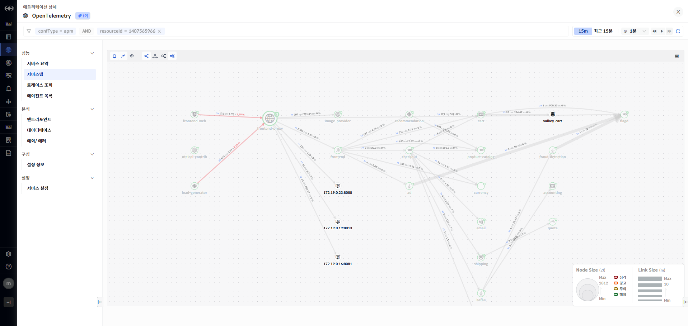

▶ \[그림 48\] 서비스 맵 – 외부 리소스 하이라이트

서비스맵 노드,선 빠른 메뉴

서비스맵에서는 노드 또는 선에서 빠른 메뉴를 사용할 수 있습니다. 노드의 빠른 메뉴는 \[인-아웃맵\], \[트레이스 조회\] 메뉴를 제공합니다. 선을 클릭하면 \[트레이스 조회\] 메뉴가 표시됩니다.

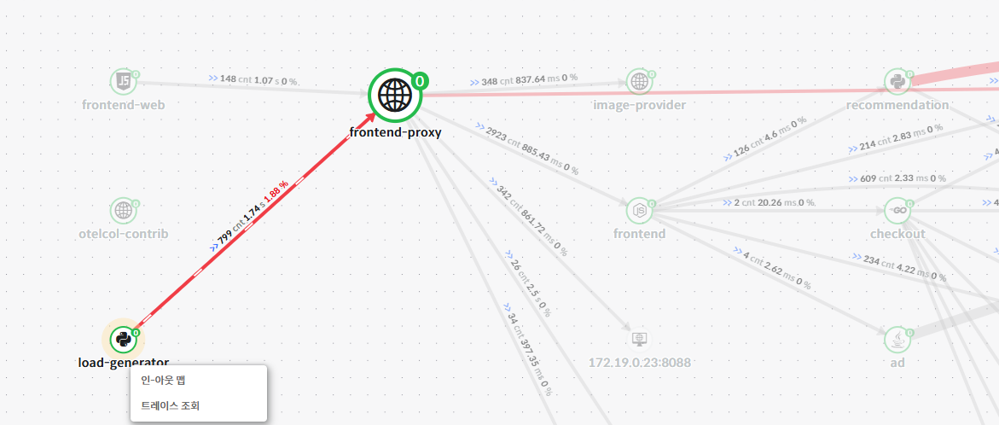

▶ \[그림 49\] 서비스 맵 – 노드 빠른 메뉴

서비스맵 노드 빠른 메뉴 – 인-아웃 맵

노드의 \[인-아웃맵\]은 해당 노드로 요청을 하거나 해당 노드에서 다른 노드로 요청한 관계를 확인할 수 있습니다. 복잡한 MSA 구조에서 특정 애플리케이션으로의 요청과 다른 노드로의 요청을 빠르게 확인할 수 있습니다. 선택한 노드 왼쪽에 표시되는 노드가 선택 노드로 요청을 보내는 노드들이며 선택 노드의 오른쪽에 표시되는 노드가 선택노드로 부터 요청을 받는 노드입니다. \[서비스맵으로 돌아가기\]를 선택하면 서비스맵 화면으로 전환됩니다,

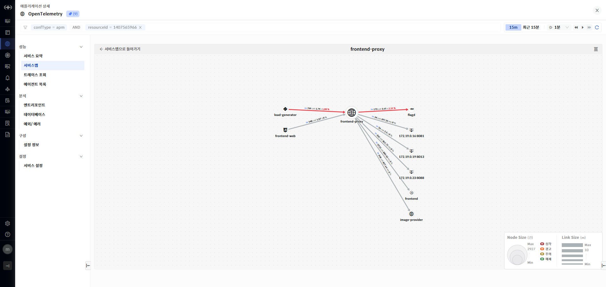

▶ \[그림 50\] 서비스 맵 – 노드 빠른 메뉴 – 인-아웃맵

서비스맵 노드 트레이스 조회

노드의 트레이스 조회 메뉴를 선택하면 노드에서 수행된 트레이스 목록을 확인할 수 있습니다.

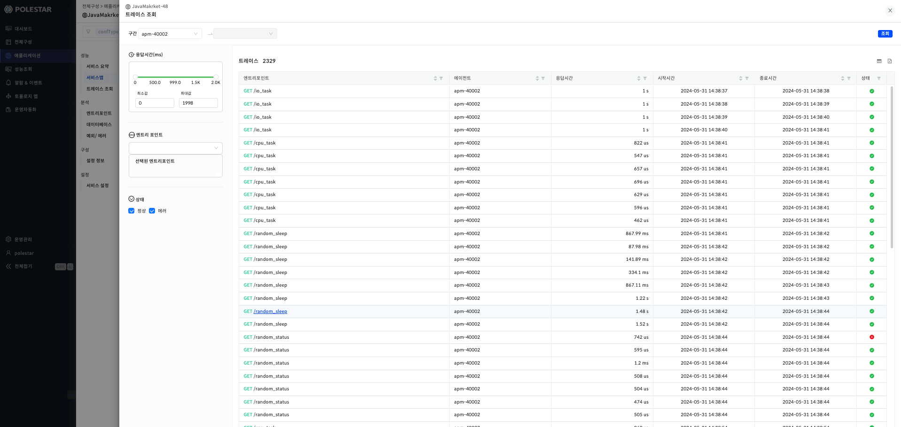

▶ \[그림 51\] 서비스 맵 – 노드 빠른 메뉴 – 트레이스 조회

화면의 왼쪽에 표시되는 응답시간 및 엔트리포인트, 상태 정보를 변경하여 조회할 수 있습니다. 노드에서 수행된 트레이스 중 특정 응답시간 구간의 트레이스만을 조회하고자 한다면 최소값과 최대값을 변경하거나 응답시간에 표시된 슬라이더바를 사용하여 변경하여 조회 할 수 있습니다.엔트리포인트의 경우 자동완성 기능을 사용하여 특정 엔트리포인트명을 검색하고자 할 때 사용할 수 있습니다. 상태 정보 역시 정상, 에러를 선택하여 조회 가능합니다. 트레이스 목록에서 보여주는 컬럼 목록을 수정하거나 CSV 파일로 다운로드 할 경우 트레이스 목록의 오론쪽 상단의 \[컬럼 설정\] 아이콘과 \[엑셀저장\] 아이콘을 클릭하여 사용할 수 있습니다.

또한 트레이스 조회화면에서 다른 노드를 선택하여 조회하고자 할 경우 구간의 노드를 다른 노드로 선택한 후 \[조회\]버튼을 클릭합니다. 조회된 목록에서 엔트리포인트명을 클릭하면 해당 트레이스에 대한 상세정보 드로우가 표시됩니다.

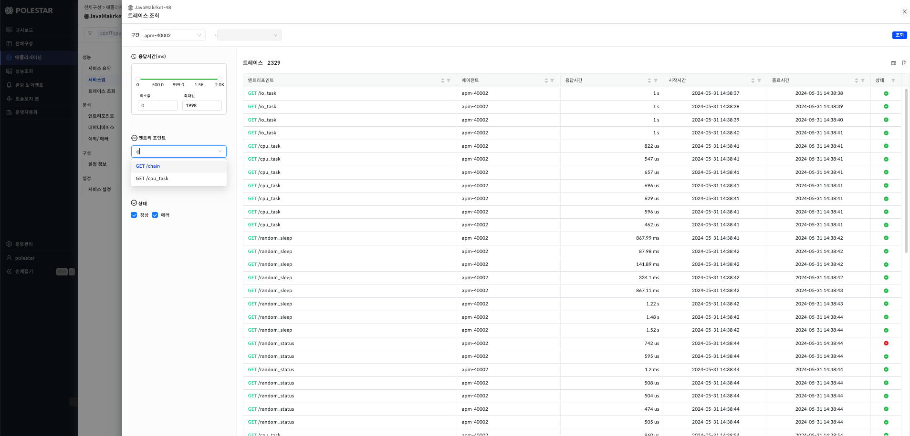

▶ \[그림 52\] 서비스 맵 – 노드 트레이스 조회

> 트레이스

<table>
<thead>
<tr class="header">
<th>엔트리포인트</th>
<th>실행한 트레이스의 엔트리포인트(URI, 메소드, 오퍼레이션)</th>
</tr>
</thead>
<tbody>
<tr class="odd">
<td>에이전트</td>
<td>트레이스가 실행된 에이전트. 여러 애플리케이션을 통해 수행해는 글로벌 트레이스의 경우 엔트리포인트가 실행된 에이전트를 의미</td>
</tr>
<tr class="even">
<td>응답시간</td>
<td>
트레이스가 수행되는 데 걸린 시간

트레이스의 종료시간 – 트레이스 시작 시간을 의미.
</td>
</tr>
<tr class="odd">
<td>시작시간</td>
<td>트레이스의 시작시간</td>
</tr>
<tr class="even">
<td>종료시간</td>
<td>트레이스의 종료시간</td>
</tr>
<tr class="odd">
<td>상태</td>
<td>
트레이스의 상태를 표시한다. 상세 실행내역 중 에러 구간이 존재할 경우 에러 상태로 표시한다.

: 정상

: 에러 발생
</td>
</tr>
</tbody>
</table>

서비스맵 선 빠른 메뉴 – 트레이스 조회

노드 간 선에서 빠른 메뉴를 사용하여 트레이스를 조회할 경우 노드와 동일한 트레이스 화면이 표시됩니다. 노드 간 선에서 \[트레이스 조회\] 메뉴를 선택할 경우 구간 정보에는 선의 시작 노드와 끝노드가 표시됩니다. 시작노드와 끝노드를 변경하여 재조회할 수 있습니다.

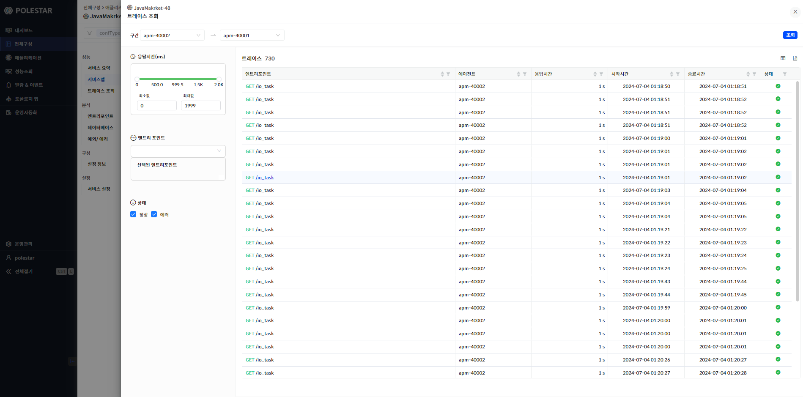

▶ \[그림 53\] 서비스 맵 – 노드 간 트레이스 조회

<table>
<tbody>
<tr class="odd">
<td>
노트

내부 리소스(에이전트가 설치된 노드)와 외부 리소스 사이에서는 트레이스 조회 기능을 제공하지 않습니다.
</td>
</tr>
</tbody>
</table>

성능 \> 트레이스 조회

과거에 수행한 트레이스를 조회하고자 한다면 트레이스 조회 메뉴를 사용하여 과거 수행한 트레이스에 대해 조회할 수 있습니다. \[트레이스 조회\]를 선택하면 기본적으로 최근 15분내에 수행된 트레이스 목록이 표시됩니다. 타임피커를 이용해 조회기간을 변경하여 조회할 수 있습니다. 트레이스 조회에서는 서비스 요약 화면의 응답분포도와 동일한 스캐터 차트가 표시됩니다. 응답분포도에 표시되는 특정영역의 데이터를 조회하고자 한다면 그 영역을 포함하여 드래그를 합니다. 아래 그림에서와 같이 드래그한 영역이 노란 영역으로 표시되며 해당 영역의 트레이스들이 아래 트레이스 목록에 표시됩니다.

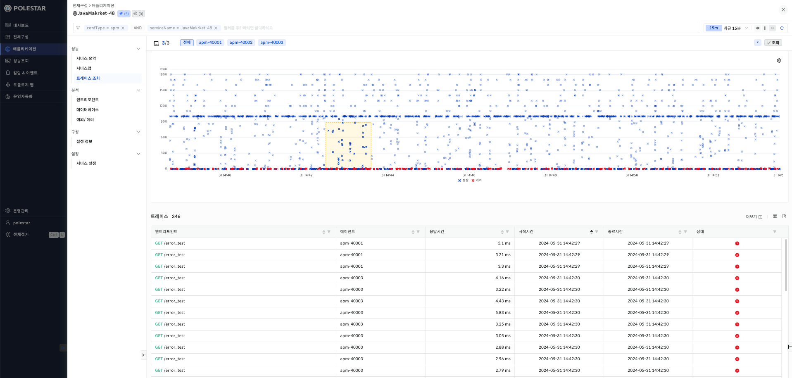

▶ \[그림 54\] 트레이스 조회

트레이스 조회 시 표시되는 트레이스 상세 화면의 기능에 대해서는 본 문서의 트레이스 상세 정보 내용을 참고합니다. 응답분포도를 통해 특정 시간대의 데이터를 조회하기 위해서는 타임피커를 사용하여 원하는 시간을 설정한 후 조회한다. 응답분포도의 특정 시간대의 데이터를 조회하고자 한다면 타임피커의 “custom 사용자 정의 시간 범위”를 사용한다. 응답분포도의 사용자 정의 시간 범위 기간은 3시간 이내로 제한되어 있다.

<table>
<tbody>
<tr class="odd">
<td>
노트

조회 기간이 길 경우 트레이스 조회가 오래 걸리거나 조회된 트레이스가 많아 브라우저의 메모리 문제가 발생할 수 있습니다. 많은 트랜잭션이 수행되는 서비스라면 짧은 기간을 조회하거나 조회 기간 선택 시 사용자 정의 시간 범위를 통해 짧은 기간을 선택해서 조회하는 것을 권장합니다.
</td>
</tr>
</tbody>
</table>

응답시간 분포도 설정

응답분포도를 편리하게 사용하기 위해 설정 기능을 제공합니다. 응답분포도 오른쪽 상단의 \[설정\]아이콘을 선택하면 설정 기능을 사용할 수 있습니다. 설정 기능은 아래의 표를 참고하여 사용합니다. 트레이스 조회의 응답분포도 설정 기능은 서비스 요약의 응답분포도 상세 기능과 유사합니다.

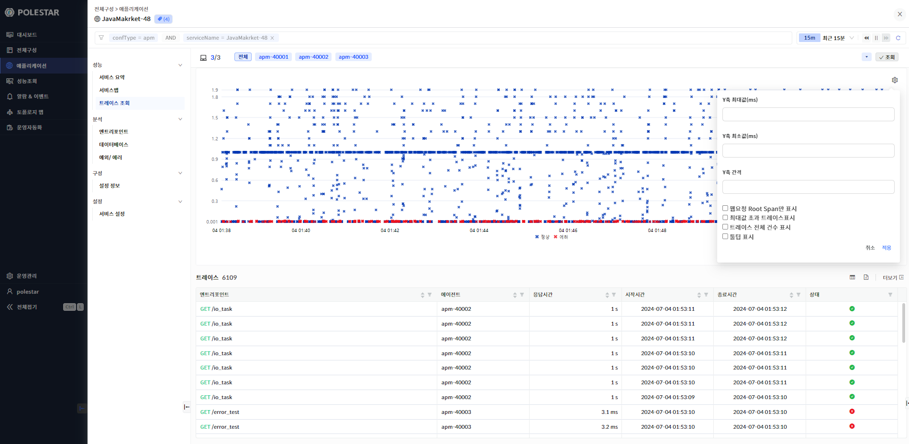

▶ \[그림 55\] 트레이스 조회 – 응답분포도 설정

> 응답분포도 설정 기능

| Y축 최대값            | 응답분포도에 표시되는 Y축의 최대값                                                  |
| ----------------- | -------------------------------------------------------------------- |
| Y축 최소값            | 응답분포도에 표시되는 Y축의 최소값                                                  |
| Y축 간격             | 응답분포도의 Y축에 안내선 간격                                                    |
| 웹요청 Root Span만 표시 | Http요청으로 들어온 트레이스만 표시                                                |
| 최대값 초과 트레이스 표시    | 응답분포도의 Y축 최대값을 설정한 경우 그 설정값 이상의 응답시간을 가진 트레이스가 있을 때 응답분포도 Y축 최상위에 표현 |
| 트레이스 전체 건수 표시     | 트레이스 전체 건수 표시                                                        |
| 툴팁표시              | 응답분포도의 데이터(포인트)를 mouse over 시 해당 트레이스에 대한 툴팁 표시 여부                   |

트레이스 목록에서 하나의 트레이스를 선택할 경우 트레이스 상세화면이 화면에 표시됩니다. 트레이스 상세화면에 대해서는 본 문서의 “엔트리포인트Slow Top5 \> 트레이스” 부분을 참고하세요.

성능 \> 에이전트 목록

서비스내에 설치되어 있는 에이전트 목록을 표시합니다.

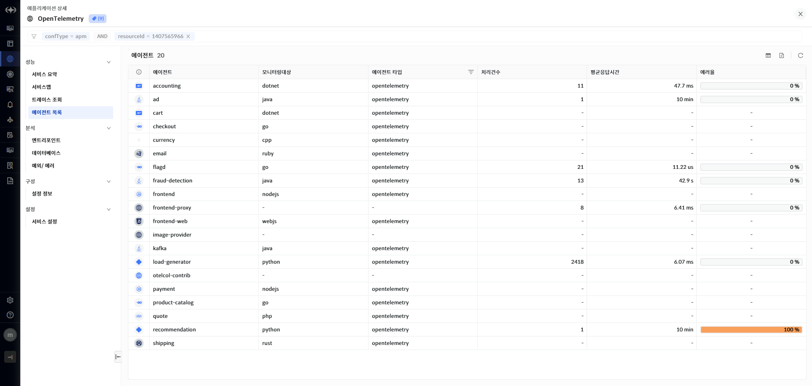

▶ \[그림 56\] 에이전트 목록

> 에이전트

<table>
<thead>
<tr class="header">
<th>가용성 및 관리상태</th>
<th>
에이전트의 가용성과 관리상태를 아이콘으로 표시

아이콘은 각 지원 언어 아이콘으로 표시
</th>
</tr>
</thead>
<tbody>
<tr class="odd">
<td>모니터링대상</td>
<td>
모니터링 대상 언어

예 : java, dotnet
</td>
</tr>
<tr class="even">
<td>에이전트 타입</td>
<td>
설치된 에이전트의 타입

예 : opentelemetry
</td>
</tr>
<tr class="odd">
<td>처리건수</td>
<td>최근 15분 간의 처리건수를 표시</td>
</tr>
<tr class="even">
<td>평균응답시간</td>
<td>최근 15 분 간의 트레이스의 평균응답시간을 표시</td>
</tr>
<tr class="odd">
<td>에러율</td>
<td>최근 15분 간 처리된 트레이스 처리건수 대비 에러 발생 비율</td>
</tr>
</tbody>
</table>

분석 \> 엔트리포인트

애플리케이션의 성능 분석을 위해 서비스내에서 수행되는 엔트리포인트를 분석이 필요합니다. 자주 수행 되는 엔트리포인트, 느린 엔트리포인트를 조회하여 서비스 내의 애플리케이션 처리 상태를 확인할 수 있습니다. 애플리케이션 목록에서 조회하고자 하는 서비스명을 클릭 후 , 분석 \> 엔트리포인트를 클릭합니다.

순위 지표란에서 엔트리포인트를 선택된 조건으로 정렬하여 순위별로 목록을 조회할 수 있으며, 특정 엔트리 포인트 클릭 시, 해당 엔트리포인트의 요약 정보 및 상세정보를 확인할 수 있습니다.

순위 지표 아래에 표시 되는 순위 결과는 최대 30개까지 표시될 수 있습니다. 특정 이름을 가진 엔트포인트를 검색하고자 한다면 순위 지표 아래의 검색창에 검색하고자 하는 엔트리포인트명을 입력합니다.

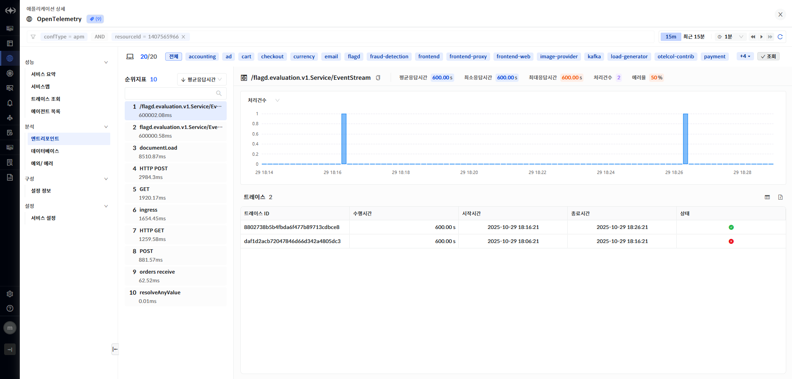

▶ \[그림 57\] 엔트리포인트 분석 조회

> 선택 조건

| 평균 응답시간 | 조회기간 내 각 엔트리포인트의 응답시간의 평균값 |
| ------- | -------------------------- |
| 처리 건수   | 조회기간 내 각 엔트리포인트의 발생 건수     |

엔트리포인트 상세 - 요약

선택한 엔트리포인트에 대한 통계 요약 정보 및 차트를 확인할 수 있습니다.

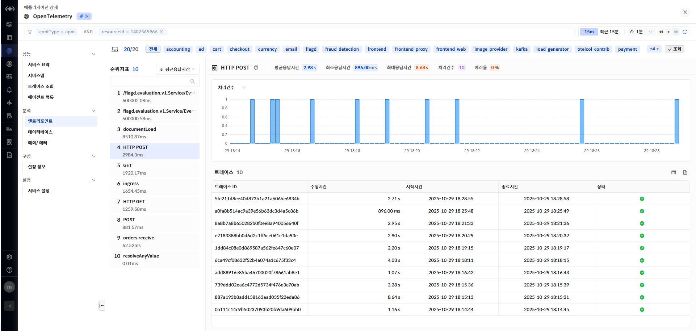

▶ \[그림 58\] 엔트리 포인트에 대한 요약 정보

> 엔트리포인트 정보

| 엔트리포인트명           | 리스트에서 선택한 엔트리포인트 이름           |
| ----------------- | ----------------------------- |
| 평균 / 최소 / 최대 응답시간 | 선택한 엔트리포인트 평균 / 최소 / 최대 응답 시간 |
| 처리 건수             | 선택한 엔트리포인트 발생 개수              |
| 에러율               | 선택한 엔트리포인트 에러 발생율             |

엔트리포인트 상세 - 차트

특정 엔트리포인트에 대한 집계치를 차트를 통해 조회할 수 있다.

선택 조건

| 처리 건수  | 특정 엔트리포인트의 발생 건수                |
| ------ | ------------------------------- |
| 응답 분포도 | 정해진 시간 범위 내에 발생한 특정 엔트리포인트의 분포도 |

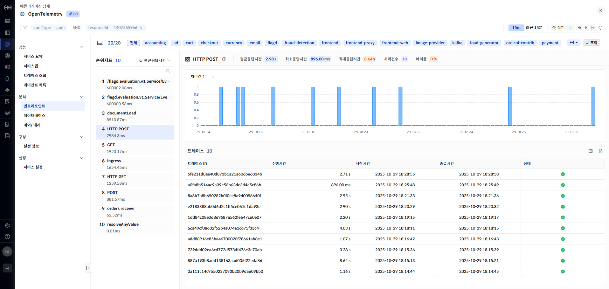

▶ \[그림 59\] 동일 엔트리포인트를 수행한 트레이스의 처리건수

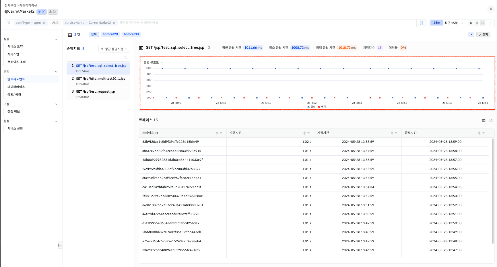

▶ \[그림 60\] 동일 엔트리포인트를 수행한 트레이스의 응답분포도

엔트리포인트 상세 – 트레이스 목록 조회

목록에서 선택한 동일한 엔트리포인트명을 수행한 트레이스 목록을 조회합니다.

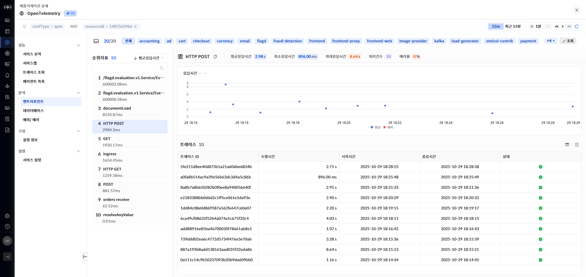

▶ \[그림 61\] 동일 엔트리포인트를 수행한 트레이스 목록

트레이스

<table>
<thead>
<tr class="header">
<th>트레이스 ID</th>
<th>해당 엔트리포인트가 수행된 트레이스 ID</th>
</tr>
</thead>
<tbody>
<tr class="odd">
<td>수행시간</td>
<td>
트레이스가 수행되는 데 걸린 시간

트레이스의 종료시간 – 트레이스 시작 시간을 의미.
</td>
</tr>
<tr class="even">
<td>시작시간</td>
<td>트레이스의 시작시간</td>
</tr>
<tr class="odd">
<td>종료시간</td>
<td>트레이스의 종료시간</td>
</tr>
<tr class="even">
<td>상태</td>
<td>
트레이스의 상태를 표시한다. 상세 실행내역 중 에러 구간이 존재할 경우 에러 상태로 표시한다.

<table>
<thead>
<tr class="header">
<th>: 트레이스 정상 종료</th>
</tr>
</thead>
<tbody>
<tr class="odd">
<td>: 트레이스 에러 발생</td>
</tr>
</tbody>
</table></td>
</tr>
</tbody>
</table>

트레이스 정보 상세 조회

본 문서의 “엔트리포인트Slow Top5 \> 트레이스” 를 참고합니다.

분석 \> 데이터베이스

데이터베이스 화면은 이러한 데이터베이스 요청의 처리 현황과 성능을 모니터링하고 분석하는 데 도움을 줍니다. 이를 통해 데이터베이스 관련 작업의 효율성을 향상시키고, 문제를 조기에 발견하여 해결할 수 있습니다.

애플리케이션 목록에서 특정 애플리케이션을 클릭한 후, 분석 \> 데이터베이스를 클릭합니다.

순위 지표란에서 데이터베이스 쿼리를 , 선택된 조건으로 정렬하여 순위별로 목록을 조회할 수 있으며, 특정 데이터베이스 쿼리 클릭 시, 해당 엔트리포인트의 요약 정보 및 상세정보를 확인할 수 있습니다.

▶ \[그림 62\] 데이터베이스 쿼리를 수행한 엔트리포인트 요약 정보

선택 조건

| 평균 응답시간 | 데이터베이스 쿼리의 평균 응답시간 |
| ------- | ------------------ |
| 처리 건수   | 데이터베이스 쿼리의 발생 건수   |

데이터베이스 쿼리 상세 - 요약

데이터베이스 쿼리의 주요 지표를 요약창을 통해 조회한다.

▶ \[그림 63\] 데이터베이스 쿼리 수행 정보

데이터베이스

| 엔트리포인트명           | 리스트에서 선택한 데이터베이스 엔트리포인트 명칭          |
| ----------------- | ----------------------------------- |
| 평균 / 최소 / 최대 응답시간 | 선택 데이터베이스 엔트리포인트 평균 / 최소 / 최대 응답 시간 |
| 처리 건수             | 선택 데이터베이스 엔트리포인트 발생 개수              |
| 에러율               | 선택 데이터베이스 엔트리포인트 에러 발생율             |

데이터베이스 엔트리포인트 상세 – Top 엔트리포인트

엔트리포인트에서 선택한 쿼리 실행 비율이 높은 트레이스를 기준으로 조회한다.

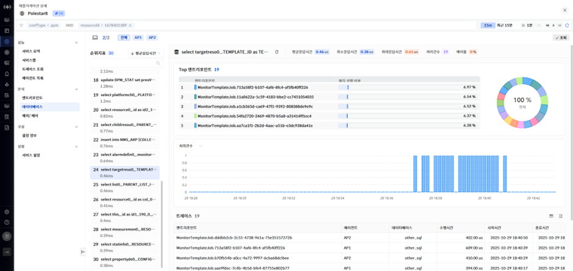

▶ \[그림 64\] 데이터베이스 쿼리를 수행한 Top 엔트리포인트 정보

데이터베이스 엔트리포인트 상세 - 차트

특정 데이터베이스 엔트리포인트에 대한 집계치를 차트를 통해 조회할 수 있다.

선택 조건

| 처리 건수  | 선택한 데이터베이스 쿼리의 발생 건수           |
| ------ | ------------------------------ |
| 응답 분포도 | 선택한 데이터베이스 쿼리를 수행한 엔트리포인트의 분포도 |

▶ \[그림 65\] 데이터베이스 쿼리를 실행한 엔트리포인트 처리건수 차트

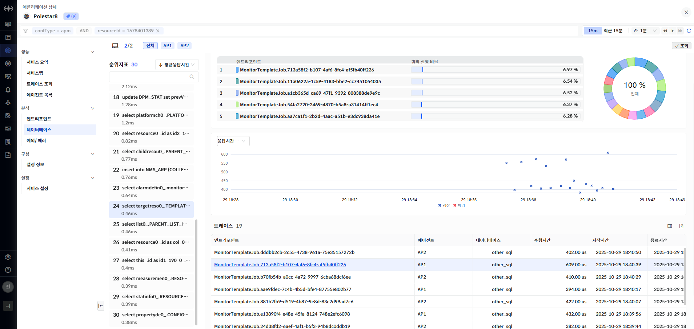

▶ \[그림 66\] 데이터베이스 쿼리를 실행한 엔트리포인트 응답분포도

데이터베이스 쿼리 상세 – 트레이스 정보 조회

선택한 쿼리를 수행한 엔트리포인트의 트레이스 실행 정보를 조회한다.

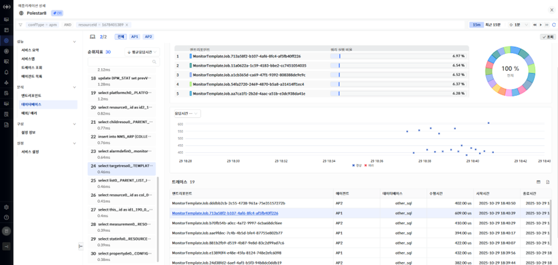

▶ \[그림 67\] 데이터베이스 쿼리를 수행한 트레이스 목록

트레이스

| 엔트리포인트 | 데이터베이스 엔트리 포인트의 루트 엔트리 포인트     |
| ------ | ------------------------------ |
| 에이전트   | 쿼리를 실행한 에이전트 정보                |
| 데이터베이스 | 쿼리 작업이 요청된 데이터베이스              |
| 수행시간   | 트레이스내에서 선택한 데이터베이스 쿼리가 수행된 시간  |
| 시작시간   | 트레이스내에서 선택한 데이터베이스 쿼리가 시작된 시간  |
| 종료시간   | 트레이스내에서 선택한 데이터베이스 쿼리가가 종료된 시간 |
| 상태     | 트레이스 실행 상태                     |

데이터베이스 엔트리포인트 상세 – 트레이스 정보 엑셀 출력

그리드 컴포넌트의 엑셀 저장 기능을 참고합니다.

데이터베이스 트레이스 정보 상세 조회

데이터베이스 트레이스 상세 화면은 특정 데이터베이스 쿼리의 실행 경로와 성능을 상세히 보여주는 화면입니다. 이 화면은 쿼리의 전체 실행 과정을 추적하고, 각 단계별 실행 시간을 분석할 수 있도록 도와줍니다. 이를 통해 성능 병목 현상을 파악하고, 쿼리 최적화를 위한 인사이트를 제공합니다.

상세 조회가 필요한 특정 트레이스를 클릭하여, 트레이스 상세 정보창으로 이동합니다.

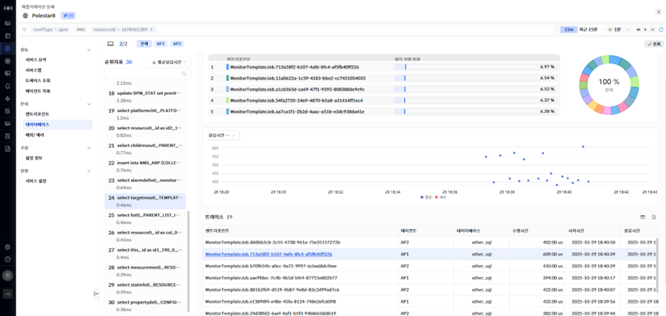

▶ \[그림 68\] 데이터베이스 쿼리를 실행한 엔트리포인트 목록

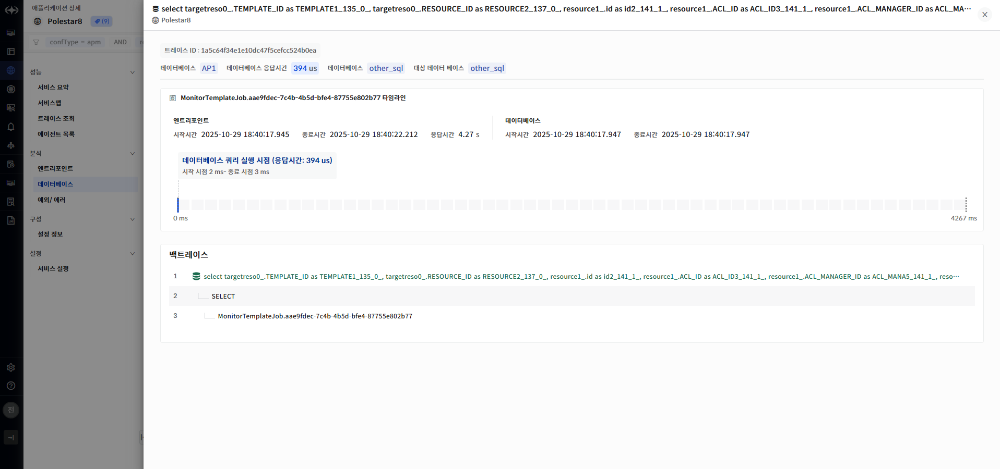

▶ \[그림 69\] 데이터베이스 쿼리 상세 수행 정보

데이터베이스 수행 정보

<table>
<thead>
<tr class="header">
<th>트레이스 ID</th>
<th>트레이스를 식별하는 고유한 ID</th>
</tr>
</thead>
<tbody>
<tr class="odd">
<td>에이전트</td>
<td>쿼리를 실행한 에이전트 정보</td>
</tr>
<tr class="even">
<td>데이터베이스 응답시간</td>
<td>쿼리의 요청이 완료된 시간</td>
</tr>
<tr class="odd">
<td>데이터베이스</td>
<td>쿼리가 실행된 데이터베이스의 유형</td>
</tr>
<tr class="even">
<td>대상 데이터베이스</td>
<td>쿼리가 수행된 데이터베이스 서버의 IP 주소 또는 호스트명</td>
</tr>
<tr class="odd">
<td>엔트리포인트 URL</td>
<td>
쿼리를 실행한 엔트리포인트 URL

(예: GET /jsp/test_sql_select_free.jsp)
</td>
</tr>
<tr class="even">
<td>엔트리포인트 응답시간</td>
<td>엔트리포인트의 총 응답 시간 (예: 1010.47ms)</td>
</tr>
<tr class="odd">
<td>엔트리포인트 시작시간 및 종료시간</td>
<td>
엔트리 포인트 시작 및 종료 시간

(예: 2024.05.28 09:08:59 - 2024.05.28 09:09:00)
</td>
</tr>
<tr class="even">
<td>데이터베이스 시작시간 및 종료 시간</td>
<td>
쿼리 실행 시작 및 종료 시간

(예: 2024.05.28 09:08:59 - 2024.05.28 09:08:59)
</td>
</tr>
<tr class="odd">
<td>쿼리 수행시간</td>
<td>
쿼리의 시작 시간과 종료 시간

(예: 시작 시간 6ms - 종료 시간 8ms)
</td>
</tr>
<tr class="even">
<td>백트레이스</td>
<td>쿼리를 수행한 메소드 및 엔트리포인트까지의 과정을 역으로 표시</td>
</tr>
</tbody>
</table>

<table>
<tbody>
<tr class="odd">
<td>
노트

Agent에서 관제 대상의 쿼리 내용을 제공하지 않을 경우 “[not provided]”으로 표시 됩니다.
</td>
</tr>
</tbody>
</table>

백트레이스는 데이터베이스 쿼리를 기점으로 하여 어떤 경로를 통해서 수행되었는지 역으로 추적할 수 있는 기능입니다. 트레이스 상세 실행내역의 타임라인을 통해 데이터베이스 수행 경로를 추적할 경우 데이터베이스 쿼리를 수행한 메소드 또는 구간을 찾기 위해 많은 내용을 살펴봐야하지만 백트레이스를 통해 데이터베이스 실행 까지의 구간을 역추적할 수 있어 느린 쿼리를 수정하기 위한 애플리케이션 코드를 검색하는 시간을 절약할 수 있습니다.

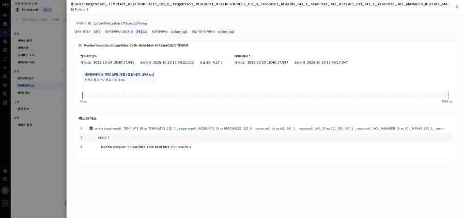

▶ \[그림 70\] 데이터베이스 상세 수행 정보-백트레이스

트레이스 정보 상세 조회

본 문서의 “엔트리포인트Slow Top5 \> 트레이스” 를 참고합니다.

트레이스 상세 조회 절차

1.  > 트레이스 ID 클릭

2.  > 트레이스 상세 조회 팝업 화면

분석 \> 예외/에러

예외/에러 관리 화면은 애플리케이션에서 발생한 예외와 에러를 모니터링하고 분석하는 데 사용되는 화면입니다. 이 화면은 특정 예외/에러의 발생 원인과 경로를 추적하고, 문제를 해결하기 위한 정보를 제공합니다. 애플리케이션 목록에서 특정 애플리케이션을 클릭한 후, 분석 \> 예외/에러를 클릭합니다.

현재 선택된 시간 범위 내에서의 예외/에러를 보여주며, 순위 지표란에서 예외/에러 발생 트레이스를 선택된 조건으로 정렬하여 순위별로 목록을 조회할 수 있습니다. 특정 예외/에러 발생 트레이스 클릭 시, 해당 트레이스의 요약 정보 및 상세 정보를 확인할 수 있습니다.

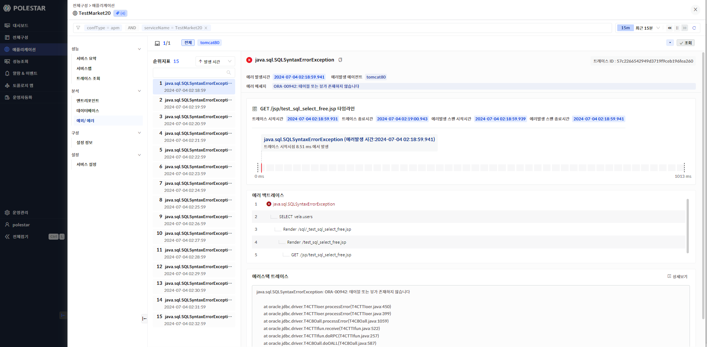

▶ \[그림 71\] 예외/에러 상세 화면

선택 조건

| 발생 시간 | 에러 트레이스 발생 시점                |
| ----- | ---------------------------- |
| 발생 건수 | 애플리케이션에서 발생한 특정 에러에 대한 발생 건수 |

예외/에러 분석 기능의 경우 엔트리포인트나 데이터베이스와 달리 순위 지표 즉 발생시간, 발생 건수에 따라 표시되는 정보가 다릅니다. 발생 건수의 경우 동일 예외/에러에 대한 발생 건수 및 발생 엔트리포인트에 대한 정보를 차트 형태로 제공, 통계적인 정보를 확인할 수 있습니다.

예외/에러 트레이스 상세 - 요약

예외/에러 리스트 영역에서 선택된 트레이스를 기준으로 요약화면을 보여줍니다.

주요 요소는 다음과 같습니다.

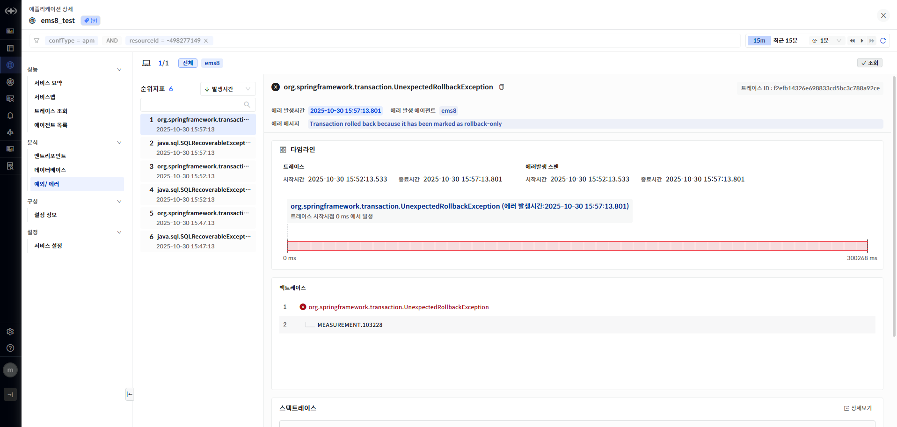

▶ \[그림 72\] 트레이스 에러 정보 및 에러타임라인

예외/에러 정보

<table>
<thead>
<tr class="header">
<th>예외/에러 이름</th>
<th>발생한 예외/에러의 이름 (예: java.sql.SQLSyntaxErrorException)</th>
</tr>
</thead>
<tbody>
<tr class="odd">
<td>트레이스 ID</td>
<td>예외/에러가 발생한 트레이스를 식별하는 고유한 ID</td>
</tr>
<tr class="even">
<td>에러 발생 시간</td>
<td>예외/에러가 발생한 시간</td>
</tr>
<tr class="odd">
<td>에러 발생 에이전트</td>
<td>예외/에러가 발생한 에이전트 정보</td>
</tr>
<tr class="even">
<td>에러 메시지</td>
<td>
예외/에러에 대한 메시지

(예: ORA-00942: 테이블 또는 뷰가 존재하지 않습니다.)
</td>
</tr>
<tr class="odd">
<td>타임라인</td>
<td>예외/에러가 발생한 시점과 관련된 타임라인 정보</td>
</tr>
</tbody>
</table>

예외/에러 트레이스 상세 – 에러 백트레이스

에러 백트레이스 정보는 예외/에러 발생 시의 호출 스택을 시각적으로 표시합니다

▶ \[그림 73\] 에러 백트레이스

예외/에러 트레이스 상세 – 에러 스택 트레이스

에러 스택 트레이스는 예외가 발생한 시점의 상세한 호출 경로를 보여줍니다.

스택 트레이스는 오류 발생 시점부터 시작하여 호출된 메서드와 파일, 코드 라인 정보를 포함합니다. 이를 통해 개발자는 오류가 발생한 정확한 위치와 원인을 파악할 수 있습니다.

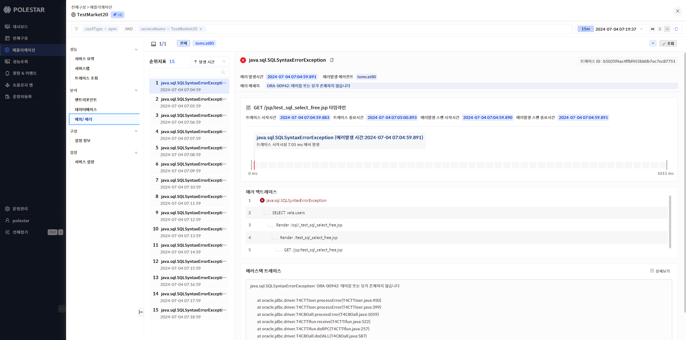

▶ \[그림 74\] 에러스택 트레이스

트레이스 ID 를 클릭하여, 트레이스 상세 정보 화면으로 이동할 수 있습니다. 상세화면 기능은 본 “엔트리포인트Slow Top5 \> 트레이스”를 참고합니다.

예외/에러 발생 건수로 조회

예외/에러 분석을 발생 건수로 조회할 경우 아래와 해당 에러를 발생한 엔트리포인트를 조회하여 표시합니다. 비율적으로 해당 에러를 가장 많이 발생시킨 에러를 비율 차트로 표시합니다.

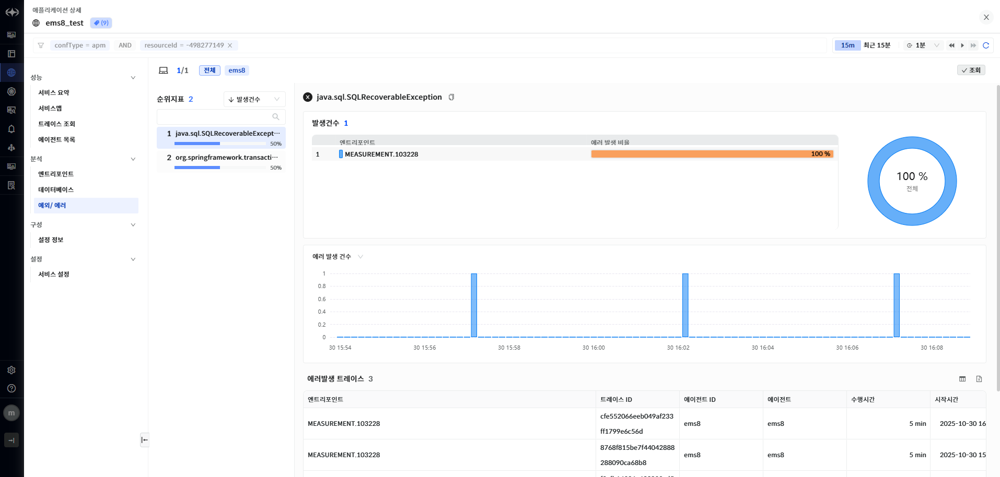

▶ \[그림 75\] 예외/에러 발생 건수 조회

해당 에러가 발생한 엔트리포인트 목록과 도넛 차트로 해당 에러가 발생한 엔트리포인트명을 표시합니다. 어떤 엔트리포인트에서 에러가 많이 발생하는지 빠르게 분석할 수 있습니다.

에러 발생 트레이스에 표시되는 트레이스 목록에서 엔트리포인트명을 클릭하면 위의 “예외/에러 트레이스 상세”화면과 동일한 화면이 표시되어 예외/에러 정보를 상세히 확인할 수 있습니다. 트레이스에 대한 실행 내역을 확인하고 싶다면 예외/에러 화면에서 트레이스 ID를 클릭하여 확인할 수 있습니다.

구성 \> 설정 정보

설정 정보

설정 정보 메뉴에서 애플리케이션의 기본 정보와 POLESTAR 정책, 권한, 리소스 담당자를 변경할 수 있습니다.

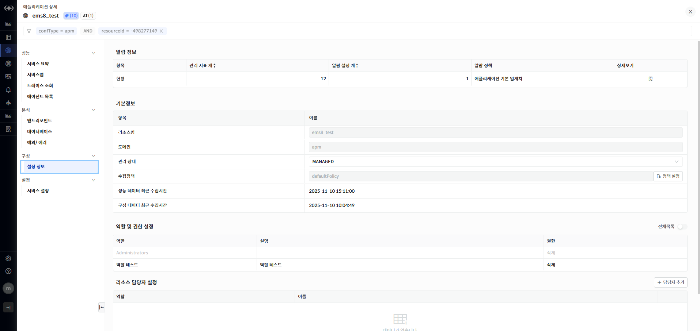

▶ \[그림 76\] 설정 정보

알람 정보

애플리케이션에서 수집하는 관리 지표 개수와 현재 설정된 알람 개수 및 알람 정책 정보를 제공합니다. \[상세보기\]를 선택하여 알람 상세 드로어에서 알람 정책의 세부 알람 설정 목록을 확인할 수 있습니다.

<table>
<tbody>
<tr class="odd">
<td>
노트

세부 알람 설정은 [알람 &amp; 이벤트] 메뉴에서 변경할 수 있습니다. 자세한 내용은 ‘알람 상세’ 매뉴얼을 참고하시기 바랍니다.
</td>
</tr>
</tbody>
</table>

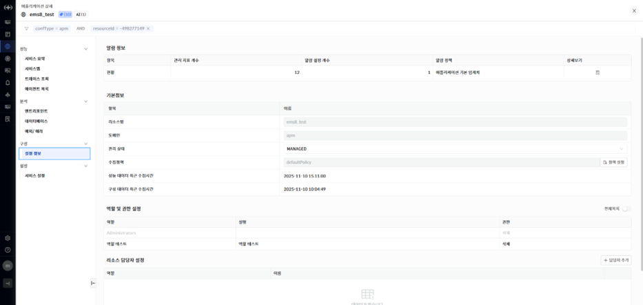

▶ \[그림 77\] 알람 정보

화면 지표

| 관리 지표 개수 | POLESTAR에서 관리하는 성능 지표 개수를 표시합니다.         |
| -------- | ---------------------------------------- |
| 알람 설정 개수 | 서버에 설정된 알람 개수를 표시합니다.                    |
| 알람 정책    | 서버에 설정된 알람 정책을 표시합니다.                    |
| 상세 보기    | 알람 정책의 세부 알람 설정 목록을 확인할 수 있는 드로어를 호출합니다. |

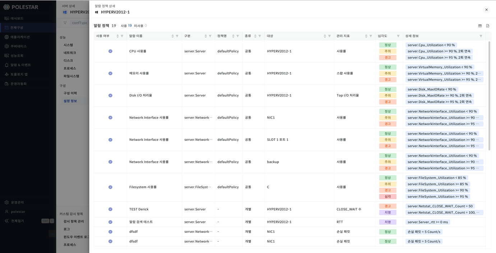

▶ \[그림 78\] 알람 정보 – 알람 상세

기본 정보

애플리케이션의 기본 정보를 표시합니다. ‘관리 상태’ 항목은 변경할 수 있습니다.

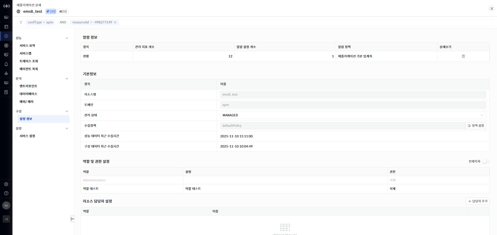

▶ \[그림 79\] 기본 정보

정책 설정

기본 정보 목록에서 \[정책 설정\] 버튼은 클릭하여 서버에 설정된 데이터 수집 정책의 세부 설정을 목록을 조회할 수 있고, 설정을 변경하거나 변경된 설정을 수집 정책의 기본값으로 초기화할 수 있습니다.

<table>
<tbody>
<tr class="odd">
<td>
노트

데이터 수집 정책 설정 방법은 ‘데이터수집설정’ 매뉴얼을 참고하시기 바랍니다.

애플리케이션의 경우 데이터 수집 주기가 60초로 설정되어 있으며 이를 변경해도 변경된 수집주기가 적용되지 않습니다. 60초 이외의 값으로 변경하지 않도록 합니다.
</td>
</tr>
</tbody>
</table>

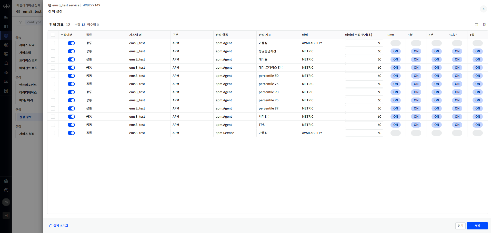

▶ \[그림 80\] 기본 정보 – 정책 설정

화면 지표

<table>
<thead>
<tr class="header">
<th>수집여부</th>
<th>
지표별 성능 데이터 수집 여부를 설정합니다.

기본적으로 POLESTAR에서 지원하는 모든 지표를 수집하도록 설정되어 있으며, 수집 여부 변경 시 해당 지표는 더 이상 POLESTAR에서 처리하지 않습니다.

 : 수집 지표

 : 미수집 지표
</th>
</tr>
</thead>
<tbody>
<tr class="odd">
<td>종류</td>
<td>
지표 설정 종류를 표시합니다. 기본값은 ‘공통’이며, 세부 설정을 변경한 경우 ‘개별’로 표시됩니다.

공통: 공통 설정. 관리지표 공통 설정의 지표 설정을 동일하게 사용하는 경우

개별: 개별 설정. 관리지표 공통 설정의 지표 설정을 변경해서 사용하는 경우
</td>
</tr>
<tr class="even">
<td>시스템 명</td>
<td>서버의 이름을 표시합니다.</td>
</tr>
<tr class="odd">
<td>구분</td>
<td>POLESTAR에서 관제하는 제품군을 표시합니다.</td>
</tr>
<tr class="even">
<td>관리 항목</td>
<td>지표 그룹을 표시합니다.</td>
</tr>
<tr class="odd">
<td>관리 지표</td>
<td>지표명을 표시합니다.</td>
</tr>
<tr class="even">
<td>타입</td>
<td>
지표의 데이터 타입을 표시합니다.

AVAILABILITY: 가용성 데이터

TRAIT: 문자열 데이터

METRIC: 수치 데이터

TABULAR: 목록형 데이터
</td>
</tr>
<tr class="odd">
<td>데이터 수집 주기</td>
<td>
지표별 데이터 수집 주기를 표시합니다.

모든 지표는 기본 60초 주기로 설정되어 있습니다.

애플리케이션의 경우 데이터 수집 주기가 60초로 설정되어 있으며 이를 변경해도 변경된 수집주기가 적용되지 않습니다. 60초 이외의 값으로 변경하지 않도록 합니다.
</td>
</tr>
</tbody>
</table>

역할 및 권한 설정

애플리케이션 서비스에 대한 접근 권한을 조회하고 변경할 수 있습니다. Administrators 역할은 모든 서비스에 기본으로 포함되어 있으며 해제할 수 없습니다.

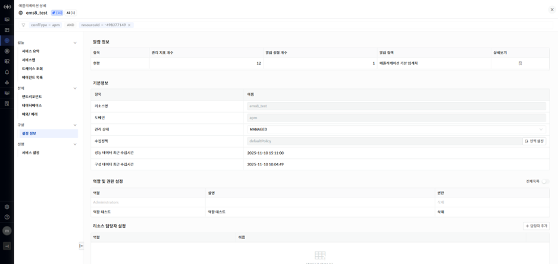

▶ \[그림81\] 역할 및 권한 설정

리소스 담당자 설정

애플리케이션 서비스의 담당자를 설정할 수 있습니다.

▶ \[그림82\] 리소스 담당자 설정

설정 \> 서비스 설정

설정의 서비스 설정은 서비스내의 데이터 설정 및 에이전트 수집 설정을 할 수 있습니다. 오픈텔레메트리의 경우 다양한 데이터를 제공해주지만 많은 데이터로 인해 수집서버의 저장공간의 확보가 어렵다면 필요한 데이터만 수집하도록 설정할 수 있습니다. 설정 변경 후 저장 버튼을 눌러주세요.

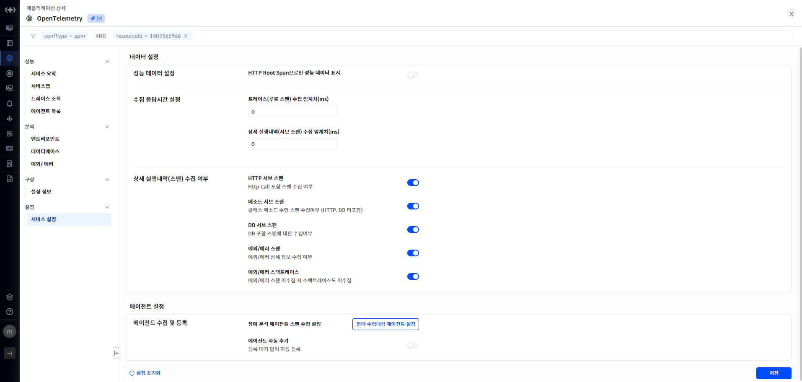

▶ \[그림 83\] 서비스 설정

데이터 설정 – 성능 데이터 설정

<table>
<tbody>
<tr class="odd">
<td>Http Root Span으로만 성능 데이터 표시</td>
<td>
Http Root Span으로만 성능 데이터를 표시할 것 인지를 설정합니다.

메소드 등 다른 타입의 루트 스팬은 성능 표시에서 제외됩니다.

초기값은 Off입니다.
</td>
</tr>
</tbody>
</table>

데이터 설정 – 수집 응답시간 설정

<table>
<thead>
<tr class="header">
<th>트레이스(루트 스팬) 수집 임계치(ms)</th>
<th>
여러 에이전트를 거쳐 실행되는 트레이스의 첫 시작점인 루트 스팬 기준 수집 임계치를 뜻하며 ms기준으로 설정합니다. 만약 해당 임계치 값이 1000일 경우 1초 이하의 트레이스는 응답분포도 또는 트레이스 조회화면에서 조회할 수 없습니다. 이는 APM의 수집 데이터 공간을 절약하기 위해 사용합니다.

초기 임계치는 1000ms로 제공됩니다.
</th>
</tr>
</thead>
<tbody>
<tr class="odd">
<td>상세 실행내역(서브 스팬) 수집 임계치(ms)</td>
<td>
트레이스(루트 스팬)의 응답시간이 해당 임계치 값보다 작을 경우 상세 실행내역을 수집하지 않도록 설정 할 수 있습니다. 이는 APM의 수집 데이터 공간을 절약하기 위해 사용합니다.

만약 해당 임계치를 3000으로 설정할 경우 트레이스의 응답시간이 3초이하인 트레이스에 대해서는 타임라인 또는 테이블 등의 상세 실행내역 데이터가 표시되지 않습니다.

초기 임계치는 3000ms로 제공됩니다.
</td>
</tr>
</tbody>
</table>

데이터 설정 – 상세 실행내역(스팬) 수집여부

오픈텔레메트리가 제공하는 다양한 양의 데이터를 모두 저장하기 위해서는 많은 데이터 저장소가 필요합니다. 필요에 따라 불필요한 데이터 수집을 제외시켜 APM 성능 및 저장소를 절약할 수 있습니다. 각 항목의 토글 버튼을 On/Off하여 데이터 수집을 줄이거나 확대할 수 있습니다.

<table>
<thead>
<tr class="header">
<th>HTTP 서브 스팬</th>
<th>HTTP 호출을 포함하고 있는 스팬</th>
</tr>
</thead>
<tbody>
<tr class="odd">
<td>메소드 서브 스팬</td>
<td>클래스 메소드 수행을 포함하고 있는 스팬</td>
</tr>
<tr class="even">
<td>DB 서브 스팬</td>
<td>오라클 등의 RDB부터 Redis등 메모리 DB등의 쿼리를 포함하고 있는 스팬</td>
</tr>
<tr class="odd">
<td>예외/에러 스팬</td>
<td>예외/에러에 대한 상세 정보 수집 여부</td>
</tr>
<tr class="even">
<td>예외/에러 스택트레이스</td>
<td>
예외/에러에는 스택 트레이스가 기본으로 수집됩니다.

스택트레이스는 데이터가 많아 데이터 저장소를 많이 사용할 수 있습니다.
</td>
</tr>
</tbody>
</table>

에이전트 설정 – 에이전트 수집 및 등록

<table>
<thead>
<tr class="header">
<th>장애분석 에이전트 스팬 수집 설정</th>
<th>
데이터 설정의 상세 실행내역(스팬) 수집 여부에서 다양한 타입의 스팬 수집 여부를 설정할 수 있지만 장애가 발생하여 위 설정과 별개로 장애 분석을 위해 모든 스팬을 수집할 수 있도록 하는 설정 입니다.

장애 수집 대상 에이전트 설정을 클릭하여 모든 타입의 스팬을 수집할 에이전트를 토글 버튼 On으로 설정하면 데이터 수집설정의 스팬 설정과 별개로 모든 데이터가 수집됩니다.

만약 상세 실행내역을 모두 수집하도록 되어 있다면 장애 수집대상 에이전트 설정을 할 필요가 없습니다.
</th>
</tr>
</thead>
<tbody>
<tr class="odd">
<td>에이전트 자동 추가</td>
<td>추가, 탐색에서 에이전트 등록 대기 없이 바로 서비스에 에이전트가 추가되도록 설정할 수 있습니다. 해당 기능이 On 되어 있을 경우 자동으로 서비스에 에이전트가 추가됩니다.</td>
</tr>
</tbody>
</table>

WPM애플리케이션 상세

APM 서비스 타입의 애플리케이션 상세를 확인하고자 한다면 아래의 링크를 클릭합니다.

[► APM 서비스의 애플리케이션 상세](#_Hlk169177776)

애플리케이션 상세 화면에서는 서비스에서 수행된 애플리케이션의 성능을 조회하고 서비스맵을 통해 에이전트간의 트레이스 처리 현황을 시각적으로 조회할 수 있습니다. 과거에 수행된 애플리케이션을 조회하고자 한다면 \[트레이스조회\]를 선택하고 조회 기간을 지정해 조회할 수 있어 과거에 수행된 응답시간이 느린 트레이스의 실행내역을 상세하게 확인하여 애플리케이션의 문제점을 추적할 수 있습니다. 또한 \[분석\]기능을 통해 에이전트로 부터 실시간 쓰레드 목록 등을 가져오거나 쓰레드 덤프 명령을 실행할 수 있습니다. 이벤트 분석 기능을 통해 WPM에서 발생한 이벤트를 기준으로 트레이스 실행 상황이나 성능 지표에 변화가 있는지 확인할 수 있습니다. 또한 서비스 분석 기능을 통해 조회기간내의 주요 지표나 엔트리포인트의 평균응답시간, 에러 건수등을 시각적으로 확인 할 수 있습니다.

<table>
<tbody>
<tr class="odd">
<td>
노트

애플리케이션 서비스 상세 화면에서는 조회하고자 하는 에이전트 목록을 설정할 수 있습니다. 화면 상단에 에이전트 목록이 표시되고 타임피커가 “LIVE”인 경우 조회하고자 하는 에이전트를 선택하여 선택 상태로 전환하면 됩니다.

[LIVE]가 아닌 경우 에이전트 목록에서 에이전트를 선택하거나 선택 해제한 후 조회 버튼을 클릭하여 선택한 에이전트들의 성능이 조회될 수 있도록 합니다.
</td>
</tr>
</tbody>
</table>

성능 \> 서비스 요약

성능의 WPM 서비스 타입의 서비스 요약화면에서는 애플리케이션의 수행 상태를 확인하기 위해 액티트 트레이스 현황, 처리건수, 평균 응답시간, 힙사용률과 같은 주요 지표를 제공하며 실행중인 액티브 트레이스 현황 등을 통해 현재 Java 애플리케이션에서 느리게 수행되고 있는 트레이스의 실시간 상태를 모니터링 할 수 있습니다.

> 조회 대상 에이전트 변경

1.  LIVE 모드인 경우 조회 대상에서 선택 또는 제외하고자 하는 에이전트를 클릭.

LIVE 모드가 아닌 경우 조회 대상에서 선택 또는 제외하고자 하는 에이전트를 클릭하고 조회 버튼 클릭

2.  에이전트 전체를 선택하거나 해제할 경우 전체 버튼 클릭

3.  에이전트 목록이 한 줄에 표현하지 못할 경우 에이전트 목록의 오른쪽 조회 버튼 앞의 ▼를 클릭하여 전체 에이전트 목록 표시

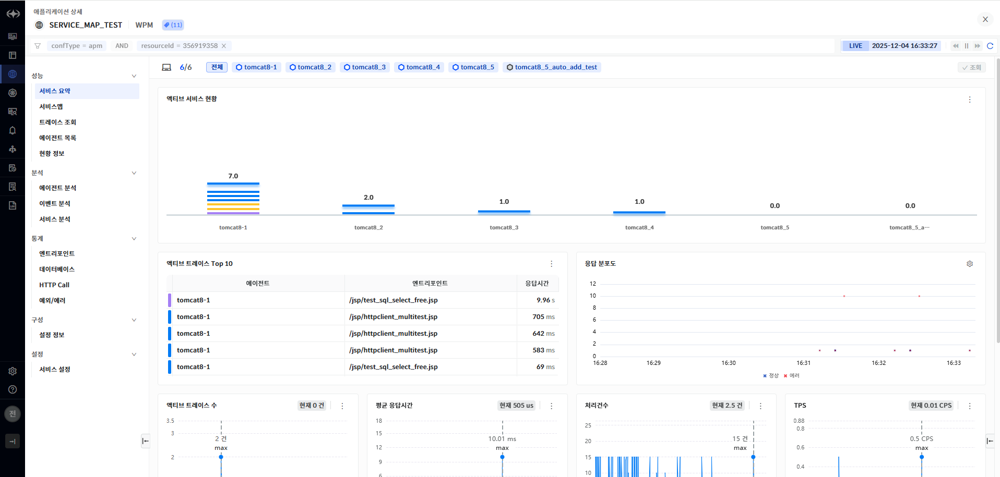

> ▶ \[그림 84\] 서비스 요약
> 
> 서비스 요약

<table>
<thead>
<tr class="header">
<th>액티트 서비스 현황</th>
<th><table>
<tbody>
<tr class="odd">
<td>
현재 에이전트에서 처리중인 요청의 경과시간을 레벨 별로 건수를 합산하여 시합니다.

기본 레벨 구간

액티브 레벨 1 : ~ 3초 미만

액티브 레벨 2 : 3초 이상 ~ 8초 미만

액티브 레벨 3 : 8초 이상

에이전트별 레벨 구간 경계값은 에이전트 옵션 설정을 통해 변경할 수 있습니다.

LIVE모드로만 동작합니다.
</td>
</tr>
</tbody>
</table></th>
</tr>
</thead>
<tbody>
<tr class="odd">
<td>액티브 서비스 Top 10</td>
<td>
현재 서비스내에서 수행중인 액티브 서비스 목록의 Top 10을 제공합니다.

액티브 서비스 Top 10테이블의 왼쪽 색상은 아래의 기준에 따라 표시됩니다

액티브 레벨 1(파랑) : ~ 3초 미만

액티브 레벨 2(노랑): 3초 이상 ~ 8초 미만

액티브 레벨 3(빨강): 8초 이상

TopN 데이터의 화면 리프레시 주기는 10초이며 리프레시 주기가 2초인 액티브 서비스 현황 이퀄라이저 차트와 개수가 다를 수 있습니다.

LIVE모드로만 동작합니다.
</td>
</tr>
<tr class="even">
<td>응답분포도</td>
<td>
정해진 시간 범위 내에 발생한 특정 엔트리포인트의 분포도

실시간으로 트레이스의 응답시간 데이터를 표현합니다.

LIVE모드로만 동작합니다.
</td>
</tr>
<tr class="odd">
<td>액티브 서비스 수</td>
<td>서비스에 등록된 에이전트의 전체 액티브 서비스 수</td>
</tr>
<tr class="even">
<td>평균 응답시간</td>
<td>서비스에 등록된 에이전트의 평균응답시간</td>
</tr>
<tr class="odd">
<td>처리 건수</td>
<td>서비스에 등록된 에이전트의 전체 처리건수</td>
</tr>
<tr class="even">
<td>TPS</td>
<td>서비스에 등록된 에이전트의 TPS의 평균값</td>
</tr>
<tr class="odd">
<td>최근 사용자수</td>
<td>
서비스에 등록된 에이전트의 최근 사용자수의 전체 수

에이전트의 최근 사용자수 지표는 최근 5분간 접속한 접속자수로 계산합니다.

만약 한 명의 사용자가 5분 이내에 동일 원격지에서 여러 번 접속해도 1명으로 계산됩니다.
</td>
</tr>
<tr class="even">
<td>시간별 방문자수</td>
<td>시간별 에이전트의 방문자수를 합산하여 처리합니다. 특정 시간대에 특정 에이전트로 동일한 사용자 정보로 지속적으로 접속한 사용자는 1로 계산되어 표시됩니다.</td>
</tr>
<tr class="odd">
<td>Heap 사용률 Top 10</td>
<td>서비스 내 에이전트 힙 사용률 Top 10 에이전트의 성능을 표시합니다.</td>
</tr>
<tr class="even">
<td>GC 시간 Top 10</td>
<td>서비스 내 에이전트 GC 시간 Top 10 에이전트의 성능을 표시합니다.</td>
</tr>
</tbody>
</table>

상세보기

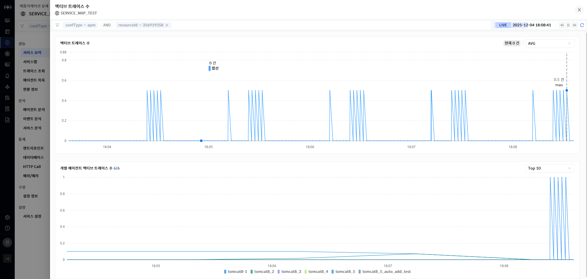

> ▶ \[그림85\] 라인 차트 상세보기

서비스 요약화면의 액티브 서비스 수, 평균응답시간, 처리건수, TPS, 최근 사용자수 지표의 경우 \[상세보기\]를 선택하면 에이전트별 처리현황을 상세하게 확인할 수 있습니다. 지표 상세보기 현황화면에서는 위의 그림에서 처럼 두 개의 차트가 표시됩니다. 위 차트의 경우 서비스내의 모든 에이전트의 성능을 종합하여 보여주는 차트이며 아래 차트는 개별 에이전트별 성능을 개별 라인으로 보여주는 차트입니다. 첫 번째 차트의 경우 오른쪽 상단의 에이전트 성능을 종합할 때 사용하는 함수를 AVG, SUM, MAX로 변경하여 성능을 확인할 수 있습니다. 개별 에이전트 차트의 경우 현재 시점을 기준으로 Top 5, Top 10, Top 20으로 에이전트별 지표 성능을 확인 할 수 있습니다. 차트 아래의 범례를 선택하여 특정 에이전트를 제외하거나 선택하여 확인할 수 있는 기능도 제공합니다.

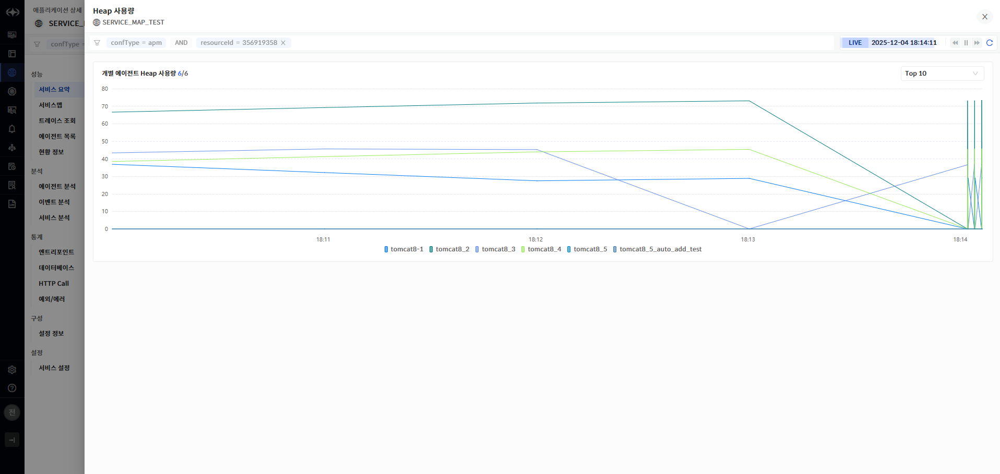

> ▶ \[그림86\] Top 10 차트 상세 보기

서비스 요약화면의 힙 사용률 Top10, GC시간Top10지표의 경우 \[상세보기\]를 선택하면 에이전트별 처리현황을 상세하게 확인할 수 있습니다. 차트 아래의 범례를 선택하여 특정 에이전트를 제외하거나 선택하여 확인할 수 있는 기능도 제공합니다.

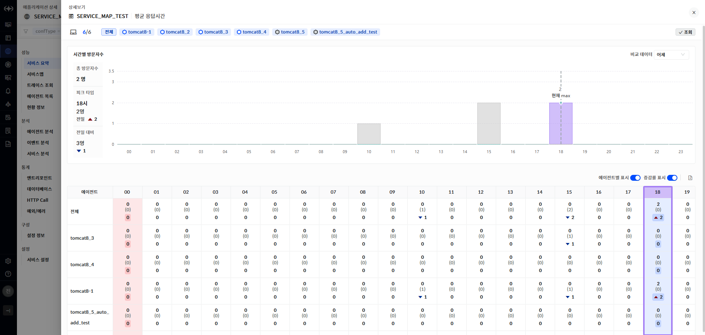

> ▶ \[그림87\] 시간별 방문자 수 상세 보기

시간별 방문자 수 상세보기는 해당 서비스에 등록되어 있는 에이전트에 접속한 사용자수를 시간별로 집계하여 표현합니다. 시간별 방문자수 조회만 원하는 에이전트만 선택하여 표시할 수 있습니다. 시간별 방문자수는 비교데이터와 함께 확인할 수 있으며 비교 데이터는 사용자 정보에 대한 보관 주기에 따라 어제 또는 전주를 선택할 수 있습니다.

각 열에는 각 에이전트의 시간대별 방문자수가 표시되며 방문자수 아래의 ()안은 비교 데이터 수치가 표시됩니다.

<table>
<thead>
<tr class="header">
<th>비교 데이터</th>
<th>
시간별 방문자수에서 비교할 수 있는 데이터.

“어제”와 “전주”를 선택할 수 있으며 “전주”는 일주일 전 동일 요일을 의미합니다.
</th>
</tr>
</thead>
<tbody>
<tr class="odd">
<td><strong>총 방문자 수</strong></td>
<td><strong>오늘 해당 서비스의 총 방문자수</strong></td>
</tr>
<tr class="even">
<td>피크 타임</td>
<td>오늘 방문자수 피크 타임 구간 정보</td>
</tr>
<tr class="odd">
<td>전일 대비</td>
<td>전일 대비 방문자수 증가수와 증가율(%)</td>
</tr>
<tr class="even">
<td>에이전트별 표시</td>
<td>에이전트별 표시를 끄면 전체 시간별 방문자수 행만 표시됩니다.</td>
</tr>
<tr class="odd">
<td>증감률</td>
<td>증감률 표시를 끄면 각 열의 증감률 표시가 제외됩니다.</td>
</tr>
</tbody>
</table>

<table>
<tbody>
<tr class="odd">
<td>
노트

시간별 방문자수는WPM에서 전달된 사용자 세션 정보 등을 집계하여 시간당 방문자수를 표현합니다. 시간당 방문자수는 동일 사용자 정보를 가진 사용자가 한 시간 내에 여러 번 접속하였다 해도 한번의 접속으로 간주합니다. 또한 에이전트에서 사용자 정보를 보내지 않을 경우 시간별 방문자수는 집계되지 않습니다. WPMAgent 7.x버전의 경우 해당 옵션이 false로 지정되어 있어 옵션을 추가하지 않으면 시간별 방문자수를 집계할 정보가 수집되지 않습니다. 시간별 방문자수가 표현되지 않는다면 에이전트의 enable_user_visit_count가 true로 설정되어 있는지 확인하세요.
</td>
</tr>
</tbody>
</table>

응답시간 분포도

애플리케이션 서비스내에서 수행한 트레이스를 응답시간 분포도를 통해 조회할 수 있습니다. 응답시간 분포도는 스캐터 차트를 사용하여 X축은 시간, Y축은 응답시간을 표시합니다. 응답분포도내의 포인트로 표시되는 데이터는 하나의 트레이스를 나타내며 이때 좌표의 X축값은 해당 트레이스의 종료시간을 의미합니다. 응답시간 분포도의 경우 많은 데이터를 표현하기 때문에 조회시간을 변경하여 조회 시 라이브 이외의 조회구간에서는 응답분포도 설정 기능에 따라 최근 5분, 10분 구간만 표시합니다. 5분에서 10분 이상의 데이터를 조회하고자 할 경우에는 서비스 성능\>트레이스조회 기능을 사용하도록 합니다.

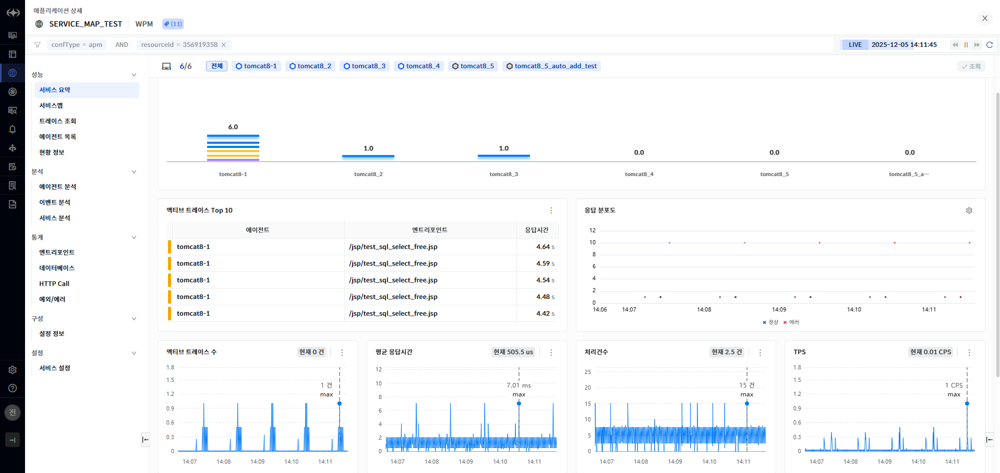

> ▶ \[그림88\] 응답분포도

응답분포도를 이용하여 트레이스의 상세 실행내역을 조회하고자 한다면 응답분포도에서 조회 하고자 하는 영역의 포인트를 포함하도록 하여 드래그를 합니다. 드래그한 영역을 포함한 트레이스 현황 화면이 표시됩니다. 응답분포도 내의 노란색 박스가 사용자가 드래그한 영역이며 트레이스 목록에 해당 영역의 트레이스가 표시됩니다. 다른 영역을 조회하고자 한다면 응답분포도의 영역을 드래그 하면 트레이스가 재조회되어 화면에 표시됩니다

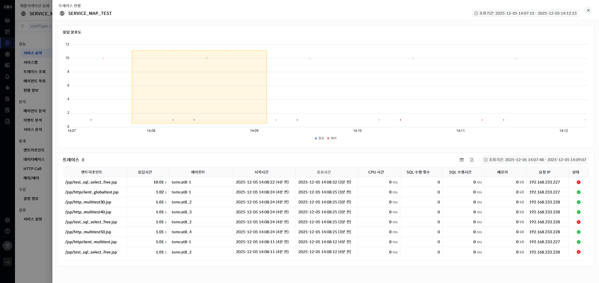

> ▶ \[그림89\] 트레이스 현황

<table>
<tbody>
<tr class="odd">
<td>
노트

트레이스 목록이 표시되는 화면에서 응답분포도와 엑셀다운로드 및 트레이스 목록 건수에 미세한 차이가 발생할 수 있습니다. 특히 엑셀다운의 경우 누르는 시점에 수집서버로 부터 조회되기 때문에 목록 그리드가 조회한 시작시간과 끝시간 사이에 추가로 종료된 트레이스가 존재할 수 있습니다. 특히나 많은 요청이 수행되는 애플리케이션이라면 빈번하게 발생할 수 있습니다.
</td>
</tr>
</tbody>
</table>

> 트레이스

<table>
<thead>
<tr class="header">
<th>엔트리포인트</th>
<th>실행한 트레이스의 엔트리포인트(URI, 메소드, 오퍼레이션)</th>
</tr>
</thead>
<tbody>
<tr class="odd">
<td>에이전트</td>
<td>트레이스가 실행된 에이전트. 여러 애플리케이션을 통해 수행해는 글로벌 트레이스의 경우 엔트리포인트가 실행된 에이전트를 의미</td>
</tr>
<tr class="even">
<td>응답시간</td>
<td>
트레이스가 수행되는 데 걸린 시간

계산 방식 : 트레이스의 종료시간 – 트레이스 시작 시간
</td>
</tr>
<tr class="odd">
<td>시작시간</td>
<td>트레이스의 시작시간</td>
</tr>
<tr class="even">
<td>종료시간</td>
<td>트레이스의 종료시간</td>
</tr>
<tr class="odd">
<td>CPU 시간</td>
<td>트레이스를 실행하는데 소요된 CPU 시간</td>
</tr>
<tr class="even">
<td>SQL 수행 횟수</td>
<td>트레이스 실행 시 수행된 SQL 횟수</td>
</tr>
<tr class="odd">
<td>SQL 수행 시간</td>
<td>트레이스 실행 시 수행된 SQL을 실행하는데 소요된 시간</td>
</tr>
<tr class="even">
<td>메모리</td>
<td>
트레이스를 수행하는데 사용한 메모리량

단위 : kB
</td>
</tr>
<tr class="odd">
<td>요청 IP</td>
<td>
해당 엔트리포인트를 요청한 사용자의 IP

방화벽 또는 Proxy를 사용할 경우 IP가 특정 IP로만 나올 수 있습니다.
</td>
</tr>
<tr class="even">
<td>상태</td>
<td>
트레이스의 상태를 표시한다. 상세 실행내역 중 에러 구간이 존재할 경우 에러 상태로 표시한다.

<table>
<thead>
<tr class="header">
<th>: 트레이스 정상 종료</th>
</tr>
</thead>
<tbody>
<tr class="odd">
<td>: 트레이스 에러 발생</td>
</tr>
</tbody>
</table></td>
</tr>
</tbody>
</table>

<table>
<tbody>
<tr class="odd">
<td>
노트

엔트리포인트는 시스템에 대한 외부 접근 지점을 의미하며, 요청이 처음으로 들어오는 지점입니다. 이는 프로그램 실행이 시작되는 지점이나, API 호출을 통해 시스템에 진입하는 지점을 포함합니다. 반면에 트레이스는 요청이 시스템 내부에서 처리되는 전체 경로와 과정을 추적하고 기록합니다. 엔트리포인트는 요청의 시작 지점, 트레이스는 요청의 전체 흐름을 이해하는 데 사용됩니다.
</td>
</tr>
</tbody>
</table>

트레이스 실행 내역을 확인하고자 한다면 트레이스 목록에서 하나의 트레이스를 선택합니다. 엔트리포인트 이름을 선택하면 목록 아래쪽에 해당 트레이스의 실행 내역이 표시됩니다. 실행내역은 타임라인 및 서비스맵을 통해 트레이스를 수행하기 위해 연동된 에이전트와 에이전트들 간의 연동 성능을 확인할 수 있습니다.

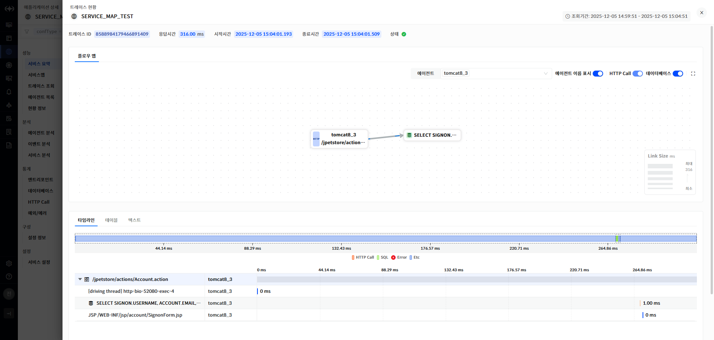

> ▶ \[그림90\] 응답분포도 - 트레이스 현황 – 타임라인

타임라인에서 SQL이 실행된 데이터베이스 스팬을 클릭하면 해당 SQL 문장의 상세 정보에 SQL 문장과 수집된 파라미터가 표시되며 파라미터 결합 토글 버튼을 클릭하면 결합된 형태의 SQL문이 표시됩니다.

타임라인으로 보여지는 상세실행내역을 큰 화면에서 확인하고 싶다면 더보기를 클릭하여 전체화면으로 전환하여 확인할 수 있습니다. 타임라인으로 표시된 상세 실행 내역을 통해 분석할 경우 위 그림에서 확인할 수 있듯이 타임라인에 색상으로 표현된 바(Bar)를 이용하여 응답시간이 느린 구간을 찾아낼 수 있습니다.

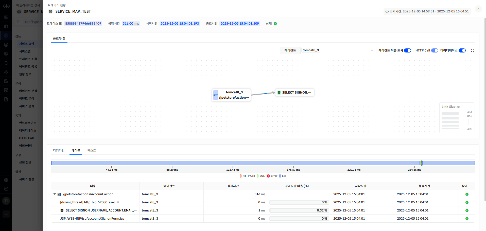

> ▶ \[그림91\] 응답분포도 – 트레이스 현황 – 테이블
> 
> 트레이스 - 테이블

<table>
<thead>
<tr class="header">
<th>내용</th>
<th>
트레이스 상세 실행내역의 구간. 스팬(Span)으로 부르기도 함

URI, 함수, 쿼리 등 실행내역 구간을 표시하는 정보.
</th>
</tr>
</thead>
<tbody>
<tr class="odd">
<td>에이전트</td>
<td>해당 실행내역 구간이 실행된 에이전트.</td>
</tr>
<tr class="even">
<td>경과시간</td>
<td>해당 구간을 실행하기 위해 소요된 시간</td>
</tr>
<tr class="odd">
<td>경과시간 비율</td>
<td>
트레이스 응답시간 중 해당 구간이 소요된 시간의 비율

계산방식 : 해당구간의 응답시간/트레이스의 응답시간 * 100
</td>
</tr>
<tr class="even">
<td>시작시간</td>
<td>스팬의 시작시간</td>
</tr>
<tr class="odd">
<td>종료시간</td>
<td>스팬의 종료시간</td>
</tr>
<tr class="even">
<td>상태</td>
<td>
스팬의 상태를 표시한다.

<table>
<thead>
<tr class="header">
<th>: 스팬 정상 종료</th>
</tr>
</thead>
<tbody>
<tr class="odd">
<td>: 스팬 에러 발생</td>
</tr>
</tbody>
</table></td>
</tr>
</tbody>
</table>

텍스트는 트레이스 처리 내용을 텍스트 형태로 표현합니다. 특정 쿼리를 복사해서 테스트를 할 때 유용하게 사용할 수 있습니다.

복사 아이콘을 사용하여 전체 텍스트를 복사할 수 있습니다.

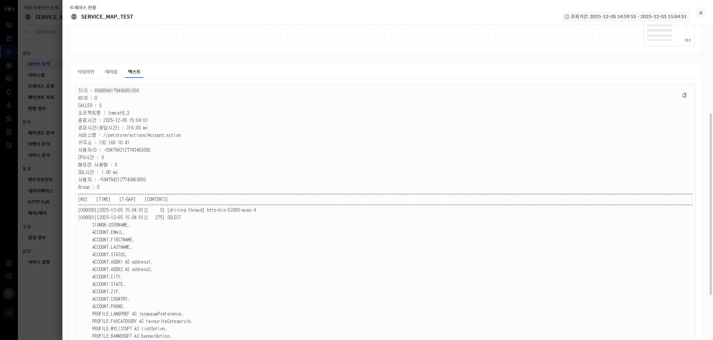

> ▶ \[그림 92\] 응답분포도 – 트레이스 현황 – 텍스트

플로우맵은 트레이스 수행한 스팬들 중 Http 호출과 데이터베이스 호출을 흐름대로 시각화하여 표현합니다. 플로우맵의 경우 각 호출에 대한 성능 값을 엔트리포인트와 함께 표현하여 어떤 호출이 응답에 영향을 주었는 지 빠르게 인지할 수 있습니다.

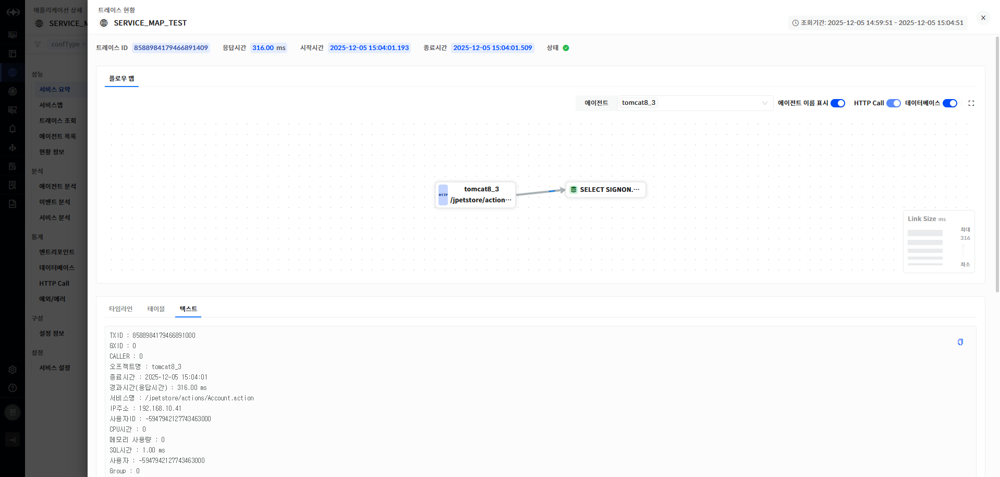

> ▶ \[그림93\] 응답분포도 – 트레이스 현황 – 플로우맵

응답시간 분포도 설정

응답분포도를 편리하게 사용하기 위해 설정 기능을 제공합니다. 응답분포도 오른쪽 상단의 \[설정\]아이콘을 선택하면 설정 기능을 사용할 수 있습니다. 설정 기능은 아래의 표를 참고하여 사용합니다.

> 응답분포도 설정 기능

<table>
<thead>
<tr class="header">
<th>응답분포도 표시 기간</th>
<th>
응답분포도의 X좌표인 표시기간을 설정

5분 또는 10분으로 설정
</th>
</tr>
</thead>
<tbody>
<tr class="odd">
<td>
엔트리포인트

(URI, 메소드, 오퍼레이션 명)
</td>
<td>특정 문자열을 포함한 엔트리포인트 명을 가진 트레이스를 조회하고자 할 경우 해당 문자열을 입력</td>
</tr>
<tr class="even">
<td>Y축 최대값</td>
<td>
응답분포도에 표시하고자 하는 Y축 최대값

WPM타입의 서비스의 응답분포도 데이터 표현 기본 단위는 miliseconds(ms)입니다. microseconds(us), seconds(s)로 선택하여 설정 가능합니다.
</td>
</tr>
<tr class="odd">
<td>Y축 최소값</td>
<td>
응답분포도에 표시하고자 하는 Y축 최소값

WPM타입의 서비스의 응답분포도 데이터 표현 기본 단위는 miliseconds(ms)입니다. microseconds(us), seconds(s)로 선택하여 설정 가능합니다.
</td>
</tr>
<tr class="even">
<td>Y축 간격</td>
<td>
응답분포도의 Y축에 안내선 간격

WPM타입의 서비스의 응답분포도 데이터 표현 기본 단위는 miliseconds(ms)입니다. microseconds(us), seconds(s)로 선택하여 설정 가능합니다.

Y축 간격을 너무 작은 단위의 작은 값으로 설정할 경우 응답분포도에 정상적으로 표시되지 않을 수 있으니 현재 최대값을 확인 후 적정값으로 설정 필요
</td>
</tr>
<tr class="odd">
<td>최대값 초과 트레이스 표시</td>
<td>응답분포도의 Y축 최대값을 설정한 경우 그 설정값 이상의 응답시간을 가진 트레이스가 있을 때 응답분포도 Y축 최상위에 표현</td>
</tr>
<tr class="even">
<td>에러가 포함된 트레이스만 표시</td>
<td>트레이스 중 에러가 발생한 트레이스만 표시</td>
</tr>
<tr class="odd">
<td>트레이스 전체 건수 표시</td>
<td>트레이스 전체 건수 표시</td>
</tr>
<tr class="even">
<td>툴팁표시</td>
<td>응답분포도의 데이터(포인트)를 mouse over 시 해당 트레이스에 대한 툴팁 표시 여부</td>
</tr>
</tbody>
</table>

응답분포도에서 특정 영역의 응답시간의 트레이스을 보고자 할 경우 위 표에서 설명한 Y축 최대값과 Y축 최소값을 설정하여 확인할 수 있습니다. 아래 그림은 Y축 최대값과 Y축 최소값을 설정 한 후의 응답분포도를 보여줍니다.

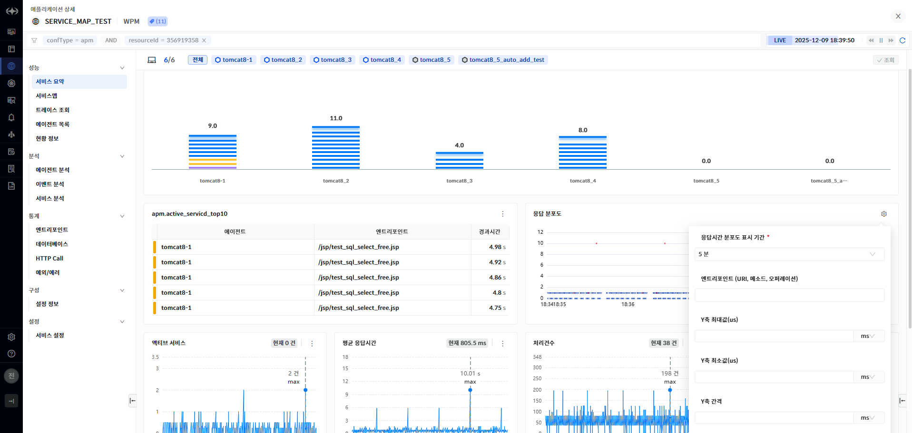

▶ \[그림 94\] 응답분포도 – 응답분포도 설정

Y축 최대값을 설정 후 최대값을 초과한 트레이스를 응답분포도내에 표시하고자 한다면 최대값 초과 트레이스 표시 항목을 체크합니다. 최대값 초과 트레이스 표시 후 응답분포도는 아래의 그림과 같이 응답분포도 최상단에 초과한 트레이스들이 겹쳐져 표시됩니다.

▶ \[그림 95\] 응답분포도 – 최대값 초과 트레이스 표시 응답분포도 설정(옵션 설정 결함으로 재캡쳐 필요)

성능 \> 서비스맵

서비스맵은 서비스내의 애플리케이션 간의 성능 현황을 시각화하여 표현한 맵입니다. 서비스맵을 통해 애플리케이션 간의 트레이스 처리 현황, 평균응답시간, 에러율을 확인할 수 있으며 알람을 발생했을 경우 발생한 알람을 빠르게 확인할 수 있습니다. 서비스맵의 상단에는 서비스 맵에 다양한 정보를 표현할 수 있는 기능아이콘이 표시됩니다. 서비스맵에서 에이전트는 둥근 노드로 표현되며 외부 리소스의 경우 노드 내 해당 리소스의 아이콘(예:데이테베이스)로 표현됩니다. 본 문서의 서비스맵에서는 에어전트 혹은 외부 리소스 모두 “노드”라는 용어로 통일하여 사용하겠습니다. 외부 리소스는 apm 에이전트가 설치되지 않는 애플리케이션 또는 에이전트가 설치된 애플리케이션과 통신하고 있는 데이터베이스 등을 의미합니다. 노드 간의 선은 두 노드 간의 호출 상태를 알려줍니다. 선의 끝이 둥근 부분이 호출하는 노드, 선의 끝이 화살표인 노드는 호출 대상 노드를 표시합니다.

<table>
<tbody>
<tr class="odd">
<td>
노트

WPM의 서비스맵은 실시간 데이터를 수신받아 표현합니다. 서비스맵이 표현되지 않는다면 에이전트의 옵션을 확인해야합니다. 에이전트는 서비스맵에 표현할 데이터를 전송할 수 있도록 옵션이 설정되어 있어야합니다. counter_interaction_enabled 옵션이 true로 설정되어 있으면 서비스맵 데이터가 수집서버로 전송되어 서비스맵이 표현됩니다.
</td>
</tr>
</tbody>
</table>

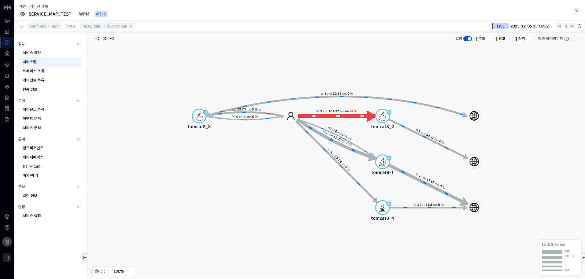

▶ \[그림 96\] 서비스맵

서비스맵 알람표시

서비스맵의 기능 아이콘 중 알람 표시 아이콘을 선택하여 알람 표시 상태를 On/Off 할 수 있습니다. 알람 레벨에 대해서는 오른쪽 하단의 범례를 참고합니다. 아래 이미지에서는 모든 노드에 알람이 발생하지 않은 해제 상태입니다. 또한 알람 발생 표시가 되어 있을 경우 원 바깥쪽에 발생 알람 수가 표시됩니다.

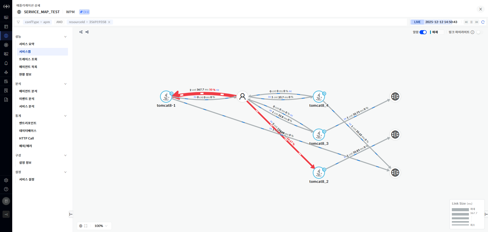

▶ \[그림 97\] 서비스맵 알람 표시 기능

서비스 맵에서 알람 표시 후 해당 서비스의 알람 목록을 확인하고자 한다면 오른쪽 하단의 알람 표시 창 열기 아이콘을 클릭하면 알람 표시 영역이 표시되며 현재 알람 현황을 확인할 수 있습니다.

서비스맵 성능 표시

서비스 맵의 성능 표시 기능을 사용하면 노드 간 성능이 표시됩니다. 표시되는 성능은 처리건수, 평균응답시간, 에러율 순으로 표시되며 에러율이 0%보다 높을 경우 라인이 붉은 색으로 표시됩니다.

서비스맵의 노드 크기 설정 기능을 사용하면 노드의 성능에 따라 크기가 변경됩니다. 노드와 링크 사이즈는 자동으로 생성되며 서비스맵의 오른쪽 아래 범례를 참고하세요

서비스맵 리소스 하이라이트

서비스맵은 외부 노드와 내부 리소스를 하이라이트 하여 확인 할 수 있습니다. 내부 리소스는 WPM 에이전트가 설치되어 있는 리소스를 의미합니다. 외부리소스는 WPM에이전트가 설치된 리소스와 연결은 되어있지만 에이전트가 설치되어않거나 데이터베이스, HttpCall에 의해 호출 대상이 되는 리소스를 의미합니다.

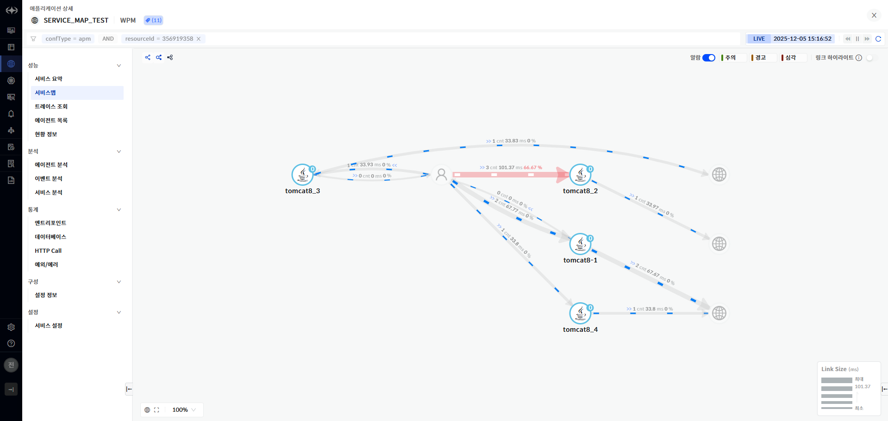

▶ \[그림 98\] 서비스 맵 – 내부 리소스 하이라이트

\[외부 리소스 하이라이트\]를 선택하면 외부리소스는 내부 리소스에 비해 밝게 표시되며 내부 리소스는 흐리게 표시합니다. 서비스에 등록된 에이전트가 많은 경우 내,외부 리소스를 구분할 수 있어 유용하게 사용할 수 있습니다.

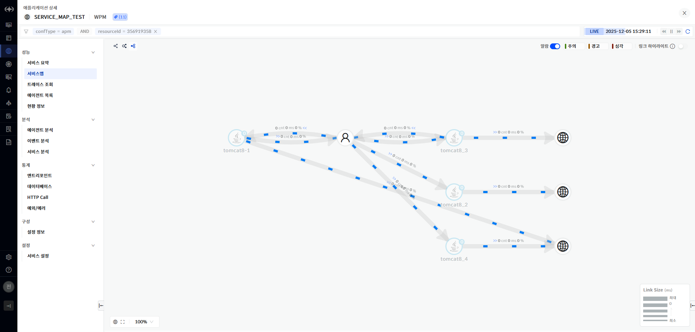

▶ \[그림 99\] 서비스 맵 – 외부 리소스 하이라이트

서비스맵 노드 빠른 메뉴 – 인-아웃 맵

노드의 \[인-아웃맵\]은 해당 노드로 요청을 하거나 해당 노드에서 다른 노드로 요청한 관계를 확인할 수 있습니다. 복잡한 MSA 구조에서 특정 애플리케이션으로의 요청과 다른 노드로의 요청을 빠르게 확인할 수 있습니다. 선택한 노드 왼쪽에 표시되는 노드가 선택 노드로 요청을 보내는 노드들이며 선택 노드의 오른쪽에 표시되는 노드가 선택노드로 부터 요청을 받는 노드입니다. \[서비스맵으로 돌아가기\]를 선택하면 서비스맵 화면으로 전환됩니다,

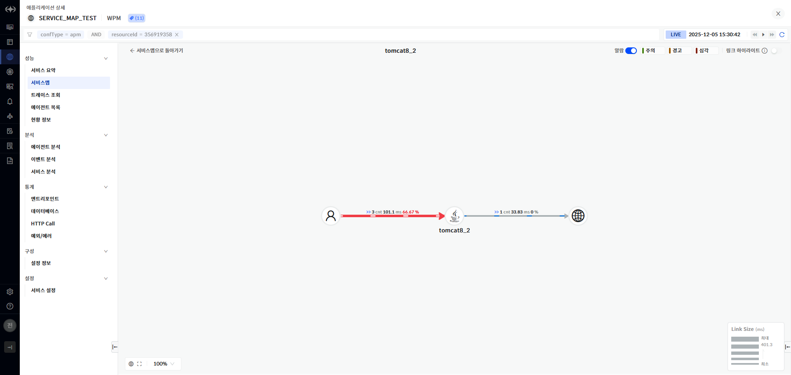

▶ \[그림 100\] 서비스 맵 – 노드 빠른 메뉴 – 인-아웃맵

성능 \> 트레이스 조회

과거에 수행한 트레이스를 조회하고자 한다면 트레이스 조회 메뉴를 사용하여 과거 수행한 트레이스에 대해 조회할 수 있습니다. \[트레이스 조회\]를 선택하면 기본적으로 최근 15분내에 수행된 트레이스 목록이 표시됩니다. 타임피커를 이용해 조회기간을 변경하여 조회할 수 있습니다. 트레이스 조회에서는 서비스 요약 화면의 응답분포도와 동일한 스캐터 차트가 표시됩니다. 응답분포도에 표시되는 특정영역의 데이터를 조회하고자 한다면 그 영역을 포함하여 드래그를 합니다. 아래 그림에서와 같이 드래그한 영역이 노란 영역으로 표시되며 해당 영역의 트레이스들이 아래 트레이스 목록에 표시됩니다.

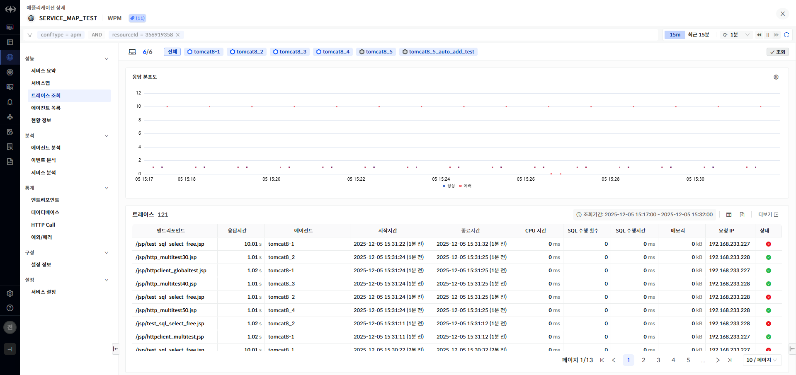

▶ \[그림 101\] 트레이스 조회

트레이스 조회 시 표시되는 트레이스 상세 화면의 기능에 대해서는 본 문서의 트레이스 상세 정보 내용을 참고합니다. 응답분포도를 통해 특정 시간대의 데이터를 조회하기 위해서는 타임피커를 사용하여 원하는 시간을 설정한 후 조회한다. 응답분포도의 특정 시간대의 데이터를 조회하고자 한다면 타임피커의 “custom 사용자 정의 시간 범위”를 사용한다. 응답분포도의 사용자 정의 시간 범위 기간은 1시간 이내로 제한되어 있다.

<table>
<tbody>
<tr class="odd">
<td>
노트

조회 기간이 길 경우 트레이스 조회가 오래 걸리거나 조회된 트레이스가 많아 브라우저의 메모리 문제가 발생할 수 있습니다. 많은 트랜잭션이 수행되는 서비스라면 짧은 기간을 조회하거나 조회 기간 선택 시 사용자 정의 시간 범위를 통해 짧은 기간을 선택해서 조회하는 것을 권장합니다.
</td>
</tr>
</tbody>
</table>

응답시간 분포도 설정

응답분포도를 편리하게 사용하기 위해 설정 기능을 제공합니다. 응답분포도 오른쪽 상단의 \[설정\]아이콘을 선택하면 설정 기능을 사용할 수 있습니다. 설정 기능은 아래의 표를 참고하여 사용합니다. 트레이스 조회의 응답분포도 설정 기능은 서비스 요약의 응답분포도 상세 기능과 유사합니다.

▶ \[그림 102\] 트레이스 조회 – 응답분포도 설정(옵션 설정 결함으로 재캡쳐 필요)

> 응답분포도 설정 기능

| Y축 최대값         | 응답분포도에 표시되는 Y축의 최대값                                                  |
| -------------- | -------------------------------------------------------------------- |
| Y축 최소값         | 응답분포도에 표시되는 Y축의 최소값                                                  |
| Y축 간격          | 응답분포도의 Y축에 안내선 간격                                                    |
| 최대값 초과 트레이스 표시 | 응답분포도의 Y축 최대값을 설정한 경우 그 설정값 이상의 응답시간을 가진 트레이스가 있을 때 응답분포도 Y축 최상위에 표현 |
| 트레이스 전체 건수 표시  | 트레이스 전체 건수 표시                                                        |
| 툴팁표시           | 응답분포도의 데이터(포인트)를 mouse over 시 해당 트레이스에 대한 툴팁 표시 여부                   |

트레이스 목록에서 하나의 트레이스를 선택할 경우 트레이스 상세화면이 화면에 표시됩니다. 트레이스 상세화면에 대해서는 본 문서의 WPM 응답분포도를 참고합니다.

[► 응답분포도](#응답분포도)

성능 \> 에이전트 목록

서비스내에 설치되어 있는 에이전트 목록을 표시합니다.

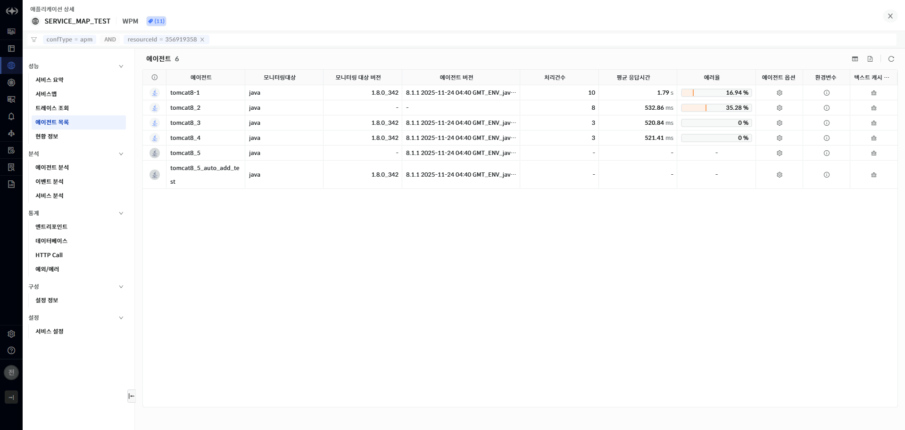

▶ \[그림 103\] 에이전트 목록

> 에이전트

<table>
<thead>
<tr class="header">
<th>가용성 및 관리상태</th>
<th>
에이전트의 가용성과 관리상태를 아이콘으로 표시

WPM은 java 아이콘으로 표시됩니다.
</th>
</tr>
</thead>
<tbody>
<tr class="odd">
<td>모니터링대상</td>
<td>
모니터링 대상 언어

예 : java
</td>
</tr>
<tr class="even">
<td>모니터링 대상 버전</td>
<td>Java JVM 버전을 표시합니다.</td>
</tr>
<tr class="odd">
<td>에이전트 버전</td>
<td>WPMAgent의 에이전트 버전을 표시합니다.</td>
</tr>
<tr class="even">
<td>처리건수</td>
<td>최근 15분 간의 처리건수를 표시</td>
</tr>
<tr class="odd">
<td>평균응답시간</td>
<td>최근 15 분 간의 트레이스의 평균응답시간을 표시</td>
</tr>
<tr class="even">
<td>에러율</td>
<td>최근 15분 간의 에러율을 표시</td>
</tr>
</tbody>
</table>

에이전트 옵션

에이전트 옵션을 표시합니다. 화면에 표시되는 에이전트 옵션은 에이전트로부터 실시간으로 수신받아 표시합니다. 에이전트 옵션이 정상적으로 표시되지 않는다면 에이전트 가용성 또는 에이전트와의 통신 시 사용하는 TCP( 기본값:31005 ) 통신이 정상적인지 확인하세요.

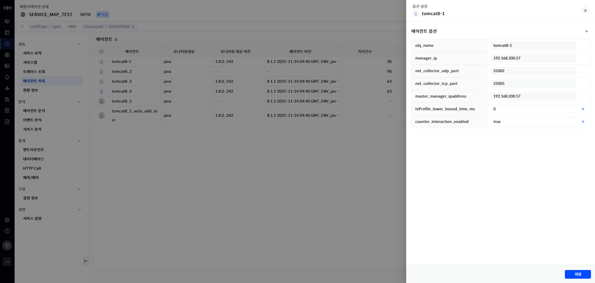

▶ \[그림 104\] 에이전트 옵션

> 에이전트 옵션 추가

1.  에이전트 옵션 화면의 오른쪽 상단의 + 를 클릭합니다.

2.  에이전트 옵션 이름과 값을 넣고 확인 버튼을 클릭합니다.

> 에이전트 옵션 삭제

1.  X표시가 되어 있는 항목만 삭제가 가능하며 에이전트 옵션 항목 오른쪽의 X 를 클릭하면 삭제됩니다.

> 에이전트 옵션 수정

1.  입력박스가 활성화되어 있는 옵션만 수정이 가능하며 입력박스에 값을 수정 한 후 화면 아래의 저장버튼을 클릭합니다.

환경변수

에이전트 기본 정보와 애플리케이션의 환경 변수를 확인할 수 있습니다

> 환경변수

<table>
<thead>
<tr class="header">
<th>에이전트</th>
<th>에이전트 이름을 표시합니다.</th>
</tr>
</thead>
<tbody>
<tr class="odd">
<td>Java VM 이름</td>
<td>
Java Vm 이름을 표시합니다.

예 : OpenJDK 64-Bit Server VM
</td>
</tr>
<tr class="even">
<td>Java 버전</td>
<td>
Java 버전을 표시합니다.

예 : 1.8.0_322
</td>
</tr>
<tr class="odd">
<td>Java 벤더</td>
<td>
Java벤더 이름을 표시합니다.

예 : Azul Systems, Inc.
</td>
</tr>
<tr class="even">
<td>Java Home</td>
<td>
Java Home을 표시합니다.

예 : /Users/gaijaeon/Library/Java/JavaVirtualMachines/azul-1.8.0_322/Contents/Home/jre
</td>
</tr>
<tr class="odd">
<td>WAS 종류</td>
<td>
WPMAgent가 인지하는 WAS 종류를 표시합니다.

WAS 구성 정보 지원이 되지 않는 자바 애플리케이션의 경우 표시되지 않을 수 있습니다.

예 : tomcat

현재 WAS 구성 정보 수집 되는 WAS 종류는 tomcat, jboss, jeus,weblogic, websphere이며 WAS 버전에 따라 WAS 종류가 수집되지 않을 수 있습니다. 특히 최신 버전의 경우 WAS 종류를 인지하지 못할 수도 있습니다.
</td>
</tr>
<tr class="even">
<td>WAS 버전</td>
<td>
WPMAgent가 인지하는 WAS 버전을 표시합니다.

WAS 구성 정보 지원이 되지 않는 자바 애플리케이션의 경우 표시되지 않을 수 있습니다.

예 : 7.0.67.0

현재 WAS 구성 정보 수집 되는 WAS 버전은 tomcat, jboss, jeus,weblogic, websphere이며 특히 최신 버전의 경우 WAS 버전을 인지하지 못할 수도 있습니다.
</td>
</tr>
<tr class="odd">
<td>에이전트 버전</td>
<td>WPM 에이전트 버전을 표시합니다.</td>
</tr>
<tr class="even">
<td>에이전트 경로</td>
<td>WPM 에이전트 설치 경로를 표시합니다.</td>
</tr>
<tr class="odd">
<td>컨테이너 WAS 여부</td>
<td>컨테이너로 기동된 WAS일 경우 true로 표시합니다</td>
</tr>
<tr class="even">
<td>컨테이너 타입</td>
<td>
AWS에서 컨테이너 형태로 기동되었을 경우 AWS 타입으로 표시합니다.

다른 환경의 경우 컨테이너 타입이 표시되지 않습니다.
</td>
</tr>
<tr class="odd">
<td>환경변수</td>
<td>애플리케이션이 수행되고 있는 Java의 환경 변수 내용을 표시합니다.</td>
</tr>
</tbody>
</table>

텍스트 캐시 삭제

WPM에이전트는 수집하는 모든 정보에 대한 텍스트를 UDP로 전송합니다. UDP로 전송 후에는 텍스트는 더 이상 보관하지 않고 전송된 텍스트의 해시코드만 보관합니다. 이런 기능으로 인해 수집서버가 다운되어 있는 상태에서 WPM 에이전트가 텍스트를 수집서버로 전송하면 해당 텍스트는 저장되지 못하고 버려지게 됩니다. 이러한 경우 화면에서 표시되어야 텍스트를 수신 받지 못해 트레이스 정보 등이 해시코드로 표시되는 경우가 발생합니다. 이때 텍스트를 재전송하기 위해 텍스트 캐시 삭제 기능을 사용하면 삭제 이후 수행된 트레이스에 대한 텍스트 정보들이 수집서버로 재전송되게 됩니다.

> 텍스트 캐시 삭제

1.  텍스트 캐시를 삭제하고자 하는 에이전트의 텍스트 캐시 삭제 열의 브러시 아이콘을 클릭하면 에이전트로 텍스트 캐시 삭제 명령어가 전달됩니다.

2.  텍스트 캐시 삭제 명령어 전달 성공 여부는 아이콘 클릭 후 메시지로 표시됩니다.

<table>
<tbody>
<tr class="odd">
<td>
노트

텍스트 캐시 삭제 명령 전달 이후 수행된 텍스트에 대해서만 재전송됩니다. 만약 텍스트 캐시 삭제 명령 전달 이후 수행되지 않은 URI나 정보에 대해서는 해시코드로 표시될 수 있습니다. 이런 문제를 최소화하기 위해 수집서버가 정상적으로 기동된 후에 애플리케이션을 재기동 해주세요.
</td>
</tr>
</tbody>
</table>

분석 \> 에이전트 분석

에이전트 분석 기능은 애플리케이션이 수행되고 있는 에이전트로 명령을 전달하여 분석에 필요한 정보를 수집하여 사용자에게 제공하는 기능입니다. 액티브 서비스 목록, 쓰레드목록, 힙 덤프 생성 등 분석에 필요한 다양한 기능을 제공합니다. 에이전트 분석 기능을 사용할 에이전트를 왼쪽 에이전트 목록에서 선택하고 분석하고자 하는 기능의 탭을 클릭합니다. 화면 이동 시에는 목록 중 첫 번째 에이전트가 선택되어 있습니다.

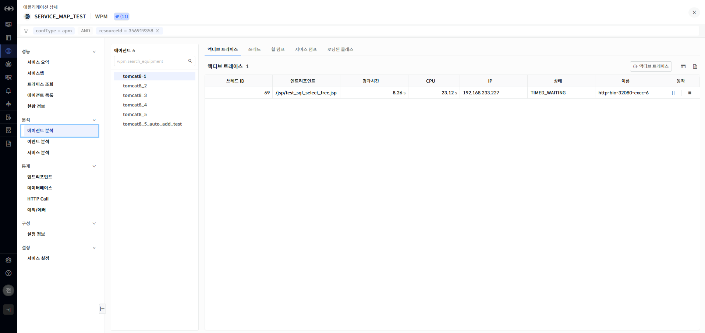

▶ \[그림 105\] 에이전트 분석 – 액티트 서비스

액티브 서비스

애플리케이션에서 현재 수행되고 있는 트레이스의 목록을 보여줍니다. 장기간 수행되고 있는 엔트리포인트를 파악하고 해당 엔트리프인트를 수행하고 있는 쓰레드에 대한 정보를 확인할 수 있습니다.

> 액티브 서비스

<table>
<thead>
<tr class="header">
<th>쓰레드 ID</th>
<th>액티브 서비스를 실행하고 있는 쓰레드의 ID를 표시합니다.</th>
</tr>
</thead>
<tbody>
<tr class="odd">
<td>엔트리포인트</td>
<td>현재 실행 중인 엔트리포인트를 표시합니다.</td>
</tr>
<tr class="even">
<td>경과시간</td>
<td>해당 엔트리포인트가 시작한 이후의 경과시간을 표시합니다.</td>
</tr>
<tr class="odd">
<td>CPU</td>
<td>해당 쓰레드의 CPU 사용시간을 표시합니다.</td>
</tr>
<tr class="even">
<td>IP</td>
<td>해당 요청이 수행된 클라이언트의 IP주소가 표시됩니다.</td>
</tr>
<tr class="odd">
<td>상태</td>
<td>쓰레드의 상태를 표시합니다.</td>
</tr>
<tr class="even">
<td>이름</td>
<td>쓰레드 이름을 표시합니다.</td>
</tr>
<tr class="odd">
<td>동작</td>
<td>
해당 쓰레드에 명령어를 전달하는 기능을 표시합니다.

Interrup와 stop 명령어를 전달할 수 있습니다.

JVM버전에 따라 두 명령이 수행되지 않을 수 있습니다.
</td>
</tr>
</tbody>
</table>

액티브 서비스 목록의 엔트리포인트 이름을 클릭하면 액티브 서비스를 수행하고 있는 쓰레드에 대한 상세 정보를 표시합니다.

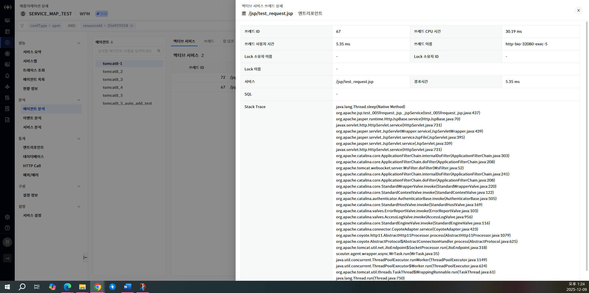

▶ \[그림 106\] 액티브 서비스 상세

> 액티브 서비스 상세

| 쓰레드 ID      | 해당 트레이스를 실행하고 있는 쓰레드 ID를 표시합니다.          |
| ----------- | ---------------------------------------- |
| 쓰레드 CPU 시간  | 해당 쓰레드의 CPU 시간을 표시합니다.                   |
| 쓰레드 사용자 시간  | 해당 쓰레드의 사용자 시간을 표시합니다.                   |
| 쓰레드 이름      | 해당 쓰레드의 이름을 표시합니다.                       |
| Lock 이름     | 해당 쓰레드가 Lock를 사용하고 있을 경우 Lock 이름을 표시합니다. |
| 엔트리포인트      | 해당 쓰레드가 실행하고 있는 엔트리포인트명을 표시합니다.          |
| 경과시간        | 해당 쓰레드가 엔트리포인트를 수행하는 데 경과한 시간을 표시합니다.    |
| SQL         | 해당 쓰레드가 SQL을 수행 중 일 경우 해당 SQL 문장을 표시합니다. |
| Stack Trace | 해당 쓰레드의 현재 스택트레이스를 표시합니다.                |

쓰레드

애플리케이션 수행되고 있는 쓰레드 목록을 제공하며 쓰레드 덤프 생성 기능을 제공합니다.

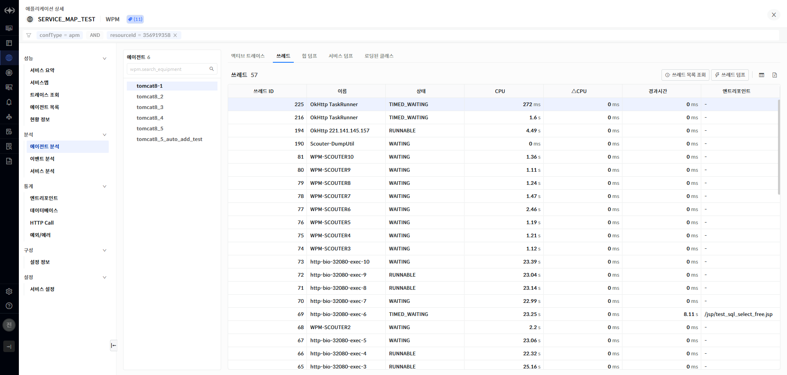

▶ \[그림 107\] 에이전트 분석 - 쓰레드

> 쓰레드

<table>
<thead>
<tr class="header">
<th>쓰레드 ID</th>
<th>쓰레드 ID를 표시합니다.</th>
</tr>
</thead>
<tbody>
<tr class="odd">
<td>이름</td>
<td><strong>쓰레드 이름을 표시합니다.</strong></td>
</tr>
<tr class="even">
<td>상태</td>
<td>쓰레드 상태를 표시합니다.</td>
</tr>
<tr class="odd">
<td>CPU</td>
<td>쓰레드의 CPU시간을 표시합니다.</td>
</tr>
<tr class="even">
<td>△CPU</td>
<td>쓰레드의 CPU 갭 시간을 표시합니다.</td>
</tr>
<tr class="odd">
<td>경과시간</td>
<td>
쓰레드가 엔트리포인트를 수행하는데 경과한 시간을 표시합니다.

종료되지 않은 엔트리포엔트에 대해서 표시됩니다.

엔트리포인트가 비어있을 경우 0으로 표시됩니다.
</td>
</tr>
</tbody>
</table>

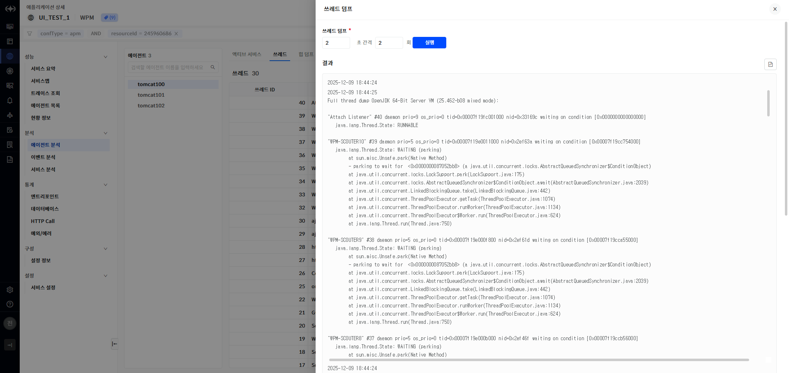

▶ \[그림 108\] 에이전트 분석 – 쓰레드 덤프

쓰레드 덤프

1.  쓰레드 화면의 \[쓰레드 덤프\] 버튼 클릭.

2.  간격과 횟수 입력 후 실행 버튼 클릭.

힙

애플리케이션 분석을 위한 힙덤프를 생성, 삭제하고 생성된 힙덤프 목록을 확인할 수 있습니다.

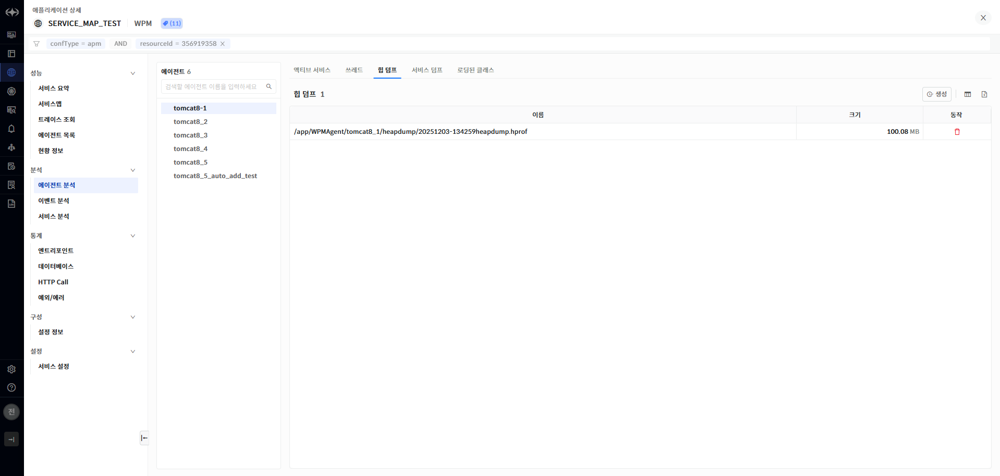

▶ \[그림 109\] 에이전트 분석 – 힙덤프

> 힙 덤프

| 이름 | 힙 덤프 파일이름을 표시합니다.              |
| -- | ------------------------------ |
| 크기 | **힙덤프 파일 크기를 표시합니다.**          |
| 동작 | 힙덤프 파일을 삭제할 수 있는 삭제 기능을 제공합니다. |

힙 덤프 생성

1.  힙덤프 화면의 \[생성\] 버튼 클릭.

힙 덤프 삭제

1.  힙덤프 화면 목록에서 삭제하고자 하는 덤프파일의 동작에서 휴지통 아이콘 클릭.

<table>
<tbody>
<tr class="odd">
<td>
노트

힙덤프 파일의 경우 애플리케이션에 따라 수MB ~ 수십GB로 생성됩니다. 브라우저를 사용하여 다운로드 시 메모리 문제가 발생할 수 있어 Polestar에서는 힙덤프 파일에 대한 다운로드 기능을 제공하지 않습니다. Ftp 클라이언트 프로그램을 사용하여 파일 경로로 접근하여 안전하게 다운로드 받으세요.
</td>
</tr>
</tbody>
</table>

서비스 덤프

애플리케이션 분석 또는 장애 시 설정에 의해 생성된 서비스 덤프파일 목록을 확인하고 서비스 덤프 파일 생성, 삭제할 수 있습니다. 서비스 덤프파일 명을 클릭하면 덤프 파일 내용 확인이 가능합니다.

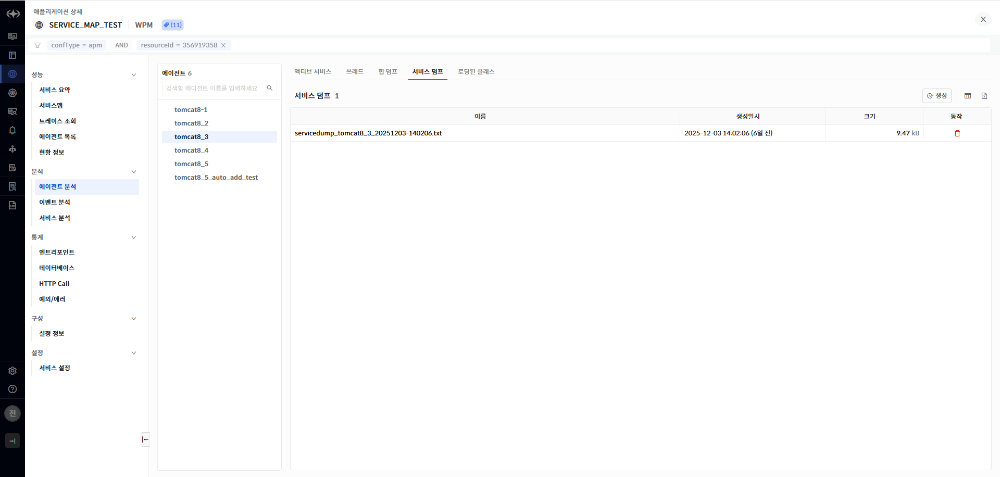

▶ \[그림 110\] 에이전트 분석 – 서비스 덤프

> 서비스 덤프

| 이름       | 서비스 덤프 파일이름을 표시합니다.               |
| -------- | --------------------------------- |
| **생성일시** | **서비스 덤프 생성일시를 표시합니다.**           |
| 크기       | **서비스덤프 파일 크기를 표시합니다.**           |
| 동작       | 서비스 덤프 파일을 삭제할 수 있는 삭제 기능을 제공합니다. |

서비스 덤프 생성

1.  서비스 덤프 화면의 \[생성\] 버튼 클릭.

서비스 덤프 삭제

1.  서비스 덤프 화면 목록에서 삭제하고자 하는 덤프파일의 동작에서 휴지통 아이콘 클릭.

2.  메시지 창에서 확인을 클릭하면 삭제됩니다.

서비스 덤프 상세

1.  서비스 덤프 화면 목록에서 상세 내용을 조회하고자하는 덤프 파일 이름을 클릭합니다.

로딩된 클래스

애플리케이션에 로딩된 클래스 목록을 확인할 수 있습니다. JDBC등 애플리케이션이 사용하고 있는 클래스가 정확한 버전의 클래스가 로딩되었는지 확인할 때 유용합니다. 리소스컬럼의 경우 해당 클래스가 로딩된 파일 경로를 표시합니다. 클래스 목록은 사용자가 로딩된 클래스 목록 화면으로 이동하거나 조회 버튼을 클릭하면 실시간으로 에이전트로부터 목록을 받아 표시합니다.

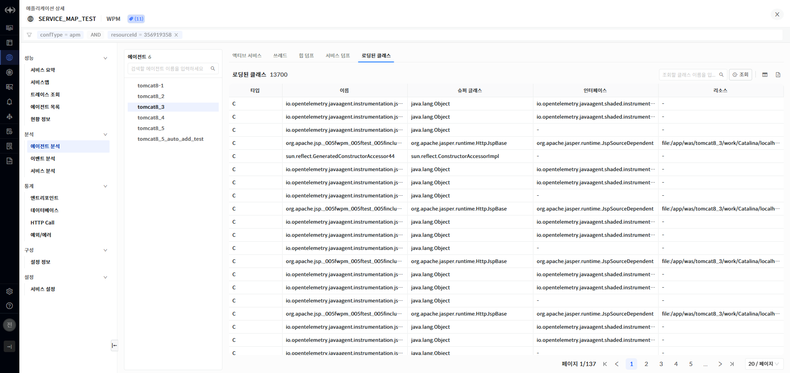

▶ \[그림 111\] 에이전트 분석 – 로딩된 클래스

> 로딩된 클래스

<table>
<thead>
<tr class="header">
<th>타입</th>
<th>
해당 클래스의 타입을 표시합니다.

클래스는 C로 인터페이스는 I로 표시됩니다.
</th>
</tr>
</thead>
<tbody>
<tr class="odd">
<td><strong>이름</strong></td>
<td><strong>클래스 이름을 표시합니다.</strong></td>
</tr>
<tr class="even">
<td>슈퍼 클래스</td>
<td>해당 클래스의 슈퍼클래스를 표시합니다.</td>
</tr>
<tr class="odd">
<td>인터페이스</td>
<td>해당 클래스가 구현한 인터페이스를 표시합니다.</td>
</tr>
<tr class="even">
<td>리소스</td>
<td>해당 클래스 로딩된 Jar파일 경로를 표시합니다.</td>
</tr>
</tbody>
</table>

특정 클래스 조회

1.  로딩된 클래스 목록 상위의 검색박스에 조회할 클래스 명을 입력하고 조회버튼을 클릭.

분석 \> 이벤트 분석

이벤트 분석 기능은 애플리케이션에서 발생한 이벤트를 중심으로 서비스의 성능 및 트레이스 상태를 분석할 수 있는 기능을 제공합니다. 이벤트 분석화면의 이벤트 목록에서는 WPM 서비스가 발생시키는 이벤트 중 ERROR와 WARN 레벨의 이벤트를 중심으로 표시합니다.

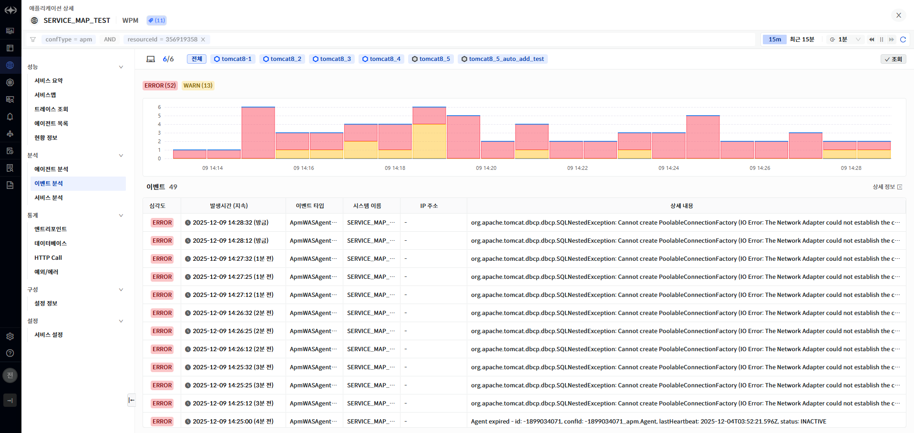

▶ \[그림 112\] 이벤트 분석

> 이벤트

<table>
<thead>
<tr class="header">
<th>심각도</th>
<th>이벤트의 심각도를 표시합니다.</th>
</tr>
</thead>
<tbody>
<tr class="odd">
<td>발생시간(지속)</td>
<td>이벤트 발생시간을 표시합니다.</td>
</tr>
<tr class="even">
<td>이벤트 타입</td>
<td>
이벤트 타입을 표시합니다.

WPM에이전트가 발생시키는 이벤트 타입은 ApmWASAgent입니다.
</td>
</tr>
<tr class="odd">
<td>시스템 이름</td>
<td>애플리케이션에서 시스템 이름은 애플리케이션의 서비스 이름을 표시합니다.</td>
</tr>
<tr class="even">
<td>IP 주소</td>
<td>
이벤트가 발생한 에이전트의 IP주소를 표시합니다.

애플리케이션의 경우 제공하지 않을 수 있습니다.
</td>
</tr>
<tr class="odd">
<td>상세 내용</td>
<td>이벤트 상세 내용을 표시합니다.</td>
</tr>
</tbody>
</table>

이벤트 분석

이벤트 목록에서 이벤트 발생시간을 클릭하면 해당 시간에 발생한 이벤트와 트레이스 현황, 서비스 주요 성능 지표를 확인할 수 있습니다.

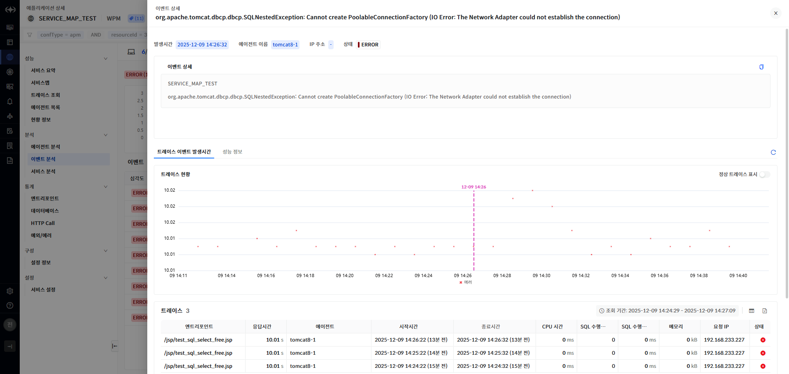

▶ \[그림 113\] 이벤트 상세

> 이벤트 상세

<table>
<thead>
<tr class="header">
<th>발생시간</th>
<th>이벤트 발생시간을 표시합니다.</th>
</tr>
</thead>
<tbody>
<tr class="odd">
<td>에이전트 이름</td>
<td>이벤트를 발생시킨 에이전트를 표시합니다.</td>
</tr>
<tr class="even">
<td>IP 주소</td>
<td>
이벤트를 발생시킨 리소스의 IP 주소를 표시합니다.

APM의 경우 수집되지 않을 수 있습니다.
</td>
</tr>
<tr class="odd">
<td>상태</td>
<td>심각도를 표시합니다.</td>
</tr>
<tr class="even">
<td>이벤트 상세</td>
<td>이벤트 상세 내용을 표시합니다.</td>
</tr>
</tbody>
</table>

이벤트 상세 - 트레이스 현황

이벤트 발생시간의 트레이스 현황을 확인할 수 있는 응답분포도를 제공합니다. 트레이스 현황 응답 분포도의 붉은 선은 이벤트가 발생한 시간을 표시합니다. 이벤트 발생 전 15분, 이벤트 발생 후 15분의 트레이스를 에러가 발생한 트레이스를 기본으로 표시합니다. 응답 분포도 오른쪽 상단의 정상트레이스 표시 토글 버튼을 On하면 정상트레이스와 함께 확인할 수 있습니다.

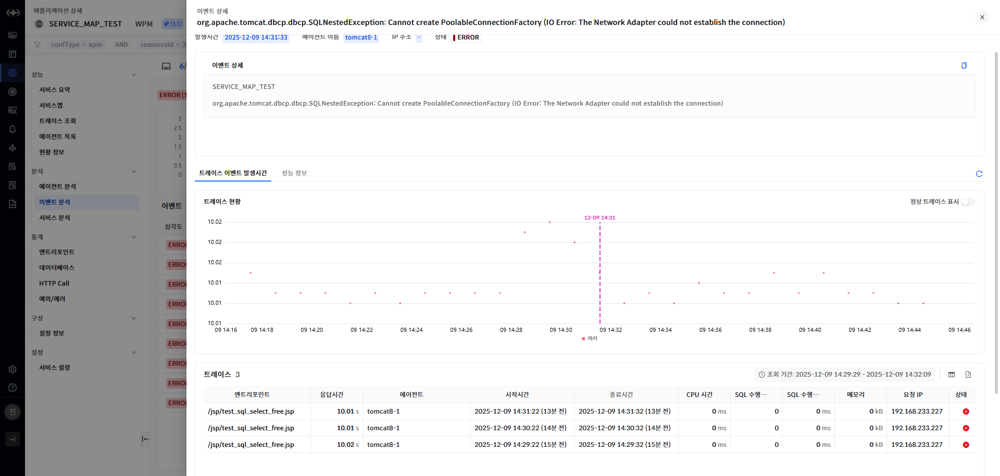

▶ \[그림 114\] 동일 엔트리포인트를 수행한 트레이스 목록

이벤트 상세 - 성능 정보

이벤트 발생시간 15분 전, 15분 후의 주요 성능 지표를 확인하여 해당 이벤트가 서비스 주요 지표에 영향을 끼쳤는지 확인합니다.

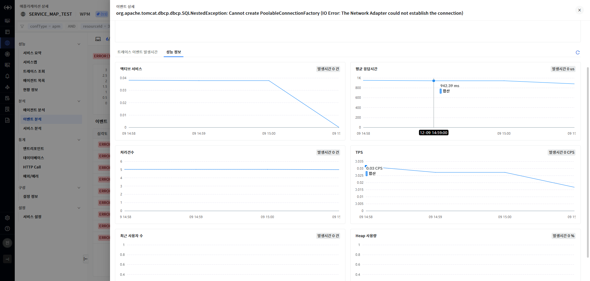

> 성능 정보

| 액티브 서비스 수 | 서비스의 액티브 서비스 수를 표시합니다. |
| --------- | ---------------------- |
| 평균응답시간    | 서비스의 평균 응답시간을 표시합니다.   |
| 처리건수      | 서비스의 처리건수를 표시합니다.      |
| TPS       | 서비스의 초당 처리건수를 표시합니다.   |
| 최근 사용자 수  | 서비스의 최근 사용자 수를 표시합니다.  |

분석 \> 서비스 분석

서비스 분석 기능은 서비스의 엔트리포인트를 중심으로 애플리케이션에서 실행되고 있는 서비스의 상태를 확인합니다. 서비스의 주요 성능 지표와 트레이스 분포 현황을 엔트리포인트 중심으로 트리맵으로 표시합니다.

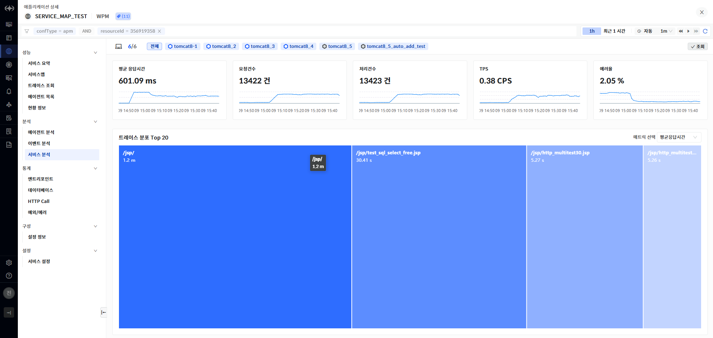

▶ \[그림 115\] 서비스 분석

> 서비스 분석

| 평균응답시간 | 서비스의 조회기간내 평균응답시간을 표시합니다.  |
| ------ | -------------------------- |
| 요청건수   | 서비스의 조회기간내 요청 건수를 표시합니다.   |
| 처리건수   | 서비스의 조회기간내 처리 건수를 표시합니다.   |
| TPS    | 서비스의 조회기간내 TPS 평균을 표시합니다.  |
| 에러율    | 서비스의 조회기간내 에러율 평균값을 표시합니다. |

트레이스 분포 Top20

조회 기간 내 트레이스의 엔트리포인트 분포를 지표값에 따라 Top20을 조회하여 트리맵으로 시각화하여 보여줍니다. 성능 지표의 값이 클수록 넓은 영역과 진한 색상으로 표시됩니다. 성능 지표는 평균 응답시간,처리건수,에러건수로 트리맵을 조회할 수 있습니다.

▶ \[그림 116\] 이벤트 상세

트레이스 분포 Top 20 지표 변경

1.  트레이스 분포의 성능지표 선택에서 원하는 지표를 선택

서비스 분석 상세

실행된 엔트리포인트에 조회기간내 성능 정보를 카드 차트와 라인 차트로 표시합니다.

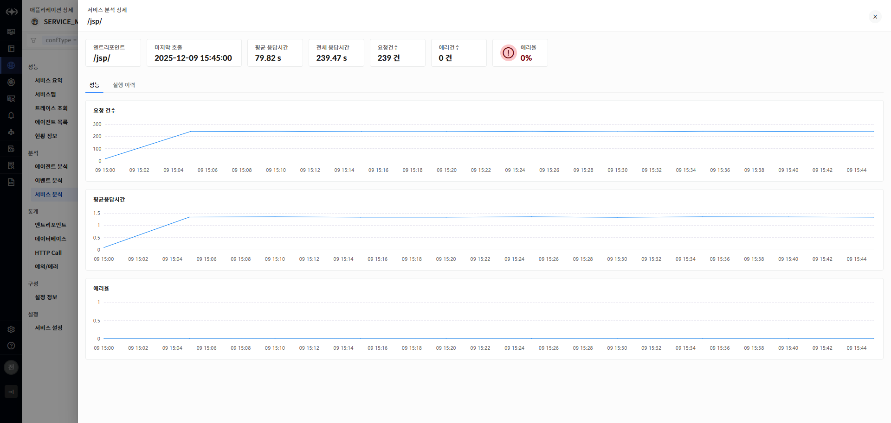

▶ \[그림 117\] 서비스 분석 상세

> 서비스 분석 상세

| 엔트리포인트  | 선택한 엔트리포인트 이름                     |
| ------- | --------------------------------- |
| 평균 응답시간 | 선택한 엔트리포인트의 조회기간내 평균응답시간          |
| 전체 응답시간 | 선택한 엔트리포인트의 조회기간내 전체응답시간          |
| 요청건수    | 선택한 엔트리포인트의 조회기간내 요청건수            |
| 에러율     | 선택한 엔트리포인트의 조회기간내 에러율 평균값을 표시합니다. |
| 마지막 호출  | 해당 엔트리포인트의 가장 최근 호출 시간            |

서비스 분석 상세 – 실행 이력

선택한 엔트리포인트에 대한 응답분포도와 함께 트레이스 목록이 표시됩니다.

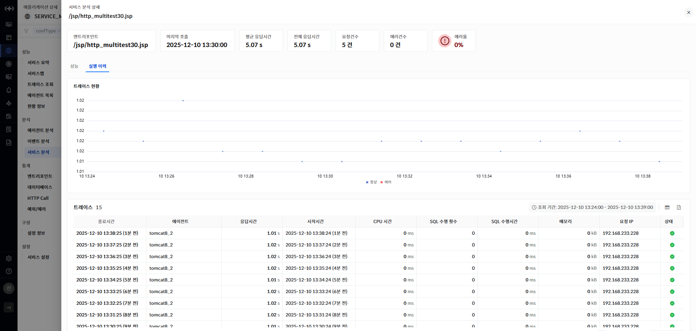

▶ \[그림 118\] 실행 이력

> 트레이스

<table>
<thead>
<tr class="header">
<th>종료시간</th>
<th>트레이스의 종료시간</th>
</tr>
</thead>
<tbody>
<tr class="odd">
<td>에이전트</td>
<td>트레이스가 실행된 에이전트. 여러 애플리케이션을 통해 수행해는 글로벌 트레이스의 경우 엔트리포인트가 실행된 에이전트를 의미</td>
</tr>
<tr class="even">
<td>응답시간</td>
<td>
트레이스가 수행되는 데 걸린 시간

계산 방식 : 트레이스의 종료시간 – 트레이스 시작 시간
</td>
</tr>
<tr class="odd">
<td>시작시간</td>
<td>트레이스의 시작시간</td>
</tr>
<tr class="even">
<td>CPU 시간</td>
<td>트레이스를 실행하는데 소요된 CPU 시간</td>
</tr>
<tr class="odd">
<td>SQL 수행 횟수</td>
<td>트레이스 실행 시 수행된 SQL 횟수</td>
</tr>
<tr class="even">
<td>SQL 수행 시간</td>
<td>트레이스 실행 시 수행된 SQL을 실행하는데 소요된 시간</td>
</tr>
<tr class="odd">
<td>메모리</td>
<td>
트레이스를 수행하는데 사용한 메모리량

단위 : kB
</td>
</tr>
<tr class="even">
<td>요청 IP</td>
<td>
해당 엔트리포인트를 요청한 사용자의 IP

방화벽 또는 Proxy를 사용할 경우 IP가 특정 IP로만 나올 수 있습니다.
</td>
</tr>
<tr class="odd">
<td>상태</td>
<td>
트레이스의 상태를 표시한다. 상세 실행내역 중 에러 구간이 존재할 경우 에러 상태로 표시한다.

<table>
<thead>
<tr class="header">
<th>: 트레이스 정상 종료</th>
</tr>
</thead>
<tbody>
<tr class="odd">
<td>: 트레이스 에러 발생</td>
</tr>
</tbody>
</table></td>
</tr>
</tbody>
</table>

통계 \> 엔트리포인트

조회기간내 서비스에서 수행된 엔트리포인트의 통계 이력을 확인할 수 있습니다. 동일 엔트리포인트가 여러 개의 에이전트에서 수행된다면 엔트리포인트 이름 왼쪽의 ►아이콘을 클릭하면 에이전트별 엔트리포인트 통계 조회도 가능합니다.

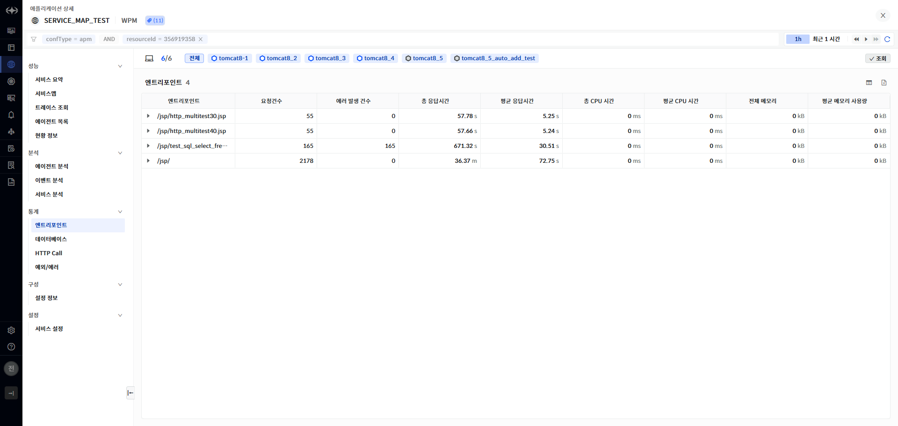

▶ \[그림 119\] 엔트리포인트 통계

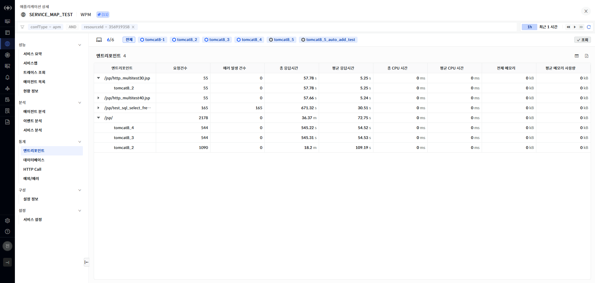

▶ \[그림 120\] 에이전트별 엔트리포인트 통계

엔트리포인트

| 엔트리포인트     | 수행한 엔트리포인트 이름을 표시합니다.            |
| ---------- | -------------------------------- |
| 요청건수       | 조회 기간내 엔트리포인트 요청 건수를 표시합니다.      |
| 에러 발생 건수   | 조회 기간내 엔트리포인트 에러 발생 건수를 표시합니다.   |
| 총 응답시간     | 조회 기간내 엔트리포인트 총 응답시간을 표시합니다.     |
| 총 CPU시간    | 조회 기간내 엔트리포인트 총 CPU시간을 표시합니다.    |
| 평균 CPU시간   | 조회 기간내 엔트리포인트 평균 CPU시간을 표시합니다.   |
| 총 메모리 사용량  | 조회 기간내 엔트리포인트 전체 메모리양을 표시합니다.    |
| 평균 메모리 사용량 | 조회 기간내 엔트리포인트 평균 메모리 사용량을 표시합니다. |

통계 \> 데이터베이스

조회기간내 서비스에서 수행된 SQL의 통계 이력을 확인할 수 있습니다. 동일 SQL이 여러 개의 에이전트에서 수행된다면 SQL이름 왼쪽의 ►아이콘을 클릭하면 에이전트별 SQL통계 조회도 가능합니다.

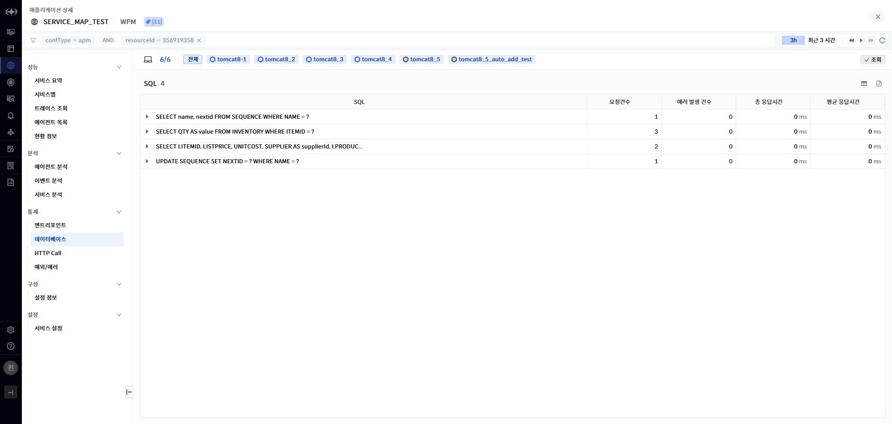

▶ \[그림 121\] 데이터베이스 통계

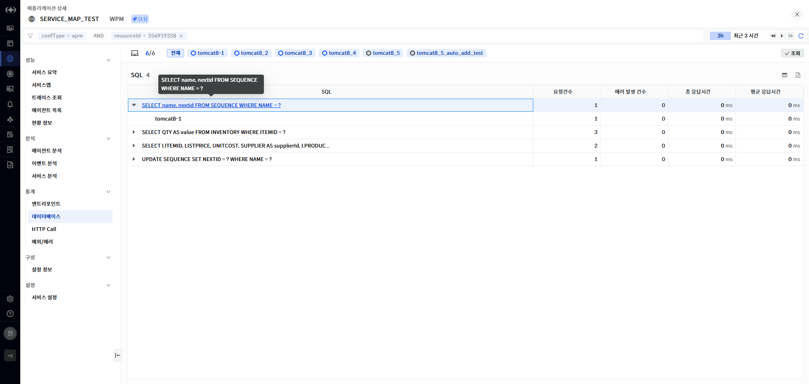

▶ \[그림 122\] 에이전트별 데이테베이스 통계

SQL

<table>
<thead>
<tr class="header">
<th>SQL</th>
<th>
수행한 SQL 이름을 표시합니다.

SQL 문장이 길 경우 SQL문을 클릭하면 전체 문장이 표시됩니다.
</th>
</tr>
</thead>
<tbody>
<tr class="odd">
<td>요청건수</td>
<td>조회 기간내 SQL요청 건수를 표시합니다.</td>
</tr>
<tr class="even">
<td>에러 발생 건수</td>
<td>조회 기간내 SQL수행 중 에러 발생 건수를 표시합니다.</td>
</tr>
<tr class="odd">
<td>총 응답시간</td>
<td>조회 기간내 SQL총 응답시간을 표시합니다.</td>
</tr>
<tr class="even">
<td>평균 응답 시간</td>
<td>조회 기간내 SQL 평균 응답 시간을 표시합니다.</td>
</tr>
</tbody>
</table>

통계 \> HTTP Call

조회기간내 서비스에서 수행된 HTTPCall의 통계 이력을 확인할 수 있습니다. 동일 HTTPCall이 여러 개의 에이전트에서 수행된다면 HTTPCall이름 왼쪽의 ►아이콘을 클릭하면 에이전트별 HTTPCall통계 조회도 가능합니다.

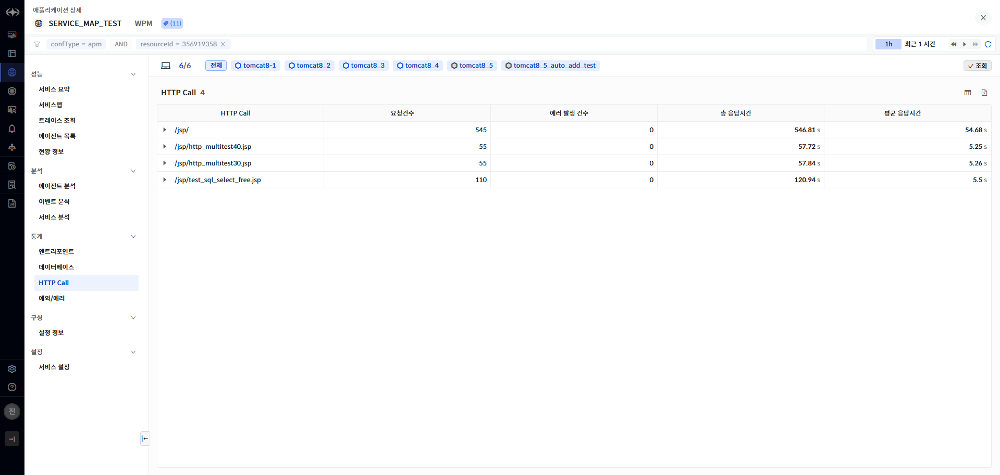

▶ \[그림 123\] HTTP Call 통계

▶ \[그림 124\] 에이전트별 HTTP Call 통계

엔트리포인트

| HTTP Call | 수행한 HTTP Call이름을 표시합니다.            |
| --------- | ---------------------------------- |
| 요청건수      | 조회 기간내 HTTP Call 요청 건수를 표시합니다.     |
| 에러 발생 건수  | 조회 기간내 HTTP Call 에러 발생 건수를 표시합니다.  |
| 총 응답시간    | 조회 기간내 HTTP Call 총 응답시간을 표시합니다.    |
| 평균 응답시간   | 조회 기간내 HTTP Call 총 평균 응답시간을 표시합니다. |

통계 \> 예외/에러

조회기간내 서비스에서 발생한 예외/에러의 통계 이력을 확인할 수 있습니다. 동일 예외/에러가 여러 개의 에이전트에서 발생했다면 예외/에러 이름 왼쪽의 ►아이콘을 클릭하면 에이전트별 예외/에러 조회가 가능합니다. 에이전트별 예외/에러 표시 후 에이전트명을 클릭하면 해당 에이전트에 발생한 예외/에러에 대한 상세 메시지가 표시됩니다.

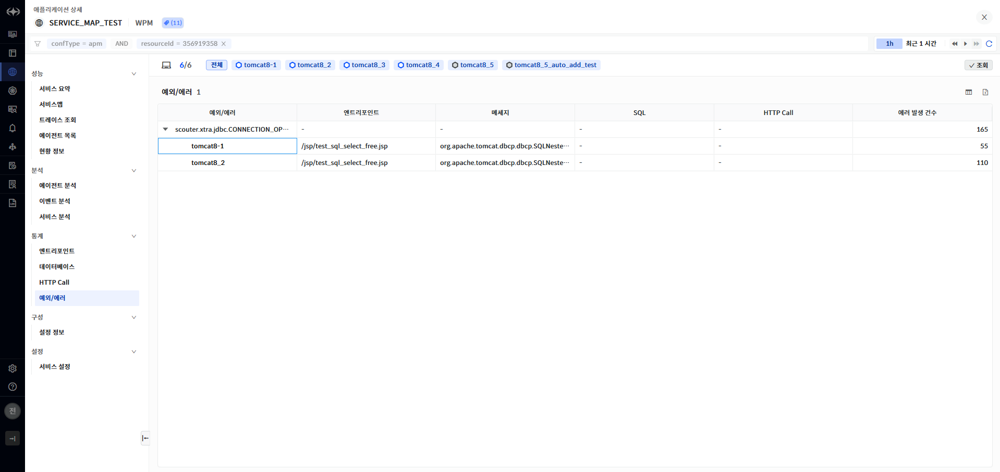

▶ \[그림 125\] 예외/에러 통계

예외/에러

<table>
<thead>
<tr class="header">
<th>예외/에러</th>
<th>발생한 예외/에러 이름을 표시합니다.</th>
</tr>
</thead>
<tbody>
<tr class="odd">
<td>엔트리포인트</td>
<td>
예외/에러가 발생한 엔트리포인트명을 표시합니다.

에이전트별 예외/에러가 표시될 때만 표시됩니다.
</td>
</tr>
<tr class="even">
<td>메시지</td>
<td>
예외/에러에 대한 메시지를 표시합니다.

에이전트별 예외/에러가 표시될 때만 표시됩니다.
</td>
</tr>
<tr class="odd">
<td>SQL</td>
<td>
예외/에러를 발생시킨 SQL을 표시합니다.

에이전트별 예외/에러가 표시될 때만 표시되며 발생한 예외/에러가 SQL 수행 중 발생한 에러일 경우만 표시됩니다.
</td>
</tr>
<tr class="even">
<td>HTTP Call</td>
<td>
예외/에러를 발생시킨 HTTP Call을 표시합니다.

에이전트별 예외/에러가 표시될 때만 표시되며 발생한 예외/에러가 HTTP Call수행 중 발생한 에러일 경우만 표시됩니다.
</td>
</tr>
<tr class="odd">
<td>에러 발생 건수</td>
<td>조회 기간내 서비스에서 발생한 에러 발생 건수를 표시합니다.</td>
</tr>
</tbody>
</table>

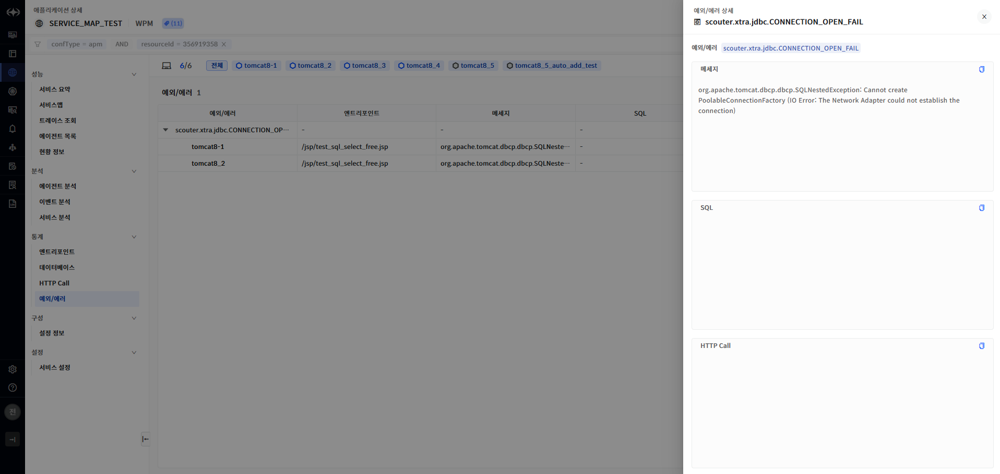

▶ \[그림 126\] 에이전트별 예외/에러 – 예외/에러 상세

구성 \> 설정 정보

설정 정보

설정 정보 메뉴에서 애플리케이션의 기본 정보와 POLESTAR 정책, 권한, 리소스 담당자를 변경할 수 있습니다.

▶ \[그림 127\] 설정 정보

알람 정보

애플리케이션에서 수집하는 관리 지표 개수와 현재 설정된 알람 개수 및 알람 정책 정보를 제공합니다. \[상세보기\]를 선택하여 알람 상세 드로어에서 알람 정책의 세부 알람 설정 목록을 확인할 수 있습니다.

<table>
<tbody>
<tr class="odd">
<td>
노트

세부 알람 설정은 [알람 &amp; 이벤트] 메뉴에서 변경할 수 있습니다. 자세한 내용은 ‘알람 상세’ 매뉴얼을 참고하시기 바랍니다.
</td>
</tr>
</tbody>
</table>

▶ \[그림 128\] 알람 정보

화면 지표

| 관리 지표 개수 | POLESTAR에서 관리하는 성능 지표 개수를 표시합니다.         |
| -------- | ---------------------------------------- |
| 알람 설정 개수 | 서버에 설정된 알람 개수를 표시합니다.                    |
| 알람 정책    | 서버에 설정된 알람 정책을 표시합니다.                    |
| 상세 보기    | 알람 정책의 세부 알람 설정 목록을 확인할 수 있는 드로어를 호출합니다. |

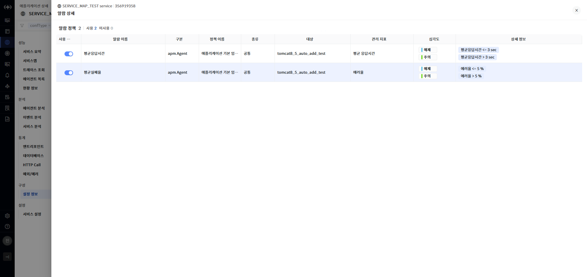

▶ \[그림 129\] 알람 정보 – 알람 상세

기본 정보

애플리케이션의 기본 정보를 표시합니다. ‘관리 상태’ 항목은 변경할 수 있습니다.

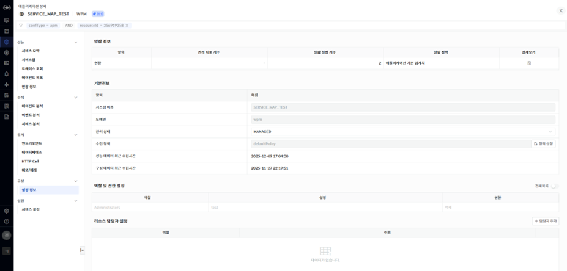

▶ \[그림 130\] 기본 정보

정책 설정

기본 정보 목록에서 \[정책 설정\] 버튼은 클릭하여 서버에 설정된 데이터 수집 정책의 세부 설정을 목록을 조회할 수 있고, 설정을 변경하거나 변경된 설정을 수집 정책의 기본값으로 초기화할 수 있습니다.

<table>
<tbody>
<tr class="odd">
<td>
노트

데이터 수집 정책 설정 방법은 ‘데이터수집설정’ 매뉴얼을 참고하시기 바랍니다.

애플리케이션의 경우 데이터 수집 주기가 60초로 설정되어 있으며 이를 변경해도 변경된 수집주기가 적용되지 않습니다. 60초 이외의 값으로 변경하지 않도록 합니다.
</td>
</tr>
</tbody>
</table>

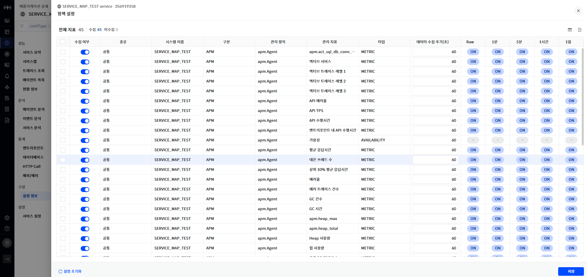

▶ \[그림 131\] 기본 정보 – 정책 설정

화면 지표

<table>
<thead>
<tr class="header">
<th>수집여부</th>
<th>
지표별 성능 데이터 수집 여부를 설정합니다.

기본적으로 POLESTAR에서 지원하는 모든 지표를 수집하도록 설정되어 있으며, 수집 여부 변경 시 해당 지표는 더 이상 POLESTAR에서 처리하지 않습니다.

 : 수집 지표

 : 미수집 지표
</th>
</tr>
</thead>
<tbody>
<tr class="odd">
<td>종류</td>
<td>
지표 설정 종류를 표시합니다. 기본값은 ‘공통’이며, 세부 설정을 변경한 경우 ‘개별’로 표시됩니다.

공통: 공통 설정. 관리지표 공통 설정의 지표 설정을 동일하게 사용하는 경우

개별: 개별 설정. 관리지표 공통 설정의 지표 설정을 변경해서 사용하는 경우
</td>
</tr>
<tr class="even">
<td>시스템 명</td>
<td>서버의 이름을 표시합니다.</td>
</tr>
<tr class="odd">
<td>구분</td>
<td>POLESTAR에서 관제하는 제품군을 표시합니다.</td>
</tr>
<tr class="even">
<td>관리 항목</td>
<td>지표 그룹을 표시합니다.</td>
</tr>
<tr class="odd">
<td>관리 지표</td>
<td>지표명을 표시합니다.</td>
</tr>
<tr class="even">
<td>타입</td>
<td>
지표의 데이터 타입을 표시합니다.

AVAILABILITY: 가용성 데이터

TRAIT: 문자열 데이터

METRIC: 수치 데이터

TABULAR: 목록형 데이터
</td>
</tr>
<tr class="odd">
<td>데이터 수집 주기</td>
<td>
지표별 데이터 수집 주기를 표시합니다.

모든 지표는 기본 60초 주기로 설정되어 있습니다.

애플리케이션의 경우 데이터 수집 주기가 60초로 설정되어 있으며 이를 변경해도 변경된 수집주기가 적용되지 않습니다. 60초 이외의 값으로 변경하지 않도록 합니다.
</td>
</tr>
</tbody>
</table>

역할 및 권한 설정

애플리케이션 서비스에 대한 접근 권한을 조회하고 변경할 수 있습니다. Administrators 역할은 모든 서비스에 기본으로 포함되어 있으며 해제할 수 없습니다.

▶ \[그림132\] 역할 및 권한 설정

리소스 담당자 설정

애플리케이션 서비스의 담당자를 설정할 수 있습니다.

▶ \[그림133\] 리소스 담당자 설정

설정 \> 서비스 설정

설정의 서비스 설정은 서비스내의 에이전트 자동 추가 설정 및 에이전트 옵션 설정을 할 수 있습니다.

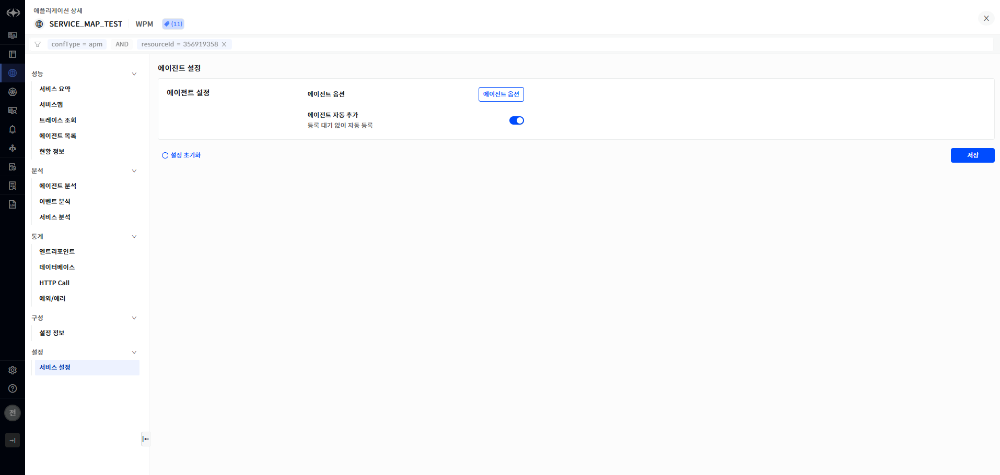

▶ \[그림 134\] 서비스 설정

에이전트 설정

| 에이전트 옵션 설정     | 에이전트 옵션 설정 기능 화면이 표시됩니다.                        |
| -------------- | ----------------------------------------------- |
| **에이전트 자동 추가** | **토글 버튼이 On되어있으면 에이전트가 등록대기 상태 없이 서비스로 등록됩니다.** |

에이전트 옵션 버튼을 클릭하면 에이전트 목록이 표시됩니다.

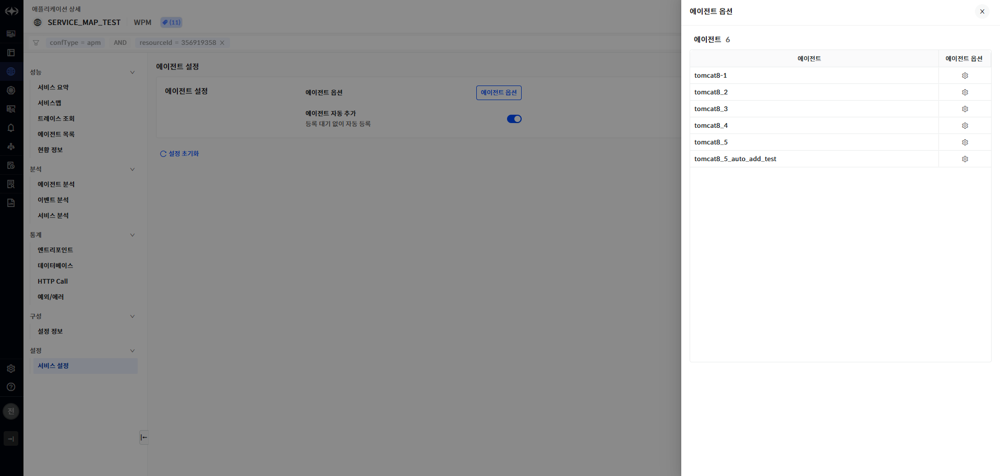

▶ \[그림 135\] 에이전트 옵션

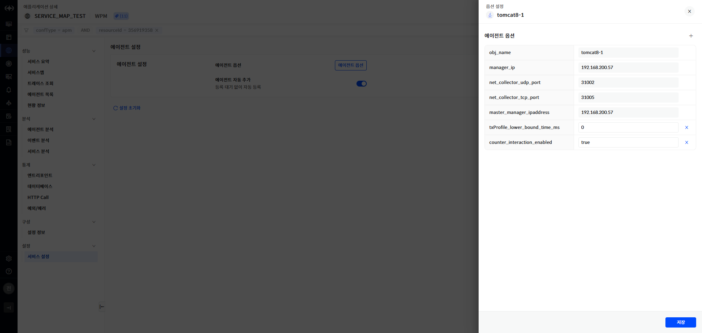

▶ \[그림 136\] 개별 에이전트 옵션 설정

에이전트 옵션 사용법은 WPM 서비스의 에이전트 목록 \> 에이전트의 옵션에 설명되어 있습니다.

