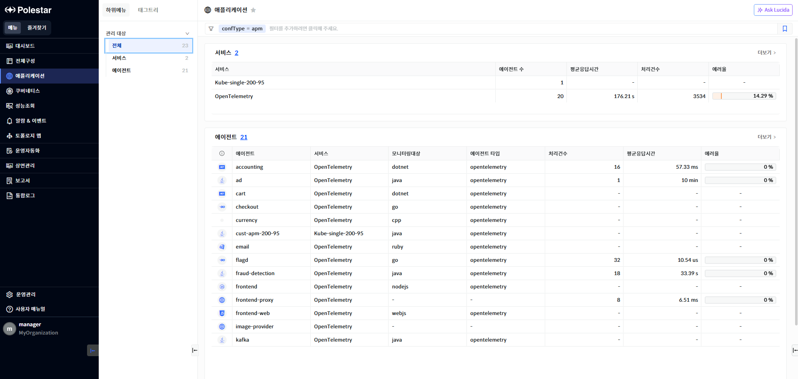
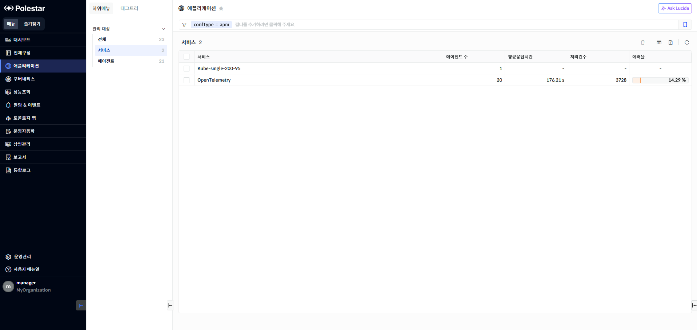
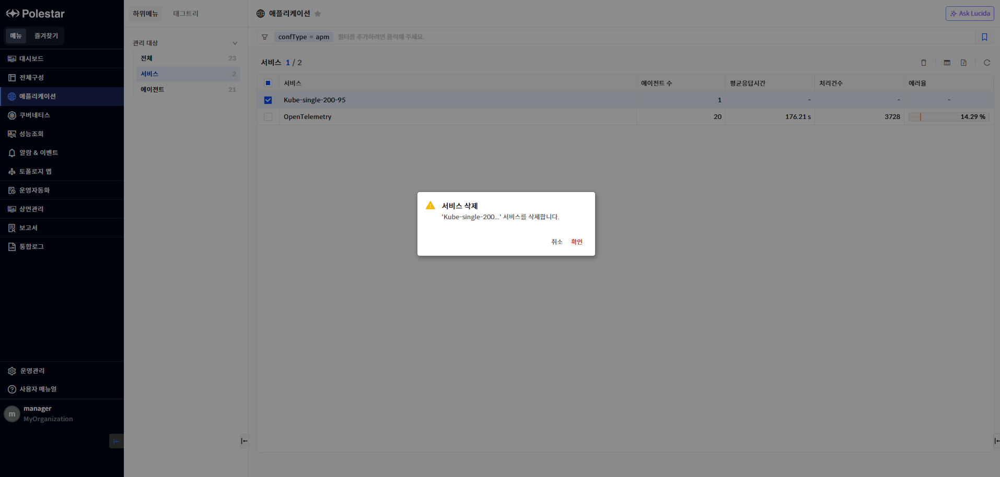
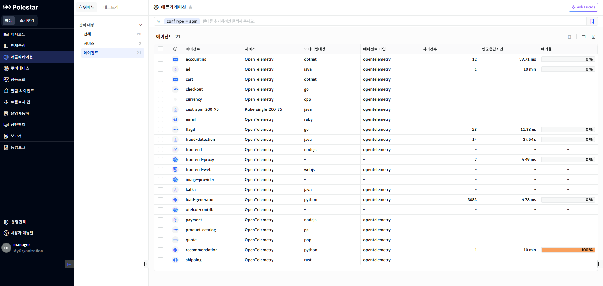
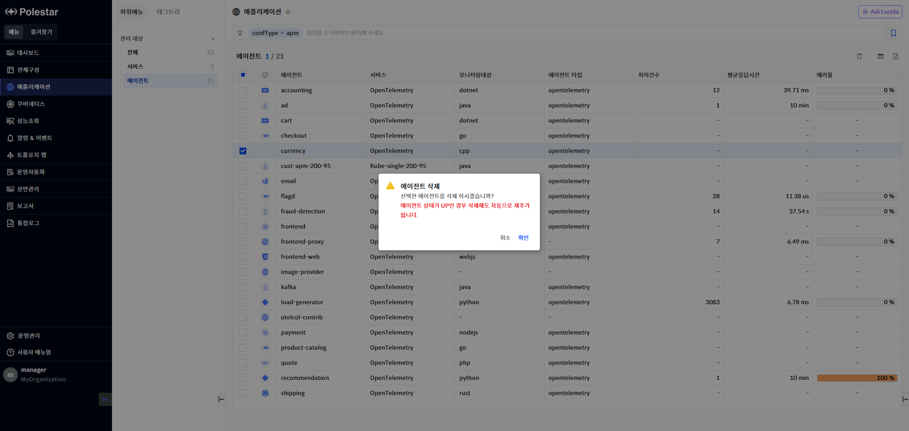

애플리케이션 전체

애플리케이션의 메뉴를 사용하면 애플리케이션에 등록된 서비스와 에이전트 목록을 확인할 수 있습니다.

<table>
<tbody>
<tr class="odd">
<td>
노트

애플리케이션 관리되는 서비스와 에이전트는 [전체구성] 메뉴의 [관리 대상 추가] 에서 애플리케이션[관리 대상 등록]을 통해 등록되어야 합니다.
</td>
</tr>
</tbody>
</table>

▶ \[그림 1\] 애플리케이션 전체 목록

> 서비스

<table>
<thead>
<tr class="header">
<th>서비스</th>
<th>애플리케이션의 성능을 수집하는 에이전트들의 그룹. 에이전트 설치 시 서비스명을 설정합니다.</th>
</tr>
</thead>
<tbody>
<tr class="odd">
<td>에이전트 수</td>
<td>해당 서비스에 속하는 에이전트 수를 표시합니다</td>
</tr>
<tr class="even">
<td>평균응답시간</td>
<td>서비스내의 애플리케이션에서 수행된 트레이스들의 평균 응답시간을 표시합니다.</td>
</tr>
<tr class="odd">
<td>처리건수</td>
<td>서비스내의 애플리케이션에서 수행된 트레이스 건수를 표시합니다.</td>
</tr>
<tr class="even">
<td>에러율</td>
<td>
서비스내의 애플리케이션에서 수행된 전체 트레이스 건수 대비 에러가 발생한 트레이스의 비율입니다

계산 방식 :( 에러트레이스 건수 / 전체 트레이스 건수 ) * 100

단위 : %
</td>
</tr>
</tbody>
</table>

> 에이전트

<table>
<thead>
<tr class="header">
<th>에이전트 상태 및 관리 상태</th>
<th>
에이전트의 상태를 표시합니다. 에이전트 상태는 10초마다 전송되는 에이전트 메트릭 데이터를 수신 받았을 경우 UP, 메트릭 데이터가 전송되지 않을 경우 Down으로 평가합니다.

<table>
<thead>
<tr class="header">
<th>: 정상적인 상태 표시</th>
</tr>
</thead>
<tbody>
<tr class="odd">
<td>: 다운된 상태 표시</td>
</tr>
</tbody>
</table></th>
</tr>
</thead>
<tbody>
<tr class="odd">
<td>에이전트</td>
<td>
애플리케이션이 수행되는 에이전트 명을 표시합니다.

에이전트 설치 시 설정을 통해 지정됩니다.
</td>
</tr>
<tr class="even">
<td>서비스</td>
<td>
애플리케이션이 수행되는 에이전트의 서비스 명을 표시합니다.

에이전트 설치 시 설정을 통해 지정됩니다.
</td>
</tr>
<tr class="odd">
<td>모니터링 대상</td>
<td>에이전트가 모니터링하는 언어를 표시합니다.</td>
</tr>
<tr class="even">
<td>에이전트 타입</td>
<td>설치된 에이전트의 타입을 의미합니다.</td>
</tr>
<tr class="odd">
<td>처리건수</td>
<td>해당 에이전트가 조회 시간 내 처리한 트레이스 수를 표시합니다.</td>
</tr>
<tr class="even">
<td>평균응답시간</td>
<td>해당 에이전트가 조회 시간 내 처리한 트레이스의 평균응답시간을 표시합니다.</td>
</tr>
<tr class="odd">
<td>에러율</td>
<td>
해당 에이전트가 조회 시간 내 처리한 트레이스에서 발생한 에러 트레이스의 비율을 표시합니다.

계산 방식 : 에러 트레이스 건수/전체 트레이스 수 * 100
</td>
</tr>
</tbody>
</table>

**서비스 더보기**

애플리케이션 전체 목록은 최대 20개의 목록만 표시할 수 있습니다.만약 등록되어 있는 서비스 전체 목록이 20개를 초과할 경우 \[더보기\]를 클릭하여 서비스 전체 목록을 확인할 수 있습니다.

▶ \[그림 2\] 애플리케이션 서비스 더보기

서비스 삭제

삭제할 서비스를 선택하고 \[삭제\] 버튼을 선택하고 서비스를 삭제할 수 있습니다.

서비스가 삭제되면 서비스내에 속해 있는 에이전트도 수집서버에서 삭제됩니다. 하지만 애플리케이션에서 에이전트 옵션 또는 모듈을 제거하지 않으면 에이전트를 삭제하더라도 지속적으로 성능 데이터를 수집서버로 전달될 수 있습니다.

삭제 후 에이전트를 다시 기동하면 다시 등록이 될 수 있습니다. 아래 노트를 참조하여 완전히 삭제할 수 있습니다.

<table>
<tbody>
<tr class="odd">
<td>
노트

애플리케이션 서비스에 속한 에이전트를 완벽하게 제거하기 위해서는 각 애플리케이션 언어별 에이전트 제거 방법을 따라 모듈을 제거합니다.
</td>
</tr>
</tbody>
</table>

▶ \[그림 3\] 서비스 삭제

<table>
<tbody>
<tr class="odd">
<td>
노트

서비스에 속해있는 에이전트를 삭제하고자 할 경우 애플리케이션&gt;전체 선택후 에이전트 목록의 [더보기]를 선택하여 에이전트 목록에서 삭제하거나 애플리케이션&gt;에이전트를 선택하여 에이전트를 삭제할 수 있습니다.
</td>
</tr>
</tbody>
</table>

> 서비스 삭제 절차

1.  삭제하고자 하는 서비스 선택 (다중 선택 가능)

2.  테이블 우측 상단의 삭제 아이콘 클릭

3.  메시지창에서 확인 클릭

에이전트 더보기

애플리케이션 에이전트 목록은 최대 20개의 목록만 표시할 수 있습니다.만약 등록되어 있는 에이전트 전체 목록이 20개를 초과할 경우 \[더보기\]를 클릭하여 에이전트 전체 목록을 확인할 수 있습니다.

▶ \[그림 4\] 애플리케이션 에이전트 더보기

에이전트 삭제

삭제할 에이전트를 선택하고 \[삭제\] 버튼을 선택하고 에이전트를 삭제할 수 있습니다.

에이전트가 설치되어 있는 애플리케이션이 에이전트 옵션 또는 모듈이 로딩된 상태로 실행 중인 상태일 경우 에이전트를 삭제하여도 에이전트가 속한 서비스의 설정에 따라 자동 추가되거나 관리대상 추가 화면에서 대기 상태로 등록되어 있을 수 있습니다. 따라서 에이전트를 완벽하게 삭제하기 위해서는 에이전트가 수행되고 있는 애플리케이션에서 에이전트 옵션을 완전히 제거하거나 모듈을 제거해야만 완전히 삭젝 할 수 있습니다.

<table>
<tbody>
<tr class="odd">
<td>
노트

애플리케이션 서비스에 속한 에이전트를 완벽하게 제거하기 위해서는 각 애플리케이션 언어별 에이전트 제거 방법을 따라 모듈을 제거합니다.
</td>
</tr>
</tbody>
</table>

▶ \[그림 5\] 에이전트 삭제

에이전트 삭제 절차

1.  > 삭제하고자 하는 에이전트 선택 (다중 선택 가능)

2.  > 테이블 우측 상단의 삭제 아이콘 클릭

3.  > 메세지 창에서 “예” 클릭

