성능 이상감지 분석

성능 이상감지 분석 화면은 리소스에서 이상이 발생시 이상 현상을 시각화하여 이상의 원인이 무엇인지 파악할 수 있는 기능을 제공합니다. 특정 리소스 알람 탭의 Lucida 이상감지 리스트 오른쪽 더보기 버튼 클릭시 볼 수 있습니다.

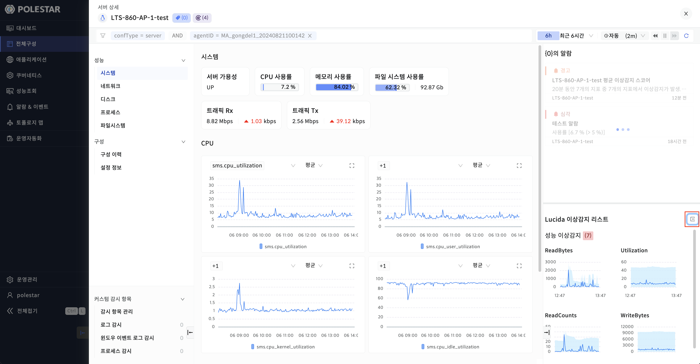

▶ \[그림1\] Lucida 이상감지 리스트의 더보기 버튼

Time Navigator Bar

상단의 Time Navigator Bar는 2시간 기준 1분 단위로 총 120칸으로 구성됩니다. Time Navigator Bar 가장 오른쪽 마커는 현재 시간을 표시하고 가장 왼쪽 마커는 현재시간 기준 2시간 전의 시간을 뜻합니다. \[\<\],\[\>\] 화살표는 1분, \[\<\<\],\[\>\>\] 화살표는 30분 단위로 이동이 가능합니다.

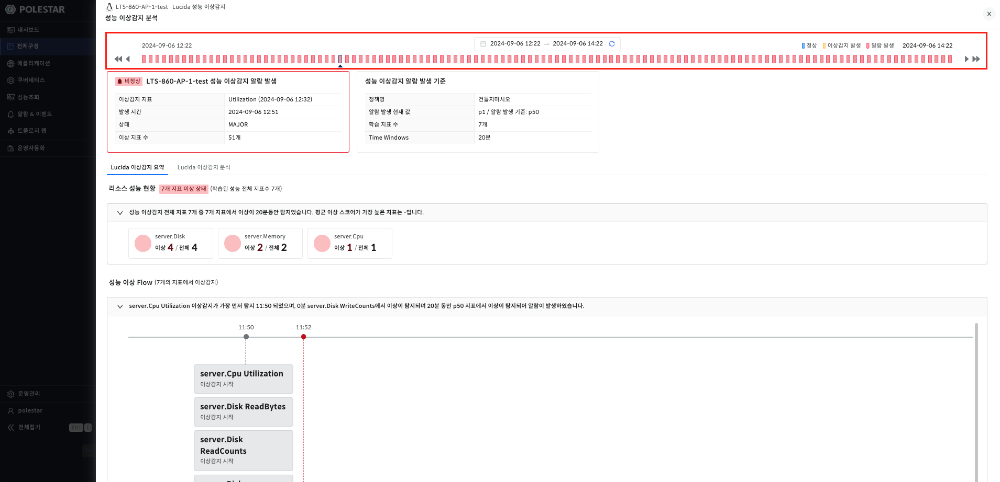

▶ \[그림2\] Time Navigator Bar

<table>
<tbody>
<tr class="odd">
<td>
노트

Time Navigator Bar의 각 마커는 3가지 색으로 표현됩니다. 정상의 경우 파란색, 이상감지가 발생한 경우 노란색, 알람이 발생한 경우 빨간색으로 표현됩니다.
</td>
</tr>
</tbody>
</table>

<table>
<tbody>
<tr class="odd">
<td>
노트

Time Navigator Bar 중앙 위 시간을 클릭시 이상감지 캘린더가 나옵니다. 해당 캘린더에는 이상감지 알람이 발생한 시간을 빨간색으로 표시하고 있습니다.
</td>
</tr>
</tbody>
</table>

성능 이상감지 알람 정보

Time Navigator Bar에서 선택한 마커 시간에 발생한 성능 이상감지 알람 정보를 보여줍니다. 해당 시간이 정상이거나 이상감지 발생 상태인 경우 정상으로 표시됩니다. 알람이 발생한 경우 비정상으로 보여줍니다.

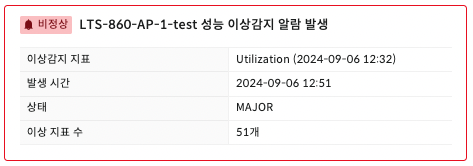

▶ \[그림3\] 성능 이상감지 알람 정보 비정상 상태

▶ \[그림4\] 성능 이상감지 알람 정보 정상 상태

성능 이상감지 알람 항목

| 시작 이상감지 지표 | 알람 발생을 판단한 이상감지 지표 중 처음 시작된 이상감지 지표명 |
| ---------- | ------------------------------------ |
| 알람 발생 시간   | 알람이 발생한 시간                           |
| 알람 상태      | 알람 상태                                |
| 이상감지 지표 수  | 알람 발생의 원인이 되는 이상감지 지표 수              |

성능 이상감지 알람 발생 기준

Time Navigator Bar에서 선택한 마커 시간에 발생한 성능 이상감지 알람 발생 기준을 보여줍니다.

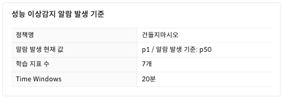

▶ \[그림5\] 성능 이상감지 알람 발생 기준

성능 이상감지 알람 발생 기준 항목

| 정책명          | 성능 이상감지 정책명             |
| ------------ | ----------------------- |
| 알람 발생 현재 값   | 현재 민감도 / 알람 발생 기준 민감도   |
| 학습 지표 수      | 알람 발생 판단에 사용된 총 지표 수    |
| Time Windows | 성능 이상감지 정책 Time Windows |

성능 프로세스 RCA

Time Navigator Bar에서 선택한 마커 시간에 발생한 성능 프로세스 RCA의 정보를 보여줍니다. 해당 영역에서 보여주는 정보는 이상 스코어가 가장 높은 프로세스의 이름과, 이상 타입, 스코어의 합계입니다. RCA는 이상감지 알람이 발생하고 해당 시점의 이상 지표 중 KPI 지표가 존재하는 경우 수행합니다. RCA 정보는 오직 서버 리소스인 경우에만 확인할 수 있습니다. 타이틀 오른쪽의 숫자는 이상 프로세스의 개수이고 클릭시 프로세스 스코어 Top List 화면이 드로우로 나타납니다.

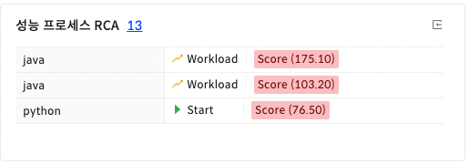

▶ \[그림6\] 성능 프로세스 RCA

<table>
<tbody>
<tr class="odd">
<td>
노트

KPI 지표는 서버에 가장 영향을 미치는 주요한 지표를 말합니다. 이상감지 정책 생성시 확인할 수 있습니다.
</td>
</tr>
</tbody>
</table>

리소스 성능 현황

Time Navigator Bar에서 선택한 마커 시간에 전체 지표 정보를 하위 리소스별로 보여줍니다. 각 리소스별로 전체 지표 수 대비 이상 지표 수를 표현하고 있고 이상이 있는 리소스의 경우 빨간색 리소스 아이콘으로 표시됩니다. 성능 이상감지 전체 지표 중 평균 이상 스코어가 가장 높은 지표를 표시합니다.

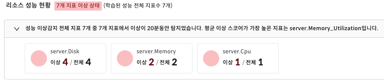

▶ \[그림7\] 리소스 성능 현황

성능 이상 Flow

해당 화면은 알람이 발생한 경우에만 표시됩니다. Time Navigator Bar에서 선택한 마커 시간에 기준 Window size 만큼의 기간동안 이상감지가 발생한 지표들을 시간별로 볼 수 있습니다.

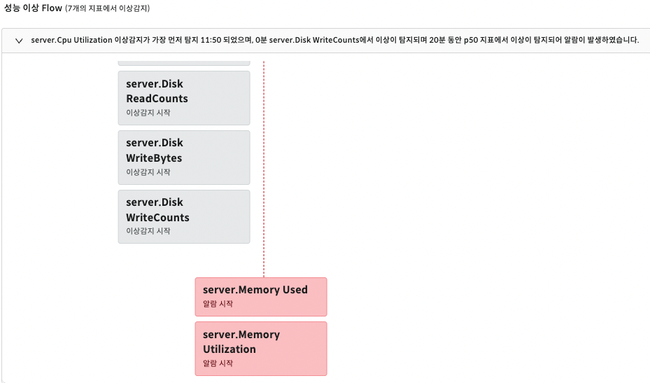

▶ \[그림8\] 성능 이상 Flow

성능 이상감지 패턴

해당 화면은 Time navigator bar에서 마커 기준으로 이상감지가 최근에 발생한 10개의 지표를 기준으로 과거 1시간 데이터를 조회합니다. 이상감지 패턴은 지표별, 이상감지 및 알람 발생 여부를 표현하고 있습니다.

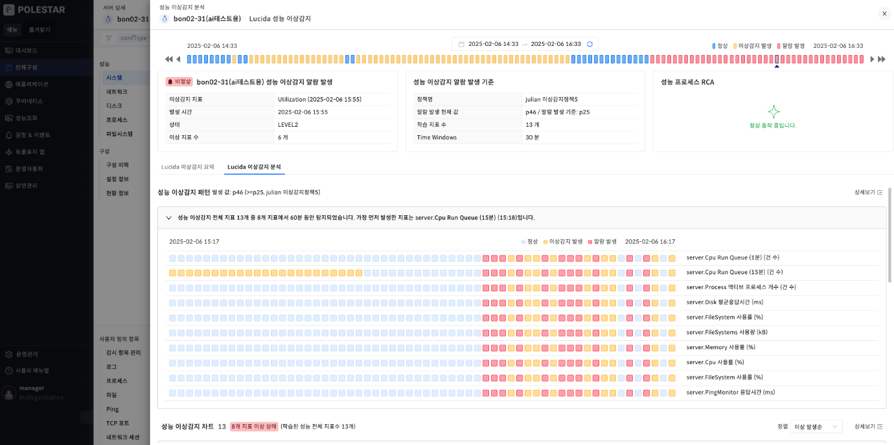

▶ \[그림10\] 성능 이상감지 패턴

성능 이상감지 패턴 항목

|                    |                                           |
| ------------------ | ----------------------------------------- |
| 발생 값 및 알람 발생 기준 정보 | 성능 이상감지 알람 발생 기준 항목 중, 알람 발생 현재 값과 동일합니다. |

성능 이상감지 패턴 상세보기

상세보기 화면에서는 이상감지가 발생한 모든 지표뿐만 아니라, 모니터링 되고 있는 정상 지표를 포함해서 조회합니다. 상세보기 화면 또한 \[\<\],\[\>\] 화살표는 1분, \[\<\<\],\[\>\>\] 를 통해, 조회 시점을 변경할 수 있으며, 캘린더를 통해 조회 시점을 변경할 수 있습니다.

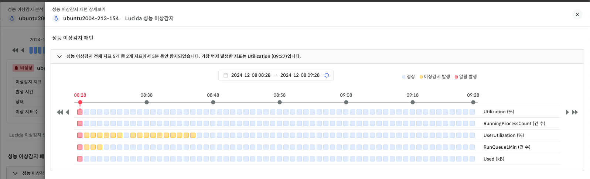

▶ \[그림11\] 성능 이상감지 패턴 상세보기

성능 이상감지 차트

해당 화면은 Time navigator bar에서 마커 기준으로 1시간 범위의 정보를, 사용자가 정한 기준으로 조회할 수 있습니다. 사용자는 정렬 선택 박스를 통해 \[이상 발생 순\], \[스코어가 높은 순\] 으로 정렬하여 조회할 수 있습니다. 또한 \[상세 보기\] 버튼을 통해, 화면에 조회된 차트 개수 외에 더 많은 차트를 조회할 수 있습니다.

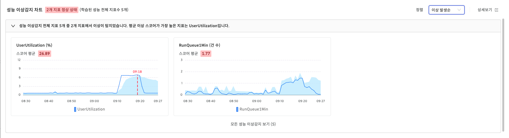

▶ \[그림12\] 성능 이상감지 차트

성능 이상감지 차트 항목

| 상태      | 현재 관제 대상 리소스에 학습된 전체 지표 중 이상 지표가 존재하는지 여부를 나타낸다. |
| ------- | ------------------------------------------------ |
| 학습 지표 수 | 현재 관제 대상 리소스의 학습된 전체 지표 수의 개수를 나타낸다.             |

성능 이상감지 차트 상세보기

상세 보기 화면에서는 이상 지표 외에 정상지표 차트도 조회할 수 있으며, 차트 별 \[좋아요\] 기능 및 \[확대 보기\] 기능을 제공합니다. \[확대 보기\]를 통해 조회된 상세보기 화면에서는 해당 지표의 성능 데이터를 포함한 이상감지 신뢰범위 등을 조회할 수 있습니다.

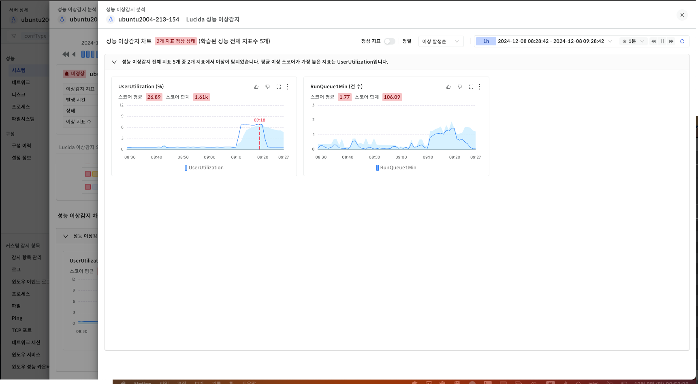

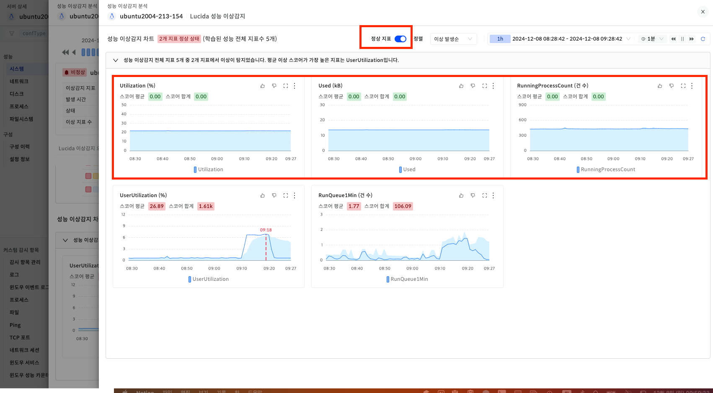

▶ \[그림13\] 성능 이상감지 차트 상세보기 & 정상지표 포함하기

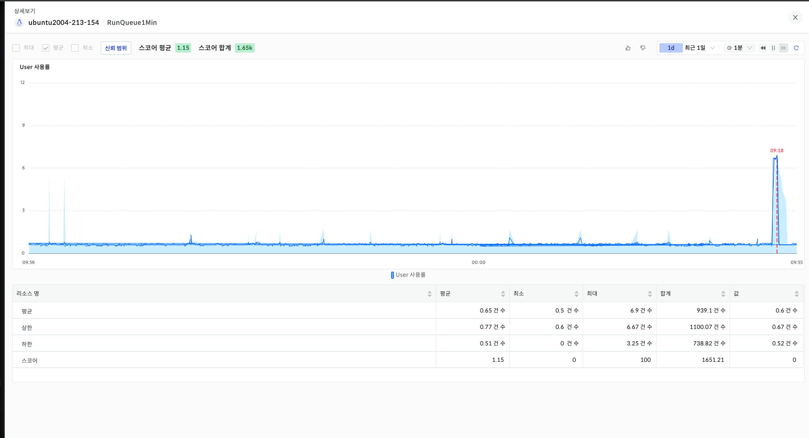

▶ \[그림14\] 성능 이상감지 차트 확대보기

<table>
<tbody>
<tr class="odd">
<td>
노트

각 성능 이상감지 차트 오른쪽 상단의 더보기 버튼 클릭시 [성능 조회 바로가기] 버튼이 있습니다. 해당 버튼 클릭시 성능 조회 화면으로 이동됩니다. 성능 조회 화면에서는 직접 조회조건을 입력해야 합니다.
</td>
</tr>
</tbody>
</table>

성능 프로세스 RCA 상세 보기

성능 프로세스 RCA 상세 보기 화면은 RCA 결과를 자세히 확인하기 위한 화면으로 성능 이상감지 분석 화면에서 \[성능 프로세스 RCA\] 카드의 오른쪽 상단 \[상세보기\] 버튼을 클릭시 볼 수 있습니다. 상세보기 화면의 상단에서는 RCA의 간단한 정보를 표시합니다.

RCA 정보

| RCA 상태               | SUCCESS, RUNNING, ERROR 상태 |
| -------------------- | -------------------------- |
| RCA 분석 시작 시간 및 종료 시간 | RCA 분석을 시작한 시간 및 종료한 시간    |
| 이상 지속 시간             | 이상감지 알람이 발생 후 이상이 지속되는 시간  |

영향도 Flow

이전 화면인 이상감지분석 화면의 성능 이상 Flow와 동일한 형태의 흐름도를 가집니다. 이상감지 알람이 발생한 시점은 지표 카드를 빨간색으로 표시합니다. 이상감지분석 화면의 Time Navigator Bar에서 선택한 마커 시간 기준 Window size 만큼의 기간동안 이상감지가 발생한 지표들을 시간별로 볼 수 있습니다. 지표 카드 중 KPI 지표인 경우에 한해서 RCA 결과인 스코어가 가장 높은 프로세스 이름과 스코어를 확인할 수 있습니다. 또한 해당 카드를 클릭시 \[전체 프로세스 성능 정보\]의 각 차트에 카드에 명시된 프로세스의 CPU, 메모리, 디스크 I/O성능 데이터를 차트에 오버레이합니다.

▶ \[그림9\] 이미지 업데이트 필요

전체 프로세스 성능 정보

RCA 분석 시점의 서버의 모든 프로세스 CPU, 메모리, 디스크 I/O 사용량의 총합을 차트로 보여줍니다. 각각의 차트에는 이상감지 알람 발생시점을 빨간색으로 표시하고 있습니다.

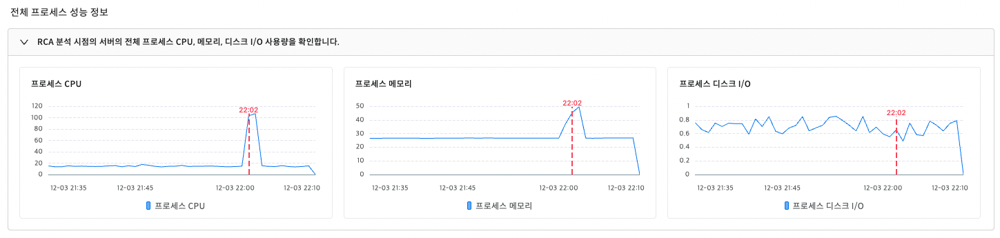

▶ \[그림15\] 전체 프로세스 성능 정보

프로세스 스코어 Top 10

RCA 기간 동안 스코어가 높은 열개의 이상 프로세스 정보를 보여줍니다. RCA 기간동안 이상이 발생한 원인이 되는 프로세스를 찾는데 도움이 됩니다.

▶ \[그림16\] 전체 프로세스 성능 정보

프로세스 스코어 Top 10 항목

| 순위         | 프로세스 스코어 합계 순위                          |
| ---------- | --------------------------------------- |
| 프로세스 이름    | 프로세스 이름                                 |
| 프로세스 기동 시간 | 프로세스 기동 시작 시간                           |
| 프로세스 정보    | 프로세스 args 정보                            |
| 이상탐지 정보    | 이상 타입 정보(Start, Stop, Timing, Workload) |
| 이상 스코어 합계  | 이상 스코어의 합계                              |

프로세스 스코어 Top List

RCA 기간 동안의 모든 프로세스에 대한 정보를 이상 스코어별로 내림차순하여 보여줍니다. \[프로세스 스코어 Top10\] 영역의 \[상세보기\] 버튼 클릭시 해당 화면을 볼 수 있습니다. 프로세스 행을 클릭시 \[전체 프로세스 성능 정보\] 화면에 해당 프로세스의 CPU, 메모리, 디스크 I/O 성능 데이터를 오버레이합니다.

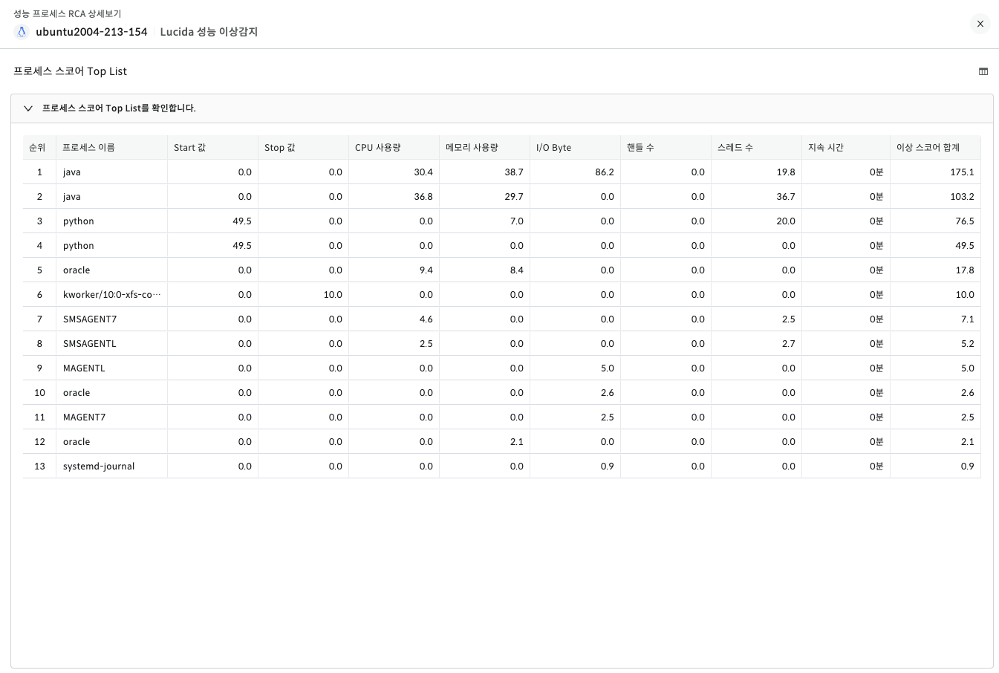

▶ \[그림17\] 프로세스 스코어 Top List

프로세스 스코어 Top 10 항목

| 순위        | 프로세스 스코어 합계 순위     |
| --------- | ------------------ |
| 프로세스 이름   | 프로세스 이름            |
| Start 값   | Start 타입의 스코어      |
| Stop 값    | Stop 타입의 스코어       |
| CPU 사용량   | 프로세스의 CPU 사용량 스코어  |
| 메모리 사용량   | 프로세스의 메모리 사용량 스코어  |
| I/O Byte  | 프로세스의 I/O Byte 스코어 |
| 핸들 수      | 프로세스의 핸들 수 스코어     |
| 스레드 수     | 프로세스의 스레드 수 스코어    |
| 지속 시간     | 프로세스의 지속 시간        |
| 이상 스코어 합계 | 프로세스의 이상 스코어 합계    |

