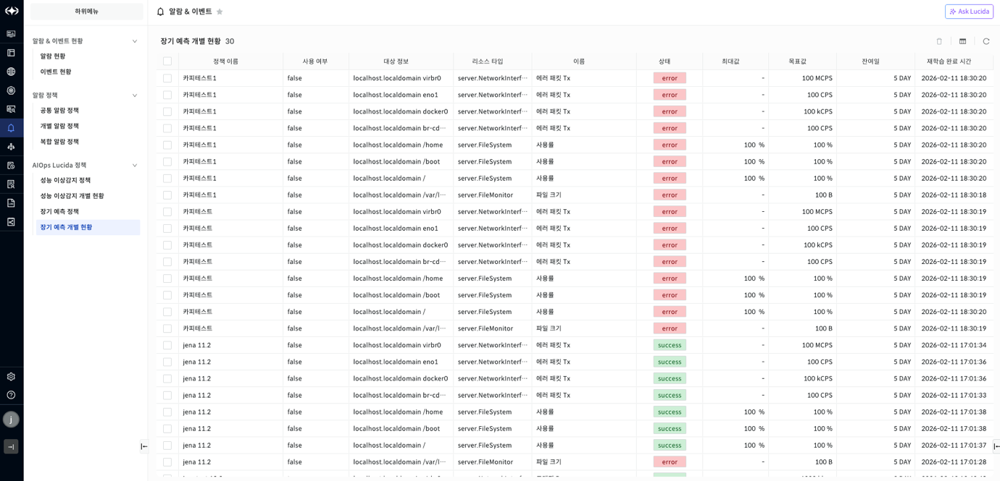
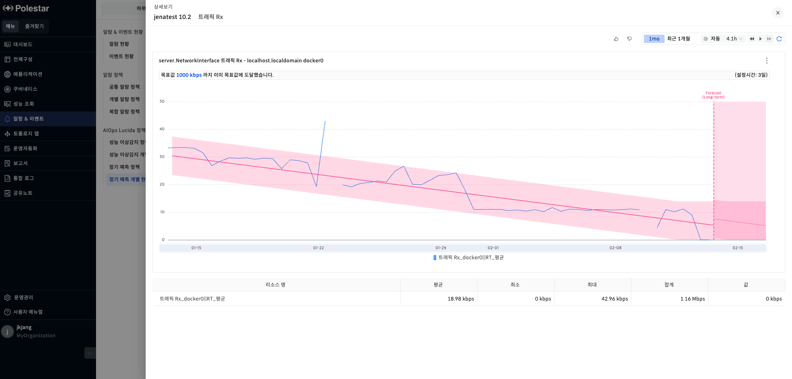

장기 예측 개별 현황

장기 예측 개별 현황은 장기 예측 정책을 통해 생성된 장기 예측 결과를 보여주는 화면입니다.

▶ \[그림1\] 장기 예측 개별 현황 목록

장기 예측 개별 현황 목록 컬럼

| 정책 이름     | 장기 예측 정책 이름입니다.                |
| --------- | ------------------------------ |
| 사용 여부     | 장기 예측 정책 사용 여부입니다.             |
| 대상 정보     | 리소스 이름입니다.                     |
| 리소스 타입    | 장기 예측 대상의 리소스 타입입니다.           |
| 이름        | 지표 이름입니다.                      |
| 상태        | 장기 예측 학습 상태(success/error)입니다. |
| 최대값       | 장기 예측 정책에서 설정한 최대값입니다.         |
| 목표값       | 장기 예측 정책에서 설정한 목표값입니다.         |
| 잔여일       | 목표값 도달까지 남은 시간                 |
| 재학습 완료 시간 | 장기 예측 재학습 완료 시간                |

장기 예측 상세 보기

장기 예측 개별 현황에서 사용 여부가 true상태인 행의 정책 이름 클릭시 장기 예측 상세보기가 나옵니다. 상세보기에서는 장기 예측 추세선과 성능 데이터 차트, 장기 예측 정보 등을 확인할 수 있습니다.

▶ \[그림2\] 장기 예측 상세 보기

