즐겨찾기

즐겨찾기 기능은 POLESTAR10의 모든 메뉴에서 등록된 자주 가는 페이지들을 등록할 수 있는 기능이 제공됩니다.

즐겨찾기 목록

즐겨찾기의 목록을 확인할 수 있고 신규 그룹 생성, 삭제 및 즐겨찾기를 다른 위치로 드래그하여 옮길 수 있습니다.

<table>
<tbody>
<tr class="odd">
<td>
노트

좌측 메뉴 [즐겨찾기] 탭에는 등록된 즐겨찾기 목록이 표출되고 클릭 시 등록된 페이지로 이동됩니다.

[+] 버튼을 이용하여 즐겨찾기 그룹을 추가 할 수 있습니다.

[펼침/접힘] 아이콘을 클릭하여 트리를 펼치거나 접을 수 있습니다.

[톱니바퀴] 아이콘을 클릭하면 즐겨찾기 관리 화면이 호출됩니다.

즐겨찾기 관리 페이지에서 즐겨찾기 그룹 및 즐겨찾기 항목을 수정하거나 삭제 할 수 있습니다.

자세한 내용은 아래 매뉴얼에 기술 되어있습니다.
</td>
</tr>
</tbody>
</table>

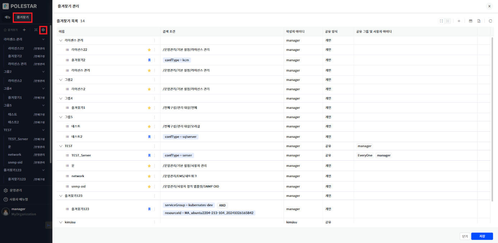

▶ \[그림1\] 즐겨찾기 목록

화면 지표

<table>
<thead>
<tr class="header">
<th>이름</th>
<th>즐겨찾기 그룹 및 즐겨찾기의 이름을 표시합니다.</th>
</tr>
</thead>
<tbody>
<tr class="odd">
<td>검색조건</td>
<td>
즐겨찾기 저장 시 조건을 표시합니다.

필터와 페이지 즐겨찾기가 표시되며 필터는 북마크 아이콘, 페이지는 별 아이콘으로 확인할 수 있습니다.
</td>
</tr>
<tr class="even">
<td>작성자 아이디</td>
<td>작성자의 아이디를 표시합니다.</td>
</tr>
<tr class="odd">
<td>공유 방식</td>
<td>
공유 방식을 표시합니다.

공유 : 공유 함 선택 시 표시

개인 : 공유 안함 선택 시 표시
</td>
</tr>
<tr class="even">
<td>공유 그룹 및 사용자 아이디</td>
<td>
공유할 그룹 및 사용자의 아이디를 표시합니다.

최대 5개의 그룹 및 사용자 아이디가 표시되고, 그 이상은 [+숫자] 태그를 클릭하면 확인할 수 있습니다.
</td>
</tr>
<tr class="odd">
<td>삭제</td>
<td>
관심 목록을 삭제하는 기능을 하는 아이콘 입니다.

삭제는 관심 목록 작성자로 로그인했을 경우에만 가능합니다.
</td>
</tr>
<tr class="even">
<td>저장</td>
<td>
즐겨찾기의 목록을 저장하는 버튼입니다.

그룹 하위의 즐겨찾기를 다른 그룹의 하위로 드래그하여 위치를 옮긴 후 버튼을 클릭하여 저장합니다.
</td>
</tr>
</tbody>
</table>

즐겨찾기 그룹 등록

즐겨찾기 목록을 체계적으로 관리할 수 있는 그룹을 생성하는 기능입니다.

즐겨찾기 목록에서 추가 버튼을 누르면 즐겨찾기 그룹을 등록할 수 있는 드로우 박스가 열립니다.

<table>
<tbody>
<tr class="odd">
<td>
노트

그룹 생성은 1계층만 표현할 수 있으며 특정 그룹 하위에 새로운 그룹을 생성할 수는 없습니다.

신규 그룹 생성 시 기본위치는 즐겨찾기 메뉴 가장 하단에 생성됩니다.
</td>
</tr>
</tbody>
</table>

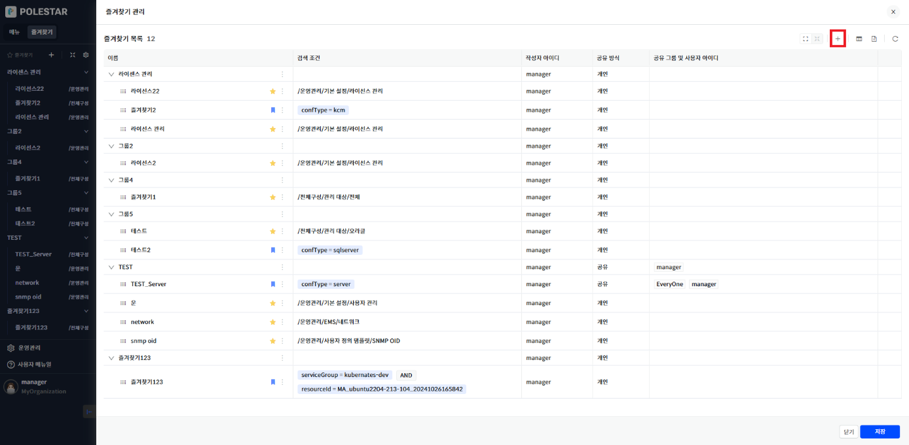

▶ \[그림2\] 즐겨찾기 그룹 등록

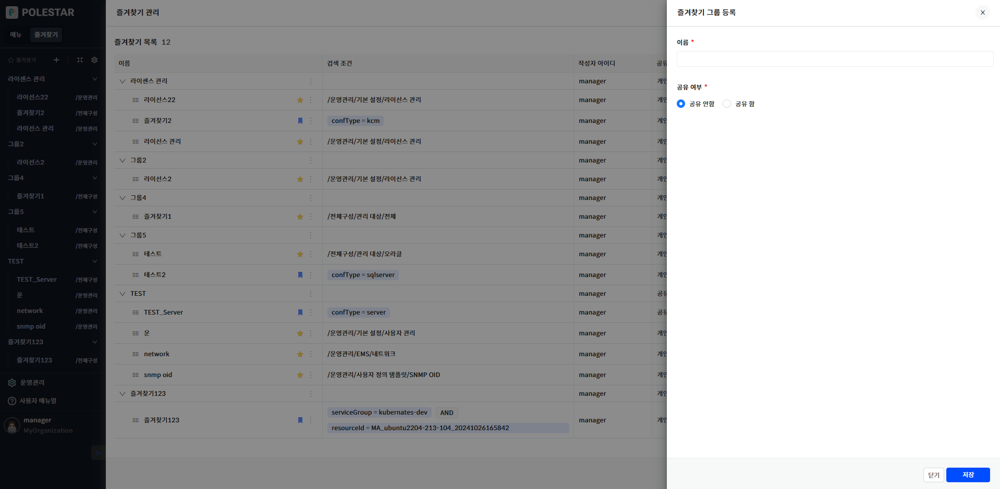

▶ \[그림3\] 즐겨찾기 그룹 등록 드로우 화면

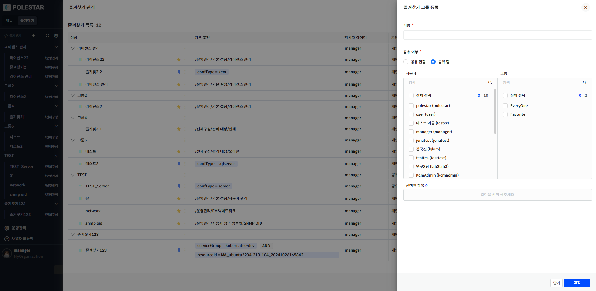

▶ \[그림4\] 즐겨찾기 그룹 등록 드로우 화면 – \[공유 함\] 선택 시

화면 지표

<table>
<thead>
<tr class="header">
<th>이름</th>
<th>
즐겨찾기 그룹의 이름을 입력합니다.

기존 즐겨찾기 그룹과 같은 이름으로 저장할 수 없습니다.
</th>
</tr>
</thead>
<tbody>
<tr class="odd">
<td>공유 여부</td>
<td>
공유 여부를 선택합니다.

[공유함] 선택 시 검색 박스가 활성화되어, 공유할 사용자/그룹을 선택할 수 있습니다.

사용자/그룹 선택 시 [선택된 항목]에 표시됩니다.
</td>
</tr>
</tbody>
</table>

즐겨찾기 등록

즐겨찾기는 필터와 페이지로 등록할 수 있습니다.

필터에 검색 조건을 입력하여 등록 버튼(북마크 아이콘)을 누르면 즐겨찾기를 등록할 수 있는 드로우 박스가 열립니다.

현재 페이지에서 별 아이콘을 누르면 페이지를 즐겨찾기 등록할 수 있는 드로우 박스가 열립니다.

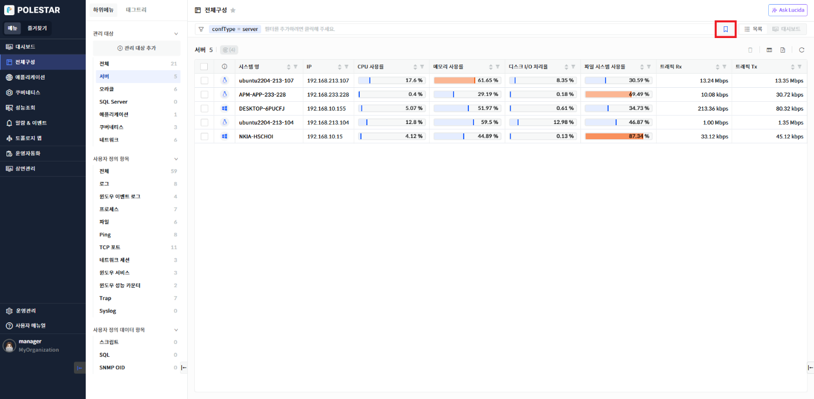

▶ \[그림5\] 필터 즐겨찾기 등록

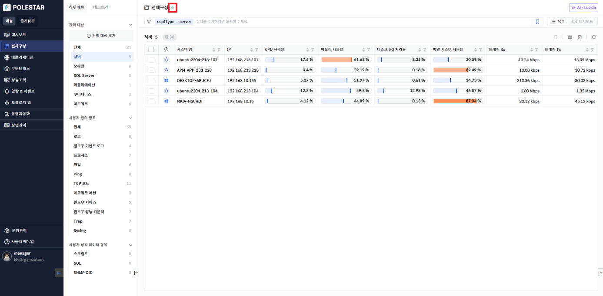

▶ \[그림6\] 페이지 즐겨찾기 등록

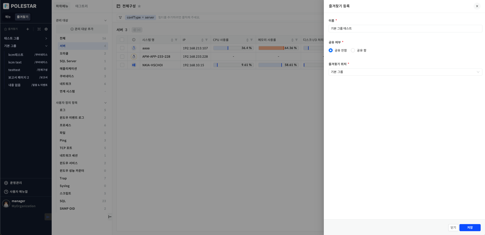

▶ \[그림7\] 즐겨찾기 등록 드로우 화면

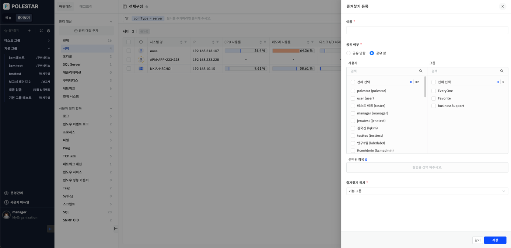

▶ \[그림8\] 즐겨찾기 등록 드로우 화면 – \[공유 함\] 선택 시

화면 지표

<table>
<thead>
<tr class="header">
<th>이름</th>
<th>
즐겨찾기의 이름을 입력합니다.

기존 즐겨찾기 목록과 같은 이름으로 저장할 수 없습니다.
</th>
</tr>
</thead>
<tbody>
<tr class="odd">
<td>공유 여부</td>
<td>
공유 여부를 선택합니다.

[공유함] 선택 시 검색 박스가 활성화되어, 공유할 사용자/그룹을 선택할 수 있습니다.

사용자/그룹 선택 시 [선택된 항목]에 표시됩니다.
</td>
</tr>
<tr class="even">
<td>즐겨찾기 위치</td>
<td>
기존 즐겨찾기의 그룹에 추가할 수 있습니다.

기본그룹 선택 시 기본그룹 내에 즐겨찾기가 추가됩니다.
</td>
</tr>
</tbody>
</table>

즐겨찾기 등록 절차

  - 필터

<!-- end list -->

1.  필터에 검색 조건 입력

2.  즐겨찾기 등록 버튼(북마크 아이콘) 클릭

3.  이름, 공유 여부, 즐겨찾기 위치 입력

4.  저장 버튼 클릭

<!-- end list -->

  - 페이지

<!-- end list -->

1.  즐겨찾기 할 페이지에 접속한다.

2.  즐겨찾기 등록 버튼 (별 아이콘) 클릭

3.  이름, 공유 여부, 즐겨찾기 위치 입력

4.  저장 버튼 클릭

즐겨찾기 수정

이름 옆 아이콘을 누르면 나타나는 즐겨찾기 수정을 누르면, 즐겨찾기를 수정할 수 있는 드로우가 열립니다.

<table>
<tbody>
<tr class="odd">
<td>
노트

수정은 즐겨찾기 작성자로 로그인했을 경우에만 가능합니다.

좌측 메뉴 [즐겨찾기] 탭의 톱니바퀴 아이콘을 클릭하면 즐겨찾기 관리 페이지가 호출됩니다.
</td>
</tr>
</tbody>
</table>

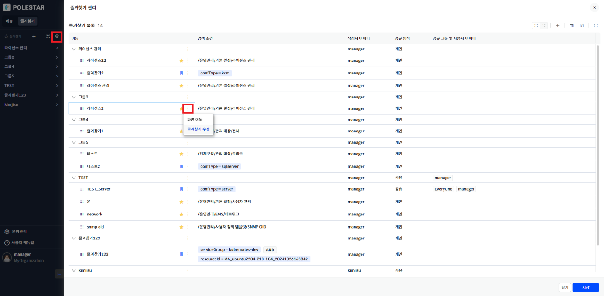

▶ \[그림9\] 즐겨찾기 수정

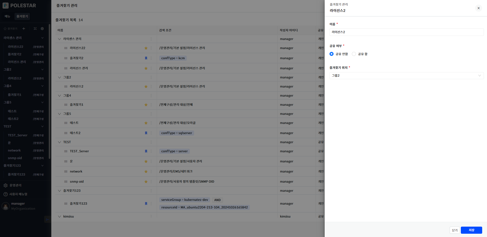

▶ \[그림10\] 즐겨찾기 수정 드로우

즐겨찾기 삭제

즐겨찾기 목록에서 삭제 버튼을 누르면 즐겨찾기 목록에서 즐겨찾기를 삭제할 수 있습니다.

<table>
<tbody>
<tr class="odd">
<td>
주의

삭제는 즐겨찾기 작성자로 로그인했을 경우에만 가능합니다..
</td>
</tr>
</tbody>
</table>

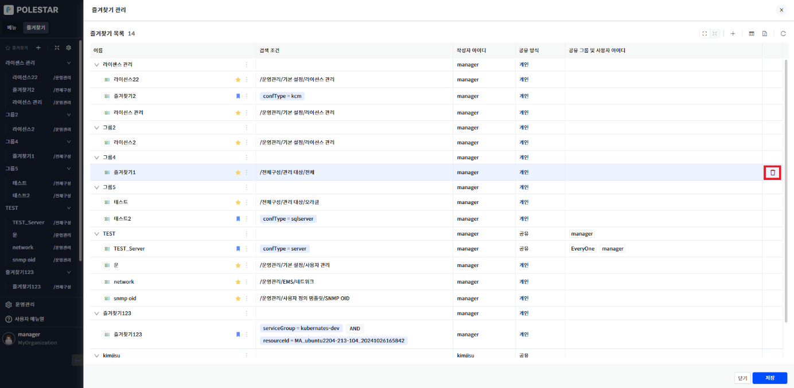

▶ \[그림11\] 즐겨찾기 삭제

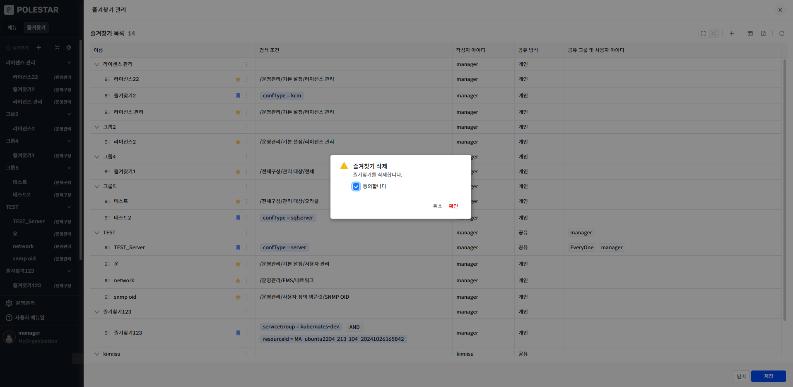

▶ \[그림12\] 즐겨찾기 삭제 확인

즐겨찾기 화면 이동

즐겨찾기 목록에서 검색 조건으로 화면 이동하는 기능으로 화면 이동을 누르면, 해당 검색 조건으로 이동됩니다.

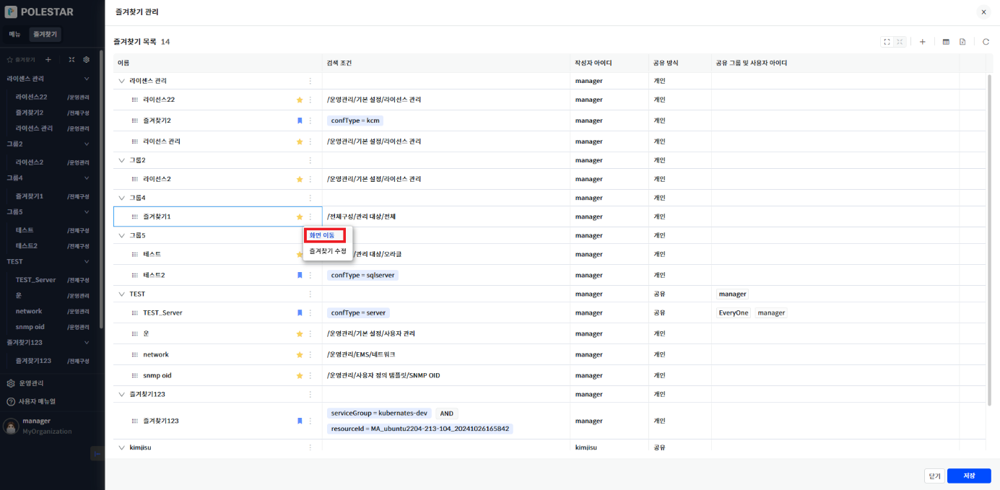

▶ \[그림13\] 즐겨찾기 화면 이동

