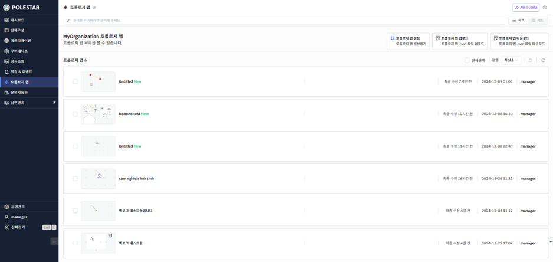
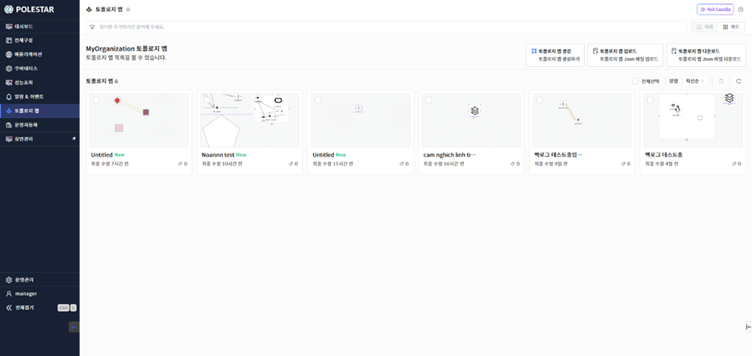
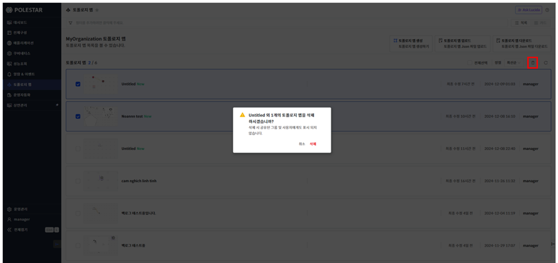
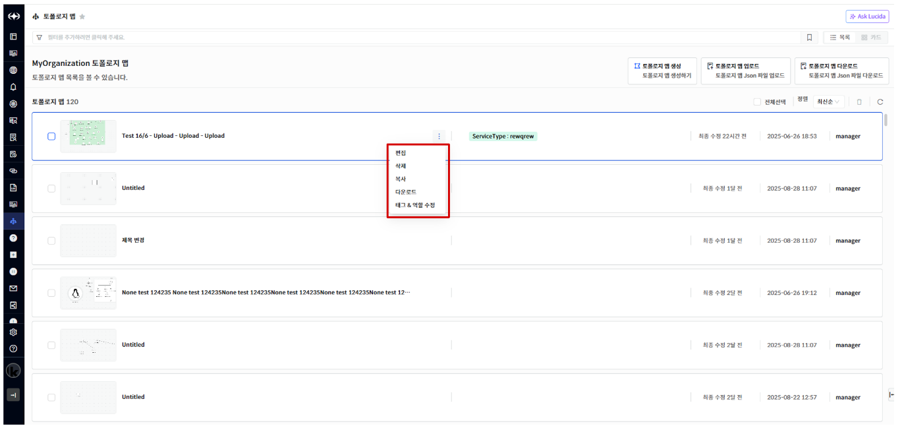
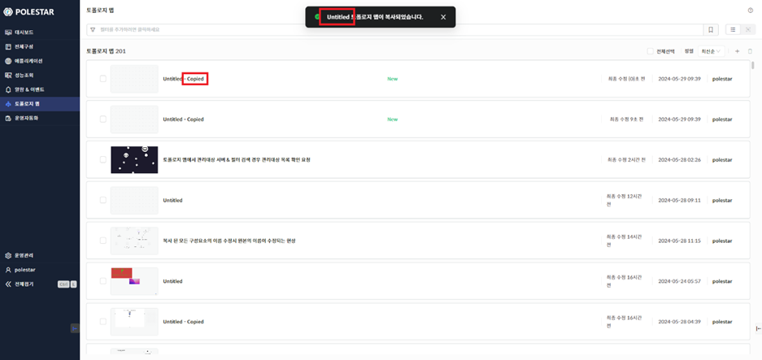
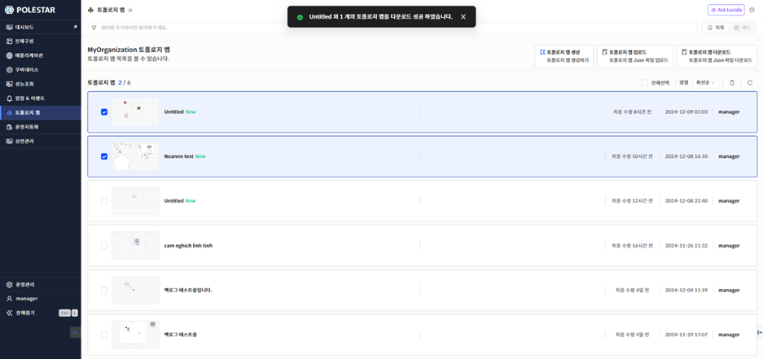

토폴로지 맵 목록

토폴로지 맵을 조회하기 위해서는 화면 왼쪽 메인메뉴 영역에서 토폴로지 맵 메뉴를 선택합니다. 토폴로지 맵은 목록 형식과 썸네일 형식 두가지로 조회가 가능합니다.

<table>
<tbody>
<tr class="odd">
<td>
노트

토폴로지 맵을 구성하기 위해서는 [관리 대상]이 미리 등록되어 있어야 합니다.
</td>
</tr>
</tbody>
</table>

> ▶ \[그림1\] 토폴로지 맵 목록

> ▶ \[그림2\] 토폴로지 썸네일 목록

토폴로지 맵 삭제

삭제할 토폴로지 맵을 선택하고 \[삭제\] 버튼을 클릭하면 토폴로지 맵을 삭제할 수 있습니다.

\[전체선택\] 버튼을 클릭하면 모든 토폴로지 맵을 선택할 수 있으며 \[삭제\] 버튼을 클릭하면 모든 토폴로지 맵을 삭제할 수 있습니다.

<table>
<tbody>
<tr class="odd">
<td>
노트

토폴로지 맵을 삭제하면 해당 디비에서 완전히 삭제가 되기 때문에 한번 더 확인을 해야 합니다.
</td>
</tr>
</tbody>
</table>

> ▶ \[그림3\] 토폴로지 맵 삭제
> 
> 토폴로지 맵 삭제 절차

1.  삭제하고자 하는 토폴로지 맵 선택 (다중 선택 가능)

2.  테이블 우측 상단의 삭제 아이콘 클릭

3.  메시지창에서 확인 클릭

토폴로지 맵 개별 메뉴

토폴로지 맵에서 마우스 오버시 개별 메뉴가 표시됩니다. 개별 메뉴에는 \[편집\], \[삭제\], \[복사\], \[다운로드\], \[태그&역할 수정\] 기능을 이용할 수 있습니다.

▶ \[그림4\] 토폴로지 맵 개별 메뉴

> 개별 메뉴

| 편집       | 선택된 토폴로지 맵을 편집할 수 있는 화면을 팝업합니다.                             |
| -------- | ----------------------------------------------------------- |
| 삭제       | 선택된 토폴로지 맵을 삭제합니다.                                          |
| 복사       | 선택된 토폴로지 맵을 복사합니다.                                          |
| 다운로드     | 선택된 토폴로지 맵을 다운로드 합니다.                                       |
| 태그&역할 수정 | 선택된 토폴로지 맵의 태그를 추가/삭제 할 수 있습니다. 접근 제어를 설정하여 역할를 변경할 수 있습니다. |

<table>
<tbody>
<tr class="odd">
<td>
노트

Administrators 역할은 가지고 있는 사용자는 해당 역할의 권한을 수정할 수 없습니다.
</td>
</tr>
</tbody>
</table>

토폴로지 맵 복사

토폴로지 맵 개별 메뉴에서 \[복사\] 기능을 이용할 수 있습니다. 토폴로지 맵을 복사할 경우 원본의 모든 데이터를 복사하며 이름 뒤에 \[-Copied\] 를 추가하여 생성합니다.

▶ \[그림5\] 토폴로지 맵 복사

> 토폴로지 맵 복사 절차

1.  복사하고자 하는 토폴로지 맵의 개별 메뉴 호출

2.  복사 메뉴를 클릭

3.  토폴로지 맵 목록에서 확인

토폴로지 맵 업로드/다운로드

토폴로지 맵 목록의 메뉴에서 \[업로드\], \[다운로드\] 기능을 이용할 수 있습니다. 토폴로지 맵을 \[다운로드\]할 경우 선택된 토폴로지 맵을 JSON 파일로 다운로드합니다. 여러 개의 토폴로지 맵을 선택할 수 있습니다. \[다운로드\]로 받은 JSON 파일을 \[업로드\]를 이용하여 새로운 토폴로지 맵을 생성할 수 있습니다. 생성된 토폴로지 맵은 이름 뒤에 \[-Upload\]를 추가하여 생성합니다.

▶ \[그림7\] 토폴로지 맵 다운로드

