토폴로지 맵 뷰어

구성이 완료된 토폴로지 맵을 확인할 수 있습니다. 노드의 알람과 가용성 정보를 주기적으로 확인할 수 있으며 컨텍스트 메뉴를 이용하여 여러가지 액션을 실행할 수 있습니다.

<table>
<tbody>
<tr class="odd">
<td>
노트

노드의 성능은 개발 중이며 다음 버전에서 확인할 수 있습니다.
</td>
</tr>
</tbody>
</table>

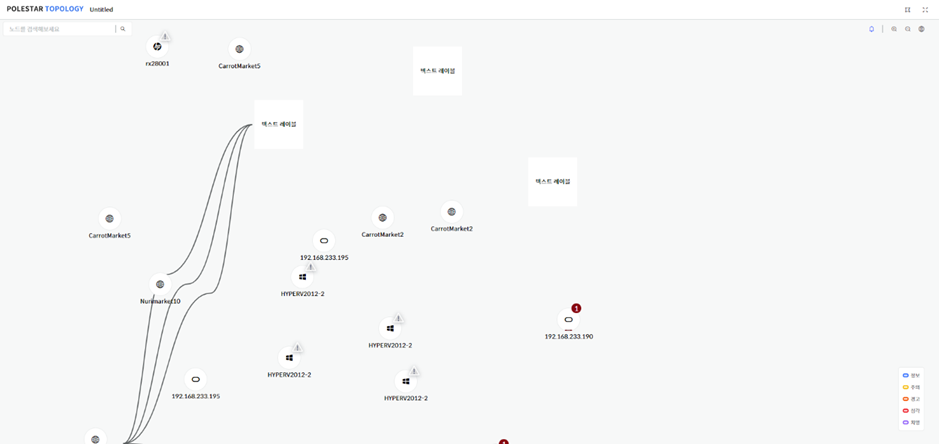

> ▶ \[그림1\] 토폴로지 맵 뷰어

토폴로지 맵 레이아웃

토폴로지 맵은 개별 팝업으로 화면을 구성하여 기존과 다른 화면 레이아웃을 가지고 있습니다.

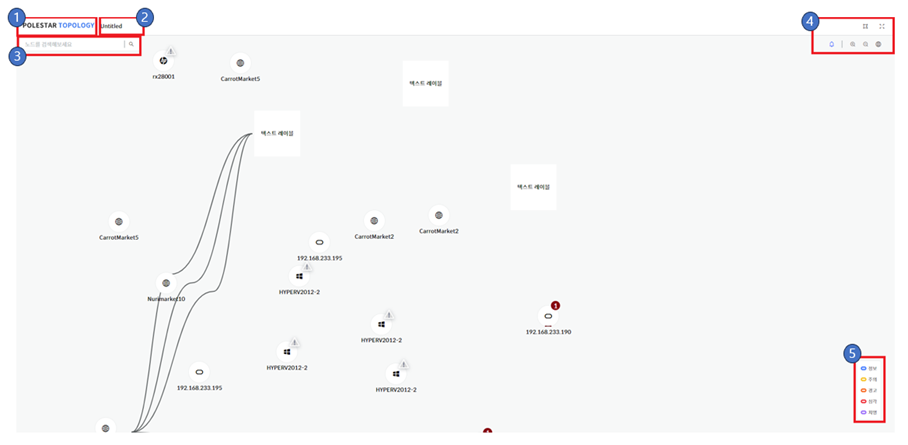

> ▶ \[그림2\] 토폴로지 맵 레이아웃
> 
> 레이 아웃

| 제품 로고 | 제품 로고를 표시합니다.                                      |
| ----- | ---------------------------------------------------------------------------------------------------------------------------------------------------------------------------- |
| 이름    | 토폴로지 맵 이름을 표시합니다.                                  |
| 노드 검색 | 노드 검색을 할 수 있으며 특정 이름을 입력하면 표시합니다.                  |
| 도구 모음 |  도구 모음을 이용하여 간단한 설정을 할 수 있습니다.                     |
| 알람 범례 |  알람 범례를 표시합니다. 범례를 클릭할 경우 특정 알람을 보이기/감추기 할 수 있습니다. |

> 도구 모음

<table>
<thead>
<tr class="header">
<th>편집 모드</th>
<th><blockquote>

편집 모드로 이동합니다.

</blockquote></th>
</tr>
</thead>
<tbody>
<tr class="odd">
<td>확장</td>
<td><blockquote>

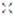 토폴로지 맵 화면을 확장합니다.

</blockquote></td>
</tr>
<tr class="even">
<td>알람</td>
<td><blockquote>

 알람을 보이기/감추기를 설정합니다.

</blockquote></td>
</tr>
<tr class="odd">
<td>확대</td>
<td><blockquote>

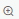 토폴로지 맵을 확대합니다. Control + 마우스 휠을 위로 올려도 같은 동작을 합니다.

</blockquote></td>
</tr>
<tr class="even">
<td>축소</td>
<td>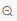 토폴로지 맵을 축소합니다. Control + 마우스 휠을 아래로 내려도 같은 동작을 합니다</td>
</tr>
<tr class="odd">
<td>미니맵</td>
<td>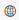 미니맵을 보이기/감추기를 설정합니다</td>
</tr>
</tbody>
</table>

노드 검색

토폴로지 맵에 구성된 특정 이름을 찾을 수 있습니다.

<table>
<tbody>
<tr class="odd">
<td>
노트

노드 검색은 노드의 이름을 기준으로 검색을 하며 노드에 맵핑된 서버의 이름은 검색 기준이 아닙니다.
</td>
</tr>
</tbody>
</table>

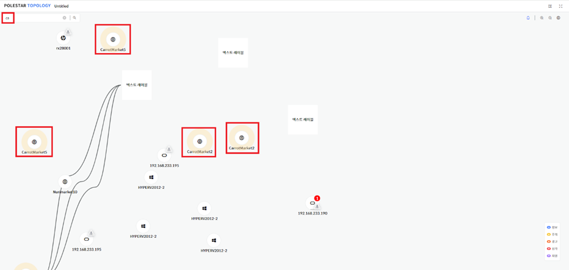

> ▶ \[그림3\] 노드 검색

가용성 표시

노드의 가용성에 따라 특정 아이콘으로 표시를 합니다. 토폴로지 설정의 \[등급 표시 위치\] 설정에 따라 표시되는 방법이 달라집니다.

> 가용성

| 상태      | 테두리                                                                                                                        | 아이콘                                                                                                                        | 하단                                                                                                                         |
| ------- | -------------------------------------------------------------------------------------------------------------------------- | -------------------------------------------------------------------------------------------------------------------------- | -------------------------------------------------------------------------------------------------------------------------- |
| UP      |  |  |  |
| DOWN    | 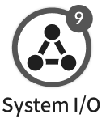 | 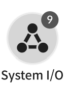 | 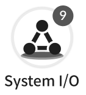 |
| UNKNOWN |  | 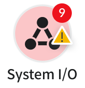 |  |

노드 컨텍스트 메뉴

토폴로지 맵에 구성된 노드에서 오른쪽 클릭하면 컨텍스트 메뉴를 호출할 수 있습니다.

<table>
<tbody>
<tr class="odd">
<td>
노트

컨텍스트 메뉴는 노드의 리소스 타입에 따라 다릅니다.
</td>
</tr>
</tbody>
</table>

> 컨텍스트 메뉴

| 상세 보기        | 노드의 상세 정보를 팝업 합니다.                              |
| ------------ | ----------------------------------------------- |
| 알람 조회        | 노드에 발생된 알람을 팝업 합니다.                             |
| Ping 체크      | 리소스 타입이 서버일 경우 표시되며 Ping 체크를 할 수 있는 화면을 팝업 합니다. |
| HTTP 연결      | 노드의 HTTP 연결 설정에 표시된 항목으로 팝업 합니다.                |
| **HTTPS 연결** | **노드의 HTTPS 연결 설정에 표시된 항목으로 팝업 합니다.**           |

