토폴로지 맵 편집

토폴로지 맵을 신규 혹은 기존의 토폴로지 맵을 편집할 수 있습니다. 구성요소는 \[관리 대상\]과 맵핑 되는 노드, 더미 노드, 텍스트 혹은 시간을 표시하는 텍스트 레이블과 노드와 노드를 연결하는 링크로 구성되어 있습니다. 배경 이미지를 설정할 수 있으며 구성된 내용이 목록에서 썸네일로 제공됩니다.

<table>
<tbody>
<tr class="odd">
<td>
노트

썸네일은 편집화면에서 주기적으로 생성하기 때문에 단기간 화면에 있을 경우 생성이 되지 않을 수 있습니다.
</td>
</tr>
</tbody>
</table>

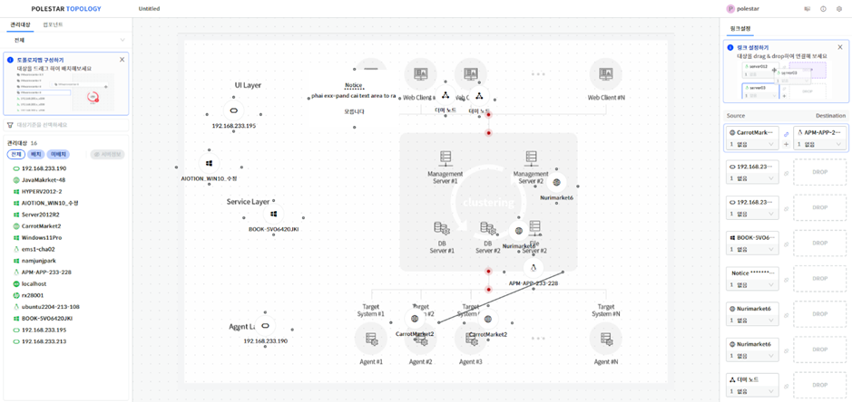

> ▶ \[그림1\] 토폴로지 맵 편집

토폴로지 맵 레이아웃

토폴로지 맵은 개별 팝업으로 화면을 구성하여 기존과 다른 화면 레이아웃을 가지고 있습니다.

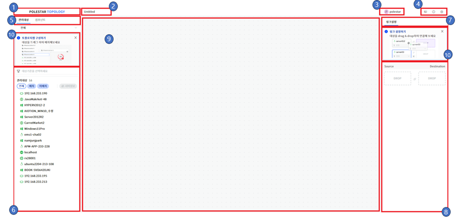

▶ \[그림2\] 토폴로지 맵 레이아웃

> 레이아웃

| 제품 로고   | 제품 로고를 표시합니다.                                                                  |
| ------- | -------------------------------------------------------------------------------------------------------------------------------------------------------------------------------------------------------- |
| 이름      | 토폴로지 맵 이름을 표시합니다. 클릭 후 변경할 수 있습니다.                                             |
| 사용자     | 현재 사용자를 표시합니다.                                                                 |
| 도구 모음   |  뷰어 화면 이동/도움말/토폴로지 맵 설정을 할 수 있는 도구 모음입니다.                                      |
| 구성 요소   |  노드/더미 노드/텍스트 레이블과 같은 토폴로지 맵을 구성하는 구성요소를 선택할 수 있습니다. 관리대상과 컴포넌트 탭으로 구성되어 있습니다. |
| 관리대상 조회 |  노드를 구성할 수 있는 관리대상을 조회하는 화면입니다.                                                |
| 속성      |  링크 설정과 각 컴포넌트의 속성을 설정할 수 있습니다. 기본은 링크 설정 탭으로 표시되며 선택된 컴포넌트에 따라 해당 속성이 표시됩니다.  |
| 링크 설정   | 토폴로지 맵에서 구성된 링크 관계가 표시됩니다. Drag\&Drop 를 이용하여 쉽게 링크를 설정할 수 있습니다.                |
| 컨텐츠 영역  | 토폴로지 맵을 구성하는 영역입니다.                                                            |
| 도움말     | 편집을 시작하기 위한 도움말을 표시합니다. 닫기를 누르면 다음부터는 표시되지 않습니다. 쿠키를 삭제하면 도움말을 다시 볼 수 있습니다.    |

> 도구 모음

| 뷰어 모드 | 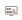 뷰어 모드로 이동합니다.                    |
| ----- | ----------------------------------------------------------------------------------------------------------------------------------------------------------- |
| 도움말   | 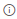 토폴로지 맵 초기에 표시한 도움말을 확인 할 수 있습니다. |
| 설정    | 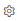 토폴로지 맵 설정화면을 팝업 합니다.             |

토폴로지 맵 설정

토폴로지 맵에 필요한 설정을 팝업 합니다. 배경 이미지 설정과 트래픽 표시 설정을 할 수 있습니다.

<table>
<tbody>
<tr class="odd">
<td>
노트

토폴로지 맵의 설정은 기본적으로 실시간 적용이지만 설정 화면은 저장을 눌러야 설정된 내용이 적용 됩니다.
</td>
</tr>
</tbody>
</table>

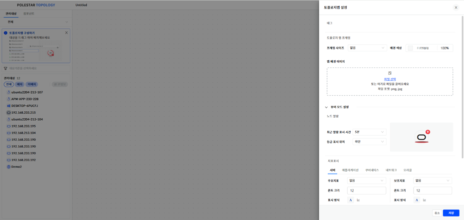

> ▶ \[그림3\] 토폴로지 맵 설정
> 
> 설정 내용

| 태그           | 적용할 태그를 설정/해제합니다.                                                                 |
| ------------ | --------------------------------------------------------------------------------- |
| 프레임 사이즈      | 맵의 영역을 설정합니다.                                                                     |
| 배경 색상        | 맵의 배경 색상을 설정합니다.                                                                  |
| 배경 이미지       | 맵의 배경 이미지 파일을 선택합니다. 이미지 파일 형태(JPG, PNG)만 업로드 가능합니다.                              |
| 최근 알람 표시 시간  | 설정된 시간 안에 알람이 발생된 노드가 있는 경우 해당 노드에 알람이 발생되었다는 효과를 표시합니다.                          |
| 등급 표시 위치     | 노드에 발생한 알람 표시 방법을 설정할 수 있습니다.                                                     |
| 주요지표         | 뷰어에서 표시할 노드의 지표를 설정합니다.                                                           |
| 폰트크기         | 뷰어에서 표시할 노드의 지표의 폰트 크기를 설정합니다.                                                    |
| 표시방식         | 뷰어에서 표시할 노드의 지표의 표시 방식을 설정합니다.                                                    |
| 보조지표         | 뷰어에서 표시할 노드의 지표를 설정합니다.                                                           |
| 노드명 IP 표시    | 노드의 이름을 관리지표의 장비명과 IP 주소를 표시합니다.                                                  |
| 링크 상태 표시     | 링크에 할당된 리소스가 다운상태가 될 경우 링크 상태 표시를 표시할지 여부를 설정합니다. 설정된 경우 다운상태가 된 링크는 붉은색으로 점멸합니다. |
| 링크 트래픽 정보 표시 | 링크에 트래픽 RX/TX 정보를 표시할지 여부를 설정합니다.                                                 |
| 색상 기준        | 링크 의 색상을 표현할 기준을 선택합니다.                                                           |

편집 액션

토폴로지 맵을 편집하기 위한 다양한 액션을 제공합니다.

> 액션

| 마우스 왼쪽 클릭 (MLC)    | 컴포넌트를 선택/해제합니다.           |
| ------------------ | ------------------------- |
| 마우스 오른쪽 클릭 (MRC)   | 컨텍스트 메뉴를 호출합니다.           |
| MLC + Drag         | 컴포넌트를 다중 선택합니다.           |
| Ctrl + MLC         | 컴포넌트를 추가로 선택/해제합니다.       |
| Space + MLC + Drag | 토폴로지 맵 화면을 이동합니다.         |
| Ctrl + A           | 모든 컴포넌트를 선택합니다.           |
| Ctrl + C           | 선택한 컴포넌트를 복사합니다.          |
| Ctrl + V           | 복사된 컴포넌트를 붙여넣기 합니다.       |
| Ctrl + Z           | 컴포넌트 관련 행동을 이전으로 되돌립니다.   |
| Ctrl + Y           | 되돌린 이전 행동을 다시 실행합니다.      |
| Del                | 선택한 컴포넌트를 삭제합니다.          |
| Ctrl + 화살표         | 화살표 방향으로 선택된 컴포넌트를 이동합니다. |

노드 추가 및 속성

노드 추가는 관리대상을 클릭 후 토폴로지 맵 영역으로 Drag 하면 추가됩니다. 노드를 클릭하면 속성을 확인할 수 있습니다.

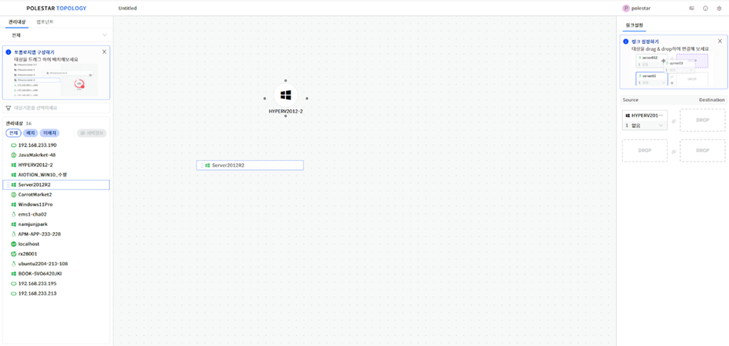

▶ \[그림4\] 노드 추가

> 속성 내용

| 노드 기본 정보 | 관리 대상의 기본 정보를 표시합니다.       |
| -------- | -------------------------- |
| 시스템명     | 관리 대상의 시스템명을 표시합니다.        |
| IP       | 관리 대상의 IP 정보를 표시합니다.       |
| 리소스 타입   | 관리 대상의 리소스 타입을 표시합니다.      |
| 텍스트 스타일  | 텍스트 관련 스타일을 설정합니다.         |
| 텍스트      | 토폴로지 맵에 표시할 텍스트를 설정합니다.    |
| 폰트 크기    | 텍스트의 폰트 크기를 설정합니다.         |
| 텍스트 위치   | 텍스트의 위치를 설정합니다.            |
| 텍스트 정렬   | 텍스트의 정렬을 설정합니다.            |
| 폰트 스타일   | 텍스트의 폰트 스타일을 설정합니다.        |
| 폰트 색상    | 텍스트의 폰트 색상을 설정합니다.         |
| 배경 색상    | 노드의 배경 색상을 설정합니다.          |
| 아이콘 설정   | 노드에 표시할 아이콘을 설정합니다.        |
| 아이콘 크기   | 아이콘 크기를 설정합니다.             |
| 아이콘 색상   | 아이콘 색상을 설정합니다.             |
| 연결 설정    | 토폴로지 맵 뷰어에서 연결할 주소를 설정합니다. |
| HTTP     | HTTP 주소를 설정합니다.            |
| HTTPS    | HTTPS 주소를 설정합니다.           |

더미 노드 추가 및 속성

더미 노드는 왼쪽 컴포넌트 탭에서 추가할 수 있습니다. 추가는 노드와 같이 클릭 후 토폴로지 맵 영역으로 Drag 하면 추가됩니다. 더미 노드를 클릭하면 속성을 확인할 수 있습니다.

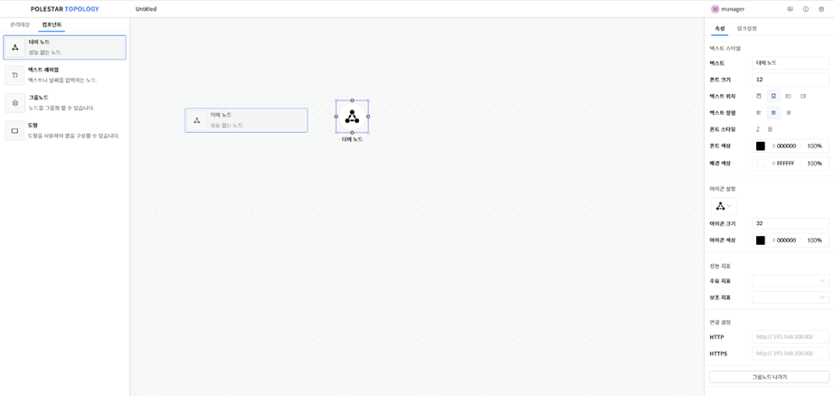

▶ \[그림5\] 더미 노드 추가

> 속성 내용

| 텍스트 스타일 | 텍스트 관련 스타일을 설정합니다.         |
| ------- | -------------------------- |
| 텍스트     | 토폴로지 맵에 표시할 텍스트를 설정합니다.    |
| 폰트 크기   | 텍스트의 폰트 크기를 설정합니다.         |
| 텍스트 위치  | 텍스트의 위치를 설정합니다.            |
| 텍스트 정렬  | 텍스트의 정렬을 설정합니다.            |
| 폰트 스타일  | 텍스트의 폰트 스타일을 설정합니다.        |
| 폰트 색상   | 텍스트의 폰트 색상을 설정합니다.         |
| 배경 색상   | 노드의 배경 색상을 설정합니다.          |
| 아이콘 설정  | 노드에 표시할 아이콘을 설정합니다.        |
| 아이콘 크기  | 아이콘 크기를 설정합니다.             |
| 아이콘 색상  | 아이콘 색상을 설정합니다.             |
| 연결 설정   | 토폴로지 맵 뷰어에서 연결할 주소를 설정합니다. |
| HTTP    | HTTP 주소를 설정합니다.            |
| HTTPS   | HTTPS 주소를 설정합니다.           |

텍스트 레이블 추가 및 속성

텍스트 레이블은 왼쪽 컴포넌트 탭에서 추가할 수 있습니다. 추가는 노드와 같이 클릭 후 토폴로지 맵 영역으로 Drag 하면 추가됩니다. 텍스트 레이블을 클릭하면 속성을 확인할 수 있습니다.

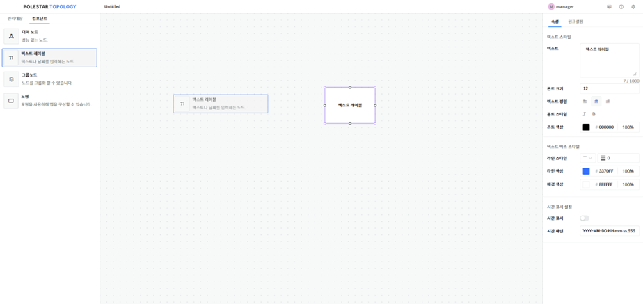

▶ \[그림6\] 텍스트 레이블 추가

> 속성 내용

| 텍스트 스타일    | 텍스트 관련 스타일을 설정합니다.            |
| ---------- | ----------------------------- |
| 텍스트        | 토폴로지 맵에 표시할 텍스트를 설정합니다.       |
| 폰트 크기      | 텍스트의 폰트 크기를 설정합니다.            |
| 텍스트 정렬     | 텍스트의 정렬을 설정합니다.               |
| 폰트 스타일     | 텍스트의 폰트 스타일을 설정합니다.           |
| 폰트 색상      | 텍스트의 폰트 색상을 설정합니다.            |
| 텍스트 박스 스타일 | 텍스트의 박스 스타일을 설정합니다.           |
| 라인 스타일     | 라인 스타일을 설정합니다.                |
| 배경 색상      | 텍스트 레이블의 배경 색상을 설정합니다.        |
| 시간 표시 설정   | 텍스트 대신 현재 시간을 설정할 수 있습니다.     |
| 시간 표시      | 시간 표시 설정시 텍스트가 현재 시간으로 대체됩니다. |
| 시간 패턴      | 시간 표시에 사용할 패턴을 설정합니다.         |

그룹 노드 추가 및 속성

그룹 노드는 왼쪽 컴포넌트 탭에서 추가할 수 있습니다. 추가는 노드와 같이 클릭 후 토폴로지 맵 영역으로 Drag 하면 추가됩니다. 그룹 노드를 클릭하면 속성을 확인할 수 있습니다. 그룹 노드는 다른 컴포넌트를 Drag 하여 그룹 노드 내에 추가할 수 있습니다.

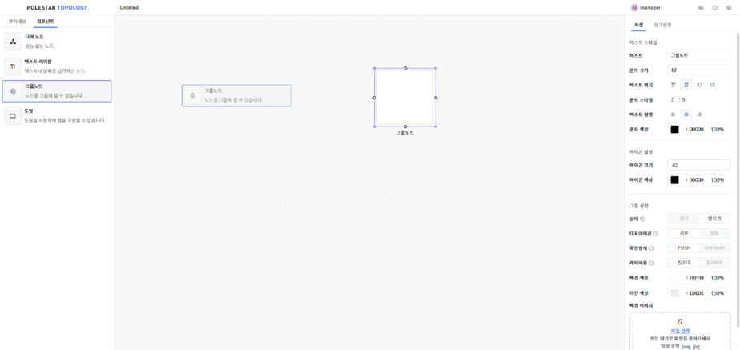

▶ \[그림7\] 그룹 노드 추가

> 속성 내용

| 텍스트 스타일 | 텍스트 관련 스타일을 설정합니다.             |
| ------- | ------------------------------ |
| 텍스트     | 토폴로지 맵에 표시할 텍스트를 설정합니다.        |
| 폰트 크기   | 텍스트의 폰트 크기를 설정합니다.             |
| 텍스트 위치  | 텍스트의 위치를 설정합니다.                |
| 텍스트 정렬  | 텍스트의 정렬을 설정합니다.                |
| 폰트 스타일  | 텍스트의 폰트 스타일을 설정합니다.            |
| 폰트 색상   | 텍스트의 폰트 색상을 설정합니다.             |
| 아이콘 설정  | 노드에 표시할 아이콘을 설정합니다.            |
| 아이콘 크기  | 아이콘 크기를 설정합니다.                 |
| 아이콘 색상  | 아이콘 색상을 설정합니다.                 |
| 그룹 설정   | 그룹 노드의 상태나 뷰어에 표시되는 방식을 설정합니다. |
| 상태      | 그룹 노드의 상태를 설정합니다.              |
| 대표아이콘   | 그룹 노드의 알람 발생시 대표아이콘을 설정합니다.    |
| 확장방식    | 그룹 노드의 확장 방식을 설정합니다.           |
| 레이아웃    | 그룹 노드의 레이아웃을 설정합니다.            |
| 배경 색상   | 그룹 노드의 배경 색상을 설정합니다.           |
| 라인 색상   | 그룹 노드의 라인 색상을 설정합니다.           |
| 배경 이미지  | 그룹 노드의 배경 이미지를 설정합니다.          |

도형 추가 및 속성

도형은 왼쪽 컴포넌트 탭에서 추가할 수 있습니다. 추가는 노드와 같이 클릭 후 토폴로지 맵 영역으로 Drag 하면 추가됩니다. 도형을 클릭하면 속성을 확인할 수 있습니다.

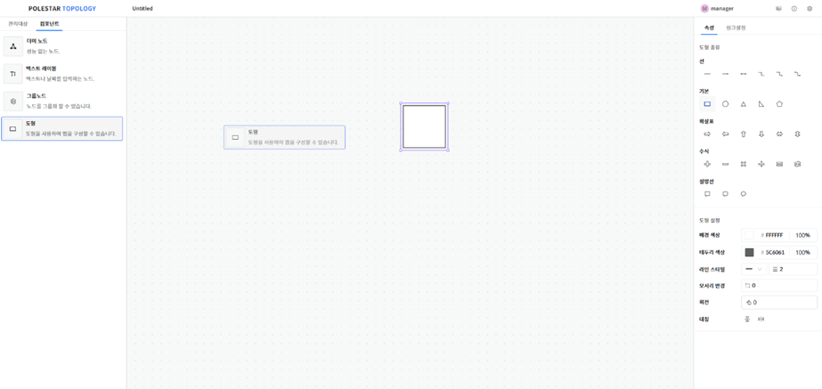

▶ \[그림8\] 도형 추가

> 속성 내용

| 도형 종류  | 도형의 형태를 설정합니다. 도형의 종류는 선, 기본, 화살표, 수식, 설명선이 있습니다.  |
| ------ | -------------------------------------------------- |
| 도형 설정  | 도형의 속성을 설정합니다.                                     |
| 배경 색상  | 도형의 배경 색상을 설정합니다.                                  |
| 테두리 색상 | 도형의 테두리 색상을 설정합니다.                                 |
| 라인 스타일 | 도형의 라인 스타일을 설정합니다.                                 |
| 모서리 변경 | 도형의 모서리를 변경합니다. 기본 도형만 설정할 수 있으며 원 도형은 설정할 수 없습니다. |
| 회전     | 선택된 도형을 회전합니다.                                     |
| 대칭     | 선택된 도형을 가로 혹은 세로로 대칭 설정합니다.                        |

링크 추가 및 속성

링크는 컴포넌트의 상하 좌우에 위치한 곳을 클릭하고 Drag하여 다른 컴포넌트와 연결하면 생성됩니다.

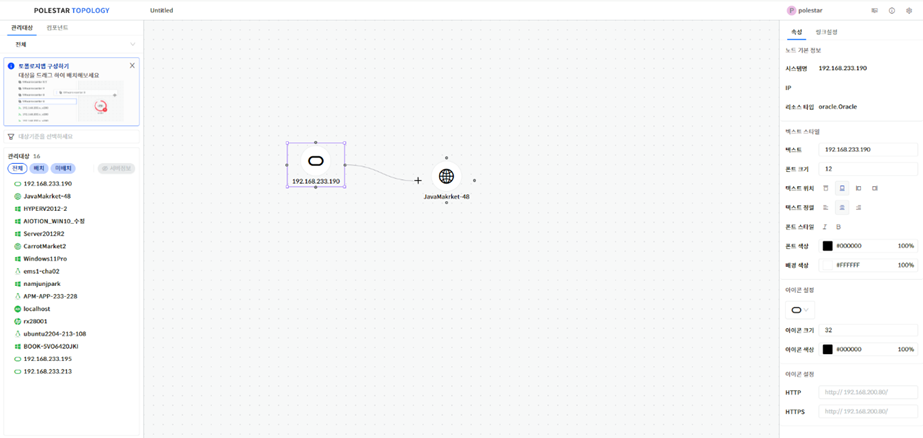

▶ \[그림9\] 링크 추가

> 속성 내용

| 링크명 설정      | 링크명과 관련된 사항을 설정할 수 있습니다.            |
| ----------- | ----------------------------------- |
| 링크명         | 링크명을 설정합니다.                         |
| 폰트 크기       | 링크명의 폰트 크기를 설정합니다.                  |
| 폰트 색상       | 링크명의 폰트 색상을 설정합니다.                  |
| 링크 라인 설정    | 링크의 스타일을 설정할 수 있습니다.                |
| 연관관계        | 노드와 노드의 연관관계를 설정합니다.                |
| 라인 스타일      | 링크의 라인 스타일을 설정합니다.                  |
| 엣지 종류       | 링크의 엣지 종류를 설정합니다.                   |
| 링크 색상       | 링크의 기본 색상을 설정합니다.                   |
| Source      | Source에 연결된 노드 정보를 확인할 수 있습니다.      |
| 인터페이스       | Source의 인터페이스를 선택합니다.               |
| 포트          | Source에 표시할 포트를 설정합니다.              |
| Destination | Destination에 연결된 노드 정보를 확인할 수 있습니다. |
| 인터페이스       | Destination의 인터페이스를 선택합니다.          |
| 포트          | Destination의 표시할 포트를 설정합니다.         |

링크 설정

링크 관계 설정을 보다 쉽게 하기위해 제공된 설정 화면입니다. 노드를 추가한 후 Source 목록에 표시된 노드를 Drag\&Drop으로 링크를 설정할 수 있습니다.

<table>
<tbody>
<tr class="odd">
<td>
노트

Destination에 설정된 노드를 Drag&amp;Drop으로 Source로 이동하면 연결된 링크가 삭제됩니다.
</td>
</tr>
</tbody>
</table>

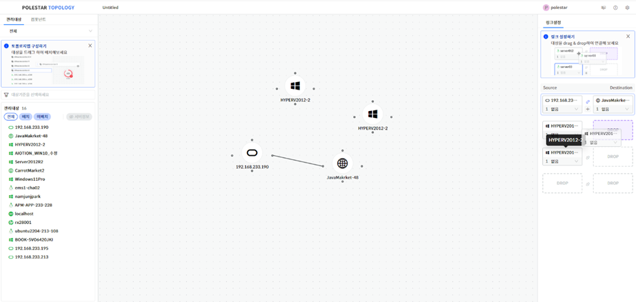

▶ \[그림10\] 링크 설정

> 수동 링크 추가 절차

1.  노드의 상하 좌우에 위치한 아이콘을 클릭

2.  링크 추가를 원하는 아이콘으로 Drag

3.  노드간 링크 추가 확인

컴포넌트 다중 속성

편집 액션으로 다중 선택 시 속성이 표시되며 정렬 옵션과 속성 일괄 수정을 선택할 수 있습니다.

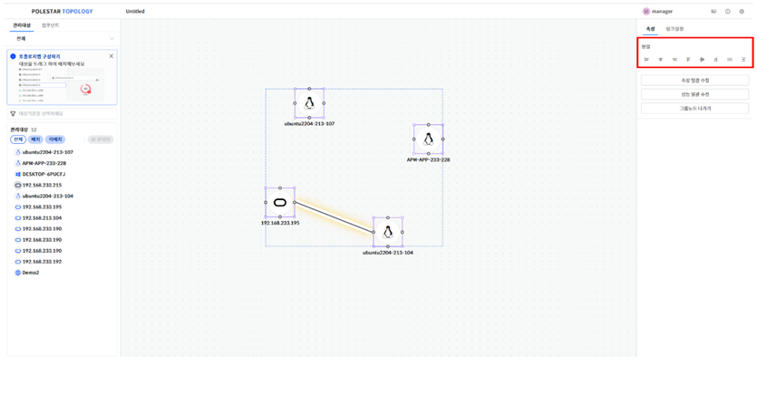

▶ \[그림11\] 컴포넌트 다중 속성

> 속성 내용

| 왼쪽 맞춤       | 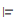 선택된 컴포넌트를 왼쪽 맞춤 정렬합니다.  |
| ----------- | -------------------------------------------------------------------------------------------------------------------------------------------------- |
| 가운데 맞춤      | 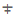 선택된 컴포넌트를 가운데 맞춤 정렬합니다. |
| 오른쪽 맞춤      | 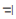 선택된 컴포넌트를 오른쪽 맞춤 정렬합니다. |
| 위쪽 맞춤       | 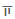 선택된 컴포넌트를 위쪽 맞춤 정렬합니다.  |
| 중간 맞춤       | 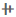 선택된 컴포넌트를 중간 맞춤 정렬합니다   |
| 아래쪽 맞춤      |  선택된 컴포넌트를 아래쪽 맞춤 정렬합니다. |
| 가로 간격 맞춤    |  선택된 컴포넌트를 가로 간격을 맞춥니다.  |
| 세로 간격 맞춤    | 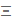 선택된 컴포넌트를 세로 간격을 맞춥니다.  |
| 링크 색상       | 링크의 기본 색상을 설정합니다.                                                                                                                                  |
| Source      | Source에 연결된 노드 정보를 확인할 수 있습니다.                                                                                                                     |
| 인터페이스       | Source의 인터페이스를 선택합니다.                                                                                                                              |
| 포트          | Source에 표시할 포트를 설정합니다.                                                                                                                             |
| Destination | Destination에 연결된 노드 정보를 확인할 수 있습니다.                                                                                                                |
| 인터페이스       | Destination의 인터페이스를 선택합니다.                                                                                                                         |
| 포트          | Destination의 표시할 포트를 설정합니다.                                                                                                                        |

속성 일괄 수정

다중 선택된 컴포넌트의 속성을 실시간으로 변경할 수 있습니다. 속성은 개별 속성과 동일합니다.

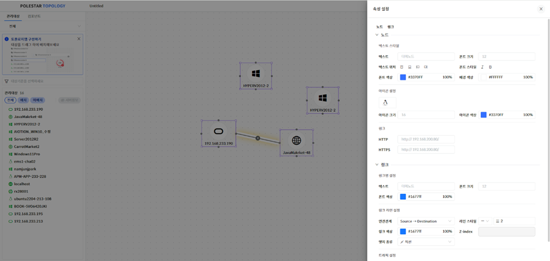

▶ \[그림12\] 속성 일괄 수정

성능 일괄 수정

다중 선택된 노드의 지표를 실시간으로 변경할 수 있습니다. 속성은 개별 속성과 동일합니다.

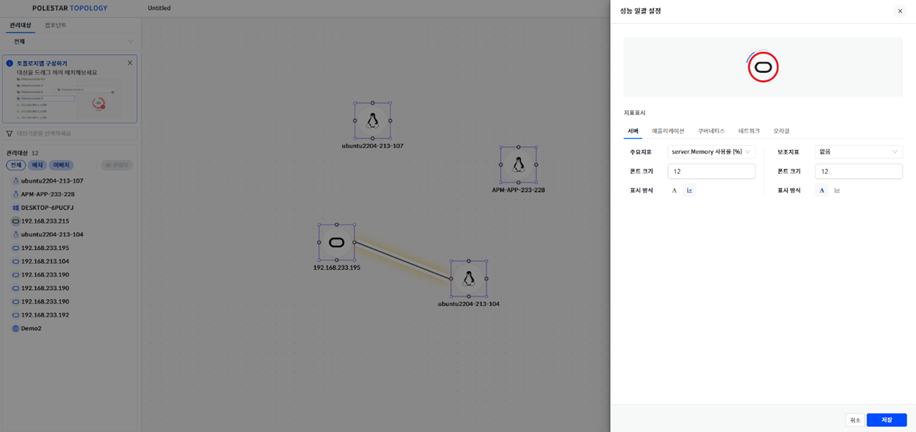

▶ \[그림13\] 성능 일괄 수정

