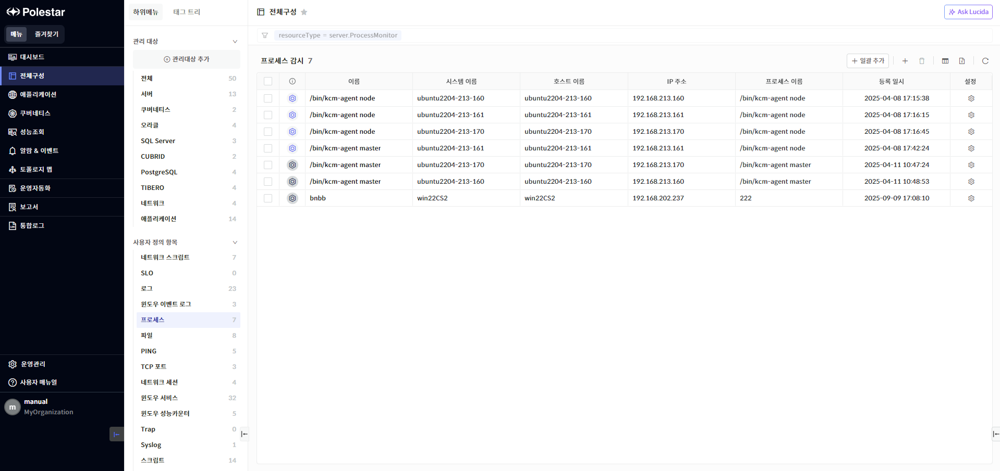
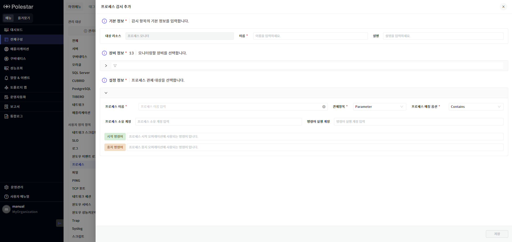
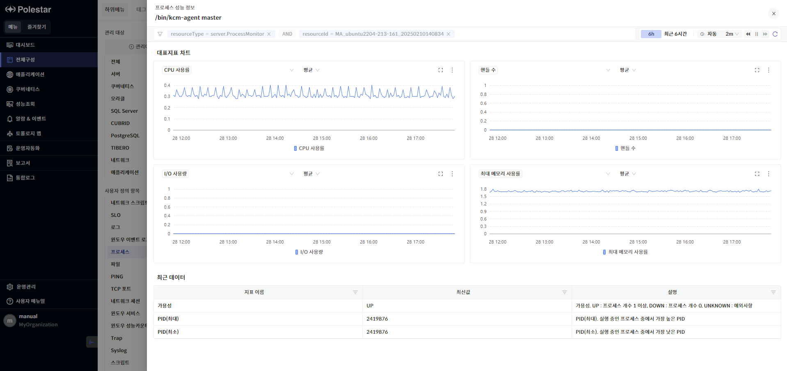
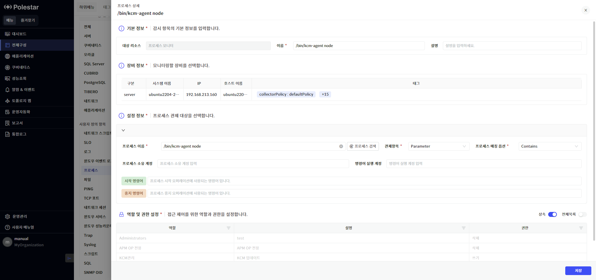
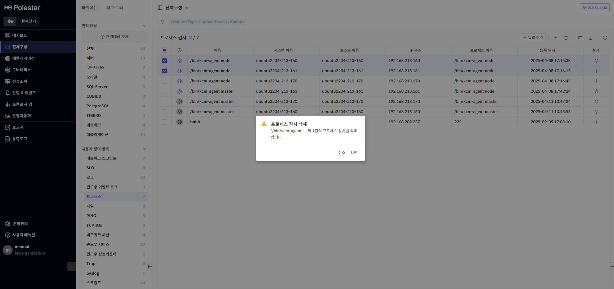
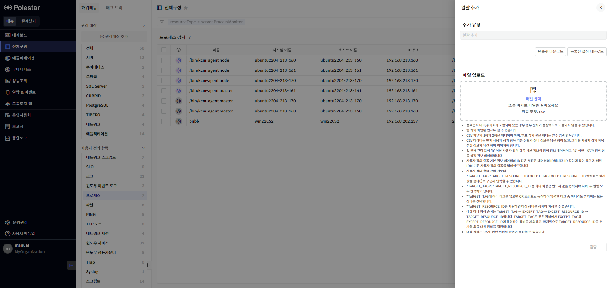
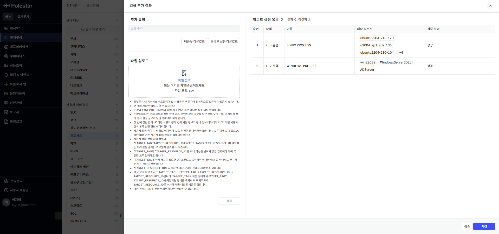

프로세스 감시

사용자가 지정한 프로세스의 상태(가용성, CPU 사용률, 메모리 사용률, 프로세스 개수, I/O 사용량, I/O 사용률, 스레드 개수, 메모리 사용량, 물리 메모리 사용량, 최소 PID, 최대 PID)를 감시할 수 있는 기능입니다.

▶ \[그림1\] 프로세스 감시 목록

화면 지표

<table>
<thead>
<tr class="header">
<th>상태</th>
<th>
프로세스 감시 항목의 가용성 상태를 색상으로 표현합니다

 : 프로세스 개수 1개 이상

 : 프로세스 개수 0개

 : 프로세스 개수 감시 불가
</th>
</tr>
</thead>
<tbody>
<tr class="odd">
<td>이름</td>
<td>프로세스 감시 항목의 이름을 표시합니다.</td>
</tr>
<tr class="even">
<td>시스템 이름</td>
<td>프로세스 감시 항목이 등록된 서버의 시스템 이름을 표시합니다.</td>
</tr>
<tr class="odd">
<td>호스트 이름</td>
<td>프로세스 감시 항목이 등록된 서버의 호스트 이름을 표시합니다.</td>
</tr>
<tr class="even">
<td>IP 주소</td>
<td>프로세스 감시 항목이 등록된 서버의 IP 주소를 표시합니다.</td>
</tr>
<tr class="odd">
<td>프로세스 이름</td>
<td>감시 중인 프로세스의 이름을 표시합니다.</td>
</tr>
<tr class="even">
<td>등록 일시</td>
<td>프로세스 감시 항목이 등록된 일시를 표시합니다.</td>
</tr>
<tr class="odd">
<td>설정</td>
<td>프로세스 감시 설정을 변경할 수 있는 프로세스 상세 화면을 호출합니다.</td>
</tr>
</tbody>
</table>

프로세스 감시 추가

모니터링할 프로세스 정보를 설정합니다. 모든 필수 항목을 입력해야 \[저장\] 버튼이 활성화됩니다.

<table>
<tbody>
<tr class="odd">
<td>
노트

사용자가 ‘쓰기’ 이상의 권한을 가지고 있는 서버에만 프로세스 감시를 등록할 수 있습니다.

프로세스 감시 추가 시, 서버 장비에 설정된 권한이 자동으로 적용됩니다. 프로세스 감시 수정 기능을 통해 권한 정보를 변경할 수 있습니다.
</td>
</tr>
</tbody>
</table>

▶ \[그림2\] 프로세스 감시 추가

기본 정보

| 대상 리소스 | 감시 항목의 타입을 표시합니다. ‘프로세스 모니터’ 타입이 자동으로 설정되어 있습니다. |
| ------ | ------------------------------------------------ |
| 이름     | 프로세스 감시 항목의 이름을 입력합니다.                           |
| 설명     | 프로세스 감시 항목의 설명을 입력합니다.                           |

장비 정보

프로세스 감시 항목을 등록할 장비를 1대 이상 선택합니다. 장비 목록에는 사용자가 ‘쓰기’ 이상의 권한을 가지고 있는 서버만 표시되며, 태그 필터를 사용해 원하는 대상 장비를 상세 검색할 수 있습니다.

설정 정보

<table>
<thead>
<tr class="header">
<th>프로세스 이름</th>
<th>모니터링 대상 프로세스 이름 또는 패턴을 입력합니다.</th>
</tr>
</thead>
<tbody>
<tr class="odd">
<td>관제항목</td>
<td>
입력한 프로세스명을 탐색할 관제 대상을 선택합니다.

<ul>
<li>
Parameter: 입력한 프로세스명을 프로세스 파라미터에서 탐색
</li>
<li>
Name: 입력한 프로세스명을 프로세스 이름에서 탐색
</li>
</ul></td>
</tr>
<tr class="even">
<td>프로세스 매칭 옵션</td>
<td>
프로세스 매칭 옵션을 선택합니다.

<ul>
<li>
Exact: 입력한 프로세스명과 정확하게 일치
</li>
<li>
Contains: 입력한 프로세스명 포함
</li>
<li>
Regex: 정규식 검사
</li>
</ul></td>
</tr>
<tr class="odd">
<td>프로세스 소유 계정</td>
<td>특정 소유 계정의 프로세스만을 탐색 대상으로 설정하는 경우 사용합니다.</td>
</tr>
<tr class="even">
<td>명령어 실행 계정</td>
<td>프로세스 시작/중지 명령어를 실행할 계정을 입력합니다.</td>
</tr>
<tr class="odd">
<td>시작 명령어</td>
<td>프로세스 시작 오퍼레이션에 사용되는 명령어를 입력합니다.</td>
</tr>
<tr class="even">
<td>중지 명령어</td>
<td>프로세스 중지 오퍼레이션에 사용되는 명령어를 입력합니다.</td>
</tr>
</tbody>
</table>

프로세스 감시 추가 절차

1.  프로세스 감시 목록 우측 상단의 \[추가\] 버튼 클릭

2.  기본 정보, 장비 정보, 설정 정보를 입력하고 \[저장\] 버튼 클릭

프로세스 성능 정보 조회

프로세스 감시 목록에서 ‘이름’ 필드를 클릭하여 등록한 프로세스 감시의 성능 정보를 조회합니다. 프로세스 감시 설정 정보에 따라 특정 프로세스의 성능 정보를 확인할 수 있습니다.

▶ \[그림3\] 프로세스 성능 정보

프로세스 감시 수정

프로세스 감시 목록에서 ‘설정’ 필드를 클릭하여 등록한 프로세스 감시의 설정 정보와 역할 및 권한 설정을 수정할 수 있습니다. 프로세스 감시의 기본 권한은 서버 장비의 권한을 따르므로 ‘상속’ 옵션이 활성화되어 있습니다. ‘상속’ 옵션을 비활성화하면 프로세스 감시에만 적용되는 전용 권한을 설정할 수 있습니다. 모든 필수 항목을 입력해야 \[저장\] 버튼이 활성화됩니다.

<table>
<tbody>
<tr class="odd">
<td>
노트

사용자가 ‘쓰기’ 이상의 권한을 가지고 있는 프로세스 감시만 수정할 수 있습니다.

프로세스 감시 설정 수정 시 프로세스 명 우측의 [프로세스 검색] 버튼을 클릭하면 대상 서버에서 실행 중인 프로세스 목록을 조회하고 선택할 수 있습니다.
</td>
</tr>
</tbody>
</table>

▶ \[그림4\] 프로세스 상세

프로세스 감시 수정 절차

1.  프로세스 감시 목록에서 수정할 항목의 ‘설정’ 필드 클릭

2.  기본 정보, 설정 정보, 역할 및 권한 설정 중 수정할 항목을 변경하고 \[저장\] 버튼 클릭

프로세스 감시 삭제

프로세스 감시 목록에서 특정 프로세스 항목을 삭제할 수 있습니다.

<table>
<tbody>
<tr class="odd">
<td>
노트

프로세스 감시의 역할 및 권한 상속 여부에 따라 프로세스 감시를 삭제할 수 있는 최소 권한이 달라집니다. 역할 및 권한 상속 여부는 프로세스 상세 화면에서 확인할 수 있습니다.

<ul>
<li>
상속 ON: ‘쓰기’ 이상의 권한 필요
</li>
<li>
상속 OFF: ‘삭제’ 권한 필요
</li>
</ul></td>
</tr>
</tbody>
</table>

▶ \[그림5\] 프로세스 감시 삭제

프로세스 감시 삭제 절차

1.  프로세스 감시 목록에서 삭제할 프로세스 선택 (다수 선택 가능)

2.  프로세스 감시 목록 우측 상단의 \[삭제\] 버튼 클릭

프로세스 감시 일괄 추가

프로세스 감시 설정 정보를 CSV 형식으로 입력하여 다수의 프로세스 감시를 일괄 등록할 수 있습니다.

\[등록된 설정 다운로드\]를 통해 등록되어 있는 프로세스 감시 설정 정보를 CSV 파일로 다운로드하고, 이 CSV 파일을 활용하여 기존 프로세스 감시 설정을 일괄 업데이트 할 수 있습니다.

프로세스 감시 설정 정보를 저장한 CSV 파일을 업로드하고 \[검증\] 버튼을 클릭하면 CSV 파일 데이터의 유효성을 검사하여 등록 진행 가능 여부를 판별합니다. 하나라도 잘못된 설정이 포함되어 있는 경우 일괄 등록을 진행할 수 없습니다. 이 경우, ‘검증 결과’ 필드를 참고하여 설정 오류를 수정하고 다시 검증을 진행하시기 바랍니다.

<table>
<tbody>
<tr class="odd">
<td>
노트

CSV 파일에서 일괄 추가 대상 장비를 태그로 설정한 경우, 사용자의 장비 권한에 따라 프로세스 감시가 적용되는 장비가 달라질 수 있습니다.

<ul>
<li>
등록: 사용자가 ‘쓰기’ 이상의 권한을 가지고 있는 서버
</li>
<li>
수정: 사용자가 ‘쓰기’ 이상의 권한을 가지고 있는 프로세스 감시
</li>
</ul></td>
</tr>
</tbody>
</table>

▶ \[그림6\] 프로세스 감시 일괄 추가

▶ \[그림7\] 프로세스 감시 일괄 추가 – 검증 및 업로드 설정 목록

프로세스 감시 일괄 추가 절차

1.  프로세스 감시 목록 우측 상단의 \[일괄 추가\] 버튼 클릭

2.  \[등록된 설정 다운로드\] 버튼 클릭

3.  다운로드 받은 CSV 파일을 열고, 기존 등록되어 있는 프로세스 감시 설정을 참고해서 신규 프로세스 감시 설정 추가

4.  CSV 파일에 있던 기존 프로세스 감시 설정 삭제

5.  일괄 추가 드로어에서 CSV 파일 업로드하고 \[검증\] 버튼 클릭

6.  ‘업로드 설정 목록’에서 결함 유무 확인하고, 결함이 없는 경우 \[저장\] 버튼 클릭

