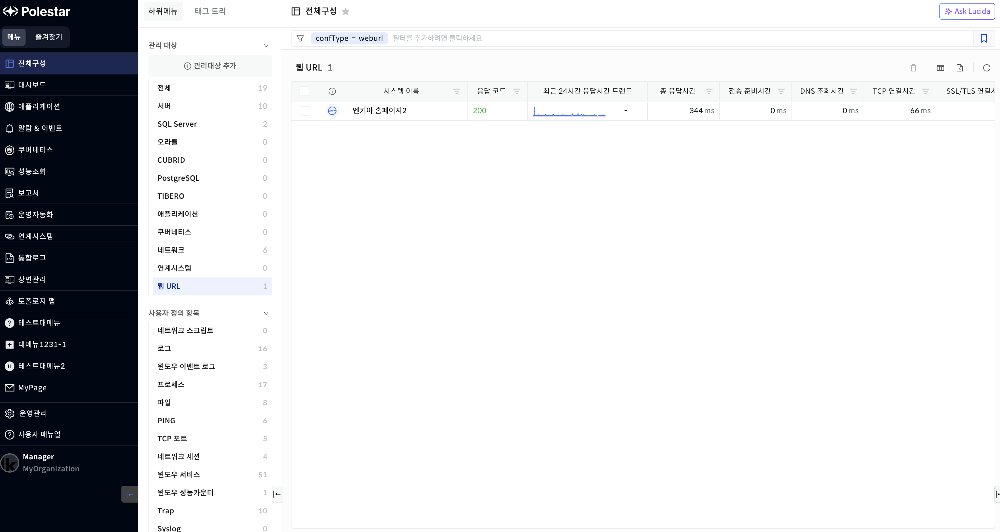
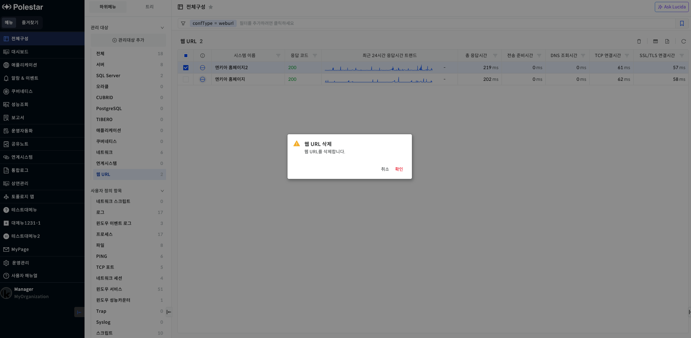
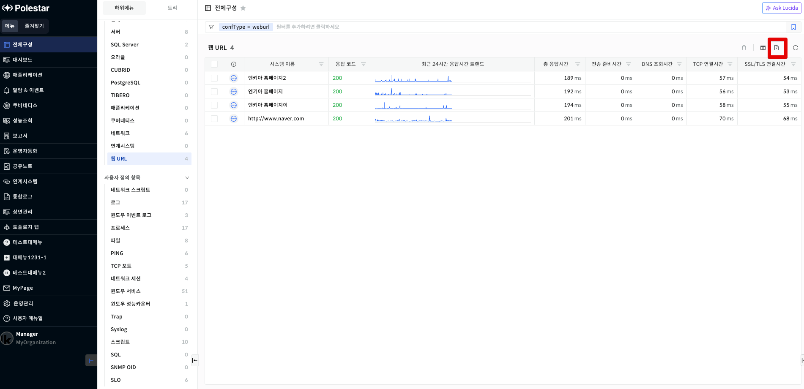

웹 URL 목록

등록된 웹 URL항목의 현황을 확인하고, 최근 24시간 응답 트랜드 등 특정 웹 URL에 대한 모니터링을 제공합니다.

▶ \[그림1\] 웹 URL 목록

> 웹 URL 목록

| 시스템 이름           | 모니터링 하고자 하는 대상의 이름을 표시합니다.      |
| ---------------- | ------------------------------- |
| 응답 코드            | 설정한 정상 응답코드를 표시합니다.             |
| 최근 24시간 응답시간 트랜드 | 총 응답시간의 최근 24시간 1분 평균 값을 표시합니다. |
| 총 응답시간           | 총 응답시간을 표시합니다.                  |
| 전송 준비시간          | 전송 준비시간을 표시합니다.                 |
| DNS 조회시간         | DNS 조회시간을 표시합니다.                |
| TCP 연결시간         | TCP 연결시간을 표시합니다.                |
| SSL/TLS 연결시간     | SSL/TLS 연결시간을 표시합니다.            |

웹 URL 삭제

삭제할 웹 URL을 선택하고 \[삭제\] 버튼을 선택하여 웹 URL을 삭제할 수 있습니다.

▶ \[그림2\] 웹 URL 삭제

웹 URL 엑셀 다운로드

전체 웹 URL 목록을 엑셀로 다운로드 할 수 있습니다.

▶ \[그림2\] 웹 URL삭제

