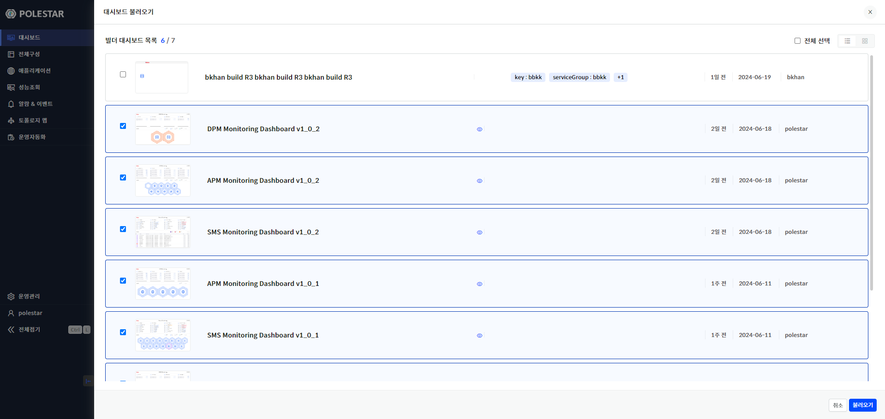
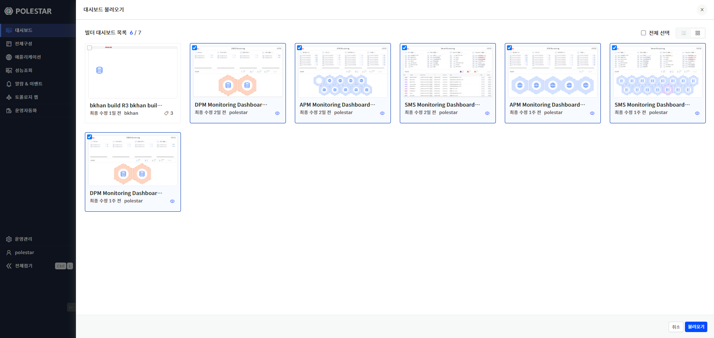
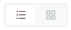
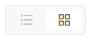
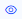

대시보드 불러오기

대시보드 목록 확인 후 상단 대시보드 불러오기 버튼을 선택하면 현재까지 “대시보드 빌더”에서 제작된 모든 대시보드를 불러올 수 있습니다.

이를 통해 대시보드 목록을 추가, 삭제할 수 있습니다.

<table>
<tbody>
<tr class="odd">
<td>
노트

목록에 포함되어 있는 대시보드 항목은 “눈 아이콘”이 활성화되어 있으며 최종 “불러오기” 버튼 선택 시 선택된 대시보드 목록으로 재설정됩니다.
</td>
</tr>
</tbody>
</table>

> ▶ \[그림1\] 대시보드 불러오기 (목록형)

> ▶ \[그림2\] 대시보드 불러오기 (썸네일 형)
> 
> 상세 기능 설명

<table>
<thead>
<tr class="header">
<th>전체 선택</th>
<th>
전체선택 체크 시 제작된 모든 대시보드가 선택됩니다.

<table>
<tbody>
<tr class="odd">
<td>: 전체 선택 체크 시</td>
</tr>
</tbody>
</table></th>
</tr>
</thead>
<tbody>
<tr class="odd">
<td>목록보기 선택</td>
<td>
서버의 O/S 정보를 아이콘으로 표시하고 색깔은 가용성으로 표시합니다.

<table>
<thead>
<tr class="header">
<th>: 목록형</th>
</tr>
</thead>
<tbody>
<tr class="odd">
<td>: 썸네일 형</td>
</tr>
</tbody>
</table></td>
</tr>
<tr class="even">
<td>대시보드명</td>
<td>제작된 대시보드명을 제공합니다.</td>
</tr>
<tr class="odd">
<td>대시보드 목록 활성화 체크박스</td>
<td>
체크박스를 통해 대시보드 목록에 포함시키거나 제외시킬 수 있습니다.

<table>
<thead>
<tr class="header">
<th>: 대시보드 목록에서 제외</th>
</tr>
</thead>
<tbody>
<tr class="odd">
<td>: 대시보드 목록에 포함</td>
</tr>
</tbody>
</table></td>
</tr>
<tr class="even">
<td>대시보드 목록 포함 여부</td>
<td>
현재 해당 대시보드가 대시보드 목록에 포함되어 있는지 여부를 아이콘을 통해 제공합니다.

<table>
<tbody>
<tr class="odd">
<td>: 눈 아이콘</td>
</tr>
</tbody>
</table></td>
</tr>
<tr class="odd">
<td>배포일</td>
<td>대시보드가 배포된 일자를 제공합니다.</td>
</tr>
<tr class="even">
<td>등록일자</td>
<td>대시보드가 등록된 일자를 제공합니다.</td>
</tr>
<tr class="odd">
<td>등록자</td>
<td>대시보드를 생성하여 등록한 등록자 정보를 제공합니다.</td>
</tr>
</tbody>
</table>

<table>
<tbody>
<tr class="odd">
<td>
주의

전체 선택 체크 후 모든 대시보드 불러오기를 실행할 경우 시간이 오래 걸릴 수 있습니다.
</td>
</tr>
</tbody>
</table>

