데이터 수집 설정

운영관리에서 \[데이터 수집 설정\]을 선택하여 POLESTAR에서 모니터링하는 관제 장비의 수집 정책을 설정할 수 있습니다.

관리지표 공통 설정

\[관리지표 공통 설정\] 탭에서 POLESTAR의 관리지표 공통 설정 목록을 확인할 수 있습니다. ‘Default Policy’는 POLESTAR에서 제공하는 기본 수집 정책입니다.

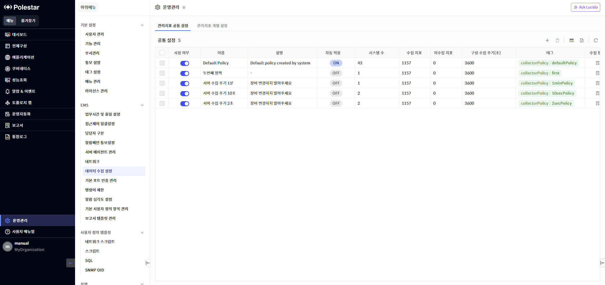

▶ \[그림1\] 관리지표 공통 설정

설정 항목

<table>
<thead>
<tr class="header">
<th>사용여부</th>
<th>
수집 정책의 사용 여부를 설정합니다. 자동 적용 정책은 미사용 정책으로 변경할 수 없으며, 미사용 정책을 자동 적용 정책으로 지정할 수 없습니다. 미사용 정책에 할당된 장비는 데이터를 수집하지 않습니다.

 : 사용 정책

 : 미사용 정책
</th>
</tr>
</thead>
<tbody>
<tr class="odd">
<td>이름</td>
<td>
수집 정책의 이름을 표시합니다.

각 수집 정책은 고유한 이름을 가져야 하며 이름을 중복 사용할 수 없습니다.
</td>
</tr>
<tr class="even">
<td>설명</td>
<td>수집 정책의 설명을 표시합니다.</td>
</tr>
<tr class="odd">
<td>자동 적용</td>
<td>
관제 장비 등록 시 자동으로 할당되는 수집 정책을 지정할 수 있습니다.

등록된 정책 중 1개의 정책만 자동 적용 정책으로 설정할 수 있으며, 자동 적용 여부는 아이콘 색상으로 표시합니다.

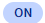 : ‘자동 적용’ 설정된 수집 정책

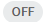 : ‘자동 적용’ 설정되지 않은 수집 정책
</td>
</tr>
<tr class="even">
<td>시스템 수</td>
<td>
수집 정책을 사용 중인 관제 장비 수를 표시합니다.

숫자를 클릭하여 장비 목록 드로어를 확인할 수 있으며, 수집 정책에 할당된 장비를 변경할 수 있습니다.

해당 필드는 목록 필터를 통한 정렬 및 검색을 지원하지 않습니다.
</td>
</tr>
<tr class="odd">
<td>수집 지표</td>
<td>
수집 정책에서 수집 중인 지표의 수를 표시합니다.

해당 필드는 목록 필터를 통한 정렬 및 검색을 지원하지 않습니다.
</td>
</tr>
<tr class="even">
<td>미수집 지표</td>
<td>수집 정책에서 수집하지 않는 지표의 수를 표시합니다.</td>
</tr>
<tr class="odd">
<td>구성 수집 주기</td>
<td>
수집 정책의 구성 수집 주기를 표시합니다. (단위: 초)

구성 수집 주기를 설정할 수 있는 관제 장비는 수집 정책의 구성 수집 주기에 따라 구성 데이터를 수집합니다. 구성 수집 주기를 변경할 수 없는 관제 장비는 장비 설정에 따라 구성 데이터를 수집합니다.
</td>
</tr>
<tr class="even">
<td>태그</td>
<td>
수집 정책의 태그 정보를 표시합니다.

각 수집 정책은 고유한 태그를 가져야 하며 태그를 중복 사용할 수 없습니다.

해당 필드는 목록 필터를 통한 정렬 및 검색을 지원하지 않습니다.
</td>
</tr>
<tr class="odd">
<td>수집 정책</td>
<td>
수집 정책의 세부 설정 목록 드로어를 호출합니다.

지표별 수집 여부, 데이터 수집 주기, 통계 저장 여부를 설정할 수 있습니다.

데이터 수집 주기는 관리 항목별로 공통 적용됩니다. 특정 지표의 데이터 수집 주기를 변경하면, 해당 지표와 관리 항목이 동일한 지표의 데이터 수집 주기가 일괄 변경됩니다.

통계 저장 여부는 METRIC 데이터에 대해서만 설정할 수 있으며, 데이터 수집 주기가 통계 주기보다 긴 경우에는 통계 저장을 지원하지 않습니다.
</td>
</tr>
</tbody>
</table>

관리지표 공통 설정 추가

관리지표 공통 설정 목록 상단의 \[추가\] 버튼을 클릭하여 신규 수집 정책을 추가할 수 있습니다. 신규 정책은 등록되어 있는 정책을 복사하여 생성하며, 이름 및 태그 정보는 중복 사용할 수 없습니다. 구성 수집 주기는 3600초 이상으로 설정합니다.

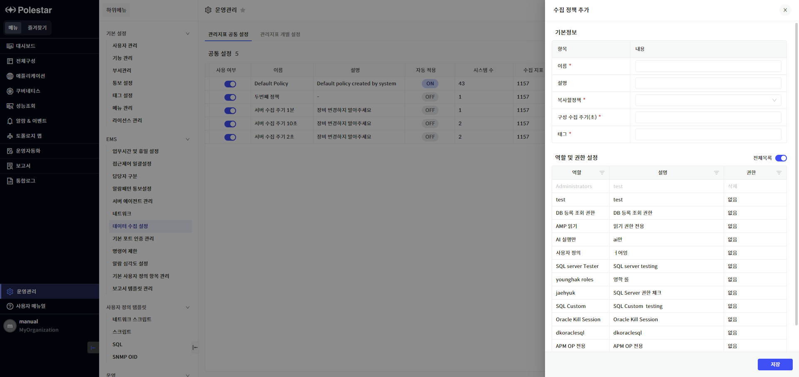

▶ \[그림2\] 관리지표 공통 설정 추가

설정 항목

<table>
<thead>
<tr class="header">
<th>이름</th>
<th>
수집 정책의 이름을 입력합니다.

각 수집 정책은 고유한 이름을 가져야 하며 이름을 중복 사용할 수 없습니다.
</th>
</tr>
</thead>
<tbody>
<tr class="odd">
<td>설명</td>
<td>수집 정책의 설명을 입력합니다.</td>
</tr>
<tr class="even">
<td>복사할정책</td>
<td>등록되어 있는 공통 수집 정책 중 복사할 정책을 선택합니다. 선택한 정책의 세부 설정 (지표별 수집 여부, 데이터 수집 주기, 통계 저장 여부) 정보가 신규 추가하는 수집 정책으로 복사됩니다.</td>
</tr>
<tr class="odd">
<td>구성수집주기</td>
<td>
수집 정책의 구성 수집 주기를 입력합니다. (단위: 초)

구성 수집 주기는 3600초 (=1시간) 이상으로 설정해야 합니다.
</td>
</tr>
<tr class="even">
<td>태그</td>
<td>
수집 정책의 태그를 입력합니다.

각 수집 정책은 고유한 태그를 가져야 하며 태그를 중복 사용할 수 없습니다.
</td>
</tr>
<tr class="odd">
<td>역할 및 권한 설정</td>
<td>
수집 정책에 할당할 역할과 권한을 설정합니다.

수집 정책에 설정한 권한 조건을 만족하는 사용자만 수집 정책 조회, 수정, 삭제가 가능합니다.
</td>
</tr>
</tbody>
</table>

<table>
<tbody>
<tr class="odd">
<td>
노트

서버는 구성 수집 주기가 1일 1회로 고정되어 있습니다. 관리 지표 공통 설정의 구성 수집 주기 설정은 서버에는 적용되지 않습니다.
</td>
</tr>
</tbody>
</table>

관리지표 공통 설정 추가 절차

1.  관리지표 공통 설정 목록 우측 상단의 \[추가\] 버튼 클릭

2.  추가할 수집 정책의 세부 항목 설정 후 \[저장\] 버튼 클릭

관리지표 공통 설정 수정

관리지표 공통 설정 목록에서 \[이름\] 필드를 선택하여 수집 정책의 대표 필드 정보를 수정할 수 있습니다. 이름 및 태그 정보는 중복 사용할 수 없으며, 구성 수집 주기는 3600초 이상으로 설정해야 합니다.

<table>
<tbody>
<tr class="odd">
<td>
노트

기본 수집 정책인 ‘Default Policy’는 구성 수집 주기만 수정이 가능합니다.
</td>
</tr>
</tbody>
</table>

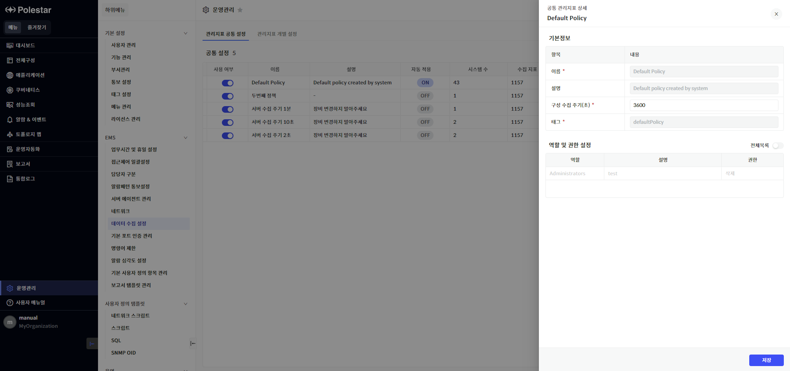

▶ \[그림3\] 관리지표 공통 설정 수정

관리지표 공통 설정 수정 절차

1.  관리지표 공통 설정 목록에서 수정할 수집 정책의 ‘이름’ 클릭

2.  수집 정책의 세부 항목 변경 후 \[저장\] 버튼 클릭

관리지표 공통 설정 – 시스템

관리지표 공통 설정 목록에서 \[시스템 수\] 필드를 선택하여 각 수집 정책을 사용하고 있는 관제 장비 목록 드로어를 확인할 수 있으며, 관제 장비 목록 상단의 \[추가\] 버튼을 클릭하여 관제 장비에 할당된 수집 정책을 변경할 수 있습니다.

<table>
<tbody>
<tr class="odd">
<td>
주의

대량의 장비의 정책을 변경할 경우 정책 변경 시간이 오래 걸릴 수 있습니다.
</td>
</tr>
</tbody>
</table>

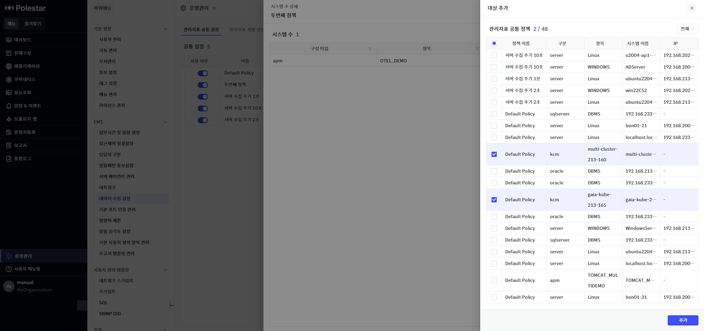

▶ \[그림4\] 관리지표 공통 설정 - 대상 추가

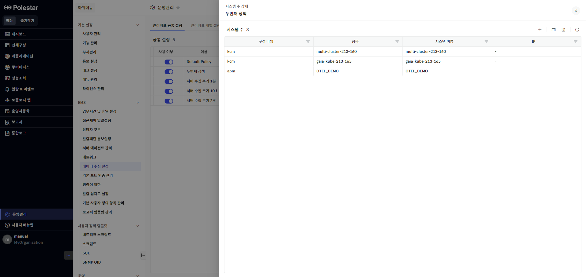

▶ \[그림5\] 관리지표 공통 설정 - 대상 추가 후 시스템 수 상세 화면

관리지표 공통 설정 대상 변경 절차

1.  관리지표 공통 설정 목록에서 대상을 변경할 수집 정책의 ‘시스템 수’ 클릭

2.  선택한 수집 정책에 할당된 장비 목록 우측 상단의 \[추가\] 버튼 클릭

3.  장비 목록에서 수집 정책을 변경할 장비를 다중 선택하고 \[추가\] 버튼 클릭

<table>
<tbody>
<tr class="odd">
<td>
노트

관리지표 공통 설정에서 특정 대상을 제외하고 싶은 경우, 제외할 대상에 새롭게 할당할 관리지표 공통 설정에서 대상 변경 절차를 진행합니다.
</td>
</tr>
</tbody>
</table>

관리지표 공통 설정 – 공통 지표

관리지표 공통 설정 목록에서 \[수집 정책\] 필드를 선택하여 수집 정책의 지표별 세부 설정 목록 드로어를 확인할 수 있습니다. 세부 설정 목록 드로어에서는 지표별 수집 여부, 데이터 수집 주기, 통계 저장 여부를 설정할 수 있습니다.

<table>
<tbody>
<tr class="odd">
<td>
노트

아래 사용자 정의 항목은 데이터 수집 설정 기능이 적용되지 않습니다.

<ul>
<li>
로그, 윈도우 이벤트 로그, 프로세스, 파일, Ping, TCP 포트, 네트워크 세션, 윈도우 서비스, 윈도우 성능 카운터, 스크립트, SQL, SNMP OID
</li>
</ul></td>
</tr>
</tbody>
</table>

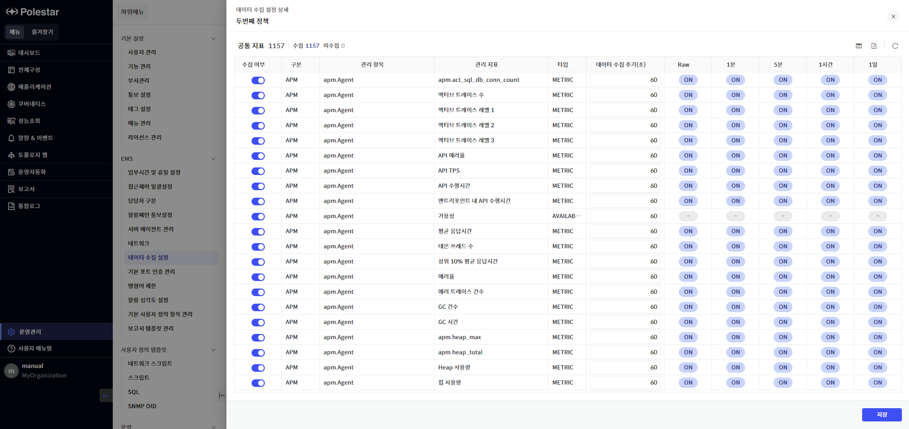

▶ \[그림6\] 관리지표 공통 설정 – 공통 지표 목록

설정 항목

<table>
<thead>
<tr class="header">
<th>수집 여부</th>
<th>
지표별 성능 데이터 수집 여부를 설정합니다.

기본적으로 POLESTAR에서 지원하는 모든 지표를 수집하도록 설정되어 있으며, 수집 여부 변경 시 해당 지표는 더 이상 POLESTAR에서 처리하지 않습니다.

 : 수집 지표

 : 미수집 지표
</th>
</tr>
</thead>
<tbody>
<tr class="odd">
<td>구분</td>
<td>POLESTAR에서 관제하는 제품군을 표시합니다.</td>
</tr>
<tr class="even">
<td>관리 항목</td>
<td>지표 그룹을 표시합니다.</td>
</tr>
<tr class="odd">
<td>관리 지표</td>
<td>지표명을 표시합니다.</td>
</tr>
<tr class="even">
<td>타입</td>
<td>
지표의 데이터 타입을 표시합니다.

AVAILABILITY: 가용성 데이터

TRAIT: 문자열 데이터

METRIC: 수치 데이터

TABULAR: 목록형 데이터
</td>
</tr>
<tr class="odd">
<td>데이터 수집 주기</td>
<td>
지표별 데이터 수집 주기를 표시합니다. (단위: 초)

모든 지표는 기본 60초 주기로 설정되어 있습니다. 데이터 수집 주기는 관리 항목별로 공통 적용되기 때문에 특정 지표의 데이터 수집 주기를 변경하면 해당 지표와 관리 항목이 동일한 모든 지표의 데이터 수집 주기가 일괄 업데이트 됩니다.
</td>
</tr>
<tr class="even">
<td>통계 데이터</td>
<td>
주기별 통계 데이터 저장 여부를 설정합니다.

POLESTAR는 1분, 5분, 1시간. 1일 주기의 통계 데이터를 제공합니다.

통계 저장 여부는 METRIC 데이터에 대해서만 설정할 수 있으며, 데이터 수집 주기가 통계 주기보다 긴 경우에는 통계 저장을 지원하지 않습니다.

 : 통계 데이터 저장

 : 통계 데이터 저장 안함
</td>
</tr>
</tbody>
</table>

관리지표 공통 설정 – 지표별 설정 변경 절차

1.  관리지표 공통 설정 목록에서 지표 설정을 변경할 수집 정책의 \[수집 정책\] 버튼 클릭

2.  공통 지표 설정 드로어에서 특정 지표의 수집 여부, 데이터 수집 주기, 통계 저장 여부 변경 후 \[저장\] 버튼 클릭

<table>
<tbody>
<tr class="odd">
<td>
주의

다수의 지표 설정을 변경할 경우 변경 시간이 오래 걸릴 수 있습니다.
</td>
</tr>
</tbody>
</table>

관리지표 공통 설정 삭제

관리지표 공통 설정 목록에서 수집 정책을 삭제할 수 있습니다. 수집 정책은 할당된 시스템 수가 0개인 경우만 삭제가 가능합니다.

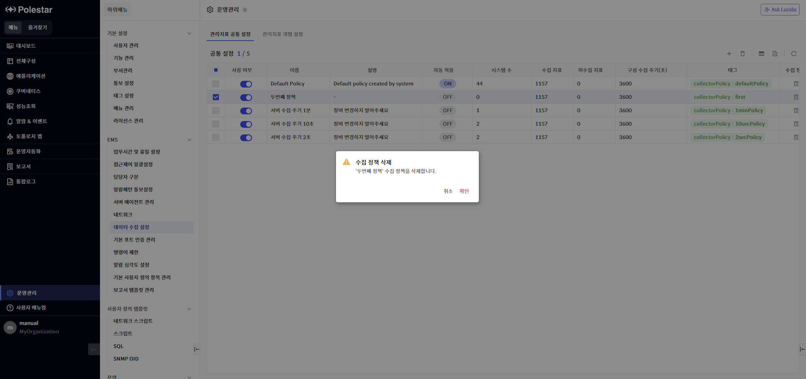

▶ \[그림7\] 관리지표 공통 설정 삭제

관리지표 공통 설정 삭제 절차

1.  관리지표 공통 설정 목록에서 삭제할 수집 정책 선택 (다중 선택 가능)

2.  관지지표 공통 설정 목록 우측 상단의 \[삭제\] 버튼 클릭

3.  삭제 확인 메시지창에서 \[확인\] 버튼 클릭

관리지표 개별 설정

\[관리지표 개별 설정\] 탭에서 POLESTAR의 관리지표 개별 설정 목록을 확인할 수 있습니다. 관리지표 개별 설정은 관리지표 공통 설정을 기반으로 관제 장비에 실제 적용된 설정을 의미합니다.

<table>
<tbody>
<tr class="odd">
<td>
노트

관리지표 개별 설정 목록은 ‘읽기’ 이상의 권한이 할당된 장비만 표시됩니다.
</td>
</tr>
</tbody>
</table>

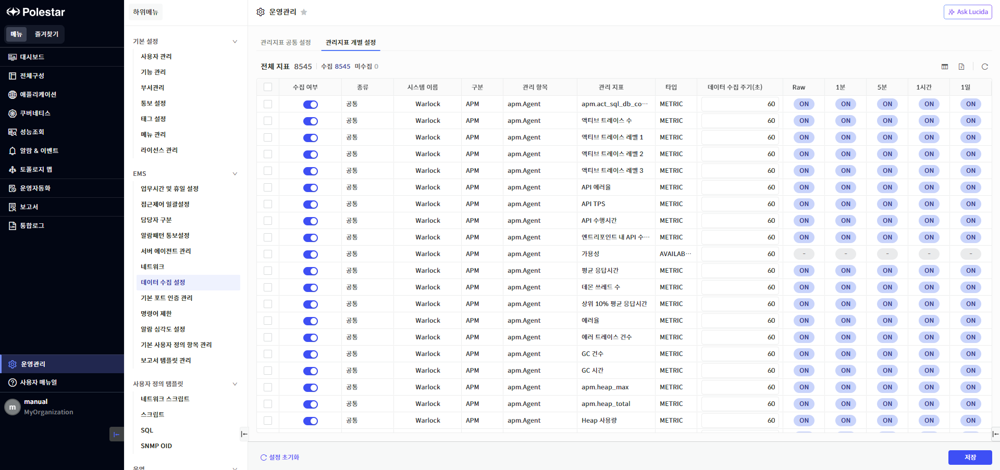

▶ \[그림8\] 관리지표 개별 설정

설정 항목

<table>
<thead>
<tr class="header">
<th>수집 여부</th>
<th>
지표별 성능 데이터 수집 여부를 설정합니다.

기본적으로 POLESTAR에서 지원하는 모든 지표를 수집하도록 설정되어 있으며, 수집 여부 변경 시 해당 지표는 더 이상 POLESTAR에서 처리하지 않습니다.

 : 수집 지표

 : 미수집 지표
</th>
</tr>
</thead>
<tbody>
<tr class="odd">
<td>종류</td>
<td>
지표 설정 종류를 표시합니다. 기본값은 ‘공통’이며, 관리지표 개별 설정 목록에서 데이터를 변경할 경우 ‘개별’로 표시됩니다.

공통: 공통 설정. 관리지표 공통 설정의 지표 설정을 동일하게 사용하는 경우

개별: 개별 설정. 관리지표 공통 설정의 지표 설정을 변경해서 사용하는 경우
</td>
</tr>
<tr class="even">
<td>시스템 이름</td>
<td>관제 장비의 이름을 표시합니다.</td>
</tr>
<tr class="odd">
<td>구분</td>
<td>POLESTAR에서 관제하는 제품군을 표시합니다.</td>
</tr>
<tr class="even">
<td>관리 항목</td>
<td>지표 그룹을 표시합니다.</td>
</tr>
<tr class="odd">
<td>관리 지표</td>
<td>지표명을 표시합니다.</td>
</tr>
<tr class="even">
<td>타입</td>
<td>
지표의 데이터 타입을 표시합니다.

AVAILABILITY: 가용성 데이터

TRAIT: 문자열 데이터

METRIC: 수치 데이터

TABULAR: 목록형 데이터
</td>
</tr>
<tr class="odd">
<td>데이터 수집 주기</td>
<td>
지표별 데이터 수집 주기를 표시합니다. (단위: 초)

모든 지표는 기본 60초 주기로 설정되어 있습니다. 데이터 수집 주기는 관리 항목별로 공통 적용되기 때문에 특정 지표의 데이터 수집 주기를 변경하면 해당 지표와 관리 항목이 동일한 모든 지표의 데이터 수집 주기가 일괄 업데이트 됩니다.
</td>
</tr>
<tr class="even">
<td>통계 데이터</td>
<td>
METRIC 데이터의 주기별 통계 데이터 저장 여부를 설정합니다.

POLESTAR는 1분, 5분, 1시간. 1일 주기의 통계 데이터를 제공합니다.

통계 저장 여부는 METRIC 데이터에 대해서만 설정할 수 있으며, 데이터 수집 주기가 통계 주기보다 긴 경우에는 통계 저장을 지원하지 않습니다.

 : 통계 데이터 저장

 : 통계 데이터 저장 안함
</td>
</tr>
</tbody>
</table>

<table>
<tbody>
<tr class="odd">
<td>
노트

시스템 명과 관리 항목이 동일한 여러 지표의 데이터 수집 주기를 각각 다르게 설정할 경우, 내부적으로 마지막으로 처리한 지표의 데이터 수집 주기가 공통으로 적용됩니다.
</td>
</tr>
</tbody>
</table>

관리지표 개별 설정 저장 절차

1.  특정 지표의 수집 여부, 데이터 수집 주기, 통계 저장 여부 변경 (다수 지표 변경 가능)

2.  \[저장\] 버튼 클릭

관리지표 개별 설정 초기화

관리지표 개별 설정을 공통 설정으로 원상 복구할 수 있습니다. 원상 복구한 지표는 ‘종류’가 ‘공통’으로 표시됩니다.

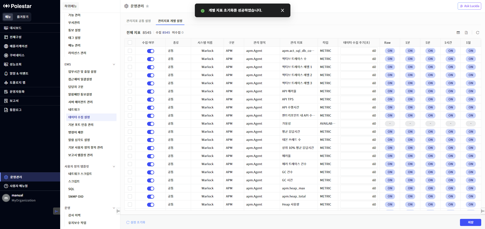

▶ \[그림9\] 관리지표 개별 설정 초기화

관리지표 개별 설정 초기화 절차

1.  설정 초기화할 지표 선택 (다수 선택 가능)

2.  관리지표 개별 설정 좌측 하단의 \[설정 초기화\] 버튼 클릭

