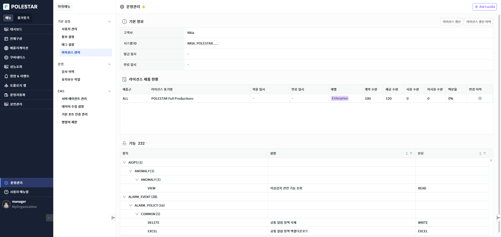
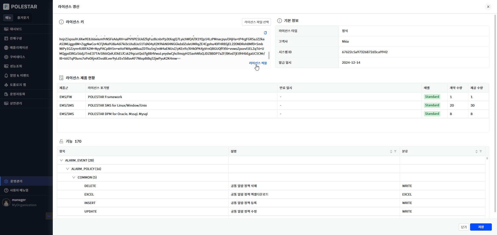
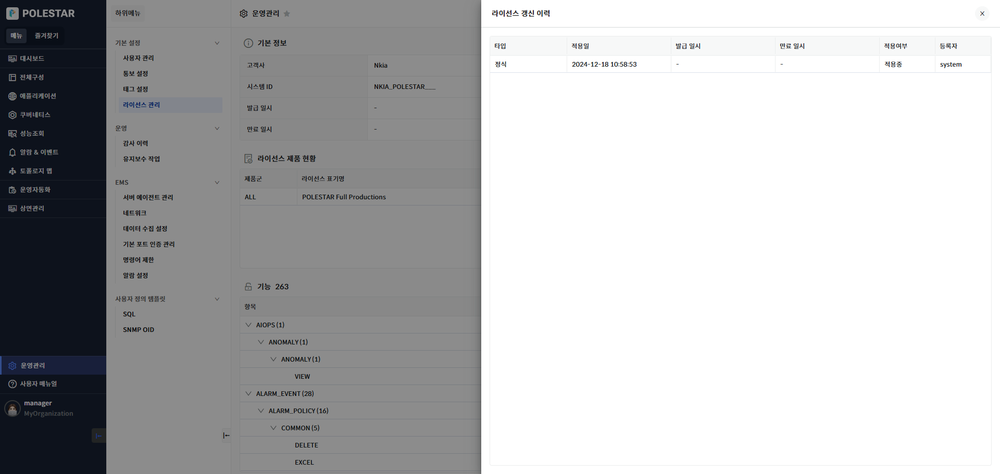
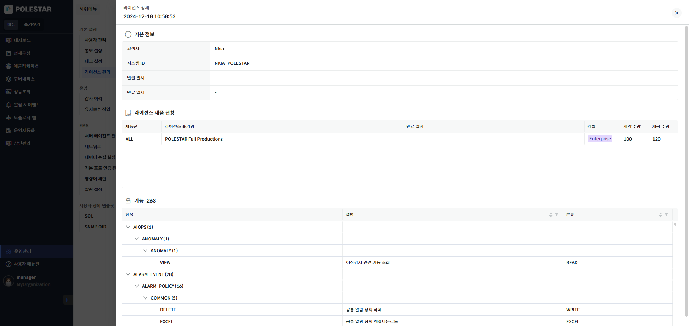

라이선스 관리

라이선스 관리 기능은 시스템에 적용된 라이선스의 현황을 조회하고 갱신하며 이력을 관리하는 기능입니다. 라이선스는 조직별로 적용되며 시스템 관리자가 신규 조직을 생성하는 경우 라이선스를 발급받아서 적용해야 합니다. 라이선스는 갱신 시마다 이력이 저장되며 이력 목록을 통해서 적용당시의 라이선스 정보를 확인할 수 있습니다. 또한 제품별 이력정보를 확인하여 라이선스 적용에 따른 제품 수량의 변화를 확인할 수 있습니다. 라이선스는 정식과 임시 두 가지 종류의 라이선스가 있으며 각각 마지막에 갱신된 라이선스가 적용됩니다.

최초 시스템을 설치하면 제품군이 ALL 인 라이선스가 자동으로 적용되며 모든 종류의 장비를 등록할 수 있습니다. 구축 후 조직에 맞는 정식 라이선스를 발급받아서 갱신해야 합니다.

<table>
<tbody>
<tr class="odd">
<td>
노트

임시 라이선스는 만료일이 지정된 라이선스로 대상 장비의 정보를 포함하고 있어서 해당 장비가 추가될 경우 정식 라이선스의 사용 수량이 감소하지 않습니다. 임시 라이선스 대상이 많은 경우 대상 장비 정보를 라이선스에 기입하는 것이 어려운 경우 조직을 별도로 구성하여 만료일이 있는 정식 라이선스를 발급하는 것을 추천합니다.
</td>
</tr>
</tbody>
</table>

▶ \[그림1\] 라이선스 현황

기본 정보

라이선스의 기본 정보를 표시합니다.

화면 지표

| 고객사    | 고객사 명입니다.                 |
| ------ | ------------------------- |
| 시스템 ID | 라이선스가 적용될 수 있는 시스템 ID입니다. |
| 발급 일시  | 라이선스가 발급된 날짜입니다.          |
| 만료 일시  | 라이선스의 만료일 날짜입니다.          |

라이선스 제품 현황

라이선스에 포함된 제품 현황을 확인할 수 있습니다. \[변경 이력\] 기능으로 제품군별 제품 수량 변경 내역을 확인할 수 있습니다.

<table>
<tbody>
<tr class="odd">
<td>
노트

계약 수량은 정식으로 계약된 수량이며 제공 수량은 등록 가능한 수량 정보입니다. 등록 대수가 계약 수량을 넘기면 추후 라이선스를 다시 발급받아서 계약 수량을 업데이트 해야 합니다.
</td>
</tr>
</tbody>
</table>

화면 지표

<table>
<thead>
<tr class="header">
<th>제품군</th>
<th>라이선스에 기입된 Polestar 10제품군명입니다.</th>
</tr>
</thead>
<tbody>
<tr class="odd">
<td>라이선스 표기명</td>
<td>라이선스에 기입된 제품명입니다.</td>
</tr>
<tr class="even">
<td>적용 일시</td>
<td>라이선스가 적용된 날짜입니다.</td>
</tr>
<tr class="odd">
<td>레벨</td>
<td>
제품별 라이선스 레벨입니다.

레벨은 Light, Standard, Enterprise 가 있으며 Light, Standard, Enterprise 순서로 제공되는 기능이 많아집니다
</td>
</tr>
<tr class="even">
<td>계약 수량</td>
<td>고객과 계약한 제품 수량입니다</td>
</tr>
<tr class="odd">
<td>제공 수량</td>
<td>등록 가능한 수량입니다.</td>
</tr>
<tr class="even">
<td>사용 수량</td>
<td>해당 제품군으로 등록된 대상 장비 수량입니다.</td>
</tr>
<tr class="odd">
<td>미사용 수량</td>
<td>(계약 수량 – 사용 수량) 입니다. 제공 수량만큼 등록될 수 있으므로 음수 값을 가질 수 있습니다.</td>
</tr>
<tr class="even">
<td>백분율</td>
<td>계약 수량 대비 사용 수량 비율입니다. 제공 수량만큼 등록이 가능하기 때문에 제공 수량이 계약 수량보다 많으면100% 가 넘을 수도 있습니다.</td>
</tr>
<tr class="odd">
<td>변경 이력</td>
<td>해당 제품군의 라이선스 변경 이력 화면이 표시됩니다. 라이선스 갱신 시마다 계약 수량 변경을 확인할 수 있습니다.</td>
</tr>
</tbody>
</table>

기능

라이선스가 제공하는 기능 정보를 확인할 수 있습니다.

화면 지표

<table>
<thead>
<tr class="header">
<th>항목</th>
<th>기능 명입니다.</th>
</tr>
</thead>
<tbody>
<tr class="odd">
<td>설명</td>
<td>기능에 대한 설명입니다.</td>
</tr>
<tr class="even">
<td>분류</td>
<td>
기능에 대한 분류입니다.

분류: READ/WRITE/EXECUTE/EXCEL/IMPORT/EXPORT
</td>
</tr>
</tbody>
</table>

라이선스 갱신

시스템에 적용된 라이선스는 \[라이선스 갱신\] 기능을 사용하여 업데이트 할 수 있습니다.

<table>
<tbody>
<tr class="odd">
<td>
노트

라이선스는 이미 적용된 라이선스를 가지고 갱신을 시도해도 정상적으로 적용되며 갱신 이력에 기록됩니다.

라이선스 갱신 후 제품 또는 기능이 추가되어 사용자에게 권한이 할당된 경우 사용자는 다시 로그인해야 권한이 적용됩니다.
</td>
</tr>
</tbody>
</table>

▶ \[그림2\] 라이선스 갱신

화면 지표

<table>
<thead>
<tr class="header">
<th>라이선스 키</th>
<th>
발급된 라이선스 키를 입력합니다.

입력방법

<ol type="1">
<li>
라이선스 키 파일 선택
</li>
<li>
라이선스 키 직접 입력
</li>
</ol>

입력 후 표시되는 [라이선스 적용]버튼을 클릭 시 유효한 라이선스 키 인 경우 정보가 화면에 업데이트되며 유효하지 않으면 화면이 정보가 초기화되며 Alert 메시지가 나타납니다.
</th>
</tr>
</thead>
<tbody>
<tr class="odd">
<td>라이선스 타입</td>
<td>라이선스가 정식 또는 임시인지 표시합니다.</td>
</tr>
<tr class="even">
<td>고객사</td>
<td>라이선스에 기입된 고객사 명입니다.</td>
</tr>
<tr class="odd">
<td>시스템 ID</td>
<td>라이선스가 적용될 수 있는 시스템 ID입니다.</td>
</tr>
<tr class="even">
<td>발급 일시</td>
<td>라이선스가 발급된 날짜입니다.</td>
</tr>
</tbody>
</table>

라이선스 제품 현황

라이선스에 포함된 제품 현황을 확인할 수 있습니다.

<table>
<tbody>
<tr class="odd">
<td>
노트

계약 수량은 정식으로 계약된 수량이며 제공 수량은 등록 가능한 수량 정보입니다. 등록 대수가 계약 수량을 넘기면 추후 라이선스를 다시 발급받아서 계약 수량을 업데이트 해야 합니다.
</td>
</tr>
</tbody>
</table>

화면 지표

<table>
<thead>
<tr class="header">
<th>제품군</th>
<th>라이선스에 기입된 Polestar 10제품군명입니다.</th>
</tr>
</thead>
<tbody>
<tr class="odd">
<td>라이선스 표기명</td>
<td>라이선스에 기입된 제품명입니다.</td>
</tr>
<tr class="even">
<td>만료 일시</td>
<td>라이선스의 만료일 날짜입니다.</td>
</tr>
<tr class="odd">
<td>레벨</td>
<td>
제품별 라이선스 레벨입니다.

레벨은 Light, Standard, Enterprise 가 있으며 Light, Standard, Enterprise 순서로 제공되는 기능이 많아집니다
</td>
</tr>
<tr class="even">
<td>계약 수량</td>
<td>고객과 계약한 제품 수량입니다</td>
</tr>
<tr class="odd">
<td>제공 수량</td>
<td>등록 가능한 수량입니다.</td>
</tr>
</tbody>
</table>

기능

라이선스가 제공하는 기능 정보를 확인할 수 있습니다.

화면 지표

<table>
<thead>
<tr class="header">
<th>항목</th>
<th>기능 명입니다.</th>
</tr>
</thead>
<tbody>
<tr class="odd">
<td>설명</td>
<td>기능에 대한 설명입니다.</td>
</tr>
<tr class="even">
<td>분류</td>
<td>
기능에 대한 분류입니다.

분류: READ/WRITE/EXECUTE/EXCEL/IMPORT/EXPORT
</td>
</tr>
</tbody>
</table>

라이선스 갱신 이력

시스템에 적용된 라이선스 이력 정보를 확인할 수 있습니다. 이력 목록에서 \[적용여부\]가 \[적용중\] 값이 현재 시스템에 반영된 라이선스입니다. 적용중인 라이선스는 정식/임시 각각 하나만 존재합니다. 라이선스 \[적용일\]을 클릭하면 해당 라이선스 정보 창이 표시됩니다.

<table>
<tbody>
<tr class="odd">
<td>
노트

이력은 제품별이 아닌 라이선스 갱신 이력입니다.
</td>
</tr>
</tbody>
</table>

▶ \[그림3\] 라이선스 갱신 이력

화면 지표

| 타입    | 정식 또는 임시를 표시합니다.           |
| ----- | -------------------------- |
| 적용일   | 라이선스를 시스템에 적용한 날짜입니다.      |
| 발급 일시 | 라이선스의 발급 날짜입니다.            |
| 만료 일시 | 라이선스의 만료 날짜입니다.            |
| 적용여부  | 라이선스가 적용중인 상태를 표시합니다.      |
| 등록자   | 라이선스를 갱신한 사용자의 로그인 아이디입니다. |

라이선스 상세

라이선스 이력 목록의 적용일에 적용한 라이선스의 상세 정보입니다.

▶ \[그림4\] 라이선스 상세

기본 정보

라이선스의 기본 정보를 표시합니다.

화면 지표

| 고객사    | 고객사 명입니다.                 |
| ------ | ------------------------- |
| 시스템 ID | 라이선스가 적용될 수 있는 시스템 ID입니다. |
| 발급 일시  | 라이선스가 발급된 날짜입니다.          |
| 만료 일시  | 라이선스의 만료일 날짜입니다.          |

라이선스 제품 현황

라이선스에 포함된 제품 현황을 확인할 수 있습니다. \[변경 이력\] 기능으로 제품군별 제품 수량 변경 내역을 확인할 수 있습니다.

<table>
<tbody>
<tr class="odd">
<td>
노트

계약 수량은 정식으로 계약된 수량이며 제공 수량은 등록 가능한 수량 정보입니다. 등록 대수가 계약 수량을 넘기면 추후 라이선스를 다시 발급받아서 계약 수량을 업데이트 해야 합니다.
</td>
</tr>
</tbody>
</table>

화면 지표

<table>
<thead>
<tr class="header">
<th>제품군</th>
<th>라이선스에 기입된 Polestar 10제품군명입니다.</th>
</tr>
</thead>
<tbody>
<tr class="odd">
<td>라이선스 표기명</td>
<td>라이선스에 기입된 제품명입니다.</td>
</tr>
<tr class="even">
<td>만료 일시</td>
<td>라이선스가 만료된 날짜입니다.</td>
</tr>
<tr class="odd">
<td>레벨</td>
<td>
제품별 라이선스 레벨입니다.

레벨은 Light, Standard, Enterprise 가 있으며 Light, Standard, Enterprise 순서로 제공되는 기능이 많아집니다
</td>
</tr>
<tr class="even">
<td>계약 수량</td>
<td>고객과 계약한 제품 수량입니다</td>
</tr>
<tr class="odd">
<td>제공 수량</td>
<td>등록 가능한 수량입니다.</td>
</tr>
</tbody>
</table>

기능

라이선스가 제공하는 기능 정보를 확인할 수 있습니다.

화면 지표

<table>
<thead>
<tr class="header">
<th>항목</th>
<th>기능 명입니다.</th>
</tr>
</thead>
<tbody>
<tr class="odd">
<td>설명</td>
<td>기능에 대한 설명입니다.</td>
</tr>
<tr class="even">
<td>분류</td>
<td>
기능에 대한 분류입니다.

분류: READ/WRITE/EXECUTE/EXCEL/IMPORT/EXPORT
</td>
</tr>
</tbody>
</table>

