보고서 관리

사용자는 보고서 현황을 통해서 생성된 보고서 목록을 확인할 수 있습니다. 목록에는 스케줄, 마지막 생성일, 다음 생성일과 같은 보고서 생성 스케줄 정보를 확인할 수 있습니다. 사용자는 보고서 즉시 전송 기능으로 보고서를 즉시 생성하거나 마지막 생성한 보고서를 사용자에게 메일로 전달할 수 있습니다. 보고서 생성 이력 화면에서 보고서 생성에 대한 성공 여부를 확인할 수 있고 보고서를 다운로드 받을 수 있습니다.

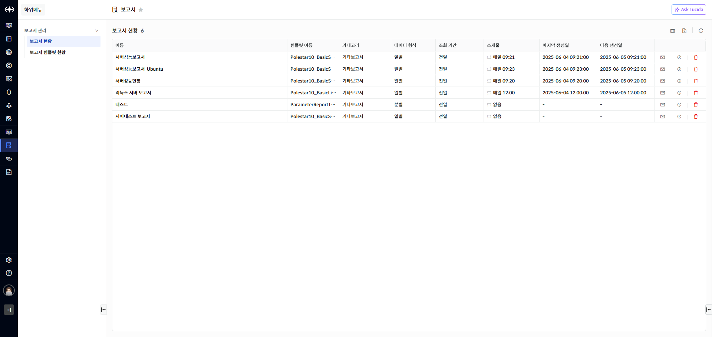

▶ \[그림1\] 보고서 현황

화면 지표

| 이름      | 생성하려는 보고서 이름을 입력합니다    |
| ------- | ---------------------- |
| 템플릿 이름  | 보고서 템플릿 이름입니다.         |
| 카테고리    | 보고서 종류입니다.             |
| 데이터 형식  | 데이터 그룹 형식입니다.          |
| 조회 기간   | 데이터 조회 기간입니다..         |
| 스케줄     | 보고서 생성 스케줄입니다.         |
| 마지막 생성일 | 가장 최근에 보고서를 생성한 일시입니다. |
| 다음 생성일  | 보고서를 생성하는 다음 일시입니다.    |

보고서 수정

보고서 현황 목록에서 이름을 선택하면 상세화면이 나타나며 보고서 정보를 수정할 수 있습니다.

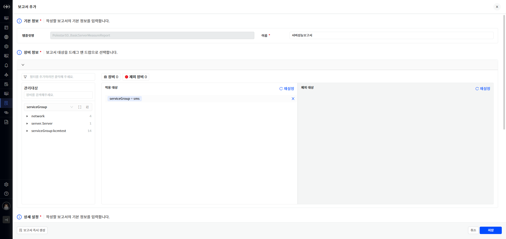

▶ \[그림2\] 보고서 수정

화면 지표

<table>
<thead>
<tr class="header">
<th>템플릿명</th>
<th>보고서 템플릿 이름입니다.</th>
</tr>
</thead>
<tbody>
<tr class="odd">
<td>이름</td>
<td>생성하려는 보고서 이름을 입력합니다</td>
</tr>
<tr class="even">
<td>장비 정보</td>
<td>
보고서 대상이 되는 장비를 선택 또는 제외합니다.

관리 대상

<ul>
<li><blockquote>

적용 또는 제외하려는 장비를 검색합니다.

</blockquote></li>
<li><blockquote>

선택하여 적용 대상 또는 제외 대상 영역에 Drop 하여 추가합니다.

</blockquote></li>
</ul>

적용 대상

<ul>
<li><blockquote>

보고서의 대상이 되는 장비 정보입니다.

</blockquote></li>
</ul>

제외 대상

<ul>
<li>
보고서의 대상에서 제외되는 장비 정보입니다.
</li>
</ul></td>
</tr>
<tr class="odd">
<td>장비(버튼)</td>
<td>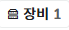 버튼을 클릭하면 적용 대상 장비 목록 조회 화면이 표시됩니다.</td>
</tr>
<tr class="even">
<td>제외 장비(버튼)</td>
<td>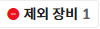버튼을 클릭하면 제외 대상 장비 목록 조회 화면이 표시됩니다.</td>
</tr>
<tr class="odd">
<td>데이터 그룹 형식</td>
<td>
보고서에서 제공하는 데이터 그룹 형식을 표시합니다.

예시: 시별/일별/주별/월별
</td>
</tr>
<tr class="even">
<td>조회 기간</td>
<td>
보고서에 필요한 데이터 조회 기간을 선택합니다.

옵션 목록

<ul>
<li><blockquote>

오늘

</blockquote></li>
<li><blockquote>

전일

</blockquote></li>
<li><blockquote>

금주

</blockquote></li>
<li><blockquote>

전주

</blockquote></li>
<li><blockquote>

금월

</blockquote></li>
<li><blockquote>

전7일

</blockquote></li>
<li><blockquote>

전30일

</blockquote></li>
<li><blockquote>

전월

</blockquote></li>
<li><blockquote>

전3개월

</blockquote></li>
<li><blockquote>

전6개월

</blockquote></li>
<li><blockquote>

금년

</blockquote></li>
<li><blockquote>

전년

</blockquote></li>
<li><blockquote>

전1시간

</blockquote></li>
<li><blockquote>

전3시간

</blockquote></li>
<li><blockquote>

전6시간

</blockquote></li>
<li><blockquote>

전12시간

</blockquote></li>
<li><blockquote>

전24시간

</blockquote></li>
<li><blockquote>

사용자 정의(최근시간)

</blockquote></li>
<li><blockquote>

사용자 정의

</blockquote></li>
</ul></td>
</tr>
<tr class="odd">
<td>역할</td>
<td>역할 이름입니다.</td>
</tr>
<tr class="even">
<td>설명</td>
<td>역할의 설명입니다.</td>
</tr>
<tr class="odd">
<td>권한</td>
<td>역할에 부여할 권한을 선택합니다.</td>
</tr>
<tr class="even">
<td>스케줄 설정</td>
<td>
옵션 목록

<ul>
<li><blockquote>

스케줄 없음

</blockquote></li>
<li><blockquote>

매일

</blockquote></li>
<li><blockquote>

매주

</blockquote></li>
<li><blockquote>

매월

</blockquote></li>
</ul></td>
</tr>
<tr class="odd">
<td>통보 방식</td>
<td>통보 설정에 정의한 통보 방식입니다. 하나를 선택할 수 있습니다.</td>
</tr>
<tr class="even">
<td>대상 사용자</td>
<td>생성된 보고서를 수신할 사용자를 선택합니다.</td>
</tr>
<tr class="odd">
<td>대상 그룹</td>
<td>생성된 보고서를 수신할 대상 그룹을 선택합니다.</td>
</tr>
<tr class="even">
<td>대상 역할</td>
<td>생성된 보고서를 수신할 역할을 선택합니다.</td>
</tr>
<tr class="odd">
<td>메일 직접 입력</td>
<td>생성된 보고서를 수신할 메일을 입력합니다. 콤마 구분자로 여러 개의 메일 주소를 입력할 수 있습니다.</td>
</tr>
<tr class="even">
<td>첨부파일</td>
<td>
생성할 보고서의 파일 형식을 선택합니다.

ALL을 선택하면 모든 종류의 파일 형식으로 생성합니다.

보고서 파일 형식 종류

<ul>
<li><blockquote>

XLS

</blockquote></li>
<li><blockquote>

PDF

</blockquote></li>
<li><blockquote>

DOC

</blockquote></li>
<li><blockquote>

HWP

</blockquote></li>
<li><blockquote>

PPT

</blockquote></li>
<li><blockquote>

XLSX

</blockquote></li>
</ul></td>
</tr>
<tr class="odd">
<td>보고서 즉시 생성(버튼)</td>
<td>입력한 정보로 보고서를 즉시 생성하여 화면에 표시합니다.</td>
</tr>
<tr class="even">
<td>취소(버튼)</td>
<td>입력을 취소하고 추가화면을 닫습니다</td>
</tr>
<tr class="odd">
<td>저장(버튼)</td>
<td>보고서를 저장합니다.</td>
</tr>
</tbody>
</table>

보고서 수정 절차

1.  수정하고자 하는 보고서 이름을 클릭합니다.

2.  보고서 정보를 수정합니다.

3.  \[저장\] 버튼을 선택하여 저장합니다

보고서 삭제

보고서 현황 목록에서 보고서를 삭제할 수 있습니다.

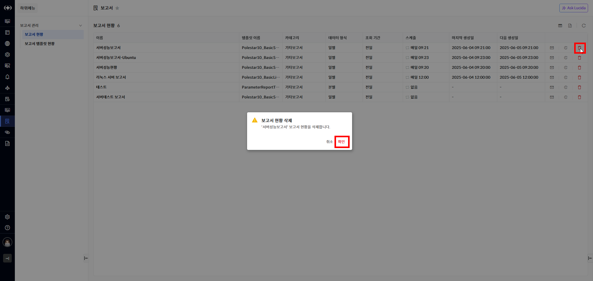

▶ \[그림3\] 보고서 삭제

보고서 삭제 절차

1.  삭제하고자 하는 보고서의 \[삭제\] 버튼을 선택합니다.

2.  \[확인\] 버튼을 선택하여 삭제합니다.

보고서 즉시 전송

사용자는 보고서 즉시 전송 기능으로 보고서 즉시 생성하거나 최근 생성된 보고서를 특정 사용자에게 전달할 수 있습니다. 보고서 현황 목록의 오른쪽에 있는 \[보고서 즉시 전송\] 버튼을 클릭하면 보고서 즉시 전송 화면이 표시됩니다. 전송 시 첨부되는 파일 종류는 보고서 등록 시 선택한 첨부 파일이 모두 첨부됩니다.

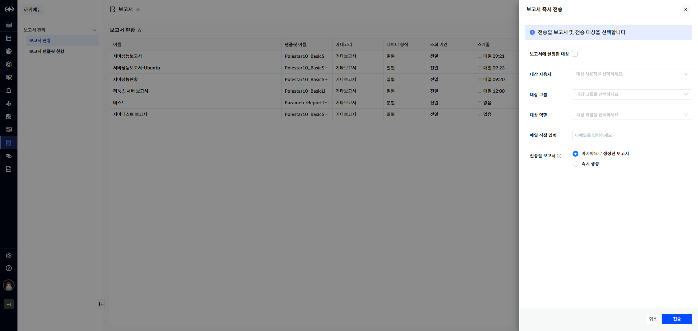

▶ \[그림4\] 보고서 즉시 전송

화면 지표

<table>
<thead>
<tr class="header">
<th>보고서에 설정된 대상</th>
<th>보고서를 수신할 대상을 보고서에 설정된 대상으로 선택합니다.</th>
</tr>
</thead>
<tbody>
<tr class="odd">
<td>대상 사용자</td>
<td>수신할 사용자를 선택합니다.</td>
</tr>
<tr class="even">
<td>대상 그룹</td>
<td>수신할 사용자 그룹을 선택합니다.</td>
</tr>
<tr class="odd">
<td>대상 역할</td>
<td>수신할 사용자 역할을 선택합니다.</td>
</tr>
<tr class="even">
<td>메일 직접 입력</td>
<td>수신할 사용자의 메일을 입력합니다.</td>
</tr>
<tr class="odd">
<td>전송할 보고서</td>
<td>
전송할 보고서를 선택합니다.

마지막으로 생성한 보고서

<ul>
<li>
가장 최근에 생성한 보고서를 전송합니다.
</li>
</ul>

즉시 생성

<ul>
<li>
지금 즉시 보고서를 생성한 후 전송합니다.
</li>
</ul></td>
</tr>
<tr class="even">
<td>취소</td>
<td>보고서를 전송하지 않고 화면을 닫습니다.</td>
</tr>
<tr class="odd">
<td>전송</td>
<td>보고서 즉시 전송을 실행합니다.</td>
</tr>
</tbody>
</table>

보고서 즉시 전송 절차

1.  보고서 현황에서 즉시 전송할 보고서의 \[보고서 즉시 전송\]버튼을 클릭합니다.

2.  보고서를 수신할 대상자 및 보고서를 선택합니다.

3.  \[전송\] 버튼을 선택하여 전송합니다.

보고서 이력조회

사용자는 보고서의 생성 이력을 확인할 수 있습니다. 보고서 현황에서 \[보고서 이력조회\]버튼을 선택하면 해당 보고서의 생성 이력화면이 표시됩니다.

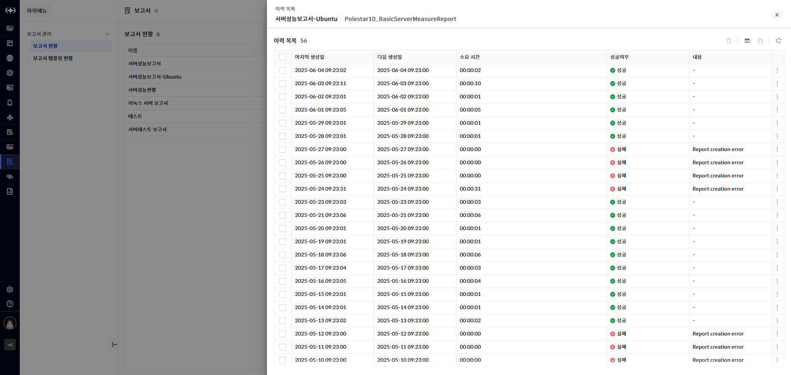

▶ \[그림5\] 보고서 이력조회

화면 지표

<table>
<thead>
<tr class="header">
<th>시작 시간</th>
<th>보고서를 생성하기 시작한 시간입니다.</th>
</tr>
</thead>
<tbody>
<tr class="odd">
<td>종료 시간</td>
<td>보고서 생성을 종료한 시간입니다.</td>
</tr>
<tr class="even">
<td>소요 시간</td>
<td>보고서에 소요된 시간입니다.</td>
</tr>
<tr class="odd">
<td>성공여부</td>
<td>보고서 생성 성공 여부입니다.</td>
</tr>
<tr class="even">
<td>내용</td>
<td>보고서 생성 실패에 대한 오류 메시지입니다.</td>
</tr>
<tr class="odd">
<td>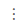</td>
<td>
다운로드할 보고서를 선택합니다.

버튼을 선택하면 생성된 보고서 목록이 표시됩니다.

보고서를 선택하거나 [전체 ZIP 다운로드] 선택하면 보고서가 다운로드 됩니다
</td>
</tr>
</tbody>
</table>

보고서 템플릿 현황

사용자는 보고서 템플릿 현황을 확인할 수 있습니다. 템플릿의 속성 정보와 템플릿으로 생성된 보고서 개수를 확인할 수 있습니다. 보고서 개수를 선택하면 해당 템플릿으로 생성된 보고서 목록 조회화면으로 이동합니다.

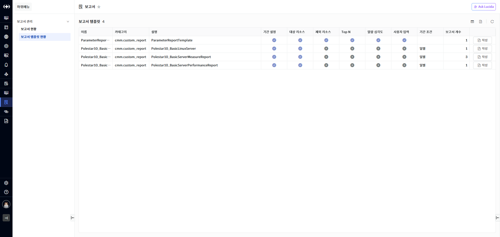

▶ \[그림6\] 보고서 템플릿 현황

화면 지표

<table>
<thead>
<tr class="header">
<th>이름</th>
<th>보고서 템플릿 이름입니다.</th>
</tr>
</thead>
<tbody>
<tr class="odd">
<td>카테고리</td>
<td>
보고서의 카테고리입니다.

(구성, 알람, 이벤트, 성능, 기타 보고서)
</td>
</tr>
<tr class="even">
<td>설명</td>
<td>보고서 템플릿에 대한 설명입니다.</td>
</tr>
<tr class="odd">
<td>기간 설정</td>
<td>보고서 생성 시 기간 설정 사용 여부입니다.</td>
</tr>
<tr class="even">
<td>대상 리소스</td>
<td>보고서 생성 시 대상 리소스 선택 사용 여부입니다.</td>
</tr>
<tr class="odd">
<td>제외 리소스</td>
<td>보고서 생성 시 제외 리소스 선택 사용 여부입니다.</td>
</tr>
<tr class="even">
<td>Top N</td>
<td>보고서 생성 시 Top N 속성 선택 여부입니다.</td>
</tr>
<tr class="odd">
<td>알람 심각도</td>
<td>보고서 생성 시 알람 심각도 선택 사용 여부입니다.</td>
</tr>
<tr class="even">
<td>사용자 입력</td>
<td>보고서 생성 시 사용자 입력 속성 사용 여부입니다.</td>
</tr>
<tr class="odd">
<td>기간 조건</td>
<td>보고서 생성 시 선택할 수 있는 데이터 그룹 형식입니다.</td>
</tr>
<tr class="even">
<td>보고서 개수</td>
<td>템플릿으로 작성한 보고서 개수입니다.</td>
</tr>
<tr class="odd">
<td>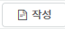</td>
<td>선택하면 신규 보고서를 작성하는 화면이 표시됩니다.</td>
</tr>
</tbody>
</table>

보고서 추가

사용자는 보고서 템플릿을 선택하여 보고서를 작성할 수 있습니다. 보고서 템플릿 현황에서 추가하고자 하는 보고서의 작성 버튼을 클릭하여 신규 보고서를 작성할 수 있습니다. 보고서 작성 화면에서 보고서 이름을 입력하고 보고서 생성에 필요한 여러 속성들의 값을 입력합니다. 보고서 템플릿 마다 보고서 생성에 필요한 속성 정보가 다를 수 있으며 필수 값들을 입력하면 보고서를 생성할 수 있습니다. 사용자는 보고서 생성에 필요한 값을 입력하고 보고서를 즉시 생성하여 결과를 확인할 수 있습니다. 보고서가 정상적으로 생성되는 것을 확인하면 보고서 생성 스케줄을 등록하여 주기적으로 보고서를 생성하고 이메일로 생성된 보고서를 받도록 설정할 수 있습니다.

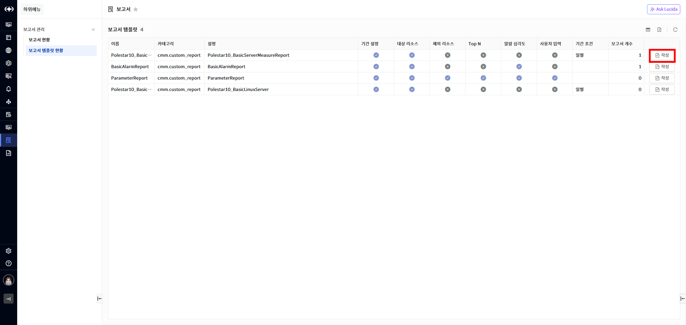

▶ \[그림7\] 보고서 템플릿 현황에서 보고서 작성 버튼 클릭

화면 지표

<table>
<thead>
<tr class="header">
<th>템플릿명</th>
<th>보고서 템플릿 이름입니다.</th>
</tr>
</thead>
<tbody>
<tr class="odd">
<td>이름</td>
<td>생성하려는 보고서 이름을 입력합니다</td>
</tr>
<tr class="even">
<td>장비 정보</td>
<td>
보고서 대상이 되는 장비를 선택 또는 제외합니다.

관리 대상

<ul>
<li><blockquote>

적용 또는 제외하려는 장비를 검색합니다.

</blockquote></li>
<li><blockquote>

선택하여 적용 대상 또는 제외 대상 영역에 Drop 하여 추가합니다.

</blockquote></li>
</ul>

적용 대상

<ul>
<li><blockquote>

보고서의 대상이 되는 장비 정보입니다.

</blockquote></li>
</ul>

제외 대상

<ul>
<li>
보고서의 대상에서 제외되는 장비 정보입니다.
</li>
</ul></td>
</tr>
<tr class="odd">
<td>장비(버튼)</td>
<td> 버튼을 클릭하면 적용 대상 장비 목록 조회 화면이 표시됩니다.</td>
</tr>
<tr class="even">
<td>제외 장비(버튼)</td>
<td>버튼을 클릭하면 제외 대상 장비 목록 조회 화면이 표시됩니다.</td>
</tr>
<tr class="odd">
<td>데이터 그룹 형식</td>
<td>
보고서에서 제공하는 데이터 그룹 형식을 표시합니다.

예시: 시별/일별/주별/월별
</td>
</tr>
<tr class="even">
<td>조회 기간</td>
<td>
보고서에 필요한 데이터 조회 기간을 선택합니다.

옵션 목록

<ul>
<li><blockquote>

오늘

</blockquote></li>
<li><blockquote>

전일

</blockquote></li>
<li><blockquote>

금주

</blockquote></li>
<li><blockquote>

전주

</blockquote></li>
<li><blockquote>

금월

</blockquote></li>
<li><blockquote>

전7일

</blockquote></li>
<li><blockquote>

전30일

</blockquote></li>
<li><blockquote>

전월

</blockquote></li>
<li><blockquote>

전3개월

</blockquote></li>
<li><blockquote>

전6개월

</blockquote></li>
<li><blockquote>

금년

</blockquote></li>
<li><blockquote>

전년

</blockquote></li>
<li><blockquote>

전1시간

</blockquote></li>
<li><blockquote>

전3시간

</blockquote></li>
<li><blockquote>

전6시간

</blockquote></li>
<li><blockquote>

전12시간

</blockquote></li>
<li><blockquote>

전24시간

</blockquote></li>
<li><blockquote>

사용자 정의(최근시간)

</blockquote></li>
<li><blockquote>

사용자 정의

</blockquote></li>
</ul></td>
</tr>
<tr class="odd">
<td>역할</td>
<td>역할 이름입니다.</td>
</tr>
<tr class="even">
<td>설명</td>
<td>역할의 설명입니다.</td>
</tr>
<tr class="odd">
<td>권한</td>
<td>역할에 부여할 권한을 선택합니다.</td>
</tr>
<tr class="even">
<td>스케줄 설정</td>
<td>
옵션 목록

<ul>
<li><blockquote>

스케줄 없음

</blockquote></li>
<li><blockquote>

매일

</blockquote></li>
<li><blockquote>

매주

</blockquote></li>
<li><blockquote>

매월

</blockquote></li>
</ul></td>
</tr>
<tr class="odd">
<td>통보 방식</td>
<td>통보 설정에 정의한 통보 방식입니다. 하나를 선택할 수 있습니다.</td>
</tr>
<tr class="even">
<td>대상 사용자</td>
<td>생성된 보고서를 수신할 사용자를 선택합니다.</td>
</tr>
<tr class="odd">
<td>대상 그룹</td>
<td>생성된 보고서를 수신할 대상 그룹을 선택합니다.</td>
</tr>
<tr class="even">
<td>대상 역할</td>
<td>생성된 보고서를 수신할 역할을 선택합니다.</td>
</tr>
<tr class="odd">
<td>메일 직접 입력</td>
<td>생성된 보고서를 수신할 메일을 입력합니다. 콤마 구분자로 여러 개의 메일 주소를 입력할 수 있습니다.</td>
</tr>
<tr class="even">
<td>첨부파일</td>
<td>
생성할 보고서의 파일 형식을 선택합니다.

ALL을 선택하면 모든 종류의 파일 형식으로 생성합니다.

보고서 파일 형식 종류

<ul>
<li><blockquote>

XLS

</blockquote></li>
<li><blockquote>

PDF

</blockquote></li>
<li><blockquote>

DOC

</blockquote></li>
<li><blockquote>

HWP

</blockquote></li>
<li><blockquote>

PPT

</blockquote></li>
<li><blockquote>

XLSX

</blockquote></li>
</ul></td>
</tr>
<tr class="odd">
<td>보고서 즉시 생성(버튼)</td>
<td>입력한 정보로 보고서를 즉시 생성하여 화면에 표시합니다.</td>
</tr>
<tr class="even">
<td>취소(버튼)</td>
<td>입력을 취소하고 추가화면을 닫습니다</td>
</tr>
<tr class="odd">
<td>저장(버튼)</td>
<td>신규 보고서를 추가합니다.</td>
</tr>
</tbody>
</table>

