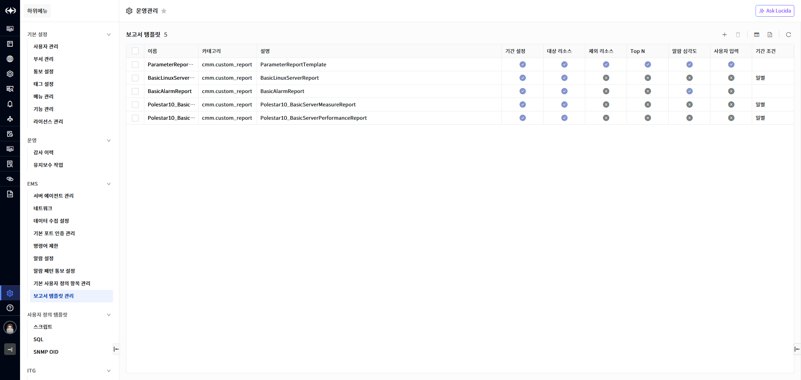
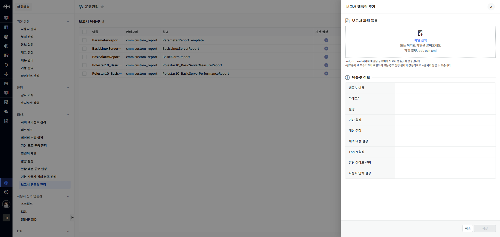
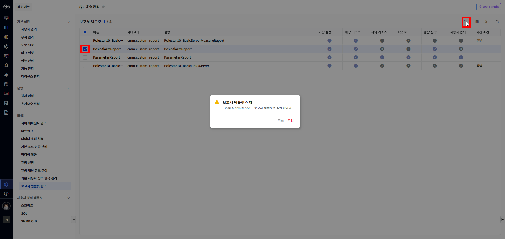
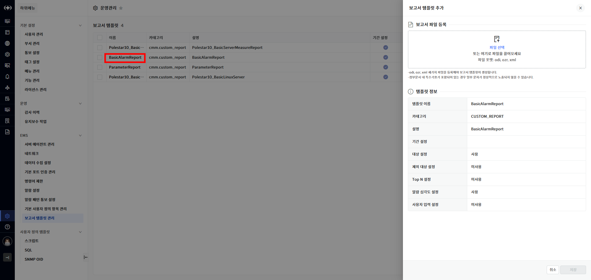

보고서 템플릿 관리

보고서의 템플릿을 관리하는 기능입니다. 기본 보고서에 대한 템플릿은 시스템 구축 시 자동으로 등록됩니다. 보고서 템플릿 기능을 통해 사용자는 효율적으로 보고서 양식을 관리하고, 일관성 있는 보고서 작성을 용이하게 할 수 있습니다. 사용자는 시스템에 등록된 보고서 템플릿 목록을 조회하여 각 템플릿에 정의된 보고서 양식 정보를 확인할 수 있습니다. 템플릿 목록 화면에서는 템플릿의 이름, 카테고리 등의 기본 정보와 더불어 템플릿이 제공하는 보고서 양식의 주요 항목들을 미리 파악할 수 있습니다. 시스템 관리자 또는 권한을 가진 사용자는 새로운 보고서 템플릿을 시스템에 업로드하여 등록할 수 있습니다. 신규 템플릿 등록 기능을 통해 조직의 특정 요구사항이나 새로운 보고서 형식을 시스템에 반영하여 사용할 수 있습니다. 템플릿 파일은 시스템에서 지원하는 특정 형식(odi, ozr, xml 확장자)으로 업로드해야 하며, 업로드 시 템플릿의 이름, 설명 등 관련 정보를 미리 확인 후 등록할 수 있습니다.

<table>
<tbody>
<tr class="odd">
<td>
노트

기존 운영중인 보고서의 양식을 변경하려면 관련 템플릿을 수정하여 업로드해야 합니다.
</td>
</tr>
</tbody>
</table>

▶ \[그림1\] 보고서 템플릿 목록

화면 지표

<table>
<thead>
<tr class="header">
<th>이름</th>
<th>보고서 템플릿 이름입니다.</th>
</tr>
</thead>
<tbody>
<tr class="odd">
<td>카테고리</td>
<td>
보고서의 카테고리입니다.

(구성, 알람, 이벤트, 성능, 기타 보고서)
</td>
</tr>
<tr class="even">
<td>설명</td>
<td>보고서 템플릿에 대한 설명입니다.</td>
</tr>
<tr class="odd">
<td>기간 설정</td>
<td>보고서 생성 시 기간 설정 사용 여부입니다.</td>
</tr>
<tr class="even">
<td>대상 리소스</td>
<td>보고서 생성 시 대상 리소스 선택 사용 여부입니다.</td>
</tr>
<tr class="odd">
<td>제외 리소스</td>
<td>보고서 생성 시 제외 리소스 선택 사용 여부입니다.</td>
</tr>
<tr class="even">
<td>Top N</td>
<td>보고서 생성 시 Top N 속성 선택 여부입니다.</td>
</tr>
<tr class="odd">
<td>알람 심각도</td>
<td>보고서 생성 시 알람 심각도 선택 사용 여부입니다.</td>
</tr>
<tr class="even">
<td>사용자 입력</td>
<td>보고서 생성 시 사용자 입력 속성 사용 여부입니다.</td>
</tr>
<tr class="odd">
<td>기간 조건</td>
<td>보고서 생성 시 선택할 수 있는 데이터 그룹 형식입니다.</td>
</tr>
</tbody>
</table>

보고서 템플릿 등록

사용자는 신규 보고서 작성에 필요한 보고서 템플릿을 화면을 통해서 등록할 수 있습니다. 보고서 템플릿 파일은 odi, ozr, xml 3 가지 파일이 필요합니다. odi, ozr 파일은 보고서 생성에 필요한 파일이고 xml 파일은 보고서 템플릿 이름 및 속성 정보를 정의한 파일입니다.

▶ \[그림2\] 보고서 템플릿 등록

화면 지표

<table>
<tbody>
<tr class="odd">
<td>템플릿 이름</td>
<td>보고서 템플릿 이름입니다.</td>
</tr>
<tr class="even">
<td>카테고리</td>
<td>
보고서의 카테고리입니다.

(구성, 알람, 이벤트, 성능, 기타 보고서)
</td>
</tr>
<tr class="odd">
<td>설명</td>
<td>보고서 템플릿에 대한 설명입니다.</td>
</tr>
<tr class="even">
<td>기간 설정</td>
<td>보고서 생성 시 기간 설정 사용 여부입니다.</td>
</tr>
<tr class="odd">
<td>대상 리소스</td>
<td>보고서 생성 시 대상 리소스 선택 사용 여부입니다.</td>
</tr>
<tr class="even">
<td>제외 리소스</td>
<td>보고서 생성 시 제외 리소스 선택 사용 여부입니다.</td>
</tr>
<tr class="odd">
<td>Top N</td>
<td>보고서 생성 시 Top N 속성 선택 여부입니다.</td>
</tr>
<tr class="even">
<td>알람 심각도</td>
<td><ul>
<li>
보고서 생성 시 알람 심각도 선택 사용 여부입니다.
</li>
</ul></td>
</tr>
<tr class="odd">
<td>사용자 입력</td>
<td>보고서 생성 시 사용자 입력 속성 사용 여부입니다.</td>
</tr>
</tbody>
</table>

보고서 템플릿 등록 절차

1.  테이블 우측 상단의 추가 버튼을 클릭합니다.

2.  보고서 템플릿 생성에 필요한 odi, ozr, xml 3 가지 파일을 업로드합니다.

3.  \[저장\] 버튼을 선택하여 저장합니다.

보고서 템플릿 삭제

보고서 템플릿을 삭제하려는 경우 목록에서 삭제할 템플릿을 선택하고 \[삭제\] 버튼을 클릭해서 삭제할 수 있습니다.

▶ \[그림3\] 보고서 템플릿 삭제

<table>
<tbody>
<tr class="odd">
<td>
노트

템플릿으로 생성한 보고서가 존재한다면 템플릿을 삭제할 수 없습니다.
</td>
</tr>
</tbody>
</table>

보고서 템플릿 삭제 절차

1.  삭제하고자 하는 보고서 템플릿 선택 (다중 선택 가능).

2.  테이블 우측 상단의 삭제 아이콘 클릭

3.  메시시창에서 확인 클릭

보고서 템플릿 수정

보고서 템플릿 목록에서 이름을 선택하면 상세화면이 나타나며 보고서 템플릿 생성에 필요한 파일을 다시 업로드하여 템플릿을 수정할 수 있습니다.

<table>
<tbody>
<tr class="odd">
<td>
노트

보고서 템플릿의 이름은 보고서를 구분하는 정보이므로 변경할 수 없습니다. 업로드한 파일 정보에서 이름이 다른 경우 다른 보고서 템플릿 파일로 인식하여 수정할 수 없습니다.
</td>
</tr>
</tbody>
</table>

▶ \[그림4\] 보고서 템플릿 수정

보고서 템플릿 수정 절차

1.  수정하고자 하는 보고서 템플릿의 이름을 클릭합니다.

2.  보고서 템플릿 수정에 필요한 odi, ozr, xml 3 가지 파일을 업로드합니다.

3.  \[저장\] 버튼을 선택하여 저장합니다

