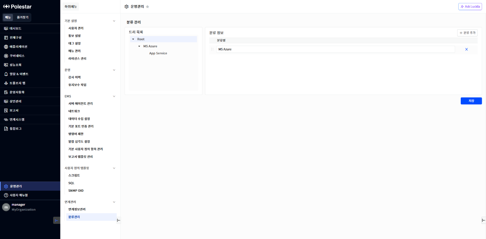

분류관리

\[운영관리\] 메뉴를 선택하면 \[연계관리\] \> \[분류관리\] 화면을 확인할 수 있습니다.

연계시스템 모니터링에 대한 분류 관리를 위하여 분류를 추가하거나 삭제할 수 있습니다.

▶ \[그림1\] 분류관리 목록 화면

화면 지표

| 트리 목록 | 분류 항목에 대한 정보를 트리 형태로 표시합니다.            |
| ----- | -------------------------------------- |
| 분류 정보 | 트리 목록에서 선택한 항목의 하위 분류 항목 정보 목록을 표시합니다. |

분류 수정

분류정보 화면에서 분류 정보를 수정할 수 있습니다.

분류 추가 절차

1.  트리 목록의 \[Root\]를 클릭합니다.

2.  \[+ 분류 추가\] 버튼을 클릭합니다.

3.  분류 정보의 빈 입력란에 분류 정보를 입력합니다.

4.  \[저장\] 버튼을 클릭합니다.

분류 삭제 절차

1.  트리 목록의 \[Root\]를 클릭합니다.

2.  분류 정보의 특정 항목 우측의 \[X\] 버튼을 클릭합니다.

3.  \[저장\] 버튼을 클릭합니다.

<table>
<tbody>
<tr class="odd">
<td>
주의

연계시스템에 등록된 분류 항목을 삭제하려면 분류 항목이 등록된 연계시스템을 먼저 삭제해야 합니다.
</td>
</tr>
</tbody>
</table>

