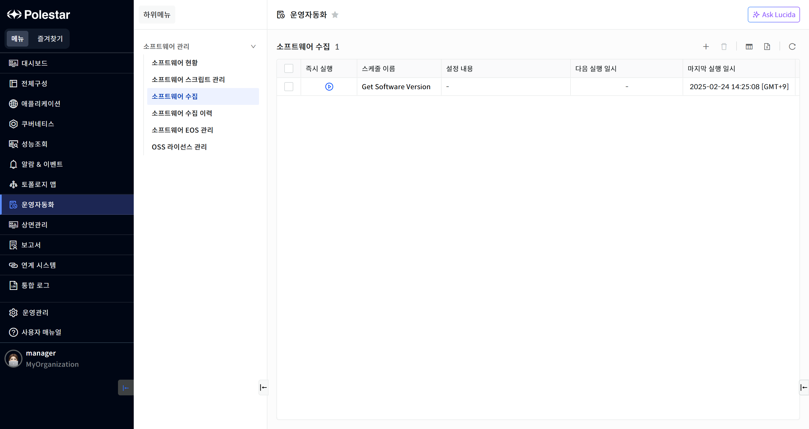
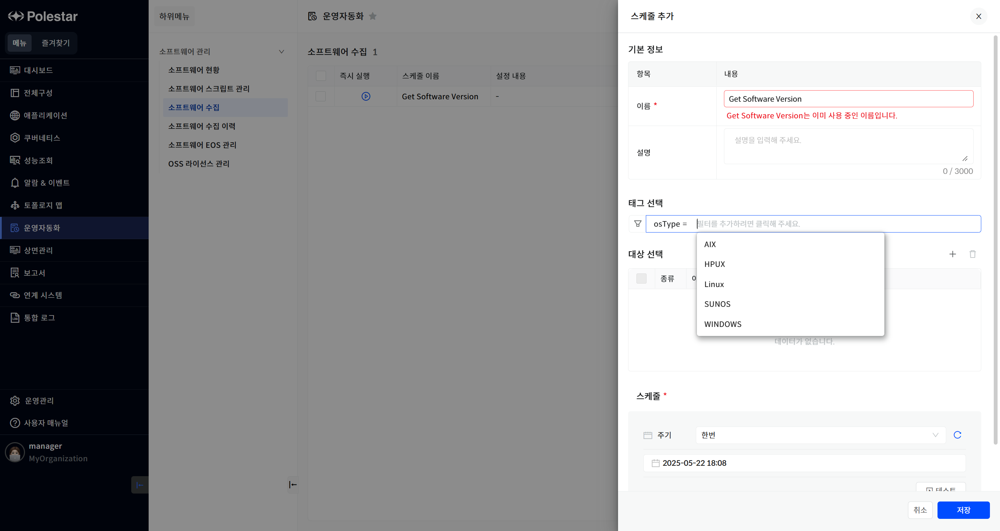
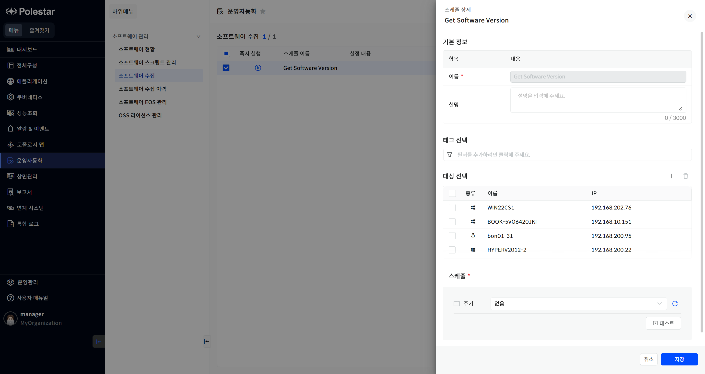
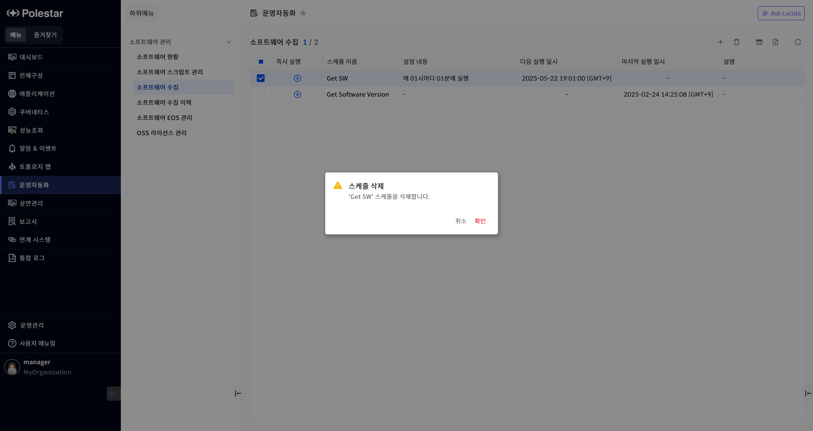

소프트웨어 수집

소프트웨어 정보 수집을 위한 스케줄 설정 정보 목록을 확인할 수 있다.

<table>
<tbody>
<tr class="odd">
<td>
노트

[소프트웨어 현황] 메뉴에서 등록된 스케줄 또는, 즉시 실행 기능을 통해 수집된 목록이 표시된다. [소프트웨어 수집 이력] 메뉴에서 배포이력과 실행이력이 표시된다.
</td>
</tr>
</tbody>
</table>

▶ \[그림1\] 스케줄 목록

화면 지표

| 스케줄 이름    | 주기적으로 실행될 스케줄 설정 정보의 이름을 표시합니다.               |
| --------- | --------------------------------------------- |
| 설정 내용     | 설정된 스케줄 정보를 표시합니다.                            |
| 다음 실행 일시  | 스케줄에 의해 수집이 실행될 예정일시를 표시합니다.                  |
| 마지막 실행 일시 | 수집된 소프트웨어 버전을 표시합니다.                          |
| 즉시 실행     | 설정된 정보를 바탕으로 즉시 소프트웨어 정보를 수집할 수 있는 버튼을 표시합니다. |

스케줄 등록

등록 아이콘을 클릭하여 신규 스케줄을 등록할 수 있습니다.

<table>
<tbody>
<tr class="odd">
<td>
노트

스크립트 선택에 등록 아이콘을 통해 표시되는 목록은 [소프트웨어 스크립트 관리] 메뉴에서 동일하게 확인할 수 있습니다. 서버 선택에 등록 아이콘을 통해 표시되는 목록은 전체 구성에서 [서버] 메뉴에서 동일하게 확인할 수 있습니다.
</td>
</tr>
</tbody>
</table>

▶ \[그림2\] 스케줄 등록

화면 지표

<table>
<thead>
<tr class="header">
<th>이름</th>
<th>
설정된 스케줄 정보의 이름을 입력합니다.

반드시 입력해야 하는 값이며 3 ~ 50자리의 문자, 숫자만 허용합니다.

기존에 등록된 이름은 사용할 수 없습니다.
</th>
</tr>
</thead>
<tbody>
<tr class="odd">
<td>설명</td>
<td>
스크립트에 대한 설명을 입력합니다.

필수 값은 아니며 3000자 이내의 문자열을 허용합니다.
</td>
</tr>
<tr class="even">
<td>태그 선택</td>
<td>태그를 갖고 있는 서버를 대상으로 소프트웨어 정보를 수집합니다.</td>
</tr>
<tr class="odd">
<td>서버 선택</td>
<td>
소프트웨어 정보를 수집하려는 서버를 목록에서 선택합니다.

 아이콘을 클릭하여 선택에서 제외할 수 있습니다.
</td>
</tr>
<tr class="even">
<td>스케줄</td>
<td>
수집 스케줄을 선택 및 입력합니다.

없음: 스케줄 없음을 의미, 즉시 실행을 통해 가능

한번: 지정된 날짜와 시간에 한번 실행

매일: 지정된 시간에 매일 실행

매주: 지정된 시간과 요일에 실행

매월: 지정된 월, 주, 요일, 시간 단위로 실행

반복: 지정된 시간, 분 단위로 실행
</td>
</tr>
<tr class="odd">
<td>테스트</td>
<td>선택 및 입력된 스케줄의 예상 실행 날짜와 시간을 표시합니다.</td>
</tr>
</tbody>
</table>

스케줄 등록 절차

1.  테이블 우측 상단의 (+) 아이콘 클릭

2.  기본 정보 항목 입력

3.  스크립트 선택

4.  서버 선택

5.  스케줄 선택

6.  \[저장\] 버튼 클릭

스케줄 상세 및 수정

목록에서 이름을 클릭하여 상세 정보를 확인 및 변경할 수 있습니다.

▶ \[그림3\] 스케줄 상세

화면 지표

\[스케줄 등록\]에서의 화면 지표와 동일한 내용입니다.

스케줄 수정 절차

1.  테이블에서 수정할 스케줄 클릭

2.  기본 정보 항목 입력

3.  태그 선택

4.  서버 선택

5.  스케줄 선택

6.  \[저장\] 버튼 클릭

스케줄 삭제

삭제 아이콘을 클릭하여 선택된 스케줄을 삭제할 수 있습니다.

▶ \[그림4\] 스케줄 삭제

스케줄 삭제 절차

1.  삭제하고자 하는 스케줄 선택 (다중 선택 가능)

2.  테이블 우측 상단의 \[삭제\] 아이콘 클릭

3.  메시지창에서 \[확인\] 클릭

