시스템그룹 트리

그룹별 장비 목록을 볼 수 있는 시스템그룹 트리입니다.

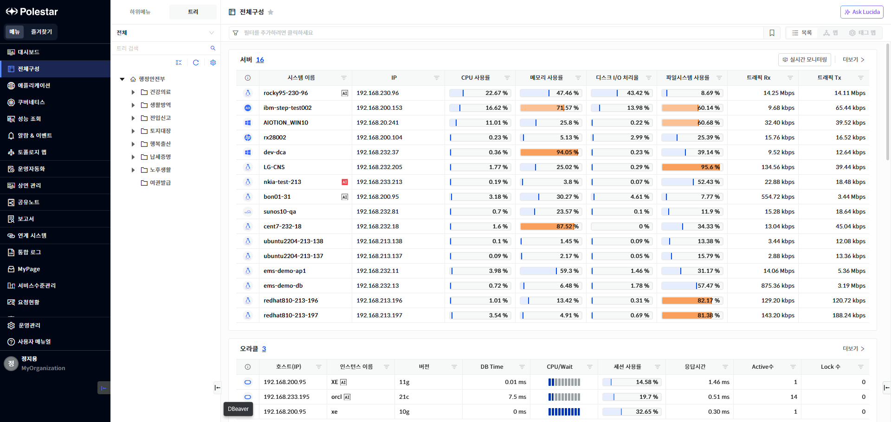

▶ \[그림1\] 시스템그룹 트리

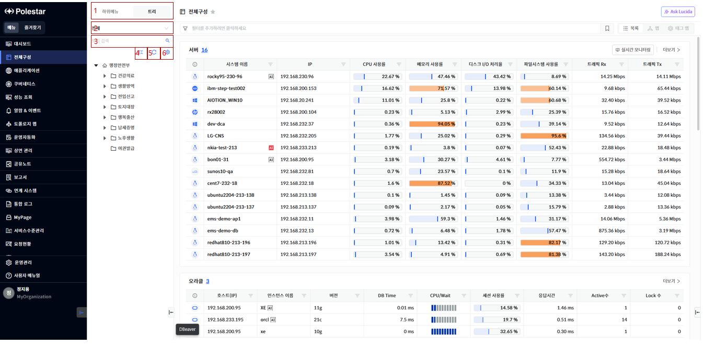

▶ \[그림2\] 시스템그룹 트리 설명

1.  하위메뉴, 시스템그룹 트리 뷰 모드를 변경할 수 있는 버튼입니다.

2.  시스템그룹 트리의 리소스 카테고리 필터입니다. 클릭 시 드롭다운으로 나타납니다. 검색 시 해당 카테고리만 검색됩니다.

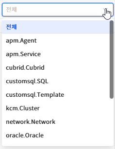

▶ \[그림3\] 카테고리 목록

3.  시스템그룹 트리 검색 기능입니다. 검색어를 입력하고 검색 버튼을 클릭하면 트리 영역에 검색결과가 표시됩니다.

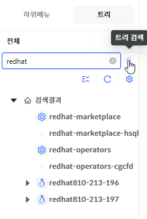

▶ \[그림4\] 검색 결과

4.  트리의 접기/펼치기를 할 수 있는 버튼입니다.

5.  트리를 처음 형태로 표시합니다.

6.  시스템그룹 트리 관리 화면으로 이동합니다. 권한이 있는 경우 표시됩니다.

컨텍스트 메뉴 - 그룹

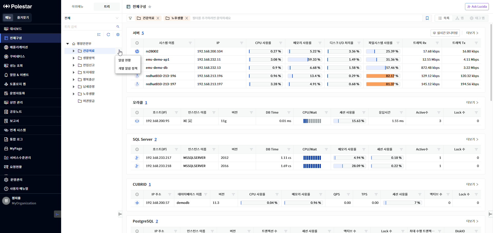

▶ \[그림5\] 그룹 상세정보

1.  마우스 호버 시, 우측에 아이콘이 표시됩니다.

2.  아이콘을 클릭 시, 알람 현황과 개별 알람 정책 드롭 다운을 선택할 수 있습니다.

3.  알람 현황 클릭 시, 해당 그룹정보가 상단의 필터 정보에 표시되고 해당 그룹의 알람 현황 목록이 표시됩니다.

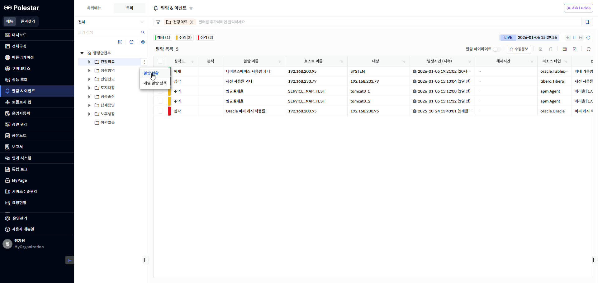

▶ \[그림6\] 그룹의 알람 현황

4.  개별알람정책 클릭 시, 개별알람정책 페이지로 이동하고, 선택한 그룹으로 필터링되어 표시됩니다.

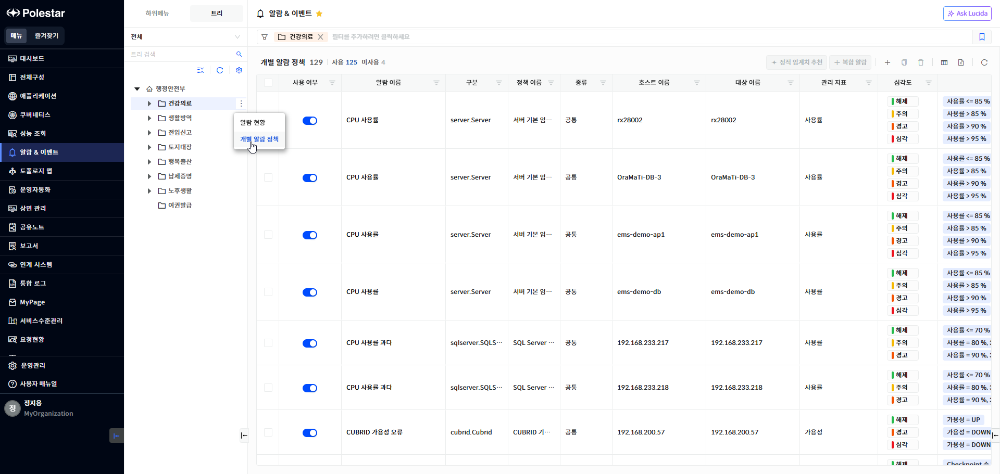

> ▶ \[그림7\] 그룹 개별 알람 정책 페이지

컨텍스트 메뉴 – 장비

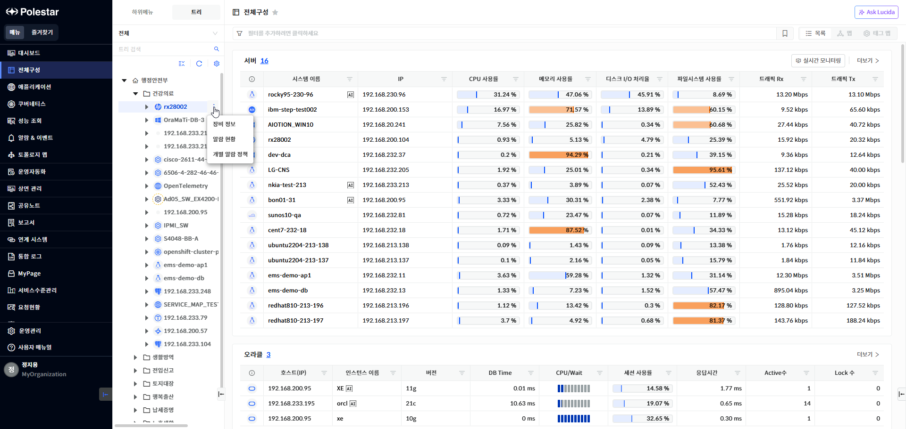

▶ \[그림8\] 장비 상세정보

1.  마우스 호버 시, 우측에 아이콘이 표시됩니다.

2.  아이콘을 클릭 시, 상세정보, 알람 현황, 개별 알람 정책 드롭 다운을 선택할 수 있습니다.

3.  상세 정보 클릭 시, 장비의 상세정보가 드로워로 나타납니다.

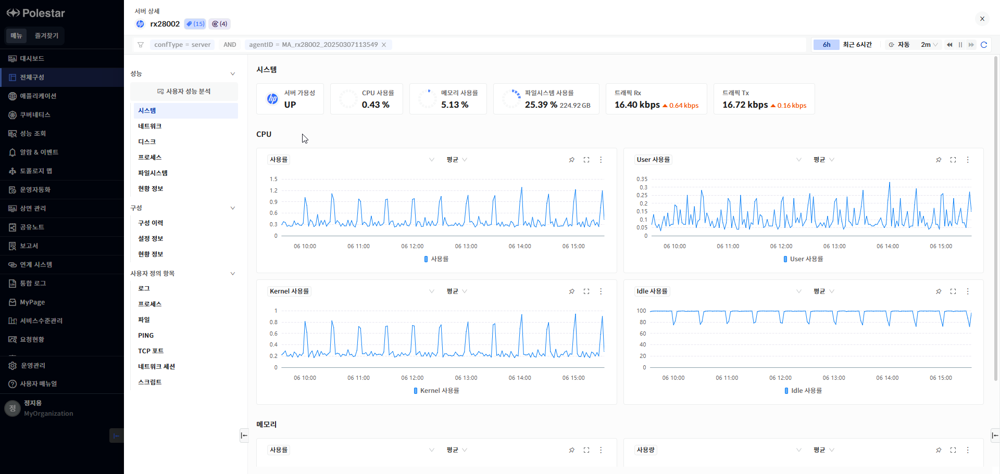

▶ \[그림9\] 장비 정보

4.  알람 현황 클릭 시, 해당 그룹정보가 상단의 필터 정보에 표시되고 해당 그룹의 알람 현황 목록이 표시됩니다.

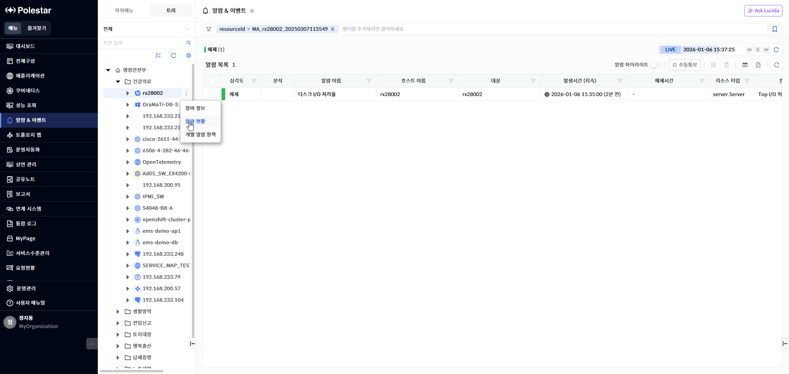

▶ \[그림10\] 장비의 알람 현황

5.  개별알람정책 클릭 시, 개별알람정책 페이지로 이동하고, 선택한 그룹으로 필터링되어 표시됩니다.

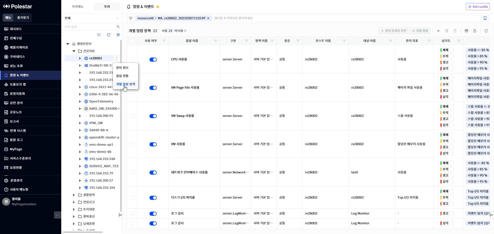

> ▶ \[그림11\] 장비의 개별 알람 정책 페이지

