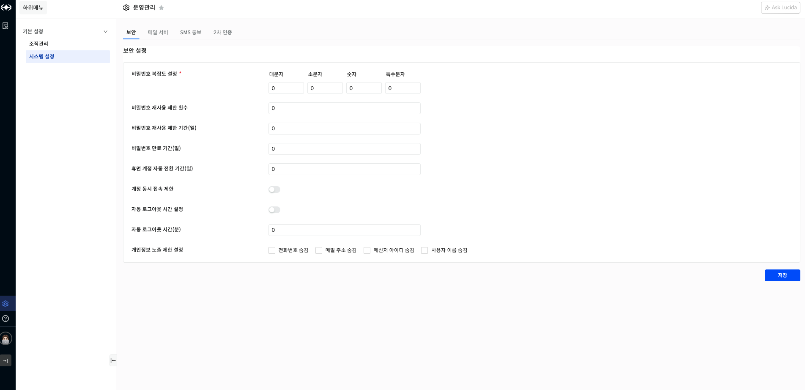

보안 설정

정보보호 정책을 설정하는 기능입니다.

▶ \[그림1\] 태그 설정 화면

화면 지표

<table>
<thead>
<tr class="header">
<th>비밀번호 복잡도 설정</th>
<th>비밀번호를 설정할 때 복잡도를 설정합니다.</th>
</tr>
</thead>
<tbody>
<tr class="odd">
<td>비밀번호 재사용 제한 횟수</td>
<td>과거 n회의 비밀번호를 재사용하지 못하도록 설정합니다.</td>
</tr>
<tr class="even">
<td>비밀번호 재사용 제한 기간(일)</td>
<td>과거 사용한 비밀번호를 재사용하지 못하도록 하는 기간을 설정합니다.</td>
</tr>
<tr class="odd">
<td>비밀번호 만료 기간(일)</td>
<td>비밀번호가 만료된 사용자는 비밀번호를 변경하도록 유도합니다.</td>
</tr>
<tr class="even">
<td>휴먼 계정 자동 전환 기간(일)</td>
<td>설정한 기간 동안 접속을 하지 않는 계정을 잠그도록 합니다.</td>
</tr>
<tr class="odd">
<td>계정 동시 접속 제한</td>
<td>하나의 사용자 계정으로 동시 접속 제한 여부를 설정합니다.</td>
</tr>
<tr class="even">
<td>자동 로그아웃 시간 설정</td>
<td>
접속 사용자 타임 아웃 활성화 여부를 설정합니다.

접속 시간이 초과되면 강제로 로그아웃 됩니다.
</td>
</tr>
<tr class="odd">
<td>자동 로그아웃 시간(분)</td>
<td>접속 사용자 타임아웃을 설정합니다. 설정된 시간이 초과되면 강제로 로그아웃 됩니다.</td>
</tr>
<tr class="even">
<td>개인 정보 노출 제한 설정</td>
<td>개인 정보 보호를 위해 등록된 사용자의 개인 정보를 숨김 처리하도록 설정합니다.</td>
</tr>
</tbody>
</table>

