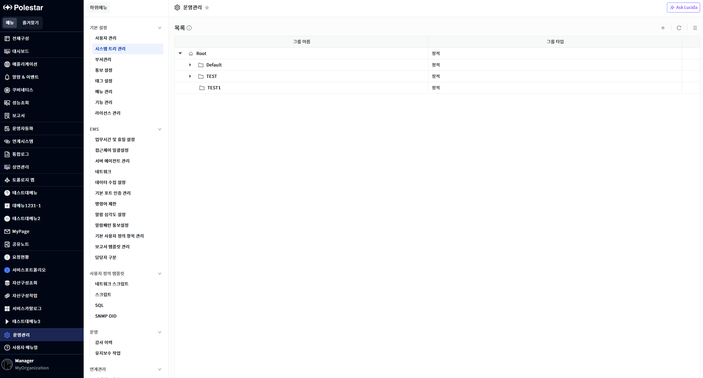
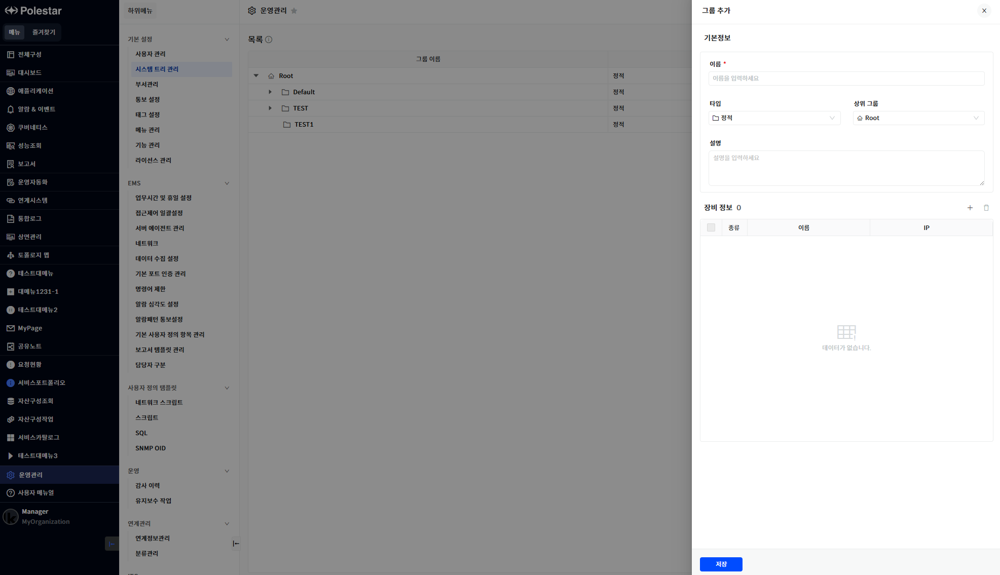
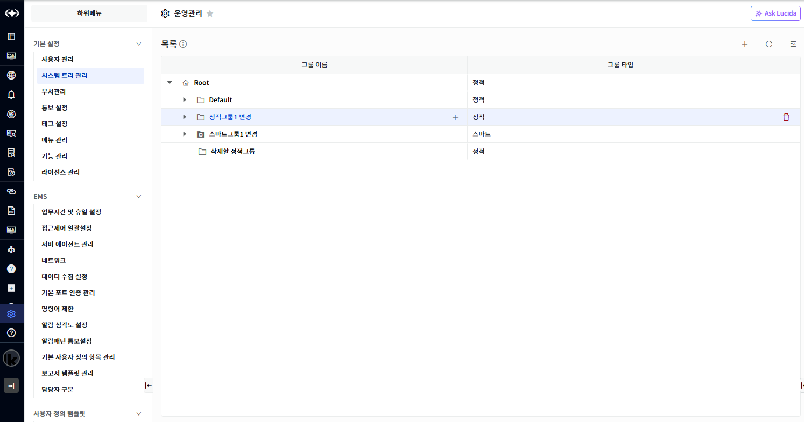
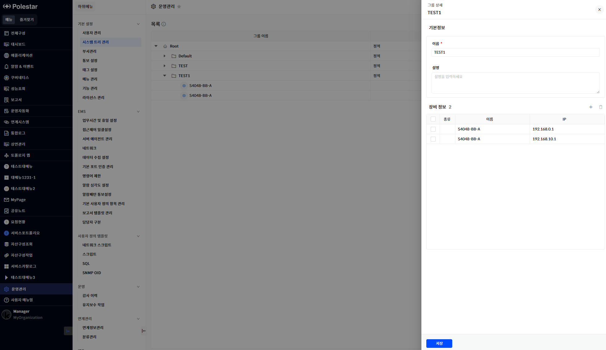
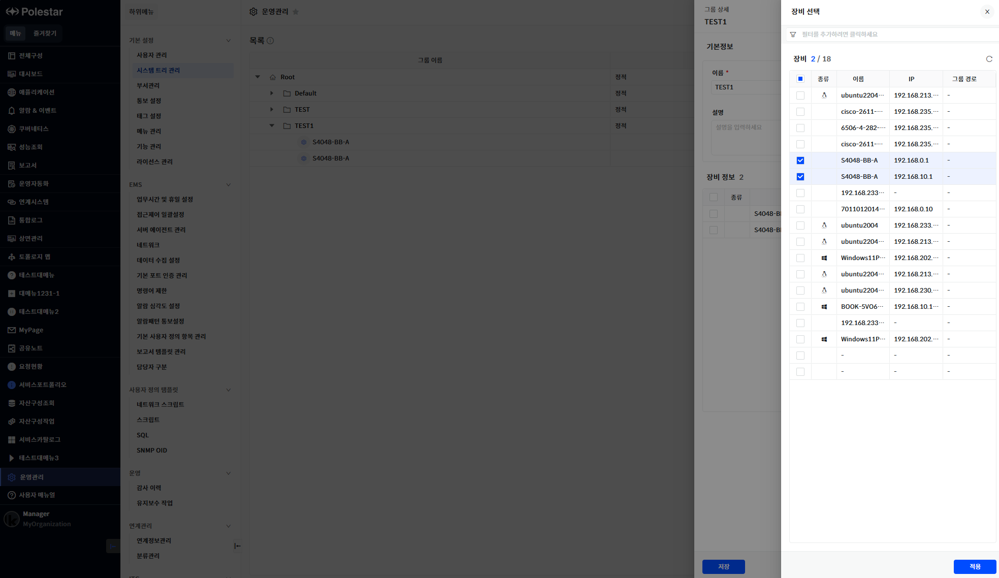

시스템 트리 관리

시스템 트리를 관리할 수 있는 기능입니다. 최상위 그룹인 Root 그룹 하위로 원하는 시스템 그룹 또는 스마트 그룹을 추가할 수 있습니다. 기본적으로 Root 그룹과 Default 그룹은 초기 구축 시 자동으로 추가되어 있습니다. 관리 대상 추가 시 특별한 그룹 지정이 없을 경우 기본적으로 Default 그룹에 속하게 됩니다. 시스템 트리는 메인 화면 좌측에서 확인이 가능하며 다른 기능들의 대상 선택에서도 사용될 수 있습니다.

<table>
<tbody>
<tr class="odd">
<td>
노트

시스템 그룹은 정적 그룹이라고도 불리며 해당 그룹 하위에 관리 대상 장비를 지정하여 관리할 수 있습니다. 이에 반해 스마트 그룹은 특정 태그 필터를 설정하여 해당 필터 조건에 맞는 관리 대상들을 동적으로 조회하여 사용됩니다.
</td>
</tr>
</tbody>
</table>

▶ \[그림1\] 시스템 트리 목록

화면 지표

| 그룹 이름 | 그룹의 이름과 계층 관계를 표현합니다. 하위에 그룹이 있을 경우 펼치기 아이콘이 존재하며 해당 아이콘을 클릭 시 하위 대상이 펼쳐집니다. |
| ----- | ---------------------------------------------------------------------------- |
| 그룹 타입 | 그룹이 정적 그룹인지 스마트 그룹인지 표시됩니다.                                                  |

그룹 등록

우측 상단의 + 버튼을 클릭하여 신규 그룹을 추가할 수 있습니다. 또는 특정 그룹 우측에 있는 + 버튼을 클릭하여 해당 그룹 하위에 신규 그룹을 추가할 수 있습니다.

<table>
<tbody>
<tr class="odd">
<td>
노트

스마트 그룹은 하위에 정적 그룹과 스마트 그룹 모두 추가할 수 없습니다. 따라서 추가 아이콘도 표시 되지 않습니다.

그룹을 추가하기 위해서는 시스템 트리 관리의 추가 권한이 부여되어 있어야 합니다.
</td>
</tr>
</tbody>
</table>

▶ \[그림2\] 그룹 등록

화면 지표

| 이름    | 신규 그룹의 이름을 입력합니다.                                                                          |
| ----- | ------------------------------------------------------------------------------------------ |
| 타입    | 그룹의 타입을 지정합니다. (정적 / 스마트)                                                                  |
| 상위 그룹 | 해당 그룹이 속할 상위 그룹을 지정합니다. 단 특정 그룹의 + 아이콘을 클릭하여 그룹을 추가할 경우에는 해당 필드는 비활성화 되며 상위 그룹이 지정되어 있습니다. |
| 설명    | 그룹의 설명을 입력합니다.                                                                             |
| 장비 정보 | 추가된 관리 대상 정보를 표시합니다. 우측 + 아이콘을 클릭하여 관리 대상을 추가할 수 있습니다.                                     |
| 조건 설정 | 타입이 스마트 그룹일 경우 조건 설정 항목이 표시되며 태그 필터를 입력하면 해당 조건에 맞는 관리 대상이 대상 목록에 조회됩니다.                   |

그룹 등록 절차

1.  테이블 우측 상단의 추가 버튼을 클릭합니다. 또는 특정 그룹 우측의 추가 버튼을 클릭합니다.

2.  필수 항목인 이름을 입력합니다.

3.  타입이 정적 그룹일 경우 장비 정보의 추가 버튼을 클릭하여 추가할 관리 대상을 지정합니다.

4.  타입이 스마트 그룹일 경우 태그 필터 조건을 입력하여 원하는 관리 대상을 조회합니다.

5.  \[저장\] 버튼을 선택하여 저장합니다.

그룹 삭제

그룹을 삭제하려는 경우 목록 우측에서 \[삭제\] 버튼을 클릭해서 삭제할 수 있습니다.

기본적으로 Root 그룹과 Default 그룹은 삭제가 불가하며 하위에 관리 대상이 존재할 경우에도 삭제할 수 없습니다.

<table>
<tbody>
<tr class="odd">
<td>
노트

하위에 관리 대상이 존재하는 그룹을 삭제하기 위해서는 해당 그룹에 속한 관리 대상들을 다른 그룹으로 이동 후에 삭제가 가능합니다. 경고 창에 상세로 이동하는 버튼을 클릭하여 대상 장비를 변경할 수 있습니다.

그룹을 삭제하기 위해서는 시스템 트리 관리의 삭제 권한이 부여되어 있어야 합니다.
</td>
</tr>
</tbody>
</table>

▶ \[그림3\] 그룹 삭제

그룹 삭제 절차

1.  삭제하고자 하는 그룹 우측의 삭제 버튼을 클릭합니다.

2.  메시시창에서 확인 클릭

그룹 수정

그룹의 이름, 설명, 장비 정보 (또는 태그 필터 조건)을 수정할 수 있습니다. 상위 그룹이나 그룹 타입은 수정이 불가하며 수정 화면에 표시되지 않습니다.

<table>
<tbody>
<tr class="odd">
<td>
노트

그룹을 수정하기 위해서는 시스템 트리 관리의 수정 권한이 부여되어 있어야 합니다.
</td>
</tr>
</tbody>
</table>

▶ \[그림4\] 그룹 수정

장비 추가

정적 그룹에서 장비 정보 우측에 추가 버튼을 클릭하여 장비를 추가할 수 있습니다.

<table>
<tbody>
<tr class="odd">
<td>
노트

특정 그룹에 장비를 추가하게 되면 해당 장비는 기존 그룹에서 제외되며 이동하게 됩니다..
</td>
</tr>
</tbody>
</table>

▶ \[그림5\] 정적 그룹의 장비 추가 화면

화면 지표

| 종류    | 관리 대상의 타입이 아이콘으로 표시됩니다.                        |
| ----- | ---------------------------------------------- |
| 이름    | 관리 대상 이름입니다.                                   |
| IP    | 관리 대상의 IP 정보입니다. IP가 없을 경우 해당 컬럼은 \[–\] 표시됩니다. |
| 그룹 경로 | 관리 대상이 속한 현재의 그룹 경로를 표시합니다.                    |

