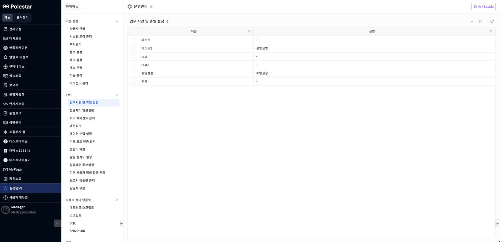
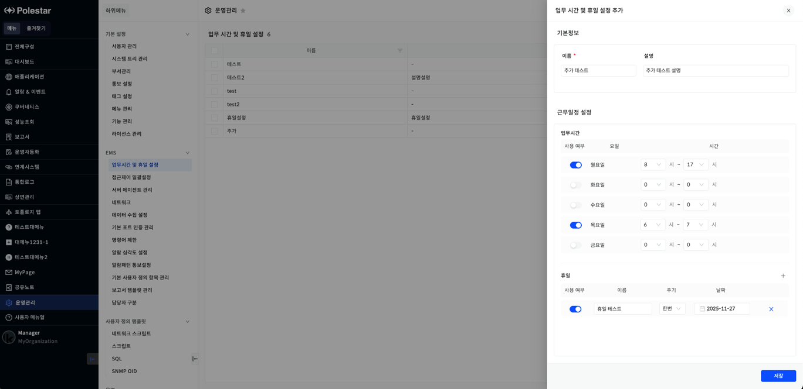
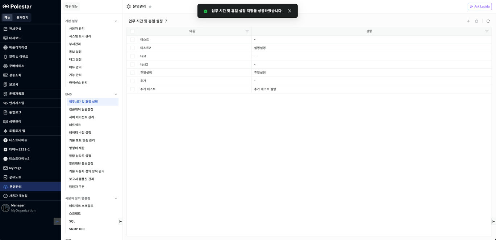
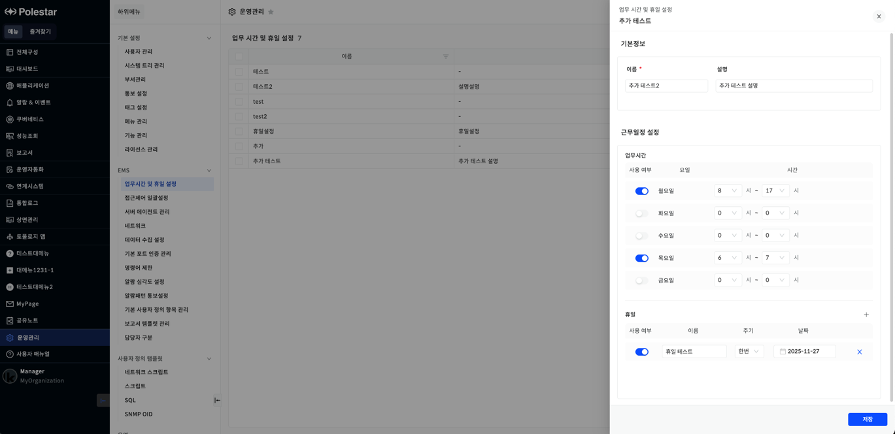
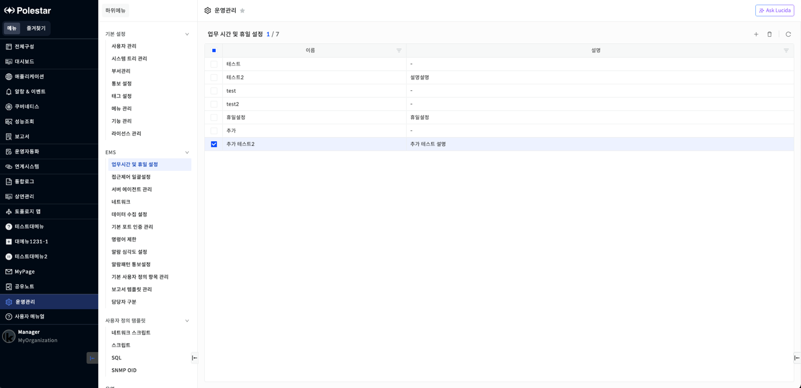
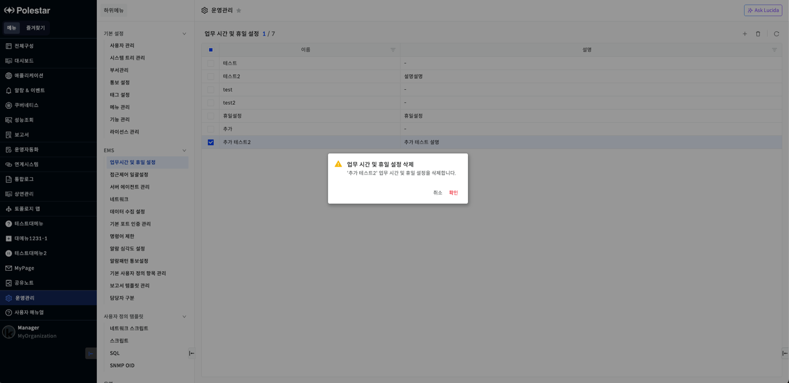

업무 시간 및 휴일 설정

업무 시간 및 휴일 정보를 효율적으로 관리할 수 있습니다. 사용자는 이 기능을 통해 요일별 업무 시간을 설정하고, 정기적인 휴일 (예: 공휴일) 또는 일시적인 휴일 (예: 특별 휴무)을 추가 및 수정할 수 있습니다.

▶ \[그림1\] 업무 시간 및 휴일 설정 목록

화면 지표

| 이름 | 설정한 업무 시간 및 휴일 데이터의 이름입니다. |
| -- | -------------------------- |
| 설명 | 설정한 업무 시간 및 휴일 데이터의 설명입니다. |

업무 시간 및 휴일 설정 등록

테이블 우측 상단의 \[+\] 버튼을 선택하여 새로운 업무 시간 및 휴일을 추가할 수 있습니다.

▶ \[그림2\] 업무 시간 및 휴일 설정 등록

<table>
<tbody>
<tr class="odd">
<td>
노트

<strong>근무일정 설정 &gt; 업무 시간 &gt; 시간 - 시작 시간/종료 시간 동작 방식</strong>

: 사용자가 종료 시간이 시작 시간보다 선행되도록 잘못 설정하는 것을 방지하기 위해 다음과 같은 로직으로 작동합니다.

<strong>시작 시간 선택 시 종료 시간 자동 세팅</strong>

: 사용자가 시작 시간을 선택하면, 종료 시간은 시작 시간의 다음 시간 (+1시간)으로 자동 세팅됩니다. (예시: 시작 시간을 오후 3시로 선택하면, 종료 시간은 자동으로 오후 4시로 설정됩니다.)

<strong>종료 시간 선택 제한</strong>

: 종료 시간 선택지에서는 선택된 시작 시간과 같거나 그 이전의 시간은 선택할 수 없도록 Disabled 처리됩니다. (예시: 시작 시간이 오후 3시인 경우, 종료 시간 선택지에서 오후 1시, 오후 2시, 오후 3시는 선택할 수 없도록 비활성화(Disabled)됩니다. (자동 세팅된 오후 4시부터 선택 가능))
</td>
</tr>
</tbody>
</table>

화면 지표

<table>
<thead>
<tr class="header">
<th>이름</th>
<th>
업무 시간 및 휴일 데이터의 이름입니다.

필수 입력 값입니다.
</th>
</tr>
</thead>
<tbody>
<tr class="odd">
<td>설명</td>
<td>업무 시간 및 휴일 데이터의 설명입니다.</td>
</tr>
<tr class="even">
<td>업무시간</td>
<td>
사용 여부, 요일, 시간을 설정합니다.

- 사용 여부 : 설정된 업무 시간 활성화/비활성화 여부 선택

- 요일 : 월요일부터 일요일로 구성

- 시간 : 0시 ~ 23시로 구성
</td>
</tr>
<tr class="odd">
<td>휴일</td>
<td>
사용 여부, 이름, 주기, 날짜를 설정합니다.

우측 [+] 버튼을 통해 휴일을 추가할 수 있습니다.

- 사용 여부 : 설정된 휴일 활성화/비활성화 여부 선택

- 이름 : 휴일의 이름을 설정

- 주기 : 한번/매년으로 구성

- 날짜 : 날짜 설정
</td>
</tr>
</tbody>
</table>

등록 절차

1.  기본정보, 근무일정 설정 정보를 입력합니다.

2.  \[저장\] 버튼을 클릭합니다

3.  목록 내에서 저장된 데이터를 확인합니다

▶ \[그림3\] 업무 시간 및 휴일 설정 등록 성공

업무 시간 및 휴일 설정 수정

테이블 목록의 \[이름\] 컬럼을 클릭하면 나타나는 수정 화면에서 수정할 수 있습니다.

수정 절차

1.  수정할 정보를 입력합니다

2.  \[저장\] 버튼을 클릭합니다

3.  목록 내에서 수정된 데이터를 확인합니다

▶ \[그림4\] 업무 시간 및 휴일 설정 수정

업무 시간 및 휴일 설정 삭제

테이블 우측 상단의 \[삭제\] 버튼을 선택하여 업무 시간 및 휴일을 삭제할 수 있습니다.

삭제 절차

1.  > 삭제할 데이터를 체크합니다

2.  > 테이블 우측 상단의 \[삭제\] 버튼을 클릭합니다

3.  > 삭제 확인 창에서 \[확인\] 버튼을 클릭합니다

4.  > 목록 내에서 삭제된 데이터를 확인합니다

▶ \[그림5\] 업무 시간 및 휴일 설정 삭제할 데이터 선택

▶ \[그림6\] 업무 시간 및 휴일 설정 삭제 확인 창

▶ \[그림7\] 업무 시간 및 휴일 설정 삭제 확인 메세지

