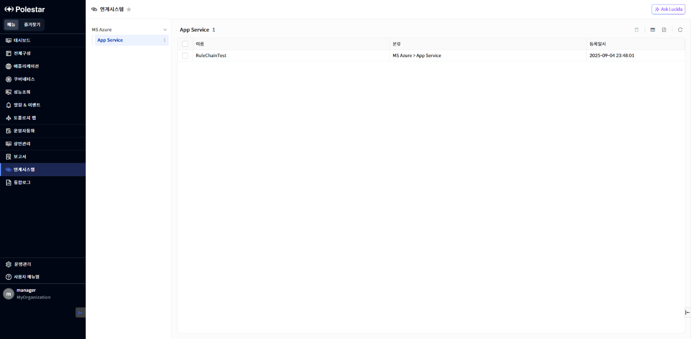
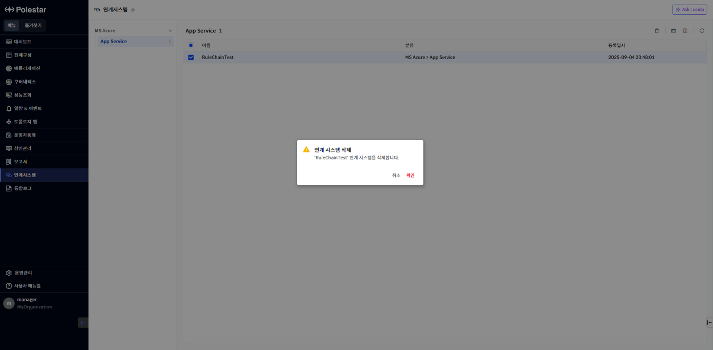
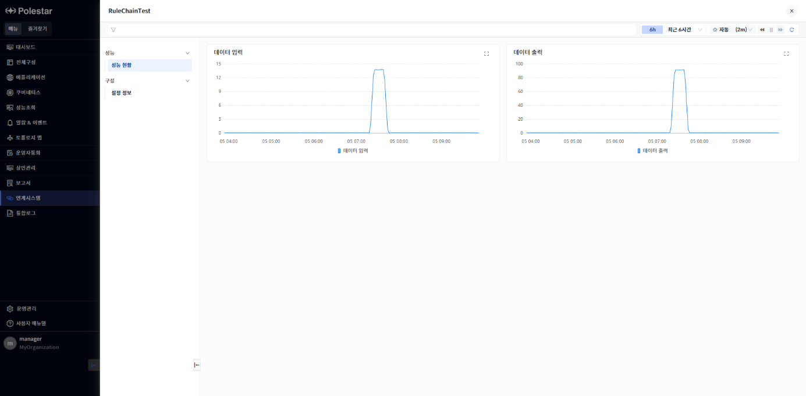
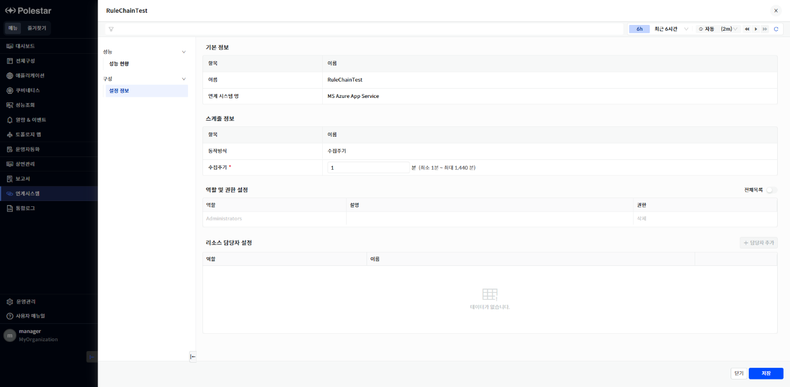

연계시스템 현황

모니터링하고자 하는 연계시스템의 관리 대상에 대한 모니터링 정보를 확인할 수 있는 기능을 제공합니다.

분류 별 등록된 연계시스템을 확인할 수 있으며 관리 대상에 대한 성능 정보를 차트로 표시하여 확인할 수 있고 설정 정보를 확인할 수 있습니다.

▶ \[그림1\] 연계시스템 현황화면

화면 지표

<table>
<thead>
<tr class="header">
<th>분류</th>
<th>
연계시스템 분류 정보가 표시됩니다.

분류 설정은 [운영관리]&gt;[분류관리]에서 할 수 있습니다.
</th>
</tr>
</thead>
<tbody>
<tr class="odd">
<td>이름</td>
<td>연계시스템의 등록된 관리 대상 이름을 표시합니다.</td>
</tr>
<tr class="even">
<td>분류</td>
<td>관리 대상이 등록된 분류 정보의 경로가 표시됩니다.</td>
</tr>
<tr class="odd">
<td>등록일시</td>
<td>연계시스템의 등록일시를 표시합니다.</td>
</tr>
</tbody>
</table>

관리대상 삭제

모니터링 중인 관리 대상을 삭제할 수 있습니다.

<table>
<tbody>
<tr class="odd">
<td>
주의

전체구성의 연계시스템에서 등록된 연계시스템을 삭제하려면 해당 연계시스템의 관리 대상을 먼저 삭제해야 합니다. 삭제하고자 하는 연계시스템을 확인하여 해당 연계시스템의 관리 대상을 삭제합니다.
</td>
</tr>
</tbody>
</table>

▶ \[그림2\] 관리 대상 삭제

관리대상 삭제 절차

1.  > 삭제하고자 하는 관리대상을 선택합니다. (다중 선택 가능)

2.  > 테이블 우측 상단의 \[삭제\] 아이콘을 클릭합니다.

3.  > 삭제 확인 메시지창에서 \[확인\] 버튼을 클릭합니다.

관리대상 성능 현황

관리 대상의 성능 현황을 확인할 수 있습니다. 관리 대상 목록에서 관리대상 이름을 클릭하면 확인할 수 있습니다.

설정된 지표에 따라서 지표 별 성능 차트가 표시됩니다. 또한, 차트에서 확대보기 버튼을 클릭하면 최대, 평균, 최소를 확인할 수 있습니다.

▶ \[그림3\] 관리대상 성능현황 화면

화면 지표

|       |                                |
| ----- | ------------------------------ |
| 성능 지표 | 룰체인에서 정의한 지표에 대한 성능 정보를 표시합니다. |

관리 대상 설정 정보

관리 대상의 설정 정보를 확인할 수 있습니다. 관리 대상 목록에서 관리대상 이름을 클릭한 후 \[구성\]\>\[설정 정보\]를 클릭하면 관리 대상에 대한 기본 정보 및 설정 정보가 표시됩니다.

해당 리소스에 대한 성능 수집 주기 설정과 역할, 권한 및 리소스 담당자를 설정할 수 있습니다.

▶ \[그림5\] 관리대상 설정정보 화면

기본 정보

| 이름      | 관리 대상 이름을 표시합니다..     |
| ------- | --------------------- |
| 연계 시스템명 | 관리 대상의 연계시스템명을 표시합니다. |

스케줄 정보

<table>
<thead>
<tr class="header">
<th>동작방식</th>
<th>수집 주기 방식이 표시됩니다.</th>
</tr>
</thead>
<tbody>
<tr class="odd">
<td>수집주기</td>
<td>
수집 주기 설정이 표시되며 수집 주기를 변경할 수 있습니다.

최소 1분에서 최대 1,440분까지 설정할 수 있습니다.
</td>
</tr>
</tbody>
</table>

역할 및 권한 설정

| 역할 | 역할 명을 표시합니다.      |
| -- | ----------------- |
| 설명 | 역할에 대한 설명을 표시합니다. |
| 권한 | 역할의 권한을 표시합니다.    |

리소스 담당자 설정

| 역할 | 역할 명을 표시합니다.              |
| -- | ------------------------- |
| 이름 | 해당 역할에 할당된 사용자 이름을 표시합니다. |

