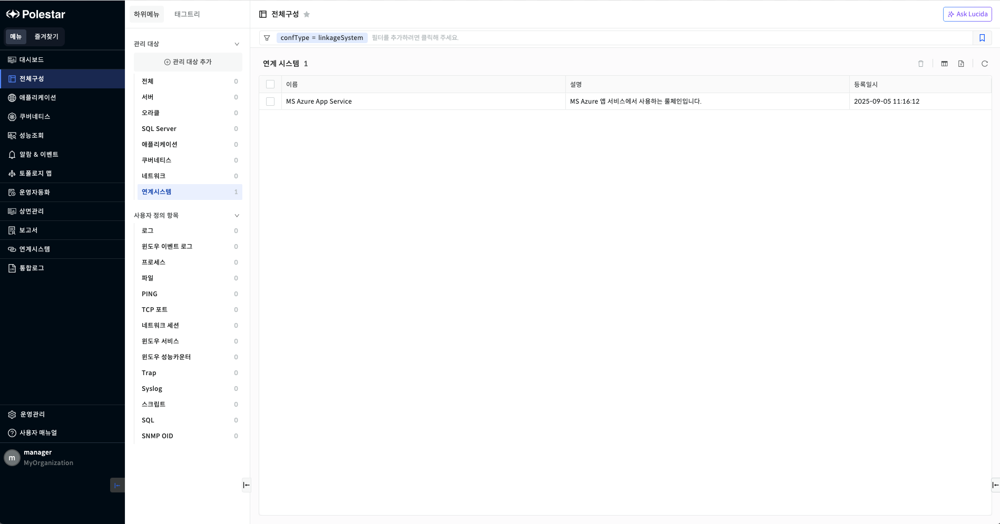
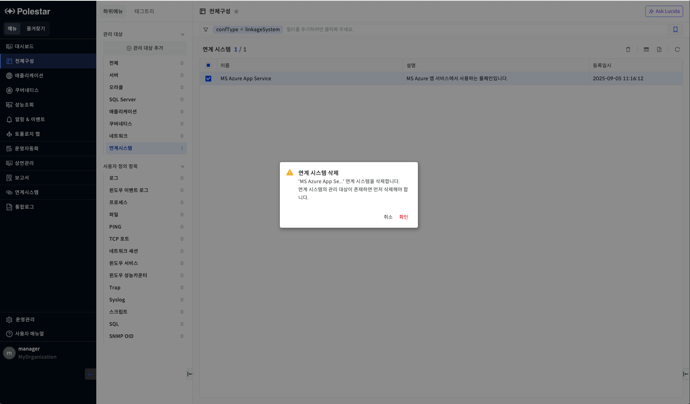
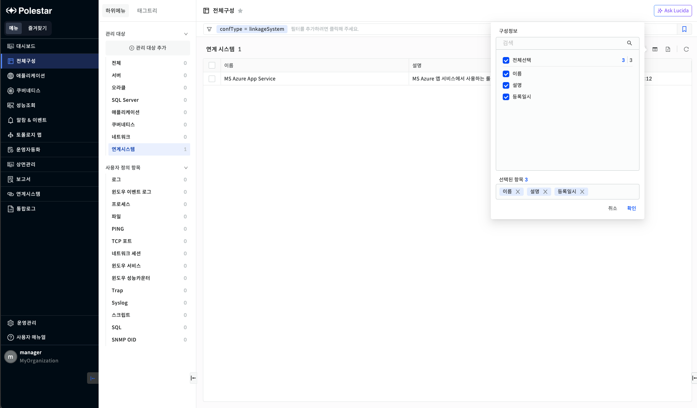

연계시스템 목록

전체 구성에서 \[연계시스템\]을 선택하거나 전체에서 연계시스템의 \[더보기\>\]를 선택하면 전체 연계시스템 목록을 확인할 수 있습니다. 연계시스템 목록을 통해 연계시스템의 이름, 설명, 등록일시를 확인하고 검색할 수 있습니다. 또한 해당 화면에서 등록된 연계시스템을 삭제할 수 있습니다.

<table>
<tbody>
<tr class="odd">
<td>
노트

전체 구성에서 관리되는 연계시스템은 [전체구성] 메뉴의 [관리 대상 추가]에서 연계시스템 - [관리 대상 등록]을 통해 등록되어야 합니다.
</td>
</tr>
</tbody>
</table>

▶ \[그림1\] 연계시스템 목록

> 연계시스템 목록

| 이름   | 등록할 때 입력한 연계시스템의 이름입니다.       |
| ---- | ----------------------------- |
| 설명   | 연계시스템의 설명입니다. 설명은 변경할 수 있습니다. |
| 등록일시 | 연계시스템을 등록할 때의 일시입니다.          |

연계시스템 삭제

관리 대상으로 등록한 연계시스템을 삭제할 수 있습니다.

▶ \[그림2\] 연계시스템 삭제

<table>
<tbody>
<tr class="odd">
<td>
노트

관리 대상으로 등록된 연계시스템을 삭제하려면, 해당 연계시스템을 사용해서 모니터링을 시작한 [관리 대상]을 먼저 삭제해야 합니다. 모니터링 하고 있는 관리 대상은 대메뉴 [연계시스템]에서 확인할 수 있습니다.
</td>
</tr>
</tbody>
</table>

연계시스템 삭제 절차

1.  연계시스템 목록에서 삭제할 연계시스템을 선택합니다. (다수 선택 가능)

2.  연계시스템 목록 우측 상단의 휴지통 모양의 아이콘을 클릭합니다.

3.  삭제 확인 메시지창에서 \[확인\] 버튼을 클릭합니다.

컬럼 수정

연계시스템 목록의 우측 상단 \[컬럼 수정\] 버튼을 통해 연계시스템 목록에 원하는 컬럼을 표시하거나 제외할 수 있습니다. 엑셀 저장시에도 컬럼 수정을 통해 표시된 컬럼만 저장됩니다. 컬럼 수정 팝업창에서는 컬럼 검색 기능을 제공하며 선택된 항목을 하단에 표시하고 표시된 컬럼을 제외할 수 있는 기능을 제공합니다.

▶ \[그림3\] 연계시스템 목록 컬럼 수정

> 연계시스템 컬럼 수정 절차

1.  연계시스템 목록에서 우측 상단 \[컬럼 수정\] 아이콘을 클릭합니다.

2.  컬럼 수정 팝업창에서 화면에 표시하고자 하는 컬럼을 체크박스에서 선택합니다.

3.  \[확인\] 버튼을 클릭합니다.

엑셀 저장

연계시스템 목록의 우측 상단 \[엑셀 저장\] 버튼을 통해 연계시스템 목록을 엑셀로 저장할 수 있습니다. 컬럼 수정 기능, 상단 태그 검색 기능, 그리드 컬럼 검색 기능 등을 통해 엑셀에 보여줄 컬럼과 내용을 원하는 조건에 맞게 필터링하여 저장할 수 있습니다.

▶ \[그림4\] 연계시스템 목록 엑셀 저장

> 연계시스템 목록 엑셀 저장

1.  연계시스템 목록에서 우측 상단 \[엑셀 저장\] 아이콘을 클릭합니다.

2.  브라우저 우측 상단 창에 저장된 엑셀 파일명이 표시됩니다.

3.  해당 파일명을 클릭하여 엑셀 파일을 확인합니다.

