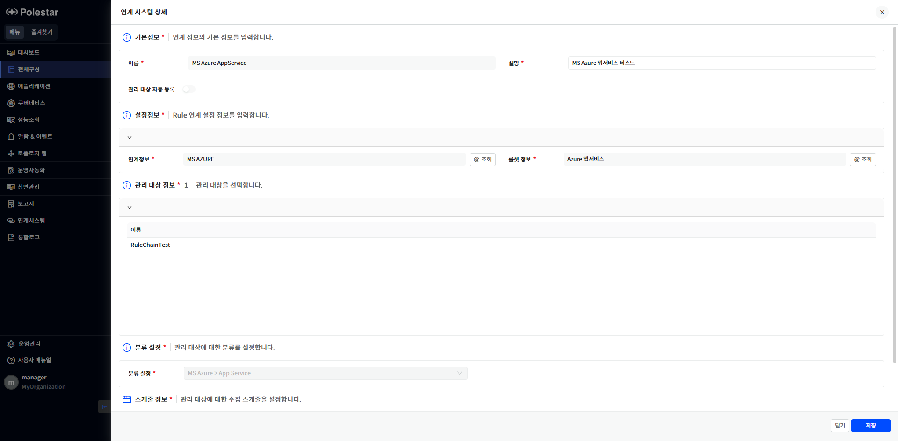

연계시스템 상세

연계시스템 목록에서 연계시스템 이름을 클릭하면 연계시스템의 상세 정보를 확인할 수 있습니다. 연계시스템 상세 화면에서는 연계시스템의 이름, 설명의 기본 정보와 연계정보 설정 및 룰 셋 정보 설정을 확인할 수 있으며 연계정보 설정과 룰 셋 정보 설정을 통해서 수집한 관리대상 목록을 확인할 수 있습니다. 또한, 분류 설정 및 수집 스케줄 정보를 확인할 수 있습니다.

상세 화면에서는 설명과 수집주기를 수정할 수 있습니다.

▶ \[그림1\] 연계시스템 상세 화면

> 기본정보

| 이름          | 등록할 때 작성한 연계시스템의 이름입니다.                                                                                   |
| ----------- | --------------------------------------------------------------------------------------------------------- |
| 설명          | 연계시스템의 설명입니다. 설명은 변경할 수 있습니다.                                                                             |
| 관리 대상 자동 등록 | 연계시스템을 등록할 때 관리 대상이 자동 등록되도록 설정할 수 있습니다. 활성화 시 검색된 관리 대상이 자동으로 등록되며 비활성화 시 검색된 관리 대상에 대해서 수동으로 등록하여야 합니다. |

> 설정정보

| 연계정보   | 운영관리의 연계정보관리에 등록한 연계정보 중 선택한 연계정보를 표시합니다. 조회 버튼을 클릭하여 전체 연계 정보 목록을 확인할 수 있습니다.    |
| ------ | --------------------------------------------------------------------------------- |
| 룰 셋 정보 | 룰체인 툴에서 정의한 룰 셋 목록 중 선택한 룰 셋 정보를 표시합니다. 우측의 조회 버튼을 클릭하여 전체 룰 셋 정보 목록을 확인할 수 있습니다. |

> 관리 대상 정보

|      |                                        |
| ---- | -------------------------------------- |
| 관리대상 | 연계정보와 룰 셋 정보를 통해서 수집한 관리 대상 정보가 표시됩니다. |

> 분류 설정

|       |                                           |
| ----- | ----------------------------------------- |
| 분류 설정 | 운영관리의 분류관리에서 연계시스템 등록 시 선택한 분류 항목이 표시됩니다. |

> 스케줄 정보

| 동작방식 | 스케줄 동작 방식을 표시합니다. 수집주기 설정 방식만 제공하기 때문에 수집주기가 선택된 상태로 표시됩니다.              |
| ---- | ------------------------------------------------------------------------ |
| 수집주기 | 연계시스템의 관리 대상, 지표 수집, 성능 수집 주기이며 수집 주기는 최소 1분에서 최대 1440분 사이에서 설정할 수 있습니다. |

