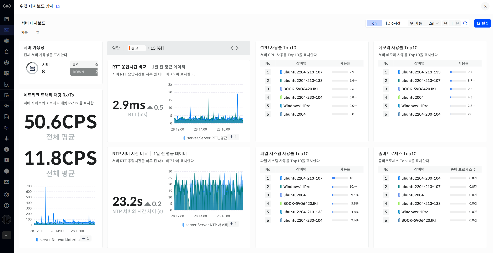
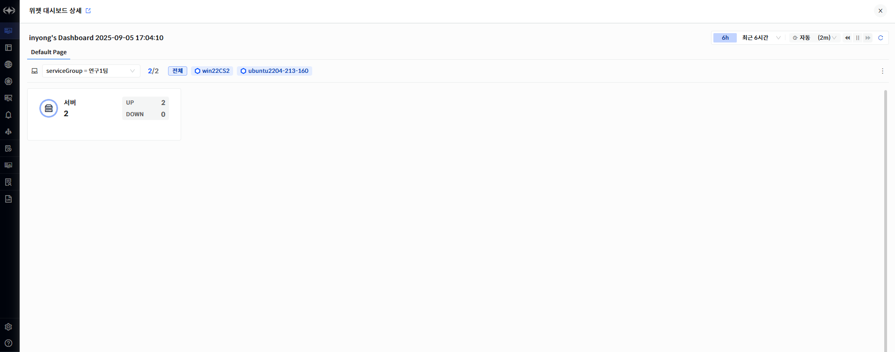
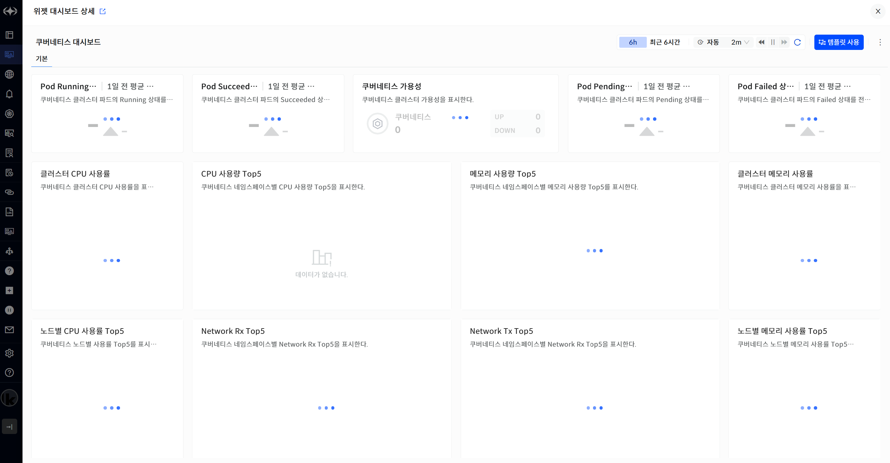

위젯 대시보드 뷰어

구성이 완료된 위젯 대시보드를 확인할 수 있습니다. 기간을 변경하여 조회할 수 있으며 주기적인 설정을 통하여 변경된 데이터를 확인할 수 있습니다. \[편집\] 버튼을 클릭하여 현재 위젯 대시보드를 편집할 수 있는 화면으로 이동합니다.

> ▶ \[그림1\] 위젯 대시보드 뷰어

대상 선택 활성화

위젯 대시보드 편집에서 대상 선택을 활성화하면 뷰어 화면에서도 적용할 수 있습니다. 대상변경과 대상목록 메뉴를 통하여 원하는 대상을 변경할 수 있으며 설정 저장을 이용하여 변경된 내용을 저장 할 수 있습니다.

> ▶ \[그림2\] 대상 선택 활성화

템플릿 대시보드 뷰어

템플릿 대시보드는 편집을 할 수 없습니다. \[템플릿 사용\] 버튼을 클릭하면 현재 템플릿 대시보드를 이용하여 완성형 대시보드를 생성할 수 있습니다. 완성형 대시보드 생성시 STEP 2로 이동 되며 이후의 STEP를 진행하여 완성형 대시보드를 생성할 수 있습니다.

> ▶ \[그림3\] 템플릿 대시보드 뷰어

