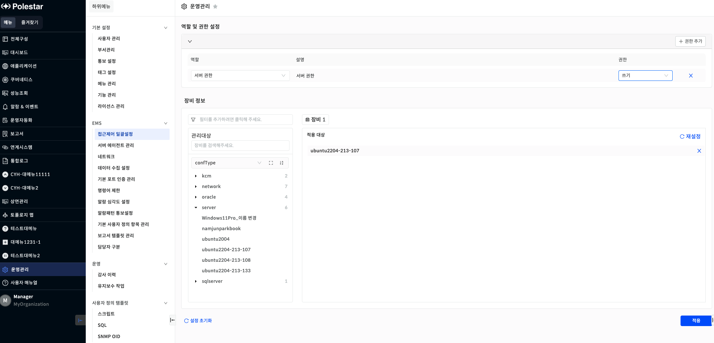
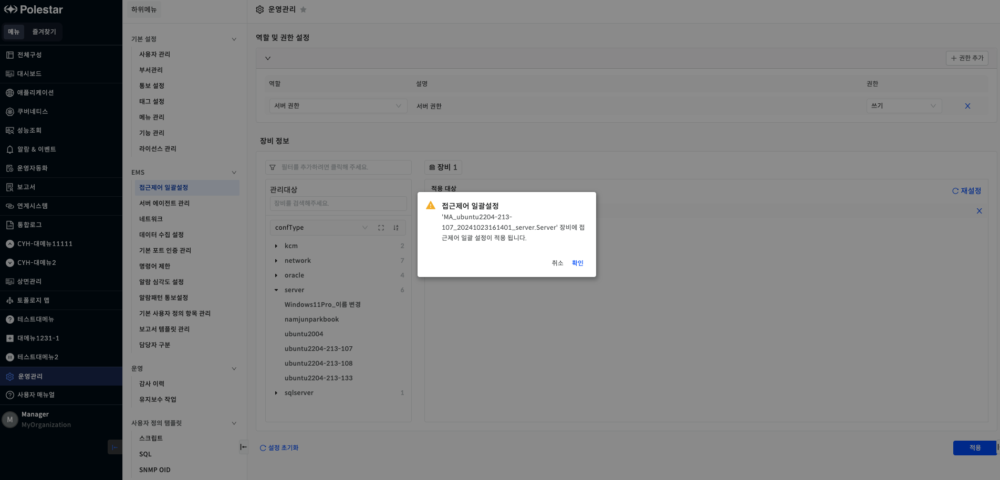

접근제어 일괄설정

등록된 장비에 접근제어 권한을 일괄설정할 수 있는 기능을 제공합니다.

▶ \[그림1\] 접근제어 일괄설정

▶ \[그림2\] 접근제어 일괄설정 적용

> 접근제어 일괄설정 등록

| 역할    | 설정할 역할과 해당 역할에 부여할 권한을 선택합니다. |
| ----- | ----------------------------- |
| 장비 정보 | 접근제어를 일괄설정 할 장비를 선택합니다.       |

