태그 설정

\[운영관리\] 메뉴를 선택하면 \[기본 설정\] \> \[태그 설정\] 화면을 확인할 수 있습니다.

태그 관리의 효율 증대를 위해 확인, 삭제할 수 있는 화면 입니다.

태그 설정 화면은 \[태그 설정\] 총 1개의 탭으로 구성되어 있습니다.

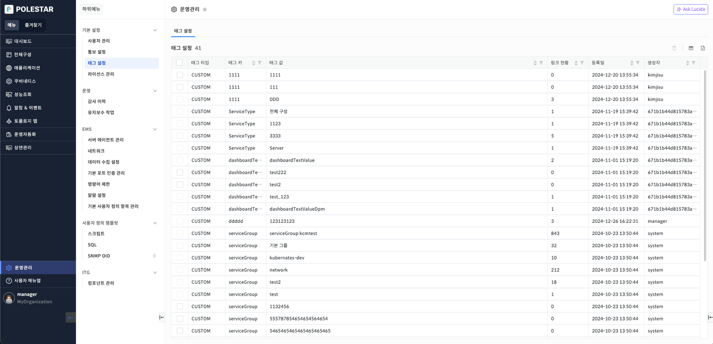

▶ \[그림1\] 태그 설정 탭

화면 지표

<table>
<thead>
<tr class="header">
<th>태그 타입</th>
<th>태그의 타입을 표시합니다.</th>
</tr>
</thead>
<tbody>
<tr class="odd">
<td>태그 키</td>
<td>태그의 키를 표시합니다.</td>
</tr>
<tr class="even">
<td>태그 값</td>
<td>태그의 키와 연결된 태그의 값을 표시합니다.</td>
</tr>
<tr class="odd">
<td>링크 현황</td>
<td>
링크 현황을 숫자로 표시합니다.

숫자를 누르면 해당 태그를 사용 중인 관리 대상의 정보를 확인할 수 있습니다.
</td>
</tr>
<tr class="even">
<td>등록일</td>
<td>태그의 등록일을 표시합니다.</td>
</tr>
<tr class="odd">
<td>생성자</td>
<td>태그의 생성자를 표시합니다.</td>
</tr>
</tbody>
</table>

태그 등록

사용자는 \[관리대상\]의 상세화면에서 \[태그\] 아이콘을 클릭하면 대상에서 사용 중인 태그를 확인 및 등록할 수 있습니다.

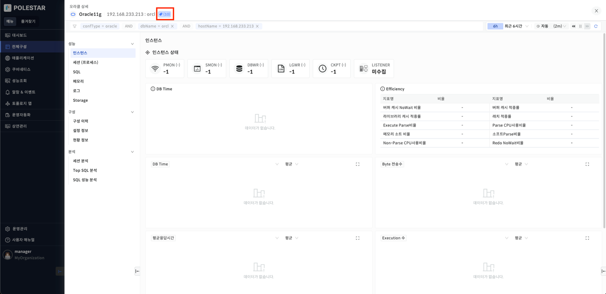

▶ \[그림2\] 관리대상 상세화면

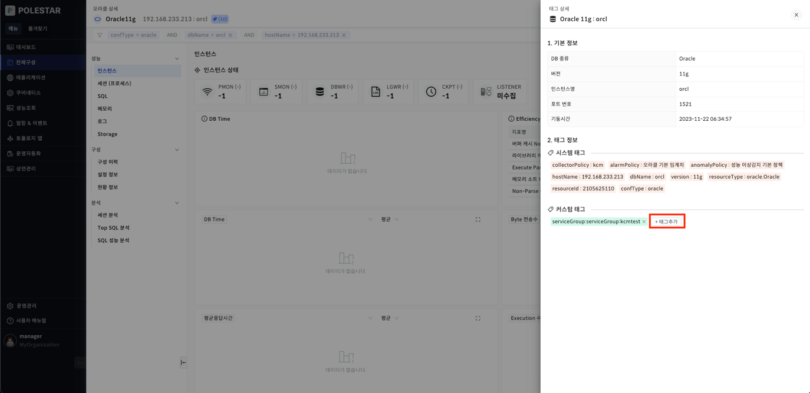

▶ \[그림3\] 사용 중인 태그 확인 및 커스텀 태그 추가

태그 삭제

<table>
<tbody>
<tr class="odd">
<td>
노트

태그 타입이 CUSTOM 이고, 링크 현황이 0개인 경우에만 삭제가 가능합니다.
</td>
</tr>
</tbody>
</table>

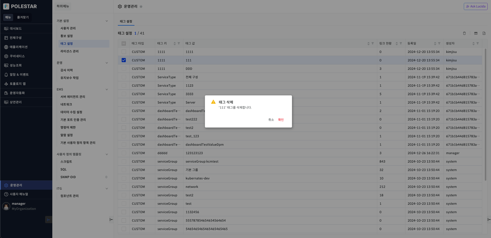

▶ \[그림4\] 태그 삭제

태그 삭제 절차

1.  > 삭제하고자 하는 태그 선택 (다중 선택 가능)

2.  > 테이블 우측 상단의 \[삭제\] 아이콘 클릭

3.  > 메시지창에서 \[확인\] 클릭

태그 링크 현황

태그 목록의 링크 현황 숫자를 누르면 선택된 태그를 사용 중인 관리 대상의 정보를 확인할 수 있습니다.

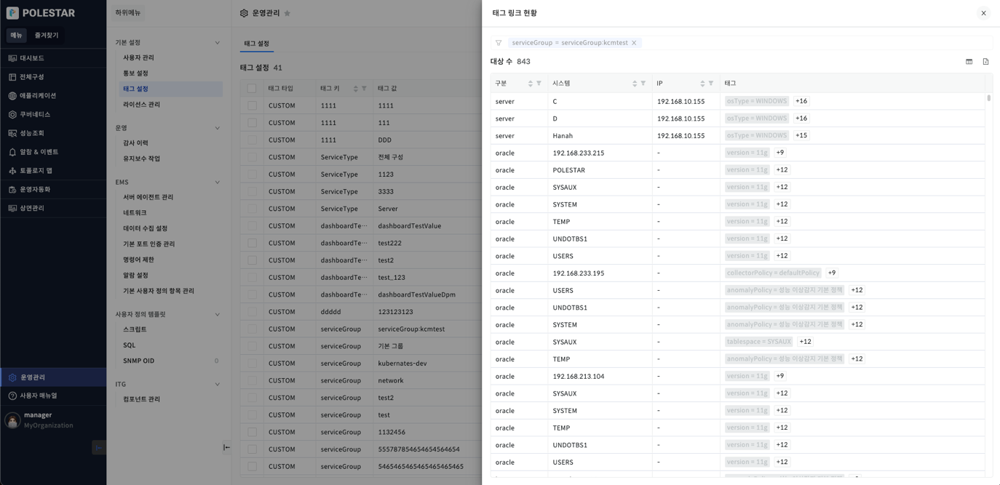

▶ \[그림5\] 태그 링크 현황

화면 지표

<table>
<thead>
<tr class="header">
<th>필터</th>
<th>선택한 태그가 필터 형식으로 표시됩니다.</th>
</tr>
</thead>
<tbody>
<tr class="odd">
<td>구분</td>
<td>태그의 구분을 표시합니다.</td>
</tr>
<tr class="even">
<td>시스템</td>
<td>태그의 시스템을 표시합니다.</td>
</tr>
<tr class="odd">
<td>IP</td>
<td>태그의 IP를 표시합니다.</td>
</tr>
<tr class="even">
<td>태그</td>
<td>
태그를 표시합니다.

하나의 태그가 표시되고 나머지 태그들은 [숫자 태그]를 클릭하면 나타나는 팝업 창에서 확인할 수 있습니다.

선택한 태그는 하이라이트 처리해서 어떤 태그를 선택하고 들어왔는지 알 수 있습니다.
</td>
</tr>
</tbody>
</table>

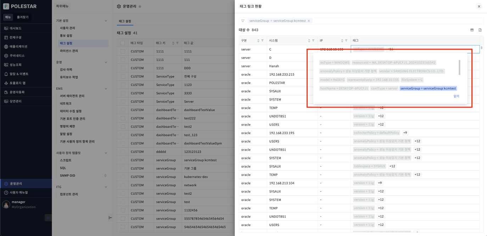

▶ \[그림6\] 태그 팝업 창

태그 추가

신규 태그를 생성할 수 있습니다. 장비 선택은 필수입니다.

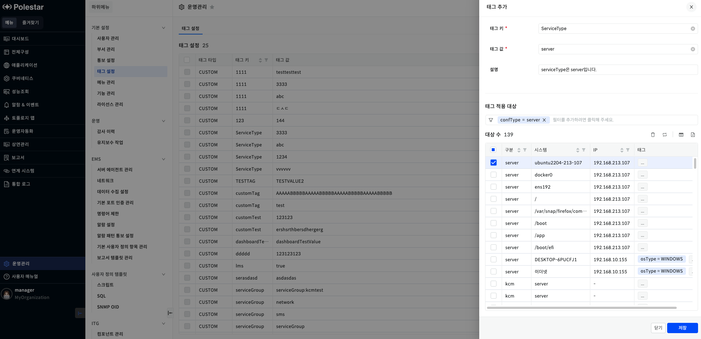

▶ \[그림7\] 태그 팝업 창

화면 지표

| 태그 키     | 추가하려는 태그의 키입니다.        |
| -------- | ---------------------- |
| 태그 값     | **추가하려는 태그의 값입니다.**    |
| 설명       | 추가하려는 태그의 설명입니다.       |
| 태그 적용 대상 | 태그 필터로 장비를 검색할 수 있습니다. |
| 대상 수     | 태그 적용 대상의 결과 값입니다.     |

태그 일괄 수정

장비에 연결된 태그를 수정합니다. 현재 등록된 태그로만 수정할 수 있습니다.

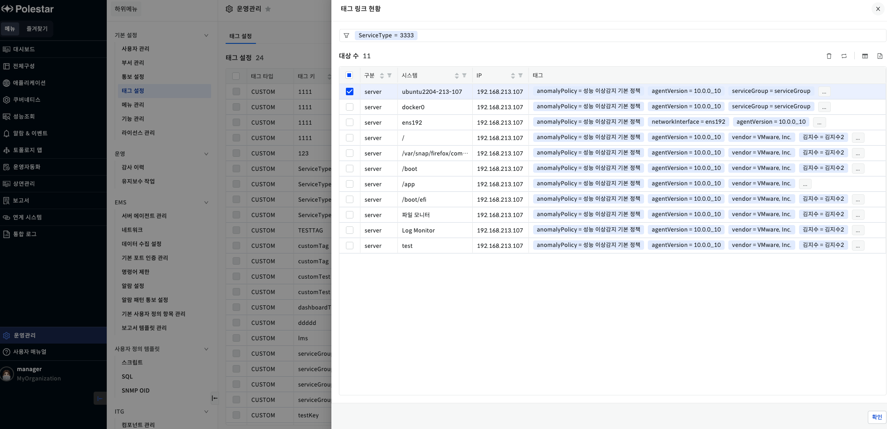

▶ \[그림8\] 태그 링크 현황

화면 지표

| 구분  | 장비의 타입을 표시합니다.     |
| --- | ------------------ |
| 시스템 | 장비의 리소스 네임을 표시합니다. |
| IP  | 장비의 IP를 표시합니다.     |
| 태그  | 장비의 현재 태그를 표시합니다.  |

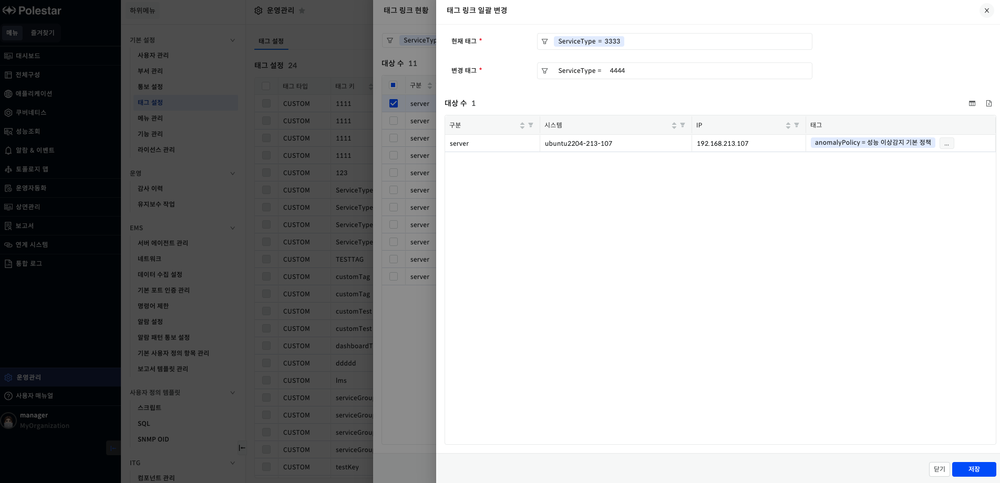

▶ \[그림9\] 태그 수정

화면 지표

| 현재 태그 | 현재 태그가 표시됩니다.          |
| ----- | ---------------------- |
| 변경 태그 | 수정하고자 하는 태그 값을 선택합니다.. |
| 대상 수  | 수정하려는 장비의 정보가 표시됩니다.   |

장비에 연결된 태그 수정 절차

1.  태그 설정 화면에서 링크 현황을 클릭한다.

2.  태그를 변결할 장비를 선택하고 수정을 클릭

3.  변경할 태그를 선택

4.  목록에서 변경된 태그 값 확인

태그 일괄 삭제

장비에 연결된 태그를 삭제합니다.

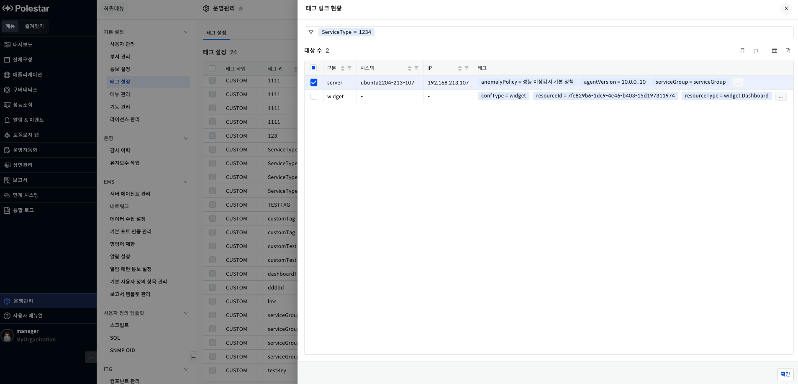

▶ \[그림10\] 태그 링크 현황

화면 지표

| 구분  | 장비의 타입을 표시합니다.     |
| --- | ------------------ |
| 시스템 | 장비의 리소스 네임을 표시합니다. |
| IP  | 장비의 IP를 표시합니다.     |
| 태그  | 장비의 현재 태그를 표시합니다.  |

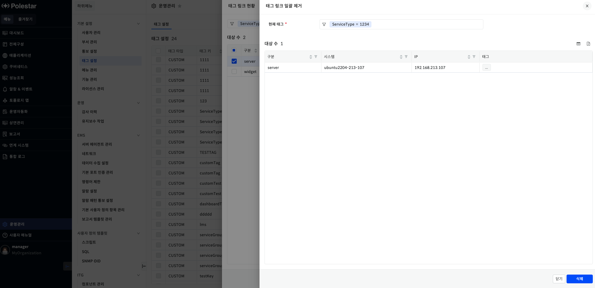

▶ \[그림11\] 태그 삭제

화면 지표

| 현재 태그 | 현재 태그가 표시됩니다.        |
| ----- | -------------------- |
| 대상 수  | 수정하려는 장비의 정보가 표시됩니다. |

장비에 연결된 태그 삭제 절차

1.  태그 설정 화면에서 링크 현황을 클릭한다.

2.  태그를 변결할 장비를 선택하고 삭제를 클릭

3.  태그 링크 일괄 제거 드로워에서 삭제 클릭

4.  목록에서 변경된 링크 현황 개수 확인

