통보 설정

등록된 통보방식의 목록을 조회할 수 있습니다.

통보방식은 통보를 보내는 방식을 의미하며, SMS, EMAIL을 지원합니다.

<table>
<tbody>
<tr class="odd">
<td>
노트

대표적으로 [유지보수 작업, 개별 알람 정책] 메뉴에서 등록된 통보방식을 선택해서 사용할 수 있습니다.
</td>
</tr>
</tbody>
</table>

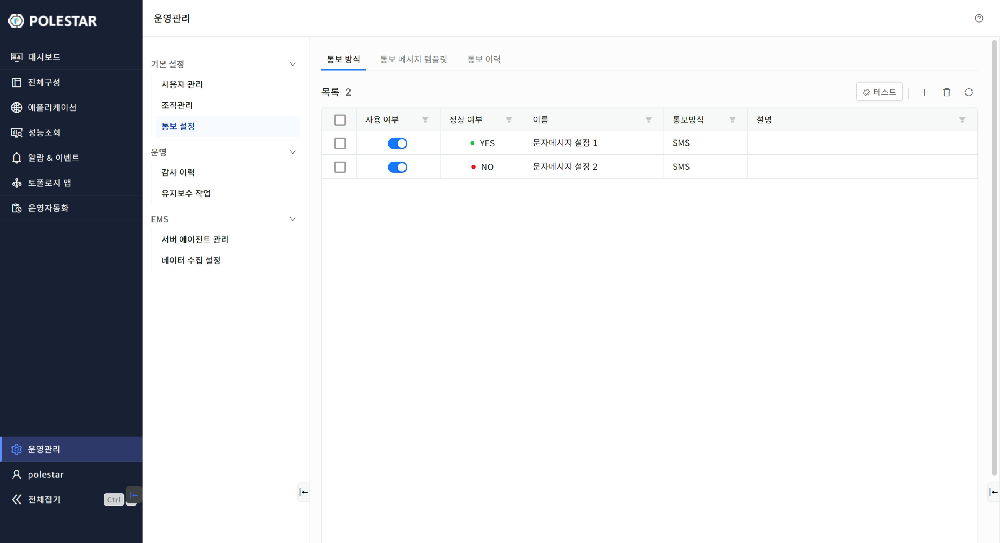

▶ \[그림1\] 통보 방식 목록

화면 지표

<table>
<thead>
<tr class="header">
<th>사용 여부</th>
<th>
사용중인 통보방식을 표시합니다.

마우스를 클릭하여 즉시 사용 여부를 선택할 수 있습니다.
</th>
</tr>
</thead>
<tbody>
<tr class="odd">
<td>정상 여부</td>
<td>
정상 동작 여부를 YES, NO 값을 표시합니다.

해당 통보방식을 사용 중에 오류가 발생한다면 NO를 표시합니다.

최초로 등록된다면 NO를 표시합니다.

테스트를 통해 정상동작한다면 YES로 변경됩니다.
</td>
</tr>
<tr class="even">
<td>이름</td>
<td>통보 방식의 이름을 표시합니다.</td>
</tr>
<tr class="odd">
<td>통보 방식</td>
<td>
통보를 보내는 방식을 표시합니다.

SMS, EMAIL을 지원하고 있습니다.
</td>
</tr>
<tr class="even">
<td>설명</td>
<td>추가적인 설명을 표시합니다.</td>
</tr>
</tbody>
</table>

통보방식 테스트

테스트 아이콘을 클릭하여 선택된 통보 방식의 정상여부를 확인할 수 있습니다.

결과에 따라 성공했다면 YES, 실패했다면 NO 값으로 변경됩니다.

테스트를 위해선 한 가지의 통보 방식을 선택해야 합니다.

<table>
<tbody>
<tr class="odd">
<td>
노트

테스트 진행에 있어 통보대상은 전화번호 또는 이메일이 등록 되어있어야 합니다.
</td>
</tr>
</tbody>
</table>

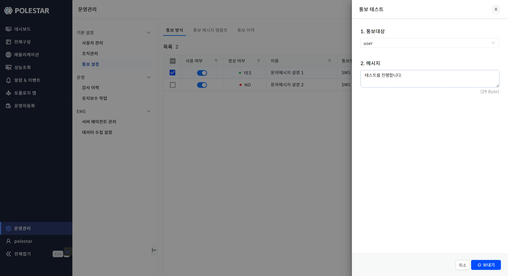

▶ \[그림2\] 통보 방식 테스트

화면 지표

<table>
<thead>
<tr class="header">
<th>통보대상</th>
<th>
테스트 메시지를 수신할 통보 대상을 선택합니다.

사용자 목록이 표시되며, 전화번호 또는 이메일이 등록되어 있어야 합니다.
</th>
</tr>
</thead>
<tbody>
<tr class="odd">
<td>메시지</td>
<td>통보대상이 수신하게 될 메시지를 입력합니다.</td>
</tr>
</tbody>
</table>

통보방식 등록

등록 아이콘을 클릭하여 신규 통보방식을 등록할 수 있습니다.

<table>
<tbody>
<tr class="odd">
<td>
노트

모든 설정 정보를 입력 후 [테스트]를 수행할 수 있습니다. 통보방식 탭의 [테스트]와 동일한 기능을 수행합니다.
</td>
</tr>
</tbody>
</table>

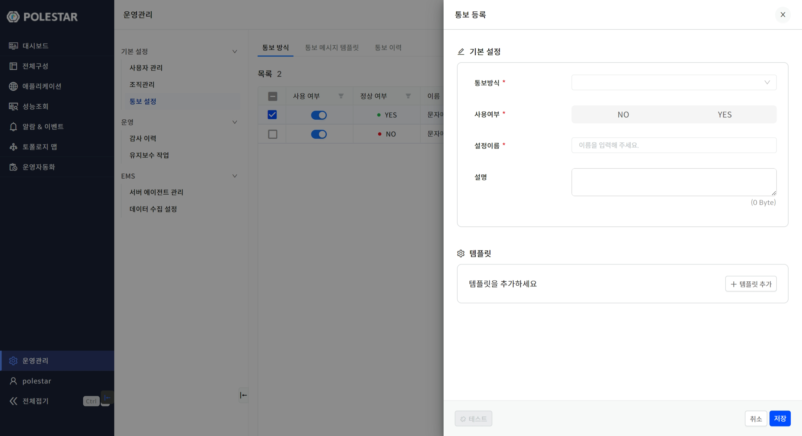

▶ \[그림3\] 통보 방식 등록

화면 지표

<table>
<thead>
<tr class="header">
<th>통보방식</th>
<th>
통보를 보내는 방식을 선택합니다.

SMS, EMAIL을 지원하고 있습니다.
</th>
</tr>
</thead>
<tbody>
<tr class="odd">
<td>사용여부</td>
<td>사용여부를 YES, NO 중에서 선택합니다.</td>
</tr>
<tr class="even">
<td>설정이름</td>
<td>통보방식의 이름을 입력합니다.</td>
</tr>
<tr class="odd">
<td>설명</td>
<td>추가적인 설명을 입력합니다.</td>
</tr>
<tr class="even">
<td>템플릿</td>
<td>통보항목에 따라 사전에 등록된 메시지 템플릿을 선택합니다.</td>
</tr>
</tbody>
</table>

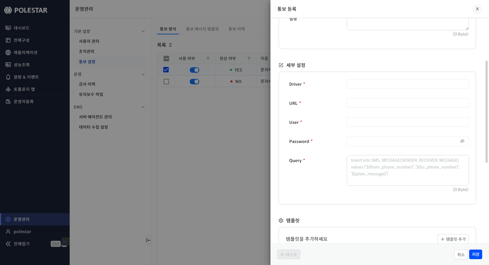

▶ \[그림4\] 통보 방식 목록 – SMS

화면 지표

<table>
<thead>
<tr class="header">
<th>표현식</th>
<th>메시지 또는 설정 정보의 값과 대치될 단어의 목록입니다.</th>
</tr>
</thead>
<tbody>
<tr class="odd">
<td>SMS</td>
<td>
JDBC 방식을 지원하고 있으며 상세 설정 정보를 입력합니다.

통보가 발생했을 때 Query의 내용에 있는 표현식으로 대치되어 메시지가 DBMS에 입력됩니다.

<table>
<thead>
<tr class="header">
<th>Driver</th>
<th>DBMS의 JDBC드라이버</th>
</tr>
</thead>
<tbody>
<tr class="odd">
<td>URL</td>
<td>접속 URL</td>
</tr>
<tr class="even">
<td>User</td>
<td>DBMS의 사용자</td>
</tr>
<tr class="odd">
<td>Password</td>
<td>DBMS의 사용자에 따른 암호</td>
</tr>
<tr class="even">
<td>Query</td>
<td>메시지 입력 쿼리</td>
</tr>
</tbody>
</table></td>
</tr>
</tbody>
</table>

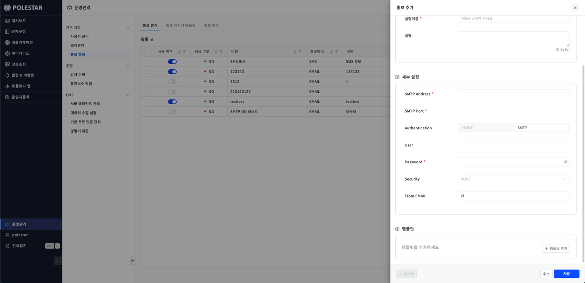

▶ \[그림5\] 통보 방식 등록 – EMAIL

화면 지표

<table>
<tbody>
<tr class="odd">
<td>EMAIL</td>
<td>
SMTP 방식을 지원하고 있으며 상세 설정 정보를 입력합니다.

<table>
<thead>
<tr class="header">
<th>SMTP Address</th>
<th>SMTP 주소</th>
</tr>
</thead>
<tbody>
<tr class="odd">
<td>SMTP Port</td>
<td>SMTP 포트</td>
</tr>
<tr class="even">
<td>Authentication</td>
<td>사용자 인증 방식 선택</td>
</tr>
<tr class="odd">
<td>User</td>
<td>
사용자

SMTP 인증을 사용할 경우 활성화
</td>
</tr>
<tr class="even">
<td>Password</td>
<td>사용자 암호</td>
</tr>
<tr class="odd">
<td>Security</td>
<td>보안 방식 선택</td>
</tr>
<tr class="even">
<td>From EMAIL</td>
<td>보내는 이 EMAIL 주소</td>
</tr>
</tbody>
</table></td>
</tr>
</tbody>
</table>

통보방식 상세

목록에서 이름을 클릭하면 통보방식의 상세 정보를 확인 및 변경할 수 있습니다.

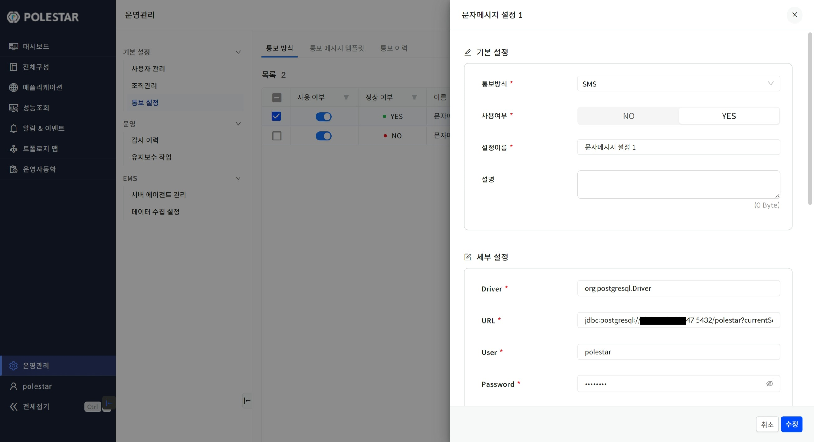

▶ \[그림6\] 통보 방식 상세

화면 지표

\[통보방식 등록\]에서의 화면 지표와 동일한 내용입니다.

통보방식 삭제

삭제 아이콘을 클릭하여 선택된 통보방식을 삭제할 수 있습니다.

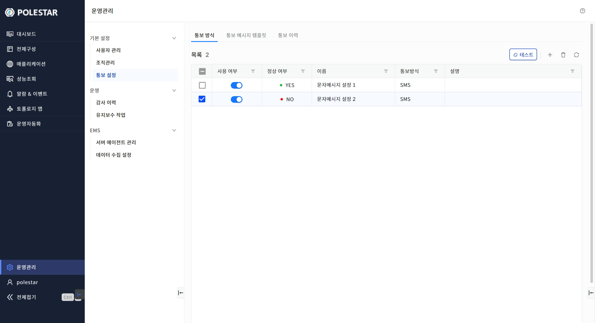

▶ \[그림7\] 통보 방식 삭제

통보메시지 템플릿 목록

등록된 통보메시지 템플릿의 목록을 조회할 수 있습니다.

통보메시지 템플릿은 사용자들에게 정형화 및 표준화된 형태의 메시지를 제공합니다.

통보항목은 통보가 발생되는 서비스의 주체를 의미하여 ALARM, MAINTENANCE, REPORT가 있습니다.

<table>
<tbody>
<tr class="odd">
<td>
노트

[통보방식] 탭에서 등록 또는 상세정보에 표시되는 템플릿 목록과 동일합니다.
</td>
</tr>
</tbody>
</table>

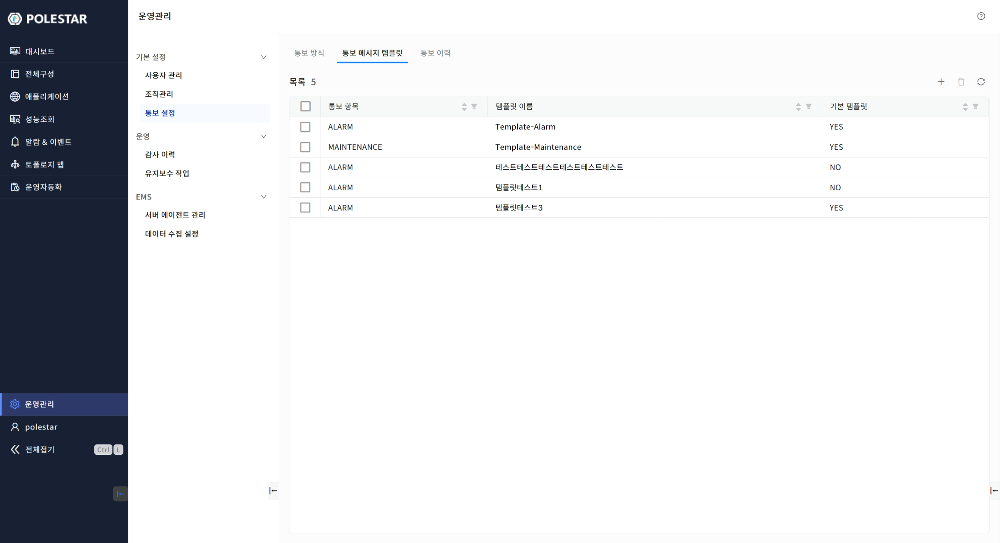

▶ \[그림8\] 통보 메시지 템플릿 목록

화면 지표

<table>
<thead>
<tr class="header">
<th>통보항목</th>
<th>
통보항목을 표시합니다.

ALARM: 알람

MAINTENANCE: 유지보수

REPORT: 보고서
</th>
</tr>
</thead>
<tbody>
<tr class="odd">
<td>템플릿 이름</td>
<td>통보메시지의 템플릿의 이름을 표시합니다.</td>
</tr>
<tr class="even">
<td>기본 템플릿</td>
<td>통보방식에 통보메시지 템플릿이 설정되지 않았다면 기본적으로 적용될 템플릿입니다. 같은 통보항목에 한 개의 기본 템플릿을 설정할 수 있습니다.</td>
</tr>
</tbody>
</table>

통보메시지 템플릿 등록

등록 아이콘을 클릭하여 신규 통보메시지 템플릿을 등록할 수 있습니다.

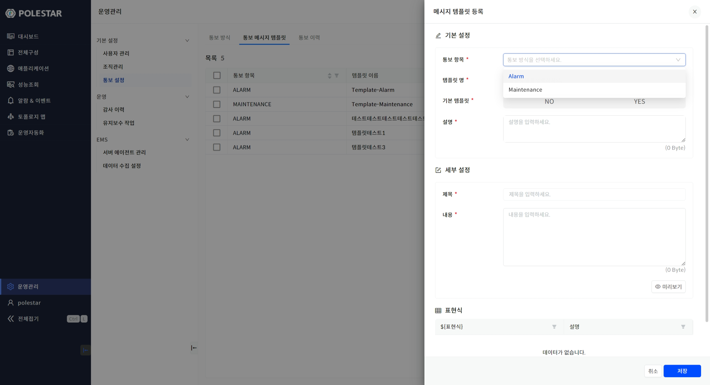

▶ \[그림9\] 통보 메시지 템플릿 등록

화면 지표

<table>
<thead>
<tr class="header">
<th>통보항목</th>
<th>
통보항목을 선택합니다.

ALARM: 알람

MAINTENANCE: 유지보수

REPORT: 보고서
</th>
</tr>
</thead>
<tbody>
<tr class="odd">
<td>템플릿 명</td>
<td>통보메시지의 템플릿의 이름을 입력합니다.</td>
</tr>
<tr class="even">
<td>기본 템플릿</td>
<td>
기본 템플릿 설정 여부를 선택합니다.

통보방식에 통보메시지 템플릿이 설정되지 않았다면 기본적으로 적용될 템플릿입니다. 같은 통보항목에 한 개의 기본 템플릿을 설정할 수 있습니다.
</td>
</tr>
<tr class="odd">
<td>설명</td>
<td>추가적인 설명을 입력합니다.</td>
</tr>
<tr class="even">
<td>제목</td>
<td>
메시지의 제목을 표현합니다.

EMAIL은 메일의 제목으로 SMS는 첫 줄에 표시됩니다.
</td>
</tr>
<tr class="odd">
<td>내용</td>
<td>
메시지의 내용을 입력합니다.

표현식은 통보될 때 실제 데이터로 대치되어 표시됩니다.
</td>
</tr>
<tr class="even">
<td>표현식</td>
<td>
내용에 표시될 표현식입니다.

표현식은 ${표현식}과 같이 내용에 작성합니다.

[$]문자에 붙여서 문자를 입력하여 표시되는 내용 중 원하는 내용을 선택할 수 있습니다.
</td>
</tr>
</tbody>
</table>

통보메시지 템플릿 상세

목록에서 이름을 클릭하면 통보메시지 템플릿의 상세정보를 확인 및 변경할 수 있습니다.

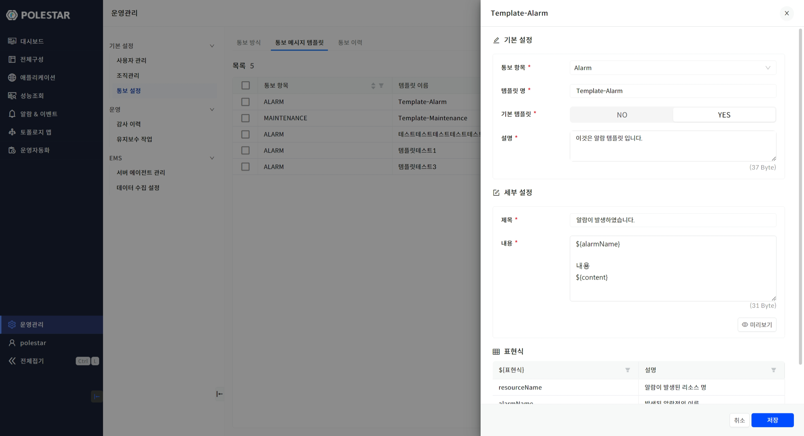

▶ \[그림10\] 통보 메시지 템플릿 상세

화면 지표

\[통보메시지 템플릿 등록\]에서의 화면 지표와 동일한 내용입니다.

통보메시지 템플릿 삭제

삭제 아이콘을 클릭하여 선택된 통보메시지 템플릿을 삭제할 수 있습니다.

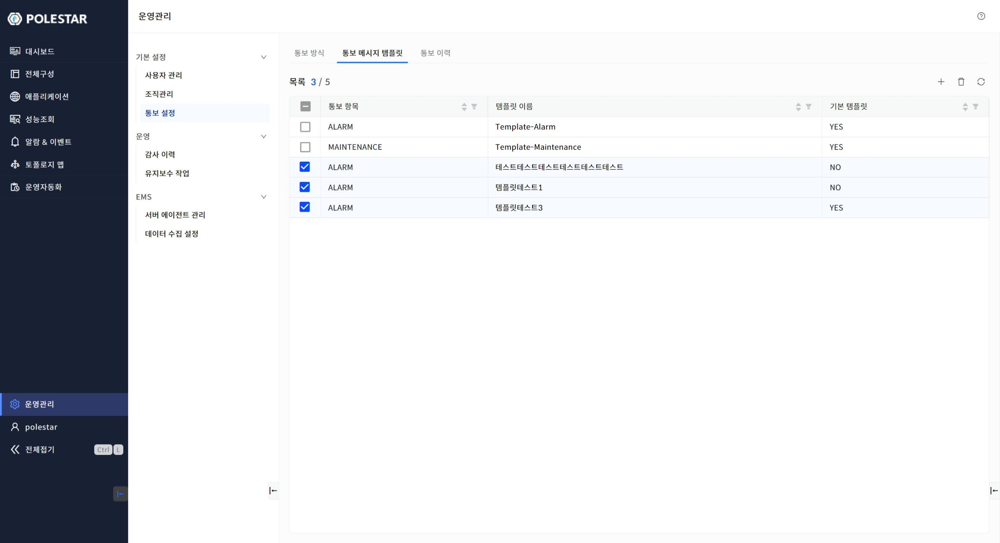

▶ \[그림11\] 통보 메시지 템플릿 삭제

통보 이력

통보방식에 의해 통보된 이력을 확인할 수 있습니다.

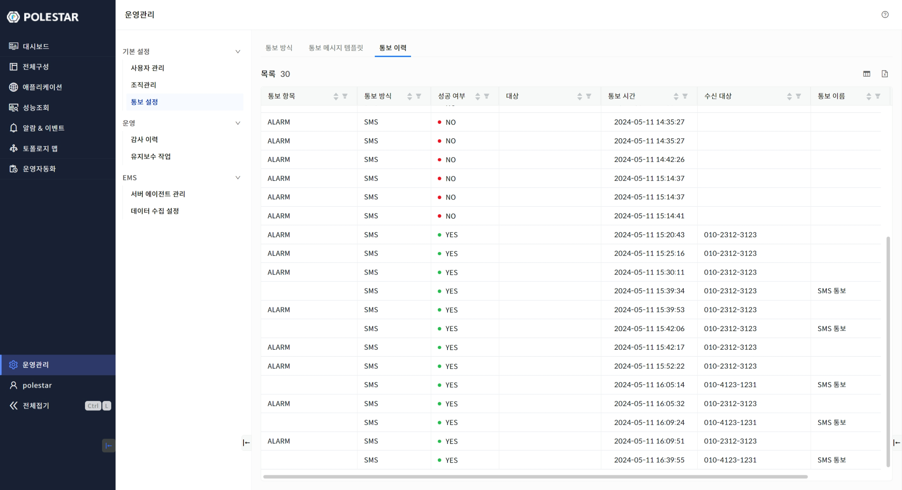

▶ \[그림12\] 통보 이력

화면 지표

<table>
<thead>
<tr class="header">
<th>통보항목</th>
<th>
통보항목을 표시합니다.

ALARM: 알람

MAINTENANCE: 유지보수

REPORT: 보고서

NOTICE: 테스트
</th>
</tr>
</thead>
<tbody>
<tr class="odd">
<td>통보방식</td>
<td>
통보를 보내는 방식을 표시합니다.

SMS, EMAIL
</td>
</tr>
<tr class="even">
<td>성공 여부</td>
<td>
통보방식에 의해 정상적으로 성공 여부를 표시합니다.

YES: 성공, NO: 실패
</td>
</tr>
<tr class="odd">
<td>대상</td>
<td>설정된 대상이 있을 경우 표시됩니다.</td>
</tr>
<tr class="even">
<td>통보 시간</td>
<td>통보된 시간을 표시합니다.</td>
</tr>
<tr class="odd">
<td>수신 대상</td>
<td>
수신대상을 표시합니다.

전화번호 또는 이메일
</td>
</tr>
<tr class="even">
<td>통보 이름</td>
<td>통보방식의 이름을 표시합니다.</td>
</tr>
<tr class="odd">
<td>결과 메시지</td>
<td>통보된 내용이 표시됩니다.</td>
</tr>
</tbody>
</table>

